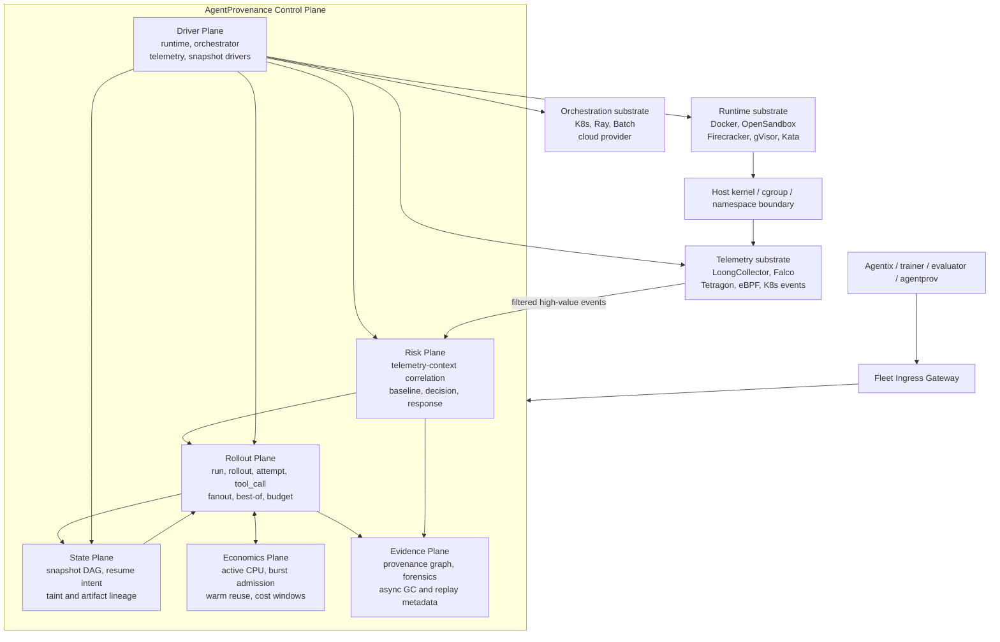

<div align="center">

<h1>AgentProvenance</h1>

### A Snapshot-aware / Cost-aware / Risk-aware control plane for AI agent rollouts.

<p>
Fan out agent attempts from reusable snapshots, admit synchronized tool bursts,
promote winners through a risk barrier, and keep cost/evidence lineage intact.
</p>

[](https://go.dev/)
[](https://www.docker.com/)
[](https://www.sqlite.org/)
[](LICENSE)

**[Quickstart](#quickstart)** | **[Demos](#demos)** | **[Architecture](#architecture)** | **[Roadmap](#roadmap)**

</div>

---

<table>
<tr>
<td width="50%" valign="top">

#### Agent rollout semantics

AgentProvenance owns the agent-side objects that generic infrastructure does not:
`run`, `rollout`, `attempt`, `tool_call`, promotion, snapshot lineage, cost,
risk, and evidence.

</td>
<td width="50%" valign="top">

#### Pluggable substrates

AgentProvenance does not replace Docker, OpenSandbox, Kubernetes, Ray, Falco, Tetragon, or
LoongCollector. It uses them through capability-gated runtime, orchestrator,
snapshot, and telemetry drivers.

</td>
</tr>
<tr>
<td colspan="2" align="center">

v &nbsp; **controlled by** &nbsp; v

```sh
agentprov lease create --task examples/tasks/bugfix.yaml
agentprov session create --lease <lease_id>
agentprov exec <session_id> --stream -- <command...>
```

</td>
</tr>
</table>

## Two ideas

AgentProvenance is small on purpose. The MVP is built around two
operations:

| | You do | You get |
|---|---|---|
| **Control** | `agentprov session create`, `agentprov exec`, `agentprov port expose` | A running sandbox session with process records, telemetry, and preview URLs |
| **Rollout** | `agentprov snapshot stack`, `agentprov rollout start`, `agentprov rollout winner` | Concurrent attempts with burst admission, `tool_call` lineage, promotion barrier, async evidence, and fanout cost |

The project treats every run as a traceable object. A command, file event,
network decision, snapshot, artifact, and cost sample can all be tied back to
`run_id`, `session_id`, and, where available, `tool_call_id`.

```sh
./agentprov exec "$SESSION_ID" --stream -- sh -lc 'pytest -q'
./agentprov snapshot create "$SESSION_ID" --type directory --path /workspace --name ready
./agentprov fork ready --count 3
```

## Why this exists

Modern agent workloads are turning sandboxes into a scheduling and observability
problem, not just an execution problem. Evaluation, RL rollouts, best-of-N
sampling, self-repair loops, and tool-using agents can create thousands of
short-lived computers that spend most of their wall time waiting on I/O, model
latency, package installs, tests, or external services. Treating each attempt as
a full-price container leaves a large resource gap: CPU is reserved but idle,
state is rebuilt instead of reused, and security evidence is scattered across
logs, containers, filesystems, and model/tool context.

AgentProvenance is an attempt to make that rollout layer explicit. It is
not a generic sandbox runtime, telemetry collector, or Kubernetes/Ray
replacement. AgentProvenance owns agent rollout semantics: which run owns a process, which
attempt produced an artifact, which tool call caused a network edge, which
snapshot is safe to promote, how much active CPU was actually consumed, and
whether a branch came from tainted state.

The current repository is a local-first MVP. It proves the control-plane shape
with Docker, SQLite, directory snapshots, rollout fanout, BurstGuard admission,
async evidence/GC, scheduler cost windows, and capability-gated drivers. The
longer-term target is a high-density rollout control plane that can pair
runtime-level snapshot/resume with scheduler-level time sharing and
kernel-level telemetry.

## Industrial pain points

| Pain point | Why it matters | Control-plane direction |
|---|---|---|
| **High-concurrency RL rollout resource sink** | Rollout fleets multiply sandbox count by task count, sample count, retry count, and evaluator count. Without snapshot reuse and per-run accounting, evaluation infrastructure becomes a CPU, disk, and cold-start sink. | Model every rollout as lease/session/snapshot/attempt/cost; reuse ready state; fan out from snapshots; report cost per run/session/node. |
| **CPU time-sharing and conservative overcommit** | Agent sandboxes are often idle-heavy. Static CPU reservation wastes capacity, while blind overcommit causes throttling and noisy failures. | Track active CPU debt, idle discount, memory pressure, warm-pool signals, and queue pressure before admitting new sessions. Memory is not overcommitted; CPU is overcommitted conservatively. |
| **Fast stop/resume/fork instead of rebuild loops** | Rebuilding workspaces and containers for every attempt destroys iteration speed. Real fleets need a path from ready snapshot to attempt workspace or resumed session. | Keep runtime drivers capability-gated; Docker implements directory snapshot/fork/resume now; VM-capable backends can later expose disk and memory snapshot capabilities. |
| **eBPF dual-axis monitoring** | Security and debugging need both system-side facts and application-side intent. Syscalls alone do not say which agent tool call caused an action; tool logs alone do not prove what happened in the kernel. | Correlate kernel/runtime telemetry such as process, file, network, syscall, cgroup events with `run_id`, `session_id`, `process_id`, `snapshot_id`, and `tool_call_id`. eBPF/Falco/Tetragon integration is a planned telemetry provider, not yet active in this MVP. |

## Quickstart

Prerequisites:

- Go 1.23+
- Docker Desktop or a compatible Docker daemon

```sh
git clone https://github.com/ByteYellow/AgentProvenance
cd AgentProvenance

go build ./cmd/agentprov

./agentprov init
LEASE_ID=$(./agentprov lease create --task examples/tasks/bugfix.yaml)
SESSION_ID=$(./agentprov session create --lease "$LEASE_ID")

./agentprov exec "$SESSION_ID" --stream -- sh -lc 'echo hello > hello.txt'
./agentprov snapshot create "$SESSION_ID" --type directory --path /workspace --name ready
./agentprov rollout start --task examples/tasks/bugfix.yaml --snapshot ready --fanout 3 \
  --strategy 'probe::test -f hello.txt && echo passed::score=contains:passed' \
  --strategy 'fast::printf 42::score=number' \
  --strategy 'slow::sleep 1; echo passed::score=contains:passed'
./agentprov rollout winner run-demo-bugfix
RESUME_LEASE_ID=$(./agentprov lease create --task examples/tasks/bugfix.yaml)
./agentprov snapshot resume ready --lease "$RESUME_LEASE_ID"
./agentprov cost show run-demo-bugfix

./agentprov session rm "$SESSION_ID"
```

Run the full MVP walkthrough:

```sh
./scripts/demo_v1.sh
```

## What you can control

The point of the CLI surface is to make sandbox state explicit enough for
security analysis, fanout execution, and cost accounting:

| You have | You run | You inspect |
|---|---|---|
| A task YAML | `agentprov lease create --task ...` | lease status, run id, resource request |
| A sandbox session | `agentprov session create --lease ...` | container id, workspace path, runtime metadata |
| A process | `agentprov exec <session> --stream -- ...` | process id, exit code, wall time |
| A workspace state | `agentprov snapshot create ...` | manifest hash, file count, bytes, taint |
| A branch point | `agentprov fork <snapshot> --count 3` | attempt workspaces and lineage |
| A stopped state | `agentprov snapshot resume <snapshot> --lease ...` | a new running session with parent snapshot lineage |
| A network event | `agentprov egress check ...` or runtime proxy traffic | policy decisions and quarantine signals |
| A run | `agentprov cost show <run_id>` | CPU seconds, wall time, storage bytes, policy blocks |

## Demos

Focused demos are kept as shell scripts so they can double as smoke tests:

```sh
./scripts/demo_preview_url.sh
./scripts/demo_snapshot_fanout.sh
./scripts/demo_best_of_forks.sh
./scripts/demo_policy_quarantine.sh
./scripts/demo_egress_proxy.sh
./scripts/demo_cost_accounting.sh
./scripts/demo_provenance_trace.sh
./scripts/demo_cpu_weight_control.sh
./scripts/demo_ioaware_snapshot_planner.sh
SESSIONS=50 ./scripts/demo_v01_50_concurrency.sh
```

See [docs/mvp.md](docs/mvp.md) for command-by-command walkthroughs.

## How it compares

**vs. sandbox runners.** A runner gives you a box and a way to execute inside
it, usually shell or a fixed SDK. AgentProvenance adds the control-plane
objects around that box: leases, sessions, snapshots, forks, policy decisions,
forensics, and cost.

| | Simple sandbox runner | AgentProvenance |
|---|---|---|
| **Execution** | Run a command in a sandbox | Lease/session/process state machine |
| **State** | Container filesystem | Workspace snapshots, fork lineage, taint |
| **Security** | Runtime defaults | Policy decisions, egress sidecar, quarantine path |
| **Cost** | Bring your own metrics | Run/session cost samples and active CPU model |
| **Extensibility** | Usually backend-specific | Runtime adapter boundary for Docker, gVisor, bubblewrap, Firecracker |

**vs. full cloud sandbox platforms.** This project is not trying to be a hosted
multi-tenant platform yet. The current goal is a local, inspectable, hackable
MVP that proves the agent-computer abstraction before adding a real multi-node
scheduler.

## Architecture

The long-term shape is an Agent Rollout Control Plane with six AgentProvenance-owned
planes and pluggable substrates underneath:



AgentProvenance owns rollout semantics, not generic infrastructure. Runtime, orchestrator,
snapshot, and telemetry implementations are queried through a capability matrix
before execution. If a backend cannot do memory snapshot or low-latency resume,
the scheduler must degrade to filesystem/directory fork instead of pretending
the capability exists.

| Plane | Responsibility |
|---|---|
| **Rollout** | `run`, `rollout`, `attempt`, `tool_call`, fanout, best-of-forks, promotion |
| **State** | Template, ready snapshot, attempt workspace, snapshot DAG, taint lineage |
| **Economics** | Active CPU windows, burst admission, warm reuse, snapshot physical cost, budget |
| **Risk** | Telemetry-context correlation, policy decision, baseline feature, response |
| **Evidence** | Async provenance graph, forensics bundle, replay metadata, background GC |
| **Driver** | Capability-gated runtime, orchestrator, telemetry, and snapshot substrates |

The current binary is `agentprov`. It can run in direct local mode, or act as a
client for the local daemon/API server.

## What works now

- Docker-backed sessions can be created, executed, stopped, and removed.
- `agentprov daemon serve` provides a local API server that owns the SQLite state
  store, runtime driver, scheduler, and Docker adapter.
- Core lifecycle commands can run as daemon clients through `--daemon-url` or
  `ACF_DAEMON_URL`.
- `exec --stream` records process rows and streams stdout/stderr.
- `port expose` provides a local HTTP preview proxy.
- Directory snapshots can be created and forked into independent workspaces.
- Directory snapshots can be resumed into new running Docker sessions.
- Templates can derive `template -> ready snapshot -> attempt workspace`
  lineage.
- `agentprov rollout start` fans out concurrent attempts from a ready snapshot,
  creates one `tool_call` per strategy, applies BurstGuard before command
  execution, records compact evidence, and promotes a winner through the
  promotion barrier.
- Best-of-forks can run multiple strategies and select a winner.
- Telemetry, policy decisions, provenance trace, and forensics export have MVP
  implementations.
- Policy rules can be loaded from YAML for offline event tests.
- Docker sessions get a session-scoped internal bridge network and an egress
  proxy sidecar. Proxy-aware HTTP/HTTPS clients route through the sidecar;
  direct egress from the sandbox network is blocked.
- Credential injection is proxy-side and redacted: raw secret values are not
  written into workspace files, container environment, SQLite event payloads, or
  normal logs.
- Cost output includes run-level CPU, wall time, snapshot bytes, policy block
  count, quarantine count, fanout cost, saved cost, session-level,
  rollout-level, attempt-level, `tool_call`-level, snapshot-level, node-level,
  and a simple cost estimate.
- Session creation goes through a single-node scheduler/admission path that
  reads node capacity, active sessions, memory pressure, warm pool signals, and
  snapshot locality.
- Active CPU accounting samples Docker stats into short-retention
  `cpu_samples`, rolls them into `session_resource_windows` and
  `node_resource_windows`, keeps an EWMA active-CPU signal, tracks throttling
  and memory pressure, and shrinks the effective CPU overcommit ratio when
  throttling is observed.
- Docker sessions support dynamic CPU weight control. New sessions start in the
  low-priority `think` profile, `exec` switches to the high-priority `tool`
  profile before running a command, and the session is returned to `think`
  afterward. Each switch is recorded as a `cpu_weight_set` telemetry event.
- BurstGuard admission reserves tool-phase CPU before `exec` can raise CPU
  weight. If synchronized tool starts exceed the node burst budget, exec is
  rejected before the sandbox is promoted from `think` to `tool`.
- Evidence and cleanup are async. Hot paths enqueue compact `evidence_events`
  and `gc_jobs`; background workers materialize `graph_edges` and reclaim losing
  attempt workspaces without blocking rollout execution.
- Snapshot planning records a file-level manifest and a snapshot edge DAG.
  `snapshot plan`, `fork`, `resume`, and `graph trace` expose the chosen plan,
  planner score, reason, lineage, taint, and storage bytes.
- The snapshot planner is I/O-aware: manifests identify hot metadata paths such
  as `.git`, `node_modules`, `.venv`, `site-packages`, `target`, and `dist`;
  plans report `copy_up_risk`, `metadata_ops_estimate`,
  `shared_lower_fanout`, `io_fanout_budget`, `upperdir_shard`, and
  `upperdir_device`.
- Warm pool items track hit count, last hit time, cold-start savings, memory,
  disk bytes, GDSF priority, and eviction reason. Session creation can consume a
  matching warm item.
- Best-of-forks supports strategy budgets, score parsers, artifact refs,
  max-fanout, max-cost, early stop, and winner selection by score/cost/risk
  signals instead of exit code alone.

## Runtime driver capabilities

Runtime backends are capability-gated. `agentprov runtime list` and
`agentprov runtime inspect <backend>` report what each backend can actually do
instead of presenting planned adapters as usable.

| Backend | Exec | Stop | Snapshot | Fork | Resume | CPU weight | Memory snapshot | Status |
|---|---:|---:|---:|---:|---:|---:|---:|---|
| Docker | yes | yes | directory | directory | directory | yes | no | active |
| gVisor | no | no | no | no | no | no | no | planned stub |
| Firecracker | no | no | no | no | no | no | no | planned stub |
| bubblewrap | no | no | no | no | no | no | no | planned stub |

The Docker driver implements directory-level snapshot, fork, and resume by
copying workspace state and then creating a new running session. Memory-level
snapshot/restore is intentionally left false until a VM-capable backend exists.

## Current boundaries

- Docker is the only fully active runtime backend today.
- gVisor, Firecracker, and bubblewrap are extension targets, not complete
  adapters.
- Snapshot support is directory-level only; memory snapshot/resume is not
  implemented.
- Scheduler/admission is single-node and conservative. It is not a distributed
  placement service yet.
- Egress enforcement covers HTTP/HTTPS proxy workflows and blocks direct
  outbound traffic from the Docker sandbox bridge. It is not a general raw TCP
  policy engine yet.
- Node registry and placement signals exist, but there is no real distributed
  scheduler.
- Baseline detection is MVP-level event/cost counting, not syscall ML or eBPF
  feature modeling.

## Command surface

Daemon mode:

```sh
agentprov daemon serve --listen 127.0.0.1:8574
export ACF_DAEMON_URL=http://127.0.0.1:8574
```

Daemon sampling is bounded and windowed:

```sh
agentprov daemon serve \
  --sample-interval 5s \
  --sample-limit 64 \
  --sample-timeout 2s \
  --raw-retention 10m \
  --max-raw-samples 512
```

Raw Docker stats are treated as short-term input. Scheduler and cost views read
10s/60s resource windows instead of scanning unbounded raw samples.

Core workflow:

```sh
agentprov init
agentprov lease create --task examples/tasks/bugfix.yaml
agentprov session create --lease <lease_id>
agentprov session cpu-profile <session_id> --profile think
agentprov exec <session_id> --stream -- <command...>
agentprov port expose <session_id> <port>
agentprov snapshot create <session_id> --type directory --path /workspace --name ready
agentprov snapshot plan ready
agentprov fork ready --count 3
agentprov snapshot resume ready --lease <lease_id>
agentprov attempt best-of --snapshot ready \
  --max-fanout 2 --max-cost 1 --early-stop \
  --strategy "probe::printf 42::budget=2::score=number::artifact=probe.txt" \
  --strategy "full::pytest -q::budget=30::score=contains:passed::artifact=pytest.log"
agentprov cost show <run_id>
```

Security, telemetry, and provenance:

```sh
agentprov egress allow example.com
agentprov credential inject --run <run_id> --session <session_id> --name github-token --host api.github.com --value <secret>
agentprov process list --session <session_id>
agentprov process inspect <process_id>
agentprov telemetry list --run <run_id> --type network_deny --tool-call <tool_call_id>
agentprov policy test examples/events/metadata-egress.jsonl --rules examples/policies/default.yaml
agentprov policy decisions --run <run_id>
agentprov graph trace --run <run_id>
agentprov forensics export <run_id>
```

Runtime and fleet signals:

```sh
agentprov runtime list
agentprov runtime inspect docker
agentprov node register --address localhost --runtime docker --cpu 8 --memory-mb 8192
agentprov node list
agentprov scheduler status
agentprov pool create --template bugfix --size 2 --seed-workspace ./seed --max-size 2
agentprov pool status
agentprov cost sample <session_id>
agentprov bench overcommit --sessions 20 --idle-ratio 0.8 --bursty --physical-cpu 8
```

v0.1 hardening demos:

```sh
./scripts/demo_cpu_weight_control.sh
SESSIONS=50 ./scripts/demo_v01_50_concurrency.sh
./scripts/demo_ioaware_snapshot_planner.sh
```

The CPU weight demo verifies the control-plane loop with Docker `CpuShares`:
`think=2`, `tool=1024`, then back to `think=2` after exec. On Linux cgroup v2,
Docker maps this control path to cgroup CPU weight behavior; a direct
`cpu.weight` node-agent writer is a later Linux-specific optimization.
The concurrency demo sets `ACF_BURST_MAX_INFLIGHT` and proves that not every
simultaneous tool call is promoted to the high-priority CPU profile. The
IO-aware snapshot demo shows hot metadata path detection, I/O fanout rejection,
and graph trace reasons for not choosing overlay.

## Roadmap

Near term:

- JSON output mode for automation
- Snapshot taint propagation and memory resume capability gates
- Stronger process manager and process tree enforcement
- Raw TCP policy enforcement for non-HTTP protocols

Later:

- gVisor and bubblewrap adapters
- Firecracker disk/memory snapshot path
- Multi-node node agent and placement scheduler
- Falco/Tetragon/eBPF telemetry integration
- Rich provenance graph queries and forensics bundles

## Testing

```sh
go test ./...
```

Local runtime state lives under `.acf/` by default and is intentionally ignored.
Public docs live under [docs/](docs/); runnable examples live under
[examples/](examples/) and [scripts/](scripts/).

<div align="center">
<sub>Apache-2.0 licensed | local-first MVP | built around Go, Docker, and SQLite</sub>
</div>
