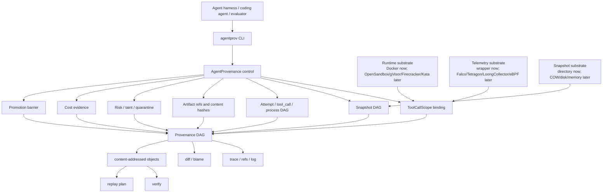

<div align="center">

# AgentProvenance

### Observability and provenance audit for sandboxed AI agent execution.

Turn agent actions, runtime telemetry, file diffs, artifacts, and decisions into
content-addressed, queryable, replayable, and auditable execution graphs.

[](https://go.dev/)
[](https://www.docker.com/)
[](https://www.sqlite.org/)
[](LICENSE)

**[Quickstart](#quickstart)** | **[Core Demo](#core-demo)** | **[Architecture](#architecture)** | **[Roadmap](#roadmap)**

</div>

---

AgentProvenance is a local-first observability and provenance audit layer for
sandboxed AI agents, especially Coding Agents.

It is not a generic sandbox runtime, telemetry collector, scheduler, or
Kubernetes/Ray replacement. It combines application-level agent context with
system-level telemetry and turns the result into an auditable provenance graph:

```text
ToolCallScope -> Runtime Telemetry -> Provenance DAG -> State Diff/Blame
  -> Taint -> Promotion Barrier -> Replay Plan
```

The narrow goal is to answer questions such as:

- Which snapshot did this artifact come from?
- Which attempt, tool call, and process produced it?
- Which process changed which file?
- Which runtime event maps to which agent action?
- Which branch was tainted, quarantined, or blocked from promotion?
- Why was one attempt promoted as the winner?
- What cost, risk, test, diff, and artifact evidence supports that decision?
- Can the result be traced, diffed, blamed, verified, materialized, and replayed?

AgentProvenance sits above runtime, snapshot, orchestration, and telemetry
substrates. Docker is the active runtime today. OpenSandbox, Firecracker,
gVisor, Kata, Kubernetes, Ray, Falco, Tetragon, LoongCollector, and eBPF are
substrates to plug in through capability-gated drivers, not systems this project
tries to replace.

The CLI is `agentprov`.

## Why

Modern agent workloads are not "one command in one container."

Coding-agent repair loops, best-of-N sampling, tool-using agents, and evaluator
experiments can fork many short-lived attempts from the same initial state. Each
attempt may run tests, edit files, call tools, create artifacts, trigger runtime
telemetry, consume CPU, and produce risk signals. Existing traces, logs,
metrics, and sandbox managers usually record fragments of this story, but they
do not give a Git-like causal graph for state, evidence, runtime behavior, and
promotion decisions.

AgentProvenance makes that correlation layer explicit:

```text
snapshot -> attempt -> tool_call -> process -> artifact
                         |             |
                         v             v
                    telemetry       file diff
                         |             |
                         v             v
                      risk/cost -> promotion barrier
```

The killer use case is a coding-agent best-of-N rollout:

1. Start from a clean snapshot.
2. Fork multiple attempts.
3. Let each attempt try a different fix.
4. Capture patches, tests, process telemetry, cost, and risk.
5. Quarantine unsafe branches.
6. Diff and blame the resulting files.
7. Promote the winner only after evidence is drained and verified.
8. Emit a replay plan and content-addressed provenance objects.

RL-style rollout and evaluator pipelines can use the same graph for debugging,
sample audit, reward-hacking investigation, and trajectory provenance. The
project does not try to become an RL runtime, trainer, or throughput scheduler.

## Quickstart

Prerequisites:

- Go 1.23+
- Docker Desktop or a compatible Docker daemon

```sh
git clone https://github.com/ByteYellow/AgentProvenance
cd AgentProvenance

go build ./cmd/agentprov

./scripts/demo_coding_agent_best_of_n.sh
```

The demo builds `agentprov`, creates a clean coding workspace, snapshots it,
forks five attempts, runs different bug-fix strategies, records raw runtime
telemetry, quarantines a risky branch, promotes a safe winner, and then queries
the provenance DAG.

Core graph commands:

```sh
./agentprov graph trace --run run-demo-bugfix
./agentprov graph refs --run run-demo-bugfix
./agentprov graph log --run run-demo-bugfix
./agentprov graph materialize --run run-demo-bugfix
./agentprov graph verify --run run-demo-bugfix
./agentprov graph replay --run run-demo-bugfix
./agentprov graph replay --run run-demo-bugfix --json
./agentprov graph diff --run run-demo-bugfix --file calculator.py
./agentprov graph blame --run run-demo-bugfix --file calculator.py
```

`trace` shows the causal DAG. `refs` gives stable Git-like names. `log` shows
chronological execution history. `materialize` writes content-addressed objects.
`verify` checks references, object hashes, replay manifest generation,
ToolCallScope correlation drift, and taint/promotion barriers. `replay` emits a
plan-only reconstruction and `replay --json` emits a structured
`agentprovenance.replay/v1` manifest for CI or downstream agent harnesses.
`diff` compares file state across attempts. `blame` attributes a file version
to the attempt, tool call, process, command, strategy, and promotion status that
produced it.

## Core Demo

Run:

```sh
./scripts/demo_coding_agent_best_of_n.sh
```

Expected acceptance:

- Forks 5 attempts from the same clean snapshot.
- Runs multiple coding-agent strategies against the same bug.
- Captures patch artifacts from attempt workspaces.
- Ingests raw runtime telemetry without requiring `tool_call_id` in the raw event.
- Resolves ToolCallScope through process/session/runtime context.
- Records an external side effect as `ExternalEffectRecord` in dry-run mode.
- Quarantines and taints the risky failed branch.
- Blocks tainted branches from promotion.
- Selects a clean winner using score, tests, risk, and cost evidence.
- Emits `graph trace`, `refs`, `log`, `materialize`, `verify`, and `replay`.
- Emits `graph diff` for `calculator.py`.
- Emits `graph blame` with created/modified/deleted/unchanged state.

This is the Phase 1 product line:

```text
ToolCallScope -> Runtime Telemetry -> Provenance DAG -> State Diff/Blame
  -> Taint -> Promotion Barrier
```

## What Works Now

| Area | Current capability |
|---|---|
| Provenance DAG | `trace`, `refs`, `log`, `materialize`, stronger `verify`, text `replay`, JSON replay manifest |
| State attribution | MVP `graph diff` and `graph blame` for workspace files |
| Rollout | local and Docker-backed best-of-N attempts, scoring, top-k pruning, winner selection |
| ToolCallScope | process/container/cgroup/time-window context binding for raw telemetry correlation |
| Artifacts | exported attempt artifacts linked back to attempt/tool_call/process |
| Risk | policy decisions, quarantine, taint, promotion barrier |
| External effects | `ExternalEffectRecord` with target, mode, gate decision, and redacted payload |
| Snapshots | directory snapshot, fork, resume, lineage, taint propagation |
| Runtime drivers | Docker active; gVisor/Firecracker/bubblewrap are explicit capability stubs |
| Cost | run/attempt/session cost records, fanout cost, saved cost, active CPU windows |

## Boundaries

These boundaries are intentional:

- AgentProvenance does not implement a general sandbox runtime.
- It does not replace Kubernetes, Ray, OpenSandbox, Firecracker, gVisor, Kata,
  Falco, Tetragon, LoongCollector, or eBPF.
- It does not promise memory snapshot or VM-level instant clone in Phase 1.
- It does not perform arbitrary branch auto-merge.
- It does not roll back real external side effects. External actions are
  recorded, gated, and optionally linked to compensation hooks.
- It does not train a complex ML behavior baseline in Phase 1.

Phase 1 focuses on provenance correlation, state diff/blame, taint propagation,
promotion barriers, and replay evidence.

See [docs/comparisons.md](docs/comparisons.md) for the difference between
AgentProvenance, LangSmith-style observability platforms, and LLM gateways.

## Architecture



The important design rule is capability gating. Upper layers must query the
driver capability matrix before assuming fast fork, memory snapshot, isolation
level, telemetry identity, or restore semantics. If the backend is Docker-only,
AgentProvenance degrades to directory/filesystem provenance instead of claiming
VM-level resume.

## ToolCallScope Correlation

Raw runtime/security events should not be required to carry `tool_call_id`.
Kernel and runtime telemetry usually knows lower-level identities such as PID,
container ID, cgroup ID, process tree, namespace, and timestamp.

AgentProvenance stores a ToolCallScope binding that maps those identities to:

```text
run_id / session_id / attempt_id / tool_call_id
```

Then telemetry ingestion resolves raw events into the DAG and records the
correlation method and confidence. This keeps the future eBPF/Falco/Tetragon
path realistic: probes provide substrate facts; AgentProvenance performs agent
context correlation.

## Storage And Replay

AgentProvenance uses sparse, content-addressed evidence instead of full
per-step snapshots.

Current model:

- snapshot lineage records the state source;
- file manifests and artifact refs capture stable hashes;
- diff/blame explain state changes at file level;
- external effects are recorded as provenance and gate evidence;
- replay emits a text plan and structured JSON manifest from
  template/snapshot/attempt/tool/process/artifact objects rather than pretending
  every side effect can be reversed.

This is closer to Git provenance than container checkpointing. Memory snapshots,
block-level COW, and VM restore are future substrate capabilities.

## Substrate Signals

Runtime and telemetry integrations are deliberately downstream of the
provenance model:

- Docker is the active local runtime.
- OpenSandbox, gVisor, Firecracker, and Kata are future runtime substrates.
- Kubernetes, Ray, and batch systems are orchestration substrates.
- Falco, Tetragon, LoongCollector, and eBPF are future telemetry substrates.

The project value is not collecting more logs. The value is correlating
substrate signals with agent execution context and making them affect taint,
promotion, replay, and auditability.

## Manual Commands

Minimal local workflow:

```sh
./agentprov init

LEASE_ID=$(./agentprov lease create --task examples/tasks/bugfix.yaml)
SESSION_ID=$(./agentprov session create --lease "$LEASE_ID")

./agentprov exec "$SESSION_ID" --stream -- sh -lc 'echo hello > hello.txt'
./agentprov snapshot create "$SESSION_ID" --type directory --path /workspace --name ready

./agentprov fork ready --count 3
./agentprov session rm "$SESSION_ID"
```

Rollout workflow:

```sh
./agentprov rollout start \
  --run run-demo-bugfix \
  --task examples/tasks/bugfix.yaml \
  --snapshot ready \
  --runtime local \
  --fanout 5 \
  --strategy "correct-add::sed 's/return a - b/return a + b/' calculator.py > calculator.py.new && mv calculator.py.new calculator.py; ./test_calculator.sh::score=contains:passed::artifact=fix.patch"

./agentprov rollout winner run-demo-bugfix
./agentprov graph trace --run run-demo-bugfix
```

External effect record:

```sh
./agentprov effect record \
  --run run-demo-bugfix \
  --type api_call \
  --target api.example.com/v1/tickets \
  --mode dry-run \
  --decision audit \
  --payload '{"redacted":true}'

./agentprov effect list --run run-demo-bugfix
```

## Repository Layout

```text
cmd/agentprov/        CLI entrypoint
internal/cli/         command parsing and output
internal/control/     leases, sessions, rollout, promotion barrier
internal/runtime/     capability-gated runtime drivers
internal/state/       snapshots, fork/resume, lineage, taint
internal/provenance/  graph trace, refs, log, diff, blame, materialize, verify, replay
internal/security/    policy decisions, quarantine, risk signals
internal/economics/   active CPU windows, cost, rollout budget
internal/store/       SQLite schema and repositories
examples/             tasks, events, policies
scripts/              runnable demos
docs/                 design notes and MVP details
```

## Roadmap

Phase 1 hardening:

- JSON output for graph queries and demo assertions.
- Stronger replay manifest schema validation and compatibility tests.
- Deeper graph integrity checks.
- Telemetry drain watermarks before promotion.
- ToolCallScope binding receiver for cgroup/container/process identity.
- Larger best-of-N coding-agent demo with patch export and replay comparison.

Phase 2 risk and response:

- Richer risk rules.
- Automatic forensics bundles.
- Promotion block policies.
- Better taint descendant queries.

Phase 3 telemetry substrate integration:

- Falco/Tetragon/LoongCollector JSONL receivers.
- eBPF-side filtering assumptions documented per substrate.
- Correlation by cgroup/container/process identity, not raw `tool_call_id`.

Phase 4 isolation escalation:

- IsolationProfile and EscalationPolicy.
- gVisor/Firecracker/Kata capability-backed runtime drivers.
- Risk-triggered isolation upgrade.

## Development

```sh
go test ./...
./scripts/demo_coding_agent_best_of_n.sh
```

The demo is the main acceptance path for Phase 1.
