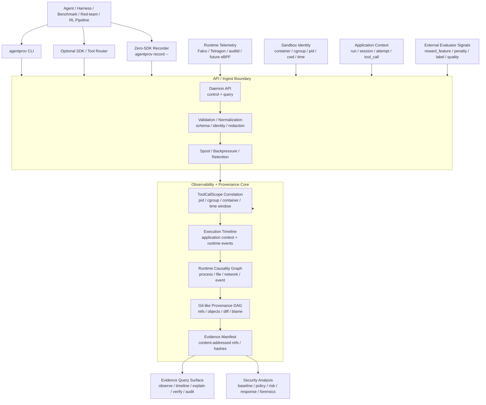

<div align="center">

# AgentProvenance

### Security-oriented execution observability and Git-like provenance for sandboxed agents.

Correlate application-side agent context with system-side telemetry, then turn
runtime evidence, file diffs, artifacts, risk signals, and response decisions
into a queryable, replayable, and auditable causality graph.

[](https://go.dev/)
[](https://github.com/ByteYellow/AgentProvenance/actions/workflows/ci.yml)
[](https://www.docker.com/)
[](https://www.sqlite.org/)
[](LICENSE)

**[Quickstart](#quickstart)** | **[Core Model](#core-model)** | **[Current Capability](#current-capability)** | **[Roadmap](#roadmap)**

</div>

---

AgentProvenance is a local-first security analysis and provenance control plane
for autonomous, tool-using agents, especially sandboxed coding agents.

It is not a generic sandbox runtime, generic telemetry collector, Kubernetes/Ray
replacement, RL trainer, or trace dashboard. It owns a narrower primitive:

```text
Execution Context
  -> Evidence Ingest
  -> Runtime Causality Graph
  -> Provenance DAG
  -> State Diff / Blame / Artifact Lineage
  -> Security Analysis / Risk Decision
  -> Taint / Response Action
  -> Replay / Forensics / Audit Manifest
```

The goal is to answer questions ordinary traces do not answer well:

- Which snapshot did this execution start from?
- Which attempt produced this artifact?
- Which tool call started this process?
- Which child process caused this runtime event?
- Which process changed this file?
- Which behavior is anomalous for this agent or task profile?
- Which execution branch was tainted, quarantined, interrupted, or blocked by
  a response gate?
- Which evidence supports a risk decision?
- What response action should be triggered: audit, deny, kill, quarantine,
  taint, export forensics, or notify a human through Feishu/DingTalk?
- What exact behavior evidence, deviation signal, and risk context should an
  external evaluator, RL pipeline, or human reviewer inspect?
- Can this execution be diffed, blamed, verified, replayed, and audited later?

## Why

Modern agent execution is not one prompt and one tool call. Coding agents and
autonomous workflows fork attempts, edit files, run tests, create artifacts,
spawn subprocesses, touch external systems, and trigger runtime telemetry.
Logs, traces, metrics, and sandbox events each capture pieces of that story,
but they rarely produce a Git-like causal record of execution state.

AgentProvenance turns sandboxed execution into a security-oriented evidence
graph:

```text
base snapshot
  -> attempt
  -> execution context
  -> tool_call
  -> process / child process
  -> runtime_event
  -> file_diff / artifact
  -> baseline feature / risk signal
  -> taint / response action
  -> replay / forensics / audit manifest
```

The primary path is recording and explaining sandboxed agent execution. The
branch-heavy coding-agent script is only a stress demo: it creates many
branches, artifacts, runtime events, and risk cases quickly enough to exercise
the graph. AgentProvenance does not choose the reward winner. It emits
structured trajectory evidence and expectation-deviation signals so an external
evaluator or training pipeline can turn them into reward, penalty, filtering,
or human-review decisions.

For RL pipelines, the useful primitive is not "best-of-one" or automatic winner
selection. The useful primitive is observability over each trajectory: what the
agent did, which subprocesses and files were touched, which network/runtime
events appeared, which behavior violated safety or task expectations, and which
risk/baseline signals should contribute to reward shaping or rejection.

## Security Loop

The security model is intentionally simple and concrete:

```text
application context
  run / session / attempt / tool_call / user / task / workspace

system telemetry
  process / file / network / resource / sandbox / eBPF event

correlation
  container_id / cgroup_id / pid / ppid / cwd / timestamp / file diff

security analysis
  behavior baseline / suspicious event / taint lineage / risk decision

response
  audit / deny / kill / quarantine / taint / forensics / Feishu or DingTalk notification
```

This makes AgentProvenance closer to an AI-era HIDS/control-plane layer than a
pure LLM trace dashboard. Traditional host monitoring asks "what did this
process do?" AgentProvenance adds the agent execution context needed to ask
"which agent/tool/task caused it, what state did it change, what evidence proves
it, and what response should happen?"

The project currently implements the evidence graph, runtime correlation,
diff/blame, telemetry batch manifests, policy decisions, normalized risk
signals, baseline deviation records, response action records, taint,
quarantine, and forensics/export foundations. Deeper eBPF receivers and
Feishu/DingTalk response adapters belong to the next security-control phases.

## Core Model

AgentProvenance supports two context modes.

### White-box mode

An agent harness, SDK, tool router, or framework explicitly provides context:

```text
run_id / session_id / attempt_id / tool_call_id / tool_name / args_hash
```

This gives high precision and fits custom coding-agent systems, Agentix-style
harnesses, LangGraph-like workflows, and internal tool routers.

### Zero-SDK mode

The user can run an agent command directly:

```sh
agentprov record -- <agent command>
```

The current MVP records a command in a working directory, snapshots the
pre-execution file state, runs the command, computes post-execution file
changes, and emits runtime file evidence into the DAG. The long-term zero-SDK
path adds deeper process-tree and kernel telemetry capture.

Zero-SDK inference uses runtime facts:

```text
root process / process tree / cwd / timestamp / container_id / cgroup_id
  / file diff / artifact refs
```

Raw system-side telemetry should not be required to carry `tool_call_id`.
Kernel and runtime signals usually know PID, cgroup, namespace, container ID,
timestamp, and process tree. AgentProvenance correlates those substrate facts
back to execution context.

Today, the CLI exposes the underlying binding primitive:

```sh
agentprov telemetry bind --run <run_id> --session <session_id> \
  --attempt <attempt_id> --tool-call <tool_call_id> --process <process_id> \
  --container-id <container_id> --cgroup-id <cgroup_id> --pid <pid>
```

Then raw events can be ingested without `tool_call_id`:

```sh
agentprov telemetry ingest --raw-event raw-execve-1 --pid <pid> \
  --timestamp <event_time> --source tetragon_jsonl --type execve \
  --payload '{"argv":["./async_child.sh"]}'
agentprov telemetry ingest-jsonl --format tetragon --file tetragon-events.jsonl
agentprov telemetry ingest-falco --file falco-events.jsonl
```

`ingest-jsonl` records a telemetry batch manifest with the input file hash,
mapped event IDs, event ID hash, receiver summary, and row-level mapping
results. By default it also evaluates runtime policy for ingested events, so
metadata-IP, private-CIDR, and secret-path rows become `policy_decisions`,
`risk_signals`, `response_actions`, graph edges, and timeline rows. Use
`--no-policy` when the receiver should only normalize and store telemetry. This
gives the DAG an audit handle for external Falco/Tetragon/LoongCollector
evidence without turning AgentProvenance into a long-term log store.

`ingest-falco` is the Falco-compatible receiver path. It reads Falco JSON/stdout
from a file or stdin stream, maps recognized `execve`, `open/openat`, and
`connect` events into normalized runtime events, correlates them by
PID/container/cgroup/time evidence, and then evaluates policy by default.
Raw Falco rows do not need `tool_call_id`; ToolCallScope is recovered from the
binding table when possible.

## Relationship To Existing Systems

AgentProvenance is designed to coexist with system-level observability projects,
LLM tracing systems, and sandbox runtimes.

| System category | What it owns | How AgentProvenance differs |
|---|---|---|
| system observability | low-intrusion system-side capture, eBPF/runtime event collection, cross-process visibility | AgentProvenance treats those events as evidence input, then builds a Git-like causality/provenance DAG, diff/blame, taint lineage, risk decision, forensics, and response-control surface |
| OpenTelemetry / LLM trace platforms | spans, logs, metrics, LLM/tool traces, dashboards, latency/cost views | AgentProvenance focuses on state provenance, artifact lineage, sandbox runtime effects, security decisions, replay, and audit manifests |
| HIDS / EDR / runtime security | host/process/file/network detection and enforcement | AgentProvenance adds agent context: run/session/attempt/tool_call, snapshot lineage, file diffs, artifact provenance, risk signals, baseline deviations, and response gates |
| Sandbox runtimes | isolation, process/container/VM execution, filesystem and network boundaries | AgentProvenance consumes sandbox identity and telemetry; it does not try to replace Docker, OpenSandbox, gVisor, Firecracker, Kata, or Kubernetes |

So the differentiation is not "another zero-SDK eBPF observer." The narrow
primitive is:

```text
system-side telemetry + application-side agent context
  -> evidence DAG
  -> security analysis and risk judgment
  -> automated response and audit trail
```

## Quickstart

Prerequisites:

- Go 1.23+
- Docker Desktop or a compatible Docker daemon

```sh
git clone https://github.com/ByteYellow/AgentProvenance
cd AgentProvenance

go build ./cmd/agentprov

mkdir -p /tmp/agentprov-record-demo
printf 'value = 1\n' > /tmp/agentprov-record-demo/app.py
./agentprov record --run run-record-demo --workdir /tmp/agentprov-record-demo -- \
  sh -lc 'printf "value = 2\n" > app.py && echo artifact > artifact.txt'
./agentprov observe summary --run run-record-demo
./agentprov graph explain --run run-record-demo --file app.py

./agentprov adapter list
./agentprov adapter inspect filtered-jsonl --json
./scripts/demo_telemetry_jsonl.sh
./agentprov telemetry batches --run run-telemetry-jsonl-demo
./agentprov timeline --run run-telemetry-jsonl-demo
./agentprov timeline --run run-telemetry-jsonl-demo --view causality
./agentprov timeline --run run-telemetry-jsonl-demo --json
./scripts/accept_phase1.sh
```

The quick path builds `agentprov`, records a command, explains the changed file,
ingests filtered substrate telemetry, and runs the Phase 1 acceptance gate.
`observe summary` is the run-level observability entry point: it summarizes
application context, runtime telemetry coverage, risk, baseline, response, and
top evidence refs before you drill into timeline or graph queries.

`demo_telemetry_jsonl.sh` is the minimal substrate telemetry path. It binds a
ToolCallScope, ingests Tetragon/Falco/LoongCollector fixture JSONL from
`examples/telemetry/`, lists normalized events, and explains how one substrate
event entered the DAG.

`accept_phase1.sh` is the machine-checkable gate for the current MVP.

`timeline` is the execution timeline surface. It merges
application context, runtime telemetry, evidence, policy decisions, risk
signals, baseline deviations, response actions, and external effects into one
time-ordered view. `--view causality` groups rows into agent context, runtime
process, runtime telemetry, evidence, risk/policy, and external-effect lanes,
with correlation status and drill-down commands. The JSON output is designed to
feed a future UI.

## Deployment Modes

AgentProvenance is intentionally usable in three deployment shapes. RL,
benchmark, and evaluator users should start with the first shape; enterprise
security and audit users can move toward the later shapes when they need shared
ingest, retention, and query services.

| Mode | Shape | Best for | Tradeoff |
|---|---|---|---|
| Library / CLI-only recorder | one `agentprov` binary, optional Python helper, local SQLite/object store | RL rollout, evaluator jobs, benchmarks, CI, local red-team harnesses | easiest to adopt; weaker shared query and long-running ingest |
| Sidecar / local daemon | `agentprov daemon serve` beside one worker or sandbox host; CLI/SDK acts as client | sandbox worker, CI runner, local security harness, medium-volume telemetry ingest | adds a local service boundary, spool, backpressure, and stable query API |
| Central evidence service | shared ingest/query service with object storage, retention, auth, and UI/API | enterprise security, audit, SRE, compliance, incident review | highest operational cost; not the default RL entry point |

For RL and evaluator pipelines, the default contract is lightweight:

- Install: one Go binary plus an optional thin Python package.
- Call: wrap an existing command first; SDK/framework integration is optional.
- Batch: every trajectory gets stable `run_id` / evidence manifest / signal
  context output, and query surfaces are paged.
- Overhead: default capture focuses on process/file/diff/artifact/exit/resource
  evidence; heavier Falco/eBPF-style telemetry is an opt-in substrate.
- Ownership: AgentProvenance emits evidence, deviation, risk, and trajectory
  signals. The RL system owns reward, ranking, dataset policy, and winner
  selection.

Python usage stays thin and CLI-backed:

```python
from agentprov_eval import Client

client = Client(binary="./agentprov", data_dir=".agentprov-rl")

manifest = client.record(
    ["python", "agent_task.py"],
    run_id="trajectory-0001",
    workdir="/tmp/agent-task",
)

evidence = client.evidence_manifest(manifest["run_id"])
ctx = client.eval_context(manifest["run_id"])
```

Batch pipelines can keep their own scheduler and call:

```python
from agentprov_eval import record_batch

batch = record_batch(
    [
        {"run_id": "traj-0001", "workdir": "/tmp/job1", "command": ["pytest", "-q"]},
        {"run_id": "traj-0002", "workdir": "/tmp/job2", "command": ["pytest", "-q"]},
    ],
    binary="./agentprov",
    data_dir=".agentprov-batch",
)
```

Later, the same local store can be queried by batch, shard, job, or run:

```sh
./agentprov evidence batch-summary --latest --json
./agentprov evidence batch-summary --shard shard-0 --json
./agentprov evidence batch-summary --run traj-0001 --json
./agentprov signal batch-context --shard shard-0 --latest > eval-contexts.jsonl
./agentprov forensics export-batch --latest --json
```

### Falco-compatible Receiver

The dedicated Falco receiver is useful when Falco is already filtering kernel
or runtime events on the host:

```sh
./agentprov telemetry bind --run run-falco-demo --session session-falco-demo \
  --attempt attempt-falco-demo --tool-call tool-falco-demo \
  --process process-falco-demo --container-id container-falco-demo --pid 4242 \
  --started-at 2026-01-01T00:00:00Z

./agentprov telemetry ingest-falco \
  --file examples/telemetry/falco-risk-events.jsonl --json

./agentprov telemetry list --run run-falco-demo
./agentprov telemetry list --run run-falco-demo --limit 100 --json
./agentprov telemetry list --run run-falco-demo --limit 100 --cursor <next_cursor> --json
./agentprov timeline --run run-falco-demo
./agentprov security risks --run run-falco-demo --json
./agentprov security responses --run run-falco-demo --json
```

For a live stream, pipe Falco JSON output directly:

```sh
sudo falco -o json_output=true -o json_include_output_property=true | \
  ./agentprov telemetry ingest-falco --file -
```

The receiver maps Falco process, file, and network rows into normalized runtime
events. Metadata IP, private CIDR, and secret-path rows are promoted into
security evidence: `RiskSignal`, `ResponseAction`, policy graph edges, and
timeline entries. `graph explain --risk <policy_decision_id> --json` links the
risk back to the raw runtime event and forward to the response action. Falco
remains the substrate collector; AgentProvenance owns correlation, causality,
provenance, and risk/audit linkage.

The main smoke path is telemetry correlation and graph explanation:

```sh
./scripts/demo_telemetry_jsonl.sh
```

It binds a ToolCallScope, ingests raw Falco/Tetragon/LoongCollector-style
runtime events that do not carry `tool_call_id`, normalizes them into the event
store, correlates them back to application context, and explains the resulting
causal graph.

## Security Evidence Commands

```sh
./agentprov observe summary --run <run_id>
./agentprov observe summary --run <run_id> --json
./agentprov observe coverage --run <run_id>
./agentprov observe coverage --run <run_id> --json
./agentprov observe scopes --run <run_id>
./agentprov observe scopes --run <run_id> --json
./agentprov observe event --run <run_id> --event <event_id>
./agentprov observe event --run <run_id> --event <event_id> --json
./agentprov observe process --run <run_id> --process <process_id>
./agentprov observe process --run <run_id> --process <process_id> --json
./agentprov observe flow --run <run_id>
./agentprov observe flow --run <run_id> --json
./agentprov evidence manifest --run <run_id>
./agentprov evidence manifest --run <run_id> --json
./agentprov evidence manifest --run <run_id> --materialize --json
./agentprov telemetry correlations --run <run_id>
./agentprov telemetry correlations --run <run_id> --json
./agentprov telemetry correlations --event <event_id> --json
./agentprov timeline --run <run_id>
./agentprov timeline --run <run_id> --view causality
./agentprov timeline --run <run_id> --limit 100 --cursor <next_cursor> --json
./agentprov timeline --run <run_id> --tool-call <tool_call_id> --json
./agentprov timeline --run <run_id> --process <process_id> --json
./agentprov timeline --run <run_id> --type risk_signal --json
./agentprov security risks --run <run_id>
./agentprov security risks --run <run_id> --json
./agentprov security deviations --run <run_id>
./agentprov security deviations --run <run_id> --json
./agentprov security responses --run <run_id>
./agentprov security responses --run <run_id> --json
./agentprov baseline learn --template <template_name> --run <run_id>
./agentprov baseline check --template <template_name> --run <run_id>
./agentprov signal context --run <run_id>
./agentprov signal batch-context --batch <batch_id>
./agentprov signal batch-context --shard <shard_id>
./agentprov signal batch-context --runs runs.jsonl
./agentprov signal run --run <run_id>
./agentprov signal run --run <run_id> --json
./agentprov signal run --run <run_id> \
  --external "PYTHONPATH=python python3 examples/evaluators/python_signal_eval.py" --json
./agentprov signal import --run <run_id> --file external-signals.json --json
./agentprov compliance frameworks
./agentprov compliance map --framework owasp-asi --run <run_id>
./agentprov compliance explain --framework owasp-asi --run <run_id> --item ASI05
./agentprov compliance gaps --framework owasp-asi --run <run_id>
./agentprov compliance report --framework nist-rfi-2026-00206 --run <run_id>
./agentprov policy test examples/events/metadata-egress.jsonl
./agentprov policy decisions --run <run_id>
./agentprov forensics export <run_id>
./agentprov forensics export-batch --batch <batch_id>
./agentprov forensics export-batch --latest --include-eval-contexts --json
```

These commands are now part of the mainline security evidence surface:

| Command | Purpose |
|---|---|
| `observe summary` | Show run-level observability coverage across application context, runtime telemetry, risks, baselines, responses, and evidence refs |
| `observe coverage` | Show runtime telemetry correlation quality and list events missing session/tool_call/process identity |
| `observe scopes` | Show per-tool-call observability: processes, runtime events, risks, policy decisions, responses, and drill-down links |
| `observe event` | Explain one runtime event with correlated agent context, related risk/policy/response evidence, and drill-down links |
| `observe process` | Explain one process with its tool_call context, runtime events, risk/policy/response evidence, and drill-down links |
| `observe flow` | Show the compact causality flow from runtime events to risk signals, policy decisions, and response actions |
| `evidence manifest` | Emit a run-level evidence index that binds observability summary, timeline hash, content-addressed object refs, risk/response report hashes, and recommended drill-down queries; `--materialize` writes it as an `evidence_manifest` provenance object |
| `telemetry correlations` | Explain why runtime telemetry events were attached to a ToolCallScope, including raw identity, matched binding, matched keys, confidence, time window, and drill-down refs |
| `timeline` | Show a time-ordered execution view across application context, runtime telemetry, evidence, risk, baseline, response, and external effects |
| `security risks` | List normalized `RiskSignal` records derived from policy/runtime evidence; `--json` emits schema/hash metadata and drill-down refs to event/process/timeline/explain views |
| `security deviations` | List `BaselineDeviation` records from behavior feature checks; `--json` emits schema/hash metadata and drill-down refs to timeline and summary views |
| `security responses` | List recorded `ResponseAction` records such as audit, deny, kill, quarantine, taint, export, or notification hooks; `--json` emits schema/hash metadata and drill-down refs back to risk/process/explain views |
| `baseline learn/check` | Learn process/file/network/risk/runtime feature vectors and emit deviation records plus baseline-derived risk signals |
| `signal context/batch-context/run/import` | Export one `EvalContext` or JSONL `EvalContext` streams for a batch/shard/run list, run built-in or external evaluators, and validate imported `EvalSignal` records for reward shaping, dataset filtering, quality scoring, or external benchmark consumers. AgentProvenance owns the evidence protocol, not the reward policy |
| `compliance frameworks/map/explain/gaps/report` | Map run evidence to OWASP Agentic Security and NIST AI agent security assessment profiles as item-level self-assessment evidence and gap lists |
| `policy test/decisions` | Evaluate events, persist policy decisions, and feed the risk/response graph |
| `forensics export` | Export auditable evidence for a run; `--json` emits `agentprovenance.forensics_export/v1` with bundle path, sha256, size, and status |
| `forensics export-batch` | Export a batch-level audit bundle for record batches; `--json` emits `agentprovenance.batch_forensics_export/v1` with batch summary, per-run forensics refs, optional EvalContext records, result/page hashes, and a sha256-verified bundle path |

## External Evaluator Protocol

AgentProvenance exposes evidence to external scoring systems without owning
their reward, ranking, or dataset policy.

```sh
./agentprov signal context --run <run_id> > eval-context.json

./agentprov signal run --run <run_id> \
  --external "PYTHONPATH=python python3 examples/evaluators/python_signal_eval.py" \
  --json

./agentprov signal import --run <run_id> --file external-signals.json --json
```

The protocol is intentionally small:

- `EvalContext` contains trajectories, file changes, runtime events, risk
  signals, and response actions.
- External evaluators read `EvalContext` from stdin and return
  `{ "signals": [...] }`.
- `EvalSignal` can represent reward features, penalties, dataset labels, or
  quality signals.
- `python/agentprov_eval` is a thin helper SDK. It does not encode a reward
  function.

This lets a benchmark harness, RL pipeline, red-team harness, or data filtering
job decide how evidence becomes score, rejection, or review.

In daemon mode, the same protocol is available through the local API:

```text
GET  /v1/signal/context?run=<run_id>
POST /v1/signal/run
POST /v1/signal/import
```

The daemon does not expose an HTTP endpoint that runs arbitrary external shell
commands. A client can fetch `EvalContext`, execute its evaluator in its own
process boundary, and import the resulting signals back into the daemon for
validation. The CLI follows that shape when `--daemon-url` is set.

## Compliance Evidence, Not Certification

AgentProvenance can map run evidence to security framework profiles such as
OWASP Agentic Security and NIST AI agent security assessment questions:

```sh
./agentprov compliance frameworks
./agentprov compliance frameworks --ruleset examples/compliance/custom-ruleset.yaml
./agentprov compliance validate --ruleset examples/compliance/custom-ruleset.yaml
./agentprov compliance map --framework owasp-asi --run <run_id>
./agentprov compliance map --framework owasp-asi --run <run_id> --only ASI05,ASI10,TRACE
./agentprov compliance explain --framework owasp-asi --run <run_id> --item ASI05
./agentprov compliance gaps --framework owasp-asi --run <run_id>
./agentprov compliance gaps --framework owasp-asi --run <run_id> --missing-only --json
./agentprov compliance map --framework enterprise-agent-review --ruleset examples/compliance/custom-ruleset.yaml --run <run_id>
./agentprov compliance report --framework nist-rfi-2026-00206 --run <run_id> --json
```

The output is an evidence-backed self-assessment. It does not certify
compliance, provide legal advice, or replace qualified third-party audit. Each
check item is derived from evidence already present in the run: timeline events,
runtime telemetry, ToolCallScope bindings, policy decisions, risk signals,
baseline deviations, response actions, forensics bundles, content-addressed
provenance objects, and graph edges.

Each item reports:

```text
covered | partial | missing | not_applicable
```

with concrete `evidence_refs`, a gap when evidence is incomplete, and a
recommended next step. This makes agent execution evidence usable for security
reviews without turning AgentProvenance into a GRC platform.
`compliance gaps` turns that same mapping into an actionable backlog of missing
or partial evidence items for a run.

Custom rulesets can add local frameworks and rules without replacing built-ins.
The YAML model separates `rules`, `frameworks`, and `mappings`; mappings can
also select built-in items such as `ASI05`, `ASI10`, or `TRACE` and reuse them
inside an enterprise-specific review profile. JSON keeps `control_id` for
compatibility and also emits `item_id` for the current terminology.

## Graph Commands

```sh
./agentprov graph trace --run run-demo-bugfix
./agentprov graph refs --run run-demo-bugfix
./agentprov graph log --run run-demo-bugfix
./agentprov graph materialize --run run-demo-bugfix
./agentprov graph objects --run run-demo-bugfix
./agentprov graph objects --run run-demo-bugfix --limit 50 --json
./agentprov graph objects --run run-demo-bugfix --limit 50 --cursor <next_cursor> --json
./agentprov graph verify --run run-demo-bugfix
./agentprov graph verify --run run-demo-bugfix --json
./agentprov graph replay --run run-demo-bugfix
./agentprov graph replay --run run-demo-bugfix --json
./agentprov graph trajectories --run run-demo-bugfix --json
./agentprov graph diff --run run-demo-bugfix --file calculator.py
./agentprov graph diff --run run-demo-bugfix --file calculator.py --json
./agentprov graph blame --run run-demo-bugfix --file calculator.py
./agentprov graph blame --run run-demo-bugfix --file calculator.py --json
./agentprov graph explain --run run-demo-bugfix --file calculator.py
./agentprov graph explain --run run-demo-bugfix --file calculator.py --json
./agentprov graph explain --run run-demo-bugfix --file calculator.py --depth 4 --limit 200 --json
./agentprov graph explain --run run-demo-bugfix --file calculator.py --depth 4 --limit 200 --cursor <next_cursor> --json
./agentprov graph explain --tool-call <tool_call_id>
./agentprov graph explain --risk <policy_decision_id> --json
```

What these mean:

| Command | Purpose |
|---|---|
| `trace` | Show execution context, runtime causality, provenance edges, risk, and response-gate evidence |
| `refs` | Emit stable Git-like references for attempts, snapshots, artifacts, and decisions |
| `log` | Show chronological execution history |
| `materialize` | Write content-addressed provenance objects |
| `objects` | List content-addressed object refs, hashes, parent hashes, source IDs, paths, and sizes; supports `--limit` and `--cursor` |
| `verify` | Check graph integrity, risk/response evidence chains, taint/response barriers, object hashes, replay generation, drain watermarks, telemetry batch hashes, and orphan lifecycle evidence for outlived zero-SDK child processes |
| `replay` | Emit a plan-only reconstruction of the run |
| `trajectories --json` | Emit per-attempt behavior evidence, risk/deviation context, cost, artifacts, and runtime events for external evaluators or RL reward/penalty pipelines |
| `diff` | Compare file state between base and attempts |
| `blame` | Attribute file state to attempt, tool call, process, strategy, command, and local candidate status |
| `explain` | Explain a target by combining trace, runtime causality, diff/blame, telemetry receiver details, telemetry batch manifests, process observations, policy, object refs, risk signals, baseline deviations, and response evidence; `--json` emits `agentprovenance.explain/v1` with `upstream`, `downstream`, bounded `causality_path`, `query`, `evidence`, `objects`, `risks`, `telemetry_batches`, `process_observations`, and `replay_refs`; runtime events include receiver/source format, normalized event type, identity keys, schema status, and correlation status; use `--depth`, `--limit`, and `--cursor` to bound and page DAG traversal |

## Current Capability

| Area | Current capability |
|---|---|
| Zero-SDK record | `agentprov record -- <command>` snapshots a working directory, samples root-process descendants with configurable `--sample-interval-ms` and `--post-root-grace-ms`, marks observed descendants that outlive the root, creates PID bindings, emits orphan lifecycle audit decisions when applicable, computes changed files, records runtime file evidence, exposes process observations with raw/correlation/container/cgroup identity in timeline JSON, materializes a `record_manifest` object, and is covered by a realistic acceptance run that modifies, creates, deletes files, observes a child process, and correlates a delayed runtime event without raw `tool_call_id` |
| Batch recorder | `agentprov record batch --file jobs.jsonl --json` records many zero-SDK jobs, persists batch/item rows, and emits `agentprovenance.record_batch/v1` with `job_id`, `shard_id`, run IDs, status counts, per-job evidence/eval/explain commands, `result_set_id`, and `page_hash`; `evidence batch-summary` queries batches by batch/job/shard/run and emits `agentprovenance.record_batch_summary/v1`; `graph materialize` stores `record_batch` and `record_batch_summary` content-addressed objects; `signal batch-context` exports matching runs as EvalContext JSONL; `forensics export-batch` writes a sha256-verified batch audit bundle with summary, per-run bundle refs, optional EvalContext records, and replay/query commands; the Python helper exposes `record_batch(...)`, `batch_summary(...)`, `batch_eval_contexts(...)`, and `batch_forensics(...)` for RL/evaluator pipelines |
| Execution context | explicit ToolCallScope binding through run/session/attempt/tool_call/process/container/cgroup/pid |
| Adapter contracts | `adapter list/inspect` exposes agent, sandbox, telemetry, artifact, and snapshot adapter capabilities, identity keys, boundaries, and QBS impact |
| Evidence ingest | raw telemetry ingestion without requiring raw `tool_call_id`; ingest and verify enforce event-specific payload schemas, reject application context inside raw runtime payloads, map filtered Tetragon/Falco/LoongCollector JSONL into normalized telemetry events, record batch manifests with input/event hashes, expose per-row receiver evidence via `receiver_summary` / `row_results`, and page telemetry event lists with `--limit` / opaque `--cursor` plus result/page hashes |
| Correlation explain | `telemetry correlations --run/--event --json` emits `agentprovenance.telemetry_correlations/v1`, explaining raw identity, resolved context, matched binding, matched keys, confidence, time window, and drill-down refs for each telemetry event |
| Graph verification | `graph verify --run --json` validates both white-box record runs and external telemetry runs. Runtime-identity bindings can anchor session/tool/process IDs even when no local sandbox tables exist; if local rows do exist, context drift and process/tool mismatches are still reported as errors. Non-allow policy decisions must have risk signals, response actions, policy/risk/response graph edges, valid response targets, and matching risk/policy references |
| Observability summary | `observe summary --run` emits `agentprovenance.observability_summary/v1` with context counts, runtime correlation coverage, risk/baseline/response counts, event/source histograms, top evidence refs, suggested drill-down commands, `result_set_id`, and `page_hash` |
| Observability coverage | `observe coverage --run` emits `agentprovenance.observability_coverage/v1` with runtime correlation ratios, missing identity fields, uncorrelated event gaps, source/type histograms, binding suggestions, `result_set_id`, and `page_hash` |
| Observability scopes | `observe scopes --run` emits `agentprovenance.observability_scopes/v1` with per-tool-call process counts, runtime event histograms, risk/response counts, evidence refs, drill-down commands, `result_set_id`, and `page_hash` |
| Observability event detail | `observe event --run --event` emits `agentprovenance.observability_event/v1` with runtime event context, correlation metadata, lane, correlation status, related risk/policy/response evidence, drill-down commands, `result_set_id`, and `page_hash` |
| Observability process detail | `observe process --run --process` emits `agentprovenance.observability_process/v1` with process lifecycle, tool_call context, lane, correlation status, runtime events, risk/policy/response evidence, drill-down commands, `result_set_id`, and `page_hash` |
| Observability flow | `observe flow --run` emits `agentprovenance.observability_flow/v1` with event-to-risk-to-policy-to-response rows, lane, correlation status, drill-down commands, `result_set_id`, and `page_hash` |
| Evidence manifest | `evidence manifest --run` emits `agentprovenance.evidence_manifest/v1`, a run-level evidence index with observability summary hashes, timeline hashes, object-list hashes, risk/response report hashes, query refs, and recommended drill-down queries for UI, audit export, and incident review; `--materialize` stores it as a content-addressed `evidence_manifest` object |
| Forensics bundle | `forensics export <run_id> --json` emits a hashed `agentprovenance.forensics_bundle/v1` file containing evidence manifest, events, telemetry batches, policy decisions, risk signals, response actions, graph edges, cost samples, sessions, processes, and snapshots; `forensics export-batch --json` emits `agentprovenance.batch_forensics_export/v1` and writes a batch audit bundle across many recorded trajectories |
| Daemon API boundary | `agentprov daemon serve` exposes core evidence-infra APIs for ToolCallScope binding, paged telemetry event query, telemetry correlation explain, observability summary, timeline query, graph explain/verify, security risk/deviation/response query, evidence manifest materialization, run/batch forensics export, and evaluator context/import APIs. CLI daemon-client mode covers `observe summary`, `timeline`, `telemetry correlations`, `graph explain`, `graph verify`, `security risks/deviations/responses`, `evidence manifest`, `forensics export`, `forensics export-batch`, and `signal` paths |
| Telemetry spool | Daemon Falco ingest supports async enqueue into `telemetry_spool_batches`; a background worker consumes queued batches, applies policy, and `health` exposes `queued_spool` / `spool_max_queued`. `--spool-max-queued` applies hard backpressure, and `--spool-drop-policy` supports `reject` with structured HTTP 429 or `drop_oldest` for bounded data-plane loss |
| High-volume telemetry pressure | `scripts/accept_telemetry_100k_pressure.sh` generates 100k Falco events, enqueues them through daemon spool, confirms `health` and paged telemetry query stay responsive while queued, drains the batch, and verifies bounded paged query output after ingest. Receiver row details are capped with `row_results_truncated` so summary counts remain complete without returning 100k row objects |
| Telemetry retention | `telemetry prune` and daemon `POST /v1/telemetry/retention/prune` delete old unreferenced raw telemetry events while preserving events referenced by telemetry batches, policy decisions, risk signals, or graph edges |
| Execution timeline | `timeline --run` emits a human table, `--view causality` emits a lane view, and `--json` emits `agentprovenance.timeline/v1` across tool calls, processes, zero-SDK process observations, runtime events, evidence events, policy decisions, risk signals, baseline deviations, response actions, and external effects; JSON includes lane, correlation status, drill-down refs, `result_set_id`, `page_hash`, `total_count`, `has_more`, and opaque `next_cursor` for query integrity and pagination |
| Runtime causality | native `runtime_*` graph edges for tool call, process, process tree, attempt, snapshot, runtime event, and workspace file correlation |
| Provenance DAG | `trace`, `refs`, `log`, `materialize`, `objects`, `verify`, text and JSON replay |
| Evidence query | `graph explain --json` supports file, artifact, process, event, tool call, attempt, and risk targets with bounded, depth/limit/cursor-controlled causality paths, evidence, object refs, risks, process observations, replay refs, and runtime event lane/correlation/drill-down metadata aligned with `timeline` and `observe` |
| Diff / blame | MVP file-level diff and blame with JSON manifests; `graph explain --file --json` combines diff/blame with runtime events, evidence, content-addressed object refs, risks, and replay refs |
| Artifact lineage | exported attempt artifacts linked to attempt/tool_call/process |
| Security evidence | first-class `RiskSignal`, `BaselineDeviation`, and `ResponseAction` records, graph objects, and query commands |
| Behavior baseline | `baseline learn/check` extracts process, file, network, suspicious runtime, policy block, outlived-process, and resource features; anomalous checks persist deviation records and baseline-derived risk signals |
| External evaluator protocol | `signal context --run` emits `agentprovenance.eval_context/v1`; `signal batch-context` emits JSONL `EvalContext` records for batch/shard/run-list consumers; `signal run --external` passes one context JSON to an external process over stdin; `signal import` validates returned `EvalSignal` records. Daemon API supports context export, built-in smoke signals, and signal import without exposing remote shell execution. A thin Python helper lives in `python/agentprov_eval`, with an example in `examples/evaluators/python_signal_eval.py`. Built-in signals remain available, but AgentProvenance does not own reward, ranking, or dataset policy |
| Compliance evidence | `compliance frameworks/map/explain/gaps/report` maps run evidence to OWASP Agentic Security and NIST AI agent security profiles with covered/partial/missing/not_applicable item status and evidence gap reports |
| Risk / taint | policy decisions, policy-decision graph edges, quarantine, taint, taint descendant checks |
| Response gate | eligibility checks with telemetry/evidence drain watermark for tainted or unsafe branches |
| Trajectory evidence | `agentprovenance.trajectories/v1` manifest for external evaluators, including behavior evidence that can become reward, penalty, filtering, or review signals |
| Runtime | Docker active; gVisor/Firecracker/bubblewrap are explicit capability stubs |
| Snapshots | directory snapshot, fork, resume, lineage, taint propagation |
| Resource evidence | run/attempt/session resource records, fanout stress-demo cost, saved-cost estimates, active CPU windows |

## Core Demo Acceptance

The main demo must prove:

- Multiple attempts fork from the same clean snapshot.
- Raw telemetry does not need `tool_call_id`.
- Paged `graph objects` and `graph explain` responses expose stable
  `result_set_id` and per-page `page_hash` integrity metadata.
- PID, cgroup, container, and time-window bindings can resolve execution
  context.
- Native runtime causality records `tool_call -> process -> runtime_event`.
- PID/PPID/TGID telemetry creates process-tree causality edges.
- Runtime-observed `file_write` can appear in the same trajectory that produced
  a file diff.
- Runtime-observed file events create `workspace_file/<path>` graph nodes and
  can be explained together with diff/blame.
- Zero-SDK process observations expose outlived child processes and verify that
  orphan lifecycle evidence and policy decisions exist.
- Timeline JSON shows zero-SDK `process_observed` events with pid, ppid,
  command, first/last seen timestamps, `outlived_root`, and scope boundary
  metadata.
- Risk events can create taint and response records, but Phase 1 does not make
  final reward or winner decisions.
- `graph diff` emits unified diff and JSON.
- `graph blame` emits created/modified/deleted/unchanged state attribution.
- `graph trajectories --json` emits a structured evidence package for external
  evaluators.

Run:

```sh
./scripts/demo_telemetry_jsonl.sh
./scripts/demo_provenance_trace.sh
```

## Architecture



Capability gating is a hard design rule. Upper layers must query the runtime,
snapshot, telemetry, and isolation capabilities before assuming fast fork,
memory snapshot, restore, identity, or enforcement semantics. Docker-only
execution degrades to directory/filesystem provenance instead of pretending to
provide VM-level resume.

All producers enter through the API/Ingest Boundary. Zero-SDK recorders,
SDK/tool routers, telemetry receivers, sandbox adapters, and external evaluator
signals are producer inputs; they should not bypass validation, normalization,
identity binding, redaction, spool/backpressure, or retention controls to write
directly into the core evidence graph.

## Substrate Signals

Substrate integrations are downstream of the provenance model:

- Docker is the active local runtime.
- OpenSandbox, gVisor, Firecracker, and Kata are future runtime substrates.
- Kubernetes, Ray, Batch, and cloud systems are orchestration substrates.
- Falco, Tetragon, LoongCollector, auditd, and eBPF are telemetry substrates.
  The current MVP consumes already-filtered Tetragon/Falco/LoongCollector JSONL
  through `agentprov telemetry ingest-jsonl`, adds a dedicated
  `agentprov telemetry ingest-falco` receiver for Falco JSON/stdout streams,
  records a hashable batch manifest, and does not run kernel probes.
- A future `agentprov-sensor` should be capability-gated: prefer modern eBPF
  where the kernel and permissions support it, fall back to a legacy eBPF path
  where appropriate, and only use a kmod-style collector when an operator
  explicitly accepts that deployment model. The control plane must treat sensor
  capability as data, not as a hidden assumption.

The project value is not collecting more logs. The value is correlating
substrate signals with execution context and making them affect diff, blame,
taint, replay, and auditability.

## Boundaries

These boundaries are intentional:

- AgentProvenance does not implement a general sandbox runtime.
- It does not replace Kubernetes, Ray, OpenSandbox, Firecracker, gVisor, Kata,
  Falco, Tetragon, LoongCollector, or eBPF.
- It is not a LangSmith clone, LLM gateway, or general observability dashboard.
- It does not promise memory snapshot or VM-level instant clone in Phase 1.
- It does not perform arbitrary branch auto-merge.
- It does not roll back real external side effects. External actions are
  recorded, gated, and optionally linked to compensation hooks.
- It does not make final reward, penalty, or winner decisions for RL pipelines;
  it emits the behavior evidence and deviation signals those systems can score.

See [docs/product.md](docs/product.md) for the product direction and
[docs/deployment-modes.md](docs/deployment-modes.md) for deployment shapes.
[docs/comparisons.md](docs/comparisons.md) covers adjacent-system boundaries.

## Repository Layout

```text
cmd/agentprov/        CLI entrypoint
internal/cli/         command parsing and output

internal/record/      zero-SDK command recorder
internal/telemetry/   normalized runtime event schema, JSONL ingest, correlation inputs
internal/correlation/ ToolCallScope and runtime identity binding
internal/provenance/  timeline, graph trace, refs, objects, diff, blame, verify, replay
internal/evidence/    compact evidence records and external effects
internal/security/    policy decisions, risk signals, baseline deviations, response actions
internal/baseline/    behavior baseline learning and deviation records
internal/forensics/   evidence bundle export

internal/substrate/   Docker/runtime/snapshot adapters used as execution substrates
internal/control/     local lease/session control for substrate-backed demos
internal/computerapi/ file/tool API over local sandbox sessions
internal/ports/       local preview proxy support

internal/stressdemo/  branch-heavy fanout demos that exercise provenance under load
internal/experimental/ resource windows, scheduler, node metadata, warm-pool experiments
internal/store/       SQLite schema and repositories
examples/             tasks, events, policies
scripts/              runnable demos
docs/                 product direction, MVP details, comparisons
```

The main product path lives in `record`, `telemetry`, `correlation`,
`provenance`, `evidence`, `security`, `baseline`, and `forensics`. `substrate`
contains runtime facts AgentProvenance can consume. `stressdemo` and
`experimental` are intentionally separated so branch fanout and old resource
experiments do not define the project identity.

## Roadmap

| Phase | Goal | Main deliverables |
|---|---|---|
| Phase 1 | Provenance Correlation MVP | ToolCallScope, raw telemetry correlation, runtime causality DAG, diff/blame, risk/deviation records, response-gate evidence, replay and trajectory manifests |
| Phase 2 | Evidence / Causality Hardening | execution timeline JSON, stable explain JSON, content-addressed objects, object parent hashes, graph verification, bounded traversal, pagination, integrity metadata |
| Phase 3 | Zero-SDK Recorder Hardening | process-tree capture, delayed child process handling, cwd/time/file-diff inference, orphan lifecycle evidence, low-intrusion record mode |
| Phase 4 | Real Telemetry Integration | Falco/Tetragon/LoongCollector/auditd/eBPF receivers, cgroup/container/pid correlation, kernel-side filtering assumptions |
| Phase 5 | Risk / Policy / Control | configurable risk signals, behavior baselines, compliance evidence mapping, response adapters, taint propagation, quarantine, response blocking, forensics export, Feishu/DingTalk/webhook hooks, isolation escalation hooks |
| Phase 6 | Scale / UI / Productization | async evidence writer, retention, content-addressed storage, snapshot GC, resource windows, high-concurrency ingest/query tests, evaluator SDK hardening, central evidence service, usable UI/API |

Near-term hardening:

- Deeper graph integrity checks for process-tree and file-event causality.
- Realistic zero-SDK acceptance for file modification, file creation, file
  deletion, child process observation, delayed runtime-event correlation,
  diff/blame, timeline, evidence manifest, replay, and graph verification.
- Realistic Falco risk acceptance for raw `execve`, metadata-IP, private-CIDR,
  and secret-path rows becoming correlated telemetry, risk signals, response
  actions, graph explanations, evidence manifests, and verified DAG state.
- Forensics bundle acceptance for risky runtime streams, including bundle
  sha256 verification and embedded evidence/risk/response/graph-edge checks.
- Daemon evidence API acceptance for the same risk path through HTTP endpoints,
  proving the first control/query boundary without making the CLI own every
  lifecycle.

## Development

```sh
go test ./...
./scripts/accept_phase1.sh
./scripts/accept_zero_sdk_realistic.sh
./scripts/accept_falco_risk_realistic.sh
./scripts/accept_forensics_bundle.sh
./scripts/accept_batch_forensics.sh
./scripts/accept_evidence_query_pagination.sh
./scripts/accept_daemon_evidence_api.sh
./scripts/accept_telemetry_spool_backpressure.sh
./scripts/accept_telemetry_100k_pressure.sh
./scripts/accept_signal_engine.sh
./scripts/accept_python_helper.sh
```

The acceptance scripts are the main machine-checkable gates for Phase 1
observability and provenance correlation. `accept_phase1.sh` validates the
cross-layer telemetry path. `accept_zero_sdk_realistic.sh` validates a more
realistic no-SDK command path with process-tree observation, delayed event
correlation, file diff/blame, evidence materialization, replay, and graph
verification. `accept_falco_risk_realistic.sh` validates the system-side
security path from Falco-style runtime rows to risk, response, explain,
evidence, and graph verification. `accept_forensics_bundle.sh` validates that a
risky runtime stream can be exported into a hashed forensics bundle with
embedded evidence manifest, risk/response records, graph edges, and a clean
`graph verify` result. `accept_batch_forensics.sh` validates that a recorded
batch can be exported into a sha256-verified batch audit bundle with per-run
bundle refs, optional EvalContext records, summary hashes, and replay/query
commands. `accept_daemon_evidence_api.sh` validates the daemon API
path for ToolCallScope binding, async Falco spool ingest, control API
responsiveness while a batch is queued, graph verify, evidence manifest
materialization, and forensics export. `accept_python_helper.sh` validates the
thin Python helper path for CLI-backed record, batch record, evidence manifest
export, EvalContext export, batch forensics export, and signal import.
`accept_evidence_query_pagination.sh` validates timeline cursor pagination,
daemon-client cursor propagation, and evidence manifest query refs with
result/page hashes.
