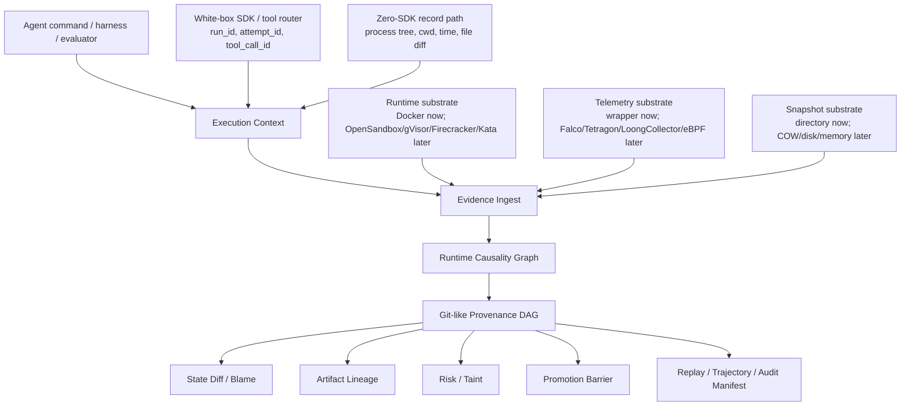

<div align="center">

# AgentProvenance

### Git-like provenance for sandboxed agent execution.

Turn execution context, runtime evidence, file diffs, artifacts, risk signals,
and promotion decisions into a queryable, replayable, and auditable causality
graph.

[](https://go.dev/)
[](https://github.com/ByteYellow/AgentProvenance/actions/workflows/ci.yml)
[](https://www.docker.com/)
[](https://www.sqlite.org/)
[](LICENSE)

**[Quickstart](#quickstart)** | **[Core Model](#core-model)** | **[Current Capability](#current-capability)** | **[Roadmap](#roadmap)**

</div>

---

AgentProvenance is a local-first provenance control plane for autonomous,
tool-using agents, especially coding agents.

It is not a generic sandbox runtime, generic telemetry collector, Kubernetes/Ray
replacement, RL trainer, or trace dashboard. It owns a narrower primitive:

```text
Execution Context
  -> Evidence Ingest
  -> Runtime Causality Graph
  -> Provenance DAG
  -> State Diff / Blame / Artifact Lineage
  -> Risk / Taint Propagation
  -> Promotion Barrier
  -> Replay / Trajectory / Audit Manifest
```

The goal is to answer questions ordinary traces do not answer well:

- Which snapshot did this execution start from?
- Which attempt produced this artifact?
- Which tool call started this process?
- Which child process caused this runtime event?
- Which process changed this file?
- Which branch was tainted, quarantined, or blocked from promotion?
- What exact evidence should an external evaluator, RL pipeline, or human
  reviewer inspect?
- Can this execution be diffed, blamed, verified, replayed, and audited later?

## Why

Modern agent execution is not one prompt and one tool call. Coding agents and
autonomous workflows fork attempts, edit files, run tests, create artifacts,
spawn subprocesses, touch external systems, and trigger runtime telemetry.
Logs, traces, metrics, and sandbox events each capture pieces of that story,
but they rarely produce a Git-like causal record of execution state.

AgentProvenance turns sandboxed execution into an evidence graph:

```text
base snapshot
  -> attempt
  -> execution context
  -> tool_call
  -> process / child process
  -> runtime_event
  -> file_diff / artifact
  -> risk / taint
  -> promotion barrier
  -> replay / audit manifest
```

The primary demo is a coding-agent best-of-N repair loop. RL-style rollout and
evaluator pipelines are important stress cases, but AgentProvenance does not
choose the reward winner. It emits structured trajectory evidence so an
external evaluator or training pipeline can make that decision.

## Core Model

AgentProvenance supports two context modes.

### White-box mode

An agent harness, SDK, tool router, or framework explicitly provides context:

```text
run_id / session_id / attempt_id / tool_call_id / tool_name / args_hash
```

This gives high precision and fits custom coding-agent systems, Agentix-style
harnesses, LangGraph-like workflows, and internal tool routers.

### Zero-SDK mode

The user can run an agent command directly:

```sh
agentprov record -- <agent command>
```

The current MVP records a command in a working directory, snapshots the
pre-execution file state, runs the command, computes post-execution file
changes, and emits runtime file evidence into the DAG. The long-term zero-SDK
path adds deeper process-tree and kernel telemetry capture.

Zero-SDK inference uses runtime facts:

```text
root process / process tree / cwd / timestamp / container_id / cgroup_id
  / file diff / artifact refs
```

Raw system-side telemetry should not be required to carry `tool_call_id`.
Kernel and runtime signals usually know PID, cgroup, namespace, container ID,
timestamp, and process tree. AgentProvenance correlates those substrate facts
back to execution context.

Today, the CLI exposes the underlying binding primitive:

```sh
agentprov telemetry bind --run <run_id> --session <session_id> \
  --attempt <attempt_id> --tool-call <tool_call_id> --process <process_id> \
  --container-id <container_id> --cgroup-id <cgroup_id> --pid <pid>
```

Then raw events can be ingested without `tool_call_id`:

```sh
agentprov telemetry ingest --raw-event raw-execve-1 --pid <pid> \
  --timestamp <event_time> --source tetragon_jsonl --type execve \
  --payload '{"argv":["./async_child.sh"]}'
```

## Quickstart

Prerequisites:

- Go 1.23+
- Docker Desktop or a compatible Docker daemon

```sh
git clone https://github.com/ByteYellow/AgentProvenance
cd AgentProvenance

go build ./cmd/agentprov

mkdir -p /tmp/agentprov-record-demo
printf 'value = 1\n' > /tmp/agentprov-record-demo/app.py
./agentprov record --run run-record-demo --workdir /tmp/agentprov-record-demo -- \
  sh -lc 'printf "value = 2\n" > app.py && echo artifact > artifact.txt'
./agentprov graph explain --run run-record-demo --file app.py

./scripts/demo_coding_agent_best_of_n.sh
./scripts/accept_phase1.sh
```

The demo builds `agentprov`, creates a clean coding workspace, snapshots it,
forks five attempts, runs different bug-fix strategies, records runtime
telemetry, quarantines a risky branch, marks one clean candidate as locally
promotable for demonstration, and queries the provenance DAG.

`accept_phase1.sh` is the machine-checkable gate for the current MVP.

## Graph Commands

```sh
./agentprov graph trace --run run-demo-bugfix
./agentprov graph refs --run run-demo-bugfix
./agentprov graph log --run run-demo-bugfix
./agentprov graph materialize --run run-demo-bugfix
./agentprov graph verify --run run-demo-bugfix
./agentprov graph verify --run run-demo-bugfix --json
./agentprov graph replay --run run-demo-bugfix
./agentprov graph replay --run run-demo-bugfix --json
./agentprov graph trajectories --run run-demo-bugfix --json
./agentprov graph diff --run run-demo-bugfix --file calculator.py
./agentprov graph diff --run run-demo-bugfix --file calculator.py --json
./agentprov graph blame --run run-demo-bugfix --file calculator.py
./agentprov graph blame --run run-demo-bugfix --file calculator.py --json
./agentprov graph explain --run run-demo-bugfix --file calculator.py
./agentprov graph explain --run run-demo-bugfix --file calculator.py --json
./agentprov graph explain --tool-call <tool_call_id>
```

What these mean:

| Command | Purpose |
|---|---|
| `trace` | Show execution context, runtime causality, provenance edges, risk, and promotion evidence |
| `refs` | Emit stable Git-like references for attempts, snapshots, artifacts, and decisions |
| `log` | Show chronological execution history |
| `materialize` | Write content-addressed provenance objects |
| `verify` | Check graph integrity, taint/promotion barriers, object hashes, replay generation, and drain watermarks |
| `replay` | Emit a plan-only reconstruction of the run |
| `trajectories --json` | Emit per-attempt evidence for external evaluators or RL pipelines |
| `diff` | Compare file state between base and attempts |
| `blame` | Attribute file state to attempt, tool call, process, strategy, command, and local candidate status |
| `explain` | Explain a target by combining trace, runtime causality, diff/blame, policy, and promotion evidence; `--json` emits `agentprovenance.explain/v1` |

## Current Capability

| Area | Current capability |
|---|---|
| Zero-SDK record | `agentprov record -- <command>` snapshots a working directory, runs a command, computes changed files, and records runtime file evidence |
| Execution context | explicit ToolCallScope binding through run/session/attempt/tool_call/process/container/cgroup/pid |
| Evidence ingest | raw telemetry ingestion without requiring raw `tool_call_id` |
| Runtime causality | native `runtime_*` graph edges for tool call, process, process tree, attempt, snapshot, runtime event, and workspace file correlation |
| Provenance DAG | `trace`, `refs`, `log`, `materialize`, `verify`, text and JSON replay |
| Diff / blame | MVP file-level diff and blame with JSON manifests; `graph explain --file --json` combines diff/blame with runtime file events |
| Artifact lineage | exported attempt artifacts linked to attempt/tool_call/process |
| Risk / taint | policy decisions, quarantine, taint, taint descendant checks |
| Promotion barrier | candidate eligibility with telemetry/evidence drain watermark |
| Trajectory evidence | `agentprovenance.trajectories/v1` manifest for external evaluators |
| Runtime | Docker active; gVisor/Firecracker/bubblewrap are explicit capability stubs |
| Snapshots | directory snapshot, fork, resume, lineage, taint propagation |
| Cost | run/attempt/session cost records, fanout cost, saved cost, active CPU windows |

## Core Demo Acceptance

The main demo must prove:

- Multiple attempts fork from the same clean snapshot.
- Raw telemetry does not need `tool_call_id`.
- PID, cgroup, container, and time-window bindings can resolve execution
  context.
- Native runtime causality records `tool_call -> process -> runtime_event`.
- PID/PPID/TGID telemetry creates process-tree causality edges.
- Runtime-observed `file_write` can appear in the same trajectory that produced
  a file diff.
- Runtime-observed file events create `workspace_file/<path>` graph nodes and
  can be explained together with diff/blame.
- A risky branch is quarantined and tainted.
- A tainted branch cannot pass the promotion barrier.
- Promotion records a drain watermark with `drain_pending_after=0`.
- `graph diff` emits unified diff and JSON.
- `graph blame` emits created/modified/deleted/unchanged state attribution.
- `graph trajectories --json` emits a structured evidence package for external
  evaluators.

Run:

```sh
./scripts/demo_coding_agent_best_of_n.sh
./scripts/accept_phase1.sh
```

## Architecture



Capability gating is a hard design rule. Upper layers must query the runtime,
snapshot, telemetry, and isolation capabilities before assuming fast fork,
memory snapshot, restore, identity, or enforcement semantics. Docker-only
execution degrades to directory/filesystem provenance instead of pretending to
provide VM-level resume.

## Substrate Signals

Substrate integrations are downstream of the provenance model:

- Docker is the active local runtime.
- OpenSandbox, gVisor, Firecracker, and Kata are future runtime substrates.
- Kubernetes, Ray, Batch, and cloud systems are orchestration substrates.
- Falco, Tetragon, LoongCollector, auditd, and eBPF are telemetry substrates.

The project value is not collecting more logs. The value is correlating
substrate signals with execution context and making them affect diff, blame,
taint, replay, and auditability.

## Boundaries

These boundaries are intentional:

- AgentProvenance does not implement a general sandbox runtime.
- It does not replace Kubernetes, Ray, OpenSandbox, Firecracker, gVisor, Kata,
  Falco, Tetragon, LoongCollector, or eBPF.
- It is not a LangSmith clone, LLM gateway, or general observability dashboard.
- It does not promise memory snapshot or VM-level instant clone in Phase 1.
- It does not perform arbitrary branch auto-merge.
- It does not roll back real external side effects. External actions are
  recorded, gated, and optionally linked to compensation hooks.
- It does not make final reward or winner decisions for RL pipelines.

See [docs/product.md](docs/product.md) for the product direction and
[docs/comparisons.md](docs/comparisons.md) for adjacent-system boundaries.

## Repository Layout

```text
cmd/agentprov/        CLI entrypoint
internal/cli/         command parsing and output
internal/control/     leases, sessions, rollout, promotion barrier
internal/runtime/     capability-gated runtime drivers
internal/state/       snapshots, fork/resume, lineage, taint
internal/provenance/  graph trace, refs, log, diff, blame, materialize, verify, replay
internal/evidence/    evidence records and external effects
internal/telemetry/   raw telemetry ingest and context correlation
internal/security/    policy decisions, quarantine, risk signals
internal/economics/   active CPU windows, cost, rollout budget
internal/store/       SQLite schema and repositories
examples/             tasks, events, policies
scripts/              runnable demos
docs/                 product direction, MVP details, comparisons
```

## Roadmap

| Phase | Goal | Main deliverables |
|---|---|---|
| Phase 1 | Provenance correlation MVP | execution context, evidence ingest, runtime causality DAG, diff/blame, taint, promotion barrier, replay and trajectory manifests |
| Phase 2 | Risk and auto-response MVP | configurable rules, RiskSignal, taint propagation, quarantine, promotion block, forensics export |
| Phase 3 | Zero-SDK substrate integration | deeper process tree capture, cwd/time/file-diff inference, wrapper/audit receivers |
| Phase 4 | eBPF telemetry substrate | Falco/Tetragon/LoongCollector JSONL receivers, cgroup/container/pid correlation, kernel-side filtering assumptions |
| Phase 5 | Isolation and enforcement | IsolationProfile, EscalationPolicy, seccomp/AppArmor/eBPF LSM/gVisor/Firecracker capability gates |
| Phase 6 | Scale hardening | async evidence writer, retention, content-addressed storage, snapshot GC, resource windows, high-concurrency rollout tests |

Near-term hardening:

- Deeper graph integrity checks for process-tree and file-event causality.

## Development

```sh
go test ./...
./scripts/demo_coding_agent_best_of_n.sh
./scripts/accept_phase1.sh
```

The acceptance script is the main machine-checkable gate for Phase 1.
