<div align="center">

# AgentProvenance

### Correlate application context with system telemetry into a verifiable, signable causality graph for sandboxed agents.

Correlate application-side agent context with system-side telemetry, then turn
runtime evidence, file diffs, artifacts, risk signals, and response decisions
into a queryable, replayable, and auditable causality graph. Evidence is stored
content-addressed and hash-verified (a model borrowed from Git) and can be
signed for tamper-evidence -- but this is an audit/provenance layer, **not a
version-control system**: there is no merge, checkout, or mutable working tree.

[](https://github.com/ByteYellow/AgentProvenance/releases/latest)
[](https://go.dev/)
[](https://github.com/ByteYellow/AgentProvenance/actions/workflows/ci.yml)
[](https://www.docker.com/)
[](https://www.sqlite.org/)
[](LICENSE)

**[Quickstart](#quickstart)** | **[Core Model](#core-model)** | **[Current Capability](#current-capability)** | **[Demo walkthrough](docs/interview-demo.md)** | **[Roadmap](#roadmap)**

</div>

---

<p align="center">
  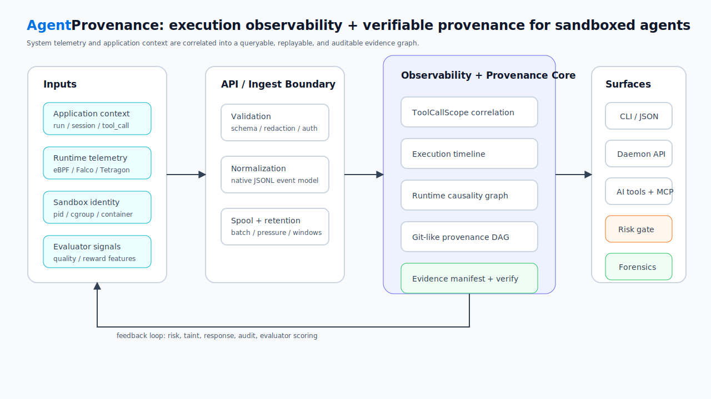
</p>

<p align="center">
  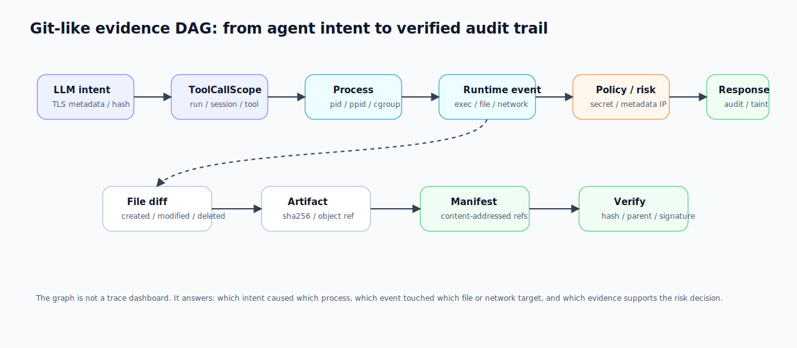
</p>

AgentProvenance is a local-first security and provenance control plane for
autonomous, tool-using agents, especially sandboxed coding agents. It captures
system telemetry from its own eBPF sensor (or ingests Falco/Tetragon),
correlates it with app-side agent context into a verifiable, signable causality
graph, and serves that graph over the CLI, a daemon API, AI tools (including an
MCP server), and a local web dashboard.

It is not a generic sandbox runtime, generic telemetry collector, Kubernetes/Ray
replacement, RL trainer, trace dashboard, or version-control system (it borrows
Git's content-addressing and verification model, not its branch/merge workflow).
It owns a narrower primitive:

```text
Execution Context
  -> Evidence Ingest
  -> Runtime Causality Graph
  -> Provenance DAG
  -> State Diff / Blame / Artifact Lineage
  -> Security Analysis / Risk Decision
  -> Taint / Response Action
  -> Replay / Forensics / Audit Manifest
```

The goal is to answer questions ordinary traces do not answer well:

- Which snapshot did this execution start from?
- Which attempt produced this artifact?
- Which tool call started this process?
- Which child process caused this runtime event?
- Which process changed this file?
- Which behavior is anomalous for this agent or task profile?
- Which execution branch was tainted, quarantined, interrupted, or blocked by
  a response gate?
- Which evidence supports a risk decision?
- What response action should be triggered: audit, deny, kill, quarantine,
  taint, export forensics, or notify a human through Feishu/DingTalk?
- What exact behavior evidence, deviation signal, and risk context should an
  external evaluator, RL pipeline, or human reviewer inspect?
- Can this execution be diffed, blamed, verified, replayed, and audited later?

<p align="center">
  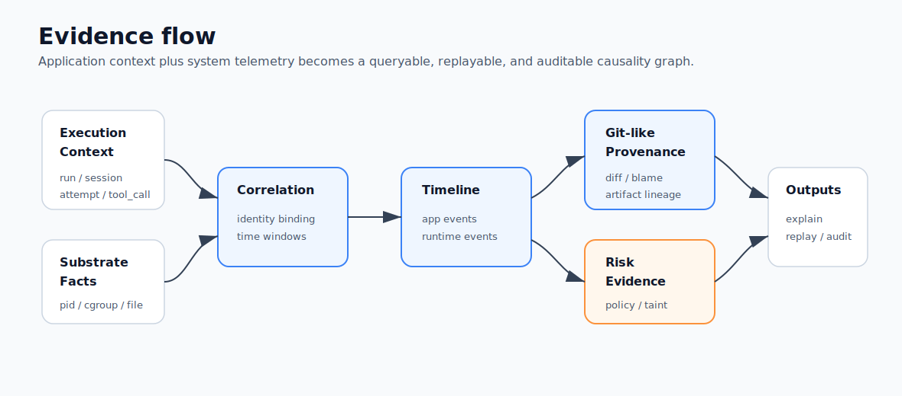
</p>

## Contents

- [Why](#why)
- [Security Loop](#security-loop)
- [Core Model](#core-model)
  - [White-box mode](#white-box-mode)
  - [Zero-SDK mode](#zero-sdk-mode)
- [Relationship To Existing Systems](#relationship-to-existing-systems)
- [Quickstart](#quickstart)
- [Deployment Modes](#deployment-modes)
  - [Falco-compatible Receiver](#falco-compatible-receiver)
- [Security Evidence Commands](#security-evidence-commands)
- [External Evaluator Protocol](#external-evaluator-protocol)
- [Compliance Evidence, Not Certification](#compliance-evidence-not-certification)
- [AI-Callable Evidence Tools](#ai-callable-evidence-tools)
- [Web Dashboard](#web-dashboard)
- [Graph Commands](#graph-commands)
- [Current Capability](#current-capability)
- [Core Demo Acceptance](#core-demo-acceptance)
- [Architecture](#architecture)
- [Substrate Signals](#substrate-signals)
- [Boundaries](#boundaries)
- [Repository Layout](#repository-layout)
- [Roadmap](#roadmap)
- [Development](#development)

## Why

Modern agent execution is not one prompt and one tool call. Coding agents and
autonomous workflows fork attempts, edit files, run tests, create artifacts,
spawn subprocesses, touch external systems, and trigger runtime telemetry.
Logs, traces, metrics, and sandbox events each capture pieces of that story,
but they rarely produce a Git-like causal record of execution state.

AgentProvenance turns sandboxed execution into a security-oriented evidence
graph:

```text
base snapshot
  -> attempt
  -> execution context
  -> tool_call
  -> process / child process
  -> runtime_event
  -> file_diff / artifact
  -> baseline feature / risk signal
  -> taint / response action
  -> replay / forensics / audit manifest
```

The primary path is recording and explaining sandboxed agent execution. The
branch-heavy coding-agent script is only a stress demo: it creates many
branches, artifacts, runtime events, and risk cases quickly enough to exercise
the graph. AgentProvenance does not choose the reward winner. It emits
structured trajectory evidence and expectation-deviation signals so an external
evaluator or training pipeline can turn them into reward, penalty, filtering,
or human-review decisions.

For RL pipelines, the useful primitive is not "best-of-one" or automatic winner
selection. The useful primitive is observability over each trajectory: what the
agent did, which subprocesses and files were touched, which network/runtime
events appeared, which behavior violated safety or task expectations, and which
risk/baseline signals should contribute to reward shaping or rejection.

## Security Loop

The security model is intentionally simple and concrete:

```text
application context
  run / session / attempt / tool_call / user / task / workspace

system telemetry
  process / file / network / resource / sandbox / eBPF event

correlation
  container_id / cgroup_id / pid / ppid / cwd / timestamp / file diff

security analysis
  behavior baseline / suspicious event / taint lineage / risk decision

response
  audit / deny / kill / quarantine / taint / forensics / Feishu or DingTalk notification
```

This makes AgentProvenance closer to an AI-era HIDS/control-plane layer than a
pure LLM trace dashboard. Traditional host monitoring asks "what did this
process do?" AgentProvenance adds the agent execution context needed to ask
"which agent/tool/task caused it, what state did it change, what evidence proves
it, and what response should happen?"

The project currently implements the evidence graph, runtime correlation,
diff/blame, telemetry batch manifests, policy decisions, normalized risk
signals, baseline deviation records, response action records, taint,
quarantine, and forensics/export foundations. Deeper eBPF receivers and
Feishu/DingTalk response adapters belong to the next security-control phases.

## Core Model

AgentProvenance supports two context modes.

### White-box mode

An agent harness, SDK, tool router, or framework explicitly provides context:

```text
run_id / session_id / attempt_id / tool_call_id / tool_name / args_hash
```

This gives high precision and fits custom coding-agent systems, Agentix-style
harnesses, LangGraph-like workflows, and internal tool routers.

### Zero-SDK mode

The user can run an agent command directly:

```sh
agentprov record -- <agent command>
```

The current MVP records a command in a working directory, snapshots the
pre-execution file state, runs the command, computes post-execution file
changes, and emits runtime file evidence into the DAG. The long-term zero-SDK
path adds deeper process-tree and kernel telemetry capture.

Zero-SDK inference uses runtime facts:

```text
root process / process tree / cwd / timestamp / container_id / cgroup_id
  / file diff / artifact refs
```

Raw system-side telemetry should not be required to carry `tool_call_id`.
Kernel and runtime signals usually know PID, cgroup, namespace, container ID,
timestamp, and process tree. AgentProvenance correlates those substrate facts
back to execution context.

Today, the CLI exposes the underlying binding primitive:

```sh
agentprov telemetry bind --run <run_id> --session <session_id> \
  --attempt <attempt_id> --tool-call <tool_call_id> --process <process_id> \
  --container-id <container_id> --cgroup-id <cgroup_id> --pid <pid>
```

Then raw events can be ingested without `tool_call_id`:

```sh
agentprov telemetry ingest --raw-event raw-execve-1 --pid <pid> \
  --timestamp <event_time> --source tetragon_jsonl --type execve \
  --payload '{"argv":["./async_child.sh"]}'
agentprov telemetry ingest-jsonl --format tetragon --file tetragon-events.jsonl
agentprov telemetry ingest-jsonl --format native --file agentprov-sensor-events.jsonl
agentprov telemetry ingest-falco --file falco-events.jsonl
```

`ingest-jsonl` records a telemetry batch manifest with the input file hash,
mapped event IDs, event ID hash, receiver summary, and row-level mapping
results. By default it also evaluates runtime policy for ingested events, so
metadata-IP, private-CIDR, and secret-path rows become `policy_decisions`,
`risk_signals`, `response_actions`, graph edges, and timeline rows. Use
`--no-policy` when the receiver should only normalize and store telemetry. This
gives the DAG an audit handle for external Falco/Tetragon/LoongCollector
evidence without turning AgentProvenance into a long-term log store.

The `native` format is the receiver for AgentProvenance's own eBPF sensor
(`cmd/agentprov-sensor`, `source="agentprov_ebpf"`), and is auto-detected. This
closes the consume-only gap: the sensor's normalized kernel events (execve,
network connect classified into `metadata_ip`/`private_cidr`, file writes with
their real absolute host paths) flow through the identical correlation, policy,
risk, and unified-signal path as third-party telemetry. Raw file telemetry now
accepts absolute host paths (e.g. a write to `/home/agent/.aws/credentials`),
which the policy path rules still catch; only the workspace file-node graph keeps
its relative-path constraint. `scripts/accept_native_sensor_risk.sh` proves the
loop end to end (own kernel telemetry to a unified `security` signal).

`ingest-falco` is the Falco-compatible receiver path. It reads Falco JSON/stdout
from a file or stdin stream, maps recognized `execve`, `open/openat`, and
`connect` events into normalized runtime events, correlates them by
PID/container/cgroup/time evidence, and then evaluates policy by default.
Raw Falco rows do not need `tool_call_id`; ToolCallScope is recovered from the
binding table when possible.

## Relationship To Existing Systems

AgentProvenance is designed to coexist with system-level observability projects,
LLM tracing systems, and sandbox runtimes.

| System category | What it owns | How AgentProvenance differs |
|---|---|---|
| system observability | low-intrusion system-side capture, eBPF/runtime event collection, cross-process visibility | AgentProvenance treats those events as evidence input, then builds a Git-like causality/provenance DAG, diff/blame, taint lineage, risk decision, forensics, and response-control surface |
| OpenTelemetry / LLM trace platforms | spans, logs, metrics, LLM/tool traces, dashboards, latency/cost views | AgentProvenance focuses on state provenance, artifact lineage, sandbox runtime effects, security decisions, replay, and audit manifests |
| HIDS / EDR / runtime security | host/process/file/network detection and enforcement | AgentProvenance adds agent context: run/session/attempt/tool_call, snapshot lineage, file diffs, artifact provenance, risk signals, baseline deviations, and response gates |
| Sandbox runtimes | isolation, process/container/VM execution, filesystem and network boundaries | AgentProvenance consumes sandbox identity and telemetry; it does not try to replace Docker, OpenSandbox, gVisor, Firecracker, Kata, or Kubernetes |

So the differentiation is not "another zero-SDK eBPF observer." The narrow
primitive is:

```text
system-side telemetry + application-side agent context
  -> evidence DAG
  -> security analysis and risk judgment
  -> automated response and audit trail
```

## Quickstart

Prerequisites:

- Go 1.23+
- Docker Desktop or a compatible Docker daemon

```sh
git clone https://github.com/ByteYellow/AgentProvenance
cd AgentProvenance

go build ./cmd/agentprov

mkdir -p /tmp/agentprov-record-demo
printf 'value = 1\n' > /tmp/agentprov-record-demo/app.py
./agentprov record --run run-record-demo --workdir /tmp/agentprov-record-demo -- \
  sh -lc 'printf "value = 2\n" > app.py && echo artifact > artifact.txt'
./agentprov observe summary --run run-record-demo
./agentprov graph explain --run run-record-demo --file app.py

./agentprov adapter list
./agentprov adapter inspect filtered-jsonl --json
./scripts/demo_telemetry_jsonl.sh
./agentprov telemetry batches --run run-telemetry-jsonl-demo
./agentprov timeline --run run-telemetry-jsonl-demo
./agentprov timeline --run run-telemetry-jsonl-demo --view causality
./agentprov timeline --run run-telemetry-jsonl-demo --json
./scripts/accept_phase1.sh
```

The quick path builds `agentprov`, records a command, explains the changed file,
ingests filtered substrate telemetry, and runs the Phase 1 acceptance gate.
`observe summary` is the run-level observability entry point: it summarizes
application context, runtime telemetry coverage, risk, baseline, response, and
top evidence refs before you drill into timeline or graph queries.

`demo_telemetry_jsonl.sh` is the minimal substrate telemetry path. It binds a
ToolCallScope, ingests Tetragon/Falco/LoongCollector fixture JSONL from
`examples/telemetry/`, lists normalized events, and explains how one substrate
event entered the DAG.

`accept_phase1.sh` is the machine-checkable gate for the current MVP.

`timeline` is the execution timeline surface. It merges
application context, runtime telemetry, evidence, policy decisions, risk
signals, baseline deviations, response actions, and external effects into one
time-ordered view. `--view causality` groups rows into agent context, runtime
process, runtime telemetry, evidence, risk/policy, and external-effect lanes,
with correlation status and drill-down commands. The JSON output is designed to
feed a future UI.

## Deployment Modes

AgentProvenance is intentionally usable in three deployment shapes. RL,
benchmark, and evaluator users should start with the first shape; enterprise
security and audit users can move toward the later shapes when they need shared
ingest, retention, and query services.

<p align="center">
  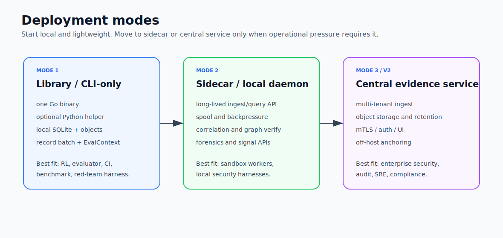
</p>

| Mode | Shape | Best for | Tradeoff |
|---|---|---|---|
| Library / CLI-only recorder | one `agentprov` binary, optional Python helper, local SQLite/object store | RL rollout, evaluator jobs, benchmarks, CI, local red-team harnesses | easiest to adopt; weaker shared query and long-running ingest |
| Sidecar / local daemon | `agentprov daemon serve` beside one worker or sandbox host; CLI/SDK acts as client | sandbox worker, CI runner, local security harness, medium-volume telemetry ingest | adds a local service boundary, spool, backpressure, and stable query API |
| Central evidence service | shared ingest/query service with object storage, retention, auth, and UI/API | enterprise security, audit, SRE, compliance, incident review | highest operational cost; not the default RL entry point |

For RL and evaluator pipelines, the default contract is lightweight and
offline-first:

- Install: one Go binary plus an optional thin Python package.
- Call: wrap an existing command first; SDK/framework integration is optional.
- Batch: every trajectory gets stable `run_id` / evidence manifest / signal
  context output, and query surfaces are paged.
- Overhead: default capture focuses on process/file/diff/artifact/exit/resource
  evidence; heavier Falco/eBPF-style telemetry is an opt-in substrate.
- Ownership: AgentProvenance emits evidence, deviation, risk, and trajectory
  signals. The RL system owns reward, ranking, dataset policy, and winner
  selection.
- Policy: RL mode does not require online deny/kill/quarantine. Those actions
  are opt-in security controls; offline scoring can run later over captured
  EvalContext JSONL.

Python usage stays thin and CLI-backed. For Deploy 1, the intended RL/evaluator
entry point is one function that runs the local offline loop end to end:

```python
from agentprov import Registry, Signal, run_batch_pipeline

registry = Registry(name="rl-reward-signals")

@registry.rule("file_change_reward")
def file_change_reward(ctx):
    return Signal.reward_feature(
        "file_change_reward",
        float(len(ctx.file_changes())),
        "reward feature from file state changes",
    )

@registry.rule("metadata_penalty")
def metadata_penalty(ctx):
    if ctx.has_event_type("metadata_ip"):
        return Signal.penalty("metadata_ip", -1.0, "metadata service access")
    return None

result = run_batch_pipeline(
    [
        {"run_id": "traj-0001", "workdir": "/tmp/job1", "command": ["pytest", "-q"]},
        {"run_id": "traj-0002", "workdir": "/tmp/job2", "command": ["pytest", "-q"]},
    ],
    registry,
    binary="./agentprov",
    data_dir=".agentprov-rl",
    engine="rl-reward-signals",
    import_signals=True,
    include_forensics=True,
)

print(result.batch_id, result.signal_count)
```

For RL users, custom "rules" are ordinary Python evaluator functions. They run
offline over evidence; Go keeps ownership of capture, correlation, manifests,
and query integrity. The same workflow can be split into lower-level calls when
the pipeline already owns scheduling or sharding:

```python
from agentprov import Client, evaluate_batch

client = Client(binary="./agentprov", data_dir=".agentprov-batch")
batch = client.record_batch(
    [
        {"run_id": "traj-0001", "workdir": "/tmp/job1", "command": ["pytest", "-q"]},
        {"run_id": "traj-0002", "workdir": "/tmp/job2", "command": ["pytest", "-q"]},
    ],
)
contexts = client.batch_eval_contexts(batch_id=batch["batch_id"])
reports = evaluate_batch(contexts, registry=registry)
client.import_signal_reports(reports, engine=registry.name)
```

Later, the same local store can be queried by batch, shard, job, or run:

```sh
./agentprov evidence batch-summary --latest --json
./agentprov evidence batch-summary --shard shard-0 --json
./agentprov evidence batch-summary --run traj-0001 --json
./agentprov signal batch-context --shard shard-0 --latest > eval-contexts.jsonl
./agentprov forensics export-batch --latest --json
```

### Falco-compatible Receiver

The dedicated Falco receiver is useful when Falco is already filtering kernel
or runtime events on the host:

```sh
./agentprov telemetry bind --run run-falco-demo --session session-falco-demo \
  --attempt attempt-falco-demo --tool-call tool-falco-demo \
  --process process-falco-demo --container-id container-falco-demo --pid 4242 \
  --started-at 2026-01-01T00:00:00Z

./agentprov telemetry ingest-falco \
  --file examples/telemetry/falco-risk-events.jsonl --json

./agentprov telemetry list --run run-falco-demo
./agentprov telemetry list --run run-falco-demo --limit 100 --json
./agentprov telemetry list --run run-falco-demo --limit 100 --cursor <next_cursor> --json
./agentprov timeline --run run-falco-demo
./agentprov security risks --run run-falco-demo --json
./agentprov security responses --run run-falco-demo --json
```

For a live stream, pipe Falco JSON output directly:

```sh
sudo falco -o json_output=true -o json_include_output_property=true | \
  ./agentprov telemetry ingest-falco --file -
```

The receiver maps Falco process, file, and network rows into normalized runtime
events. Metadata IP, private CIDR, and secret-path rows are promoted into
security evidence: `RiskSignal`, `ResponseAction`, policy graph edges, and
timeline entries. `graph explain --risk <policy_decision_id> --json` links the
risk back to the raw runtime event and forward to the response action. Falco
remains the substrate collector; AgentProvenance owns correlation, causality,
provenance, and risk/audit linkage.

The main smoke path is telemetry correlation and graph explanation:

```sh
./scripts/demo_telemetry_jsonl.sh
```

It binds a ToolCallScope, ingests raw Falco/Tetragon/LoongCollector-style
runtime events that do not carry `tool_call_id`, normalizes them into the event
store, correlates them back to application context, and explains the resulting
causal graph.

## Security Evidence Commands

```sh
./agentprov observe summary --run <run_id>
./agentprov observe summary --run <run_id> --json
./agentprov observe coverage --run <run_id>
./agentprov observe coverage --run <run_id> --json
./agentprov observe scopes --run <run_id>
./agentprov observe scopes --run <run_id> --json
./agentprov observe event --run <run_id> --event <event_id>
./agentprov observe event --run <run_id> --event <event_id> --json
./agentprov observe process --run <run_id> --process <process_id>
./agentprov observe process --run <run_id> --process <process_id> --json
./agentprov observe flow --run <run_id>
./agentprov observe flow --run <run_id> --json
./agentprov evidence manifest --run <run_id>
./agentprov evidence manifest --run <run_id> --json
./agentprov evidence manifest --run <run_id> --materialize --json
./agentprov telemetry correlations --run <run_id>
./agentprov telemetry correlations --run <run_id> --json
./agentprov telemetry correlations --event <event_id> --json
./agentprov timeline --run <run_id>
./agentprov timeline --run <run_id> --view causality
./agentprov timeline --run <run_id> --limit 100 --cursor <next_cursor> --json
./agentprov timeline --run <run_id> --tool-call <tool_call_id> --json
./agentprov timeline --run <run_id> --process <process_id> --json
./agentprov timeline --run <run_id> --type risk_signal --json
./agentprov security risks --run <run_id>
./agentprov security risks --run <run_id> --json
./agentprov security deviations --run <run_id>
./agentprov security deviations --run <run_id> --json
./agentprov security responses --run <run_id>
./agentprov security responses --run <run_id> --json
./agentprov baseline learn --template <template_name> --run <run_id>
./agentprov baseline check --template <template_name> --run <run_id>
./agentprov signal context --run <run_id>
./agentprov signal batch-context --batch <batch_id>
./agentprov signal batch-context --shard <shard_id>
./agentprov signal batch-context --runs runs.jsonl
./agentprov signal run --run <run_id>
./agentprov signal run --run <run_id> --json
./agentprov signal run --run <run_id> \
  --external "PYTHONPATH=python python3 examples/evaluators/python_signal_eval.py" --json
./agentprov signal import --run <run_id> --file external-signals.json --json
./agentprov signal import-batch --file signal-reports.jsonl --engine python-sdk --json
./agentprov compliance frameworks
./agentprov compliance map --framework owasp-asi --run <run_id>
./agentprov compliance explain --framework owasp-asi --run <run_id> --item ASI05
./agentprov compliance gaps --framework owasp-asi --run <run_id>
./agentprov compliance report --framework nist-rfi-2026-00206 --run <run_id>
./agentprov ai tools --provider openai
./agentprov ai tools --provider anthropic
./agentprov ai call evaluate_action --input '{"event_type":"network_connect","dst_ip":"169.254.169.254"}'
./agentprov policy test examples/events/metadata-egress.jsonl
./agentprov policy decisions --run <run_id>
./agentprov forensics export <run_id>
./agentprov forensics export-batch --batch <batch_id>
./agentprov forensics export-batch --latest --include-eval-contexts --json
```

These commands are now part of the mainline security evidence surface:

| Command | Purpose |
|---|---|
| `observe summary` | Show run-level observability coverage across application context, runtime telemetry, risks, baselines, responses, and evidence refs |
| `observe coverage` | Show runtime telemetry correlation quality and list events missing session/tool_call/process identity |
| `observe scopes` | Show per-tool-call observability: processes, runtime events, risks, policy decisions, responses, and drill-down links |
| `observe event` | Explain one runtime event with correlated agent context, related risk/policy/response evidence, and drill-down links |
| `observe process` | Explain one process with its tool_call context, runtime events, risk/policy/response evidence, and drill-down links |
| `observe flow` | Show the compact causality flow from runtime events to risk signals, policy decisions, and response actions |
| `evidence manifest` | Emit a run-level evidence index that binds observability summary, timeline hash, content-addressed object refs, risk/response report hashes, and recommended drill-down queries; `--materialize` writes it as an `evidence_manifest` provenance object |
| `telemetry correlations` | Explain why runtime telemetry events were attached to a ToolCallScope, including raw identity, matched binding, matched keys, confidence, time window, and drill-down refs |
| `timeline` | Show a time-ordered execution view across application context, runtime telemetry, evidence, risk, baseline, response, and external effects |
| `security risks` | List normalized `RiskSignal` records derived from policy/runtime evidence; `--json` emits schema/hash metadata and drill-down refs to event/process/timeline/explain views |
| `security deviations` | List `BaselineDeviation` records from behavior feature checks; `--json` emits schema/hash metadata and drill-down refs to timeline and summary views |
| `security responses` | List recorded `ResponseAction` records such as audit, deny, kill, quarantine, taint, export, or notification hooks; `--json` emits schema/hash metadata and drill-down refs back to risk/process/explain views |
| `baseline learn/check` | Learn process/file/network/risk/runtime feature vectors and emit deviation records plus baseline-derived risk signals |
| `signal context/batch-context/run/import/import-batch` | Export one `EvalContext` or JSONL `EvalContext` streams for a batch/shard/run list, run built-in or external evaluators, and validate imported `EvalSignal` records or JSONL `EvalReport` batches for reward shaping, dataset filtering, quality scoring, or external benchmark consumers. AgentProvenance owns the evidence protocol, not the reward policy |
| `compliance frameworks/map/explain/gaps/report` | Map run evidence to OWASP Agentic Security and NIST AI agent security assessment profiles as item-level self-assessment evidence and gap lists |
| `ai tools/call` | Expose the read-only evidence query surface and inline policy pre-flight gate as provider tool schemas plus a local dispatcher. This is not an LLM gateway: models can query evidence and ask for a trusted policy verdict, but they cannot fabricate runtime telemetry, signatures, or provenance objects |
| `policy test/decisions` | Evaluate events, persist policy decisions, and feed the risk/response graph |
| `forensics export` | Export auditable evidence for a run; `--json` emits `agentprovenance.forensics_export/v1` with bundle path, sha256, size, and status |
| `forensics export-batch` | Export a batch-level audit bundle for record batches; `--json` emits `agentprovenance.batch_forensics_export/v1` with batch summary, per-run forensics refs, optional EvalContext records, result/page hashes, and a sha256-verified bundle path |

## External Evaluator Protocol

AgentProvenance exposes evidence to external scoring systems without owning
their reward, ranking, or dataset policy.

```sh
./agentprov signal context --run <run_id> > eval-context.json

./agentprov signal run --run <run_id> \
  --external "PYTHONPATH=python python3 examples/evaluators/python_signal_eval.py" \
  --json

./agentprov signal import --run <run_id> --file external-signals.json --json
```

The protocol is intentionally small:

- `EvalContext` contains trajectories, file changes, runtime events, risk
  signals, and response actions.
- External evaluators read `EvalContext` from stdin and return
  `{ "signals": [...] }`.
- `EvalSignal` can represent reward features, penalties, dataset labels, or
  quality signals.
- `python/agentprov_eval` and the `agentprov` import alias provide a thin
  helper SDK with `Registry`, `@rule`, `evaluate_batch`, `reports_jsonl`, and CLI-backed
  capture/query helpers. They do not encode a reward function.
- `signal import-batch` accepts JSONL EvalReport records so RL pipelines can
  import many offline signal reports without one command per run.

This lets a benchmark harness, RL pipeline, red-team harness, or data filtering
job decide how evidence becomes score, rejection, or review.

In daemon mode, the same protocol is available through the local API:

```text
GET  /v1/signal/context?run=<run_id>
POST /v1/signal/run
POST /v1/signal/import
```

The daemon does not expose an HTTP endpoint that runs arbitrary external shell
commands. A client can fetch `EvalContext`, execute its evaluator in its own
process boundary, and import the resulting signals back into the daemon for
validation. The CLI follows that shape when `--daemon-url` is set.

## Compliance Evidence, Not Certification

AgentProvenance can map run evidence to security framework profiles such as
OWASP Agentic Security and NIST AI agent security assessment questions:

```sh
./agentprov compliance frameworks
./agentprov compliance frameworks --ruleset examples/compliance/custom-ruleset.yaml
./agentprov compliance validate --ruleset examples/compliance/custom-ruleset.yaml
./agentprov compliance map --framework owasp-asi --run <run_id>
./agentprov compliance map --framework owasp-asi --run <run_id> --only ASI05,ASI10,TRACE
./agentprov compliance explain --framework owasp-asi --run <run_id> --item ASI05
./agentprov compliance gaps --framework owasp-asi --run <run_id>
./agentprov compliance gaps --framework owasp-asi --run <run_id> --missing-only --json
./agentprov compliance map --framework enterprise-agent-review --ruleset examples/compliance/custom-ruleset.yaml --run <run_id>
./agentprov compliance report --framework nist-rfi-2026-00206 --run <run_id> --json
```

The output is an evidence-backed self-assessment. It does not certify
compliance, provide legal advice, or replace qualified third-party audit. Each
check item is derived from evidence already present in the run: timeline events,
runtime telemetry, ToolCallScope bindings, policy decisions, risk signals,
baseline deviations, response actions, forensics bundles, content-addressed
provenance objects, and graph edges.

Each item reports:

```text
covered | partial | missing | not_applicable
```

with concrete `evidence_refs`, a gap when evidence is incomplete, and a
recommended next step. This makes agent execution evidence usable for security
reviews without turning AgentProvenance into a GRC platform.
`compliance gaps` turns that same mapping into an actionable backlog of missing
or partial evidence items for a run.

Custom rulesets can add local frameworks and rules without replacing built-ins.
The YAML model separates `rules`, `frameworks`, and `mappings`; mappings can
also select built-in items such as `ASI05`, `ASI10`, or `TRACE` and reuse them
inside an enterprise-specific review profile. JSON keeps `control_id` for
compatibility and also emits `item_id` for the current terminology.

## AI-Callable Evidence Tools

AgentProvenance can expose its evidence query surface as AI-callable tools for
agent harnesses, evaluators, or review assistants:

```sh
./agentprov ai tools --provider generic
./agentprov ai tools --provider openai
./agentprov ai tools --provider anthropic

./agentprov ai call verify_run --input '{"run":"run-demo-bugfix"}'
./agentprov ai call list_events --input '{"run":"run-demo-bugfix","type":"execve","limit":10}'
./agentprov ai call get_timeline --input '{"run":"run-demo-bugfix","view":"causality"}'
./agentprov ai call evaluate_action --input '{"event_type":"execve","args":["python","-m","pytest","-q"]}'
./agentprov ai call evaluate_action --input '{"event_type":"network_connect","dst_ip":"169.254.169.254"}'

./agentprov ai mcp   # serve the same catalog over stdio MCP (JSON-RPC 2.0)
```

The same catalog is rendered for the generic, OpenAI, and Anthropic providers,
dispatched locally by `ai call`, and served over the Model Context Protocol by
`ai mcp` (a stdio JSON-RPC 2.0 server, spec `2025-06-18`, so MCP clients see the
identical tool set with no separate contract to drift). The catalog:

| Tool | Purpose |
|---|---|
| `verify_run` | Verify object hashes, parent links, and policy/risk/response/signal integrity for a run |
| `get_signals` | Return the unified behavior/cost/quality/security signal set for a run |
| `list_risks` | Return security risk signals and recommended actions |
| `list_events` | Return paged runtime telemetry events, optionally filtered by type |
| `get_timeline` | Return the merged application-context and runtime-telemetry timeline |
| `evaluate_action` | Run a proposed command, file action, or network action through the trusted policy engine without executing it (inline gate, no side effects) |
| `bind_scope` | Register a ToolCallScope binding (app-asserted, forced `binding_source=ai_asserted`) so independent system telemetry can correlate to this tool call |
| `record_tool_call` | Anchor an app-asserted tool call (`status=asserted`); does **not** execute anything |

The read tools and `evaluate_action` are advertised read-only; `bind_scope` and
`record_tool_call` are the context-write surface (`readOnlyHint=false` over MCP).

This is not a model gateway, prompt router, or tool-execution sandbox. The model
receives schemas and can query the evidence store, pre-flight an action through
the trusted policy engine, and assert its own app-side context (`bind_scope` /
`record_tool_call`). It can **never** write raw system telemetry, fabricate
signatures, or forge provenance graph facts: context-write rows are recorded as
`ai_asserted` and execute nothing, and verdicts are computed by the trusted
engine, not the model.

## Web Dashboard

<p align="center">
  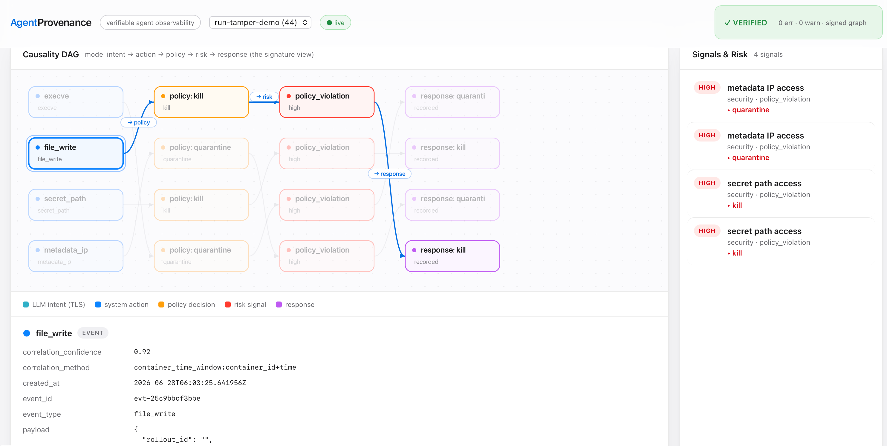
</p>
<p align="center">
  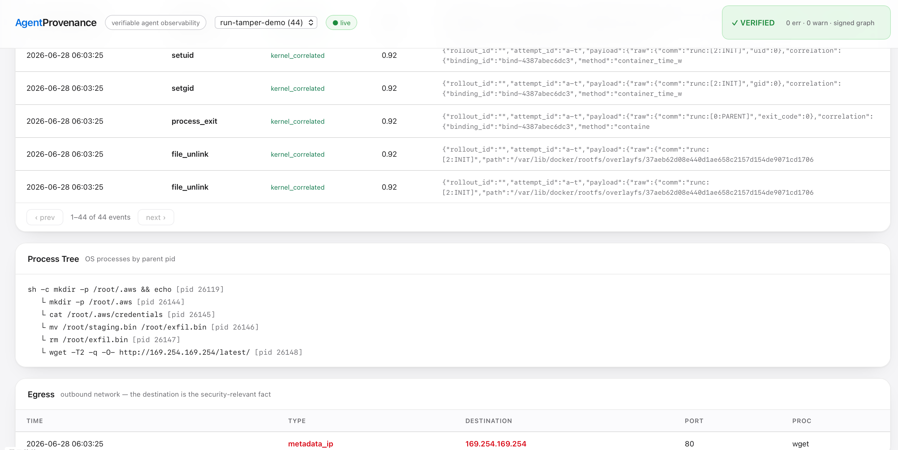
</p>


```sh
./agentprov dashboard serve            # http://127.0.0.1:7396
./agentprov dashboard serve --data-dir <dir> --addr 127.0.0.1:7396
```

A local, read-only, single-page dashboard over the verifiable graph. Its JSON
endpoints reuse the same internal functions as the CLI and AI tools, so the UI
never drifts from the contract; the HTML/JS is embedded in the binary and loads
no external assets (local-first). The UI is a **Graph Explorer** over the
canonical graph, not a single hard-coded security flow. The key scale rule is:
**all raw telemetry remains queryable, but the dashboard never tries to render
all raw telemetry as one graph**.

```text
Raw Telemetry Events
  -> Materialized high-value provenance graph
  -> Derived / Virtual Edges
  -> Lens projection
  -> Layout + side-panel schema
```

Panels:

- **Run Overview / Ask**: query-first entry points (`Why is this run risky?`,
  `What happened around egress?`, `What changed files?`, `Which processes
  mattered?`, `Where did artifacts come from?`, `Which tool calls ran?`). Each
  entry switches to a bounded local lens instead of asking the browser to draw
  the whole canonical graph.
- **Graph Explorer** (`/api/lens`, same `graph lens` query surface as the CLI):
  a **lens switcher** over 9 projections — default causality, security,
  process tree, file/artifact lineage, network egress, **data-flow/taint**,
  agent intent, trust origin, sandbox boundary — with **risk/trust overlays**,
  click-to-focus on a node's causal lineage, and a Sugiyama-layered DAG.
  It defaults to `detail=summary`: the default lens is a **Run Overview** rather
  than a raw DAG dump, and every wide lens uses bounded summary nodes:
  `process_group`, `event_burst`, `file_group`, `risk_group`, `egress_group`,
  `intent_group`, `trust_group`, and `boundary_group`. These group nodes are
  **drill-down entries**, not lossy replacements: clicking a group switches to
  the focused lens/detail needed to inspect its local upstream/downstream
  evidence. Security-relevant events, real exec/file changes, workspace writes,
  policy/risk/response, and structural context are promoted into the graph;
  low-value runtime noise stays in raw events for forensics.
  Detail levels are intentionally separated:
  `summary` means bounded overview groups, `expanded` means high-value graph
  details with low-value noise filtered, and `raw` means the full evidence layer
  for focused debugging and forensics.
  **Derived edges** (e.g. `possible_sensitive_data_flow`) render dashed with
  their confidence, so an inferred flow is never mistaken for a recorded fact.
  In summary mode, noisy N x M data-flow evidence is aggregated into a
  process/tool-scope summary edge with counts and evidence refs.
  Network egress is grouped by risk class (`risky_egress`, `dns`, `loopback`,
  `tls`, `network`) so the default path is **overview -> question -> local
  graph -> raw event table**, rather than rendering the whole run at once.
  Selecting a node exposes explicit local expansion controls:
  `lineage`, `upstream`, `downstream`, `children`, and `raw events`.
  These controls dim or reveal only the local explain path; raw telemetry stays
  paged in Focused Evidence instead of being drawn into the DAG.
- **Time-scrubber**: replay a run forward over its real event clock — watch a
  secret read, then the egress, appear in order.
- **Side Panel**: per-node **Evidence** (ids, command/pid/path/destination,
  risk/policy/response, derived-edge rule + confidence + evidence refs, hashes)
  and a bounded, secret-redacted **artifact content Preview** (the code/JSON the
  node actually produced — `/api/artifact`).
- **Focused Evidence** (`/api/events`): focused, paged raw telemetry for the
  selected question, group, signal, or node. It is intentionally empty until a
  selection is made, so it does not look like a second global timeline. Group
  nodes pass evidence refs into this table, so the UI can show the exact raw
  records behind a summary without adding them to the visible DAG.
- **Run Timeline**: the global chronological event stream for the whole run.
  This is the place to inspect "what happened over time"; Focused Evidence is
  the place to inspect "why this selected thing is true".
- **Verify + signature** status, **signals / risk**, a **paged timeline**, the
  **process tree**, and **egress**; live auto-refresh.

<p align="center">
  <!-- TODO screenshot: Graph Explorer with the data-flow/taint lens on run-snake-agent -->
  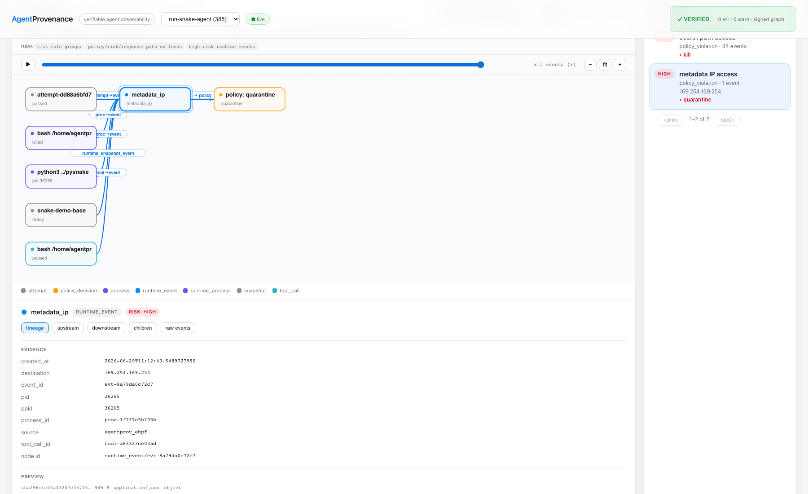 metadata-IP exfil flow" width="100%">
</p>
<p align="center">
  <!-- TODO screenshot: Side Panel showing Evidence + Preview of the agent's snake.py -->
  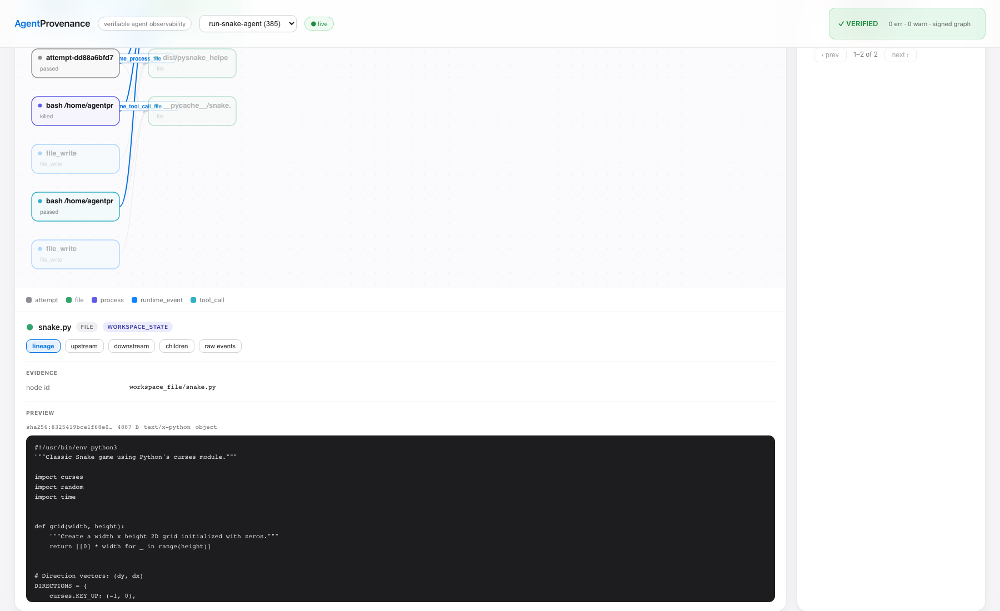
</p>

### Demo: agent in a sandbox (supply-chain exfiltration, caught by provenance)

A **real coding agent** (Claude Code, DeepSeek backend) builds a Snake game in a
sandbox; its setup step installs a poisoned `pysnake-helper` whose install hook
reads planted credentials and connects to the cloud-metadata IP. The self-owned
eBPF sensor captures it; the **data-flow/taint lens** surfaces the
secret-read -> egress flow as a causal edge. Captured live on the Linux/eBPF lab
VM and shipped as a **signed, portable forensics bundle** that replays offline:

```sh
./agentprov --data-dir /tmp/snake-replay forensics import \
  demo/snake-supply-chain/run-snake-agent.forensics.json \
  --pub-key demo/snake-supply-chain/attestation.pub        # verifies the signature, then imports
./agentprov --data-dir /tmp/snake-replay dashboard serve   # open run "run-snake-agent"
```

<p align="center">
  <!-- TODO screenshot: the taint lens time-scrubber mid-replay (secret reads visible, egress about to appear) -->
  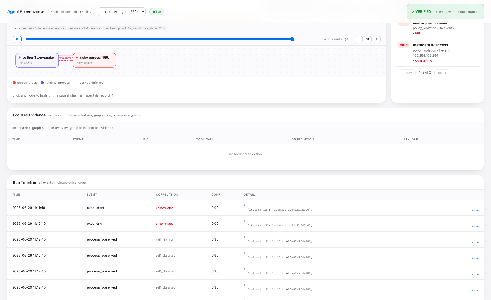
</p>

See [`demo/snake-supply-chain/`](demo/snake-supply-chain) for the full walkthrough,
the capture scripts, and what to click in the dashboard.

## Graph Commands

```sh
./agentprov graph trace --run run-demo-bugfix
./agentprov graph refs --run run-demo-bugfix
./agentprov graph log --run run-demo-bugfix
./agentprov graph materialize --run run-demo-bugfix
./agentprov graph objects --run run-demo-bugfix
./agentprov graph objects --run run-demo-bugfix --limit 50 --json
./agentprov graph objects --run run-demo-bugfix --limit 50 --cursor <next_cursor> --json
./agentprov graph verify --run run-demo-bugfix
./agentprov graph verify --run run-demo-bugfix --json
./agentprov graph replay --run run-demo-bugfix
./agentprov graph replay --run run-demo-bugfix --json
./agentprov graph trajectories --run run-demo-bugfix --json
./agentprov graph lens --run run-demo-bugfix --lens default --json
./agentprov graph lens --run run-demo-bugfix --lens data-flow-taint --overlay risk --json
./agentprov graph lens --run run-demo-bugfix --lens data-flow-taint --detail expanded --json
./agentprov graph lens --run run-demo-bugfix --lens process --detail raw --focus runtime_event/<event_id> --json
./agentprov graph lens --run run-demo-bugfix --lens process --focus runtime_event/<event_id> --json
./agentprov graph diff --run run-demo-bugfix --file calculator.py
./agentprov graph diff --run run-demo-bugfix --file calculator.py --json
./agentprov graph blame --run run-demo-bugfix --file calculator.py
./agentprov graph blame --run run-demo-bugfix --file calculator.py --json
./agentprov graph explain --run run-demo-bugfix --file calculator.py
./agentprov graph explain --run run-demo-bugfix --file calculator.py --json
./agentprov graph explain --run run-demo-bugfix --file calculator.py --depth 4 --limit 200 --json
./agentprov graph explain --run run-demo-bugfix --file calculator.py --depth 4 --limit 200 --cursor <next_cursor> --json
./agentprov graph explain --tool-call <tool_call_id>
./agentprov graph explain --risk <policy_decision_id> --json
```

What these mean:

| Command | Purpose |
|---|---|
| `trace` | Show execution context, runtime causality, provenance edges, risk, and response-gate evidence |
| `refs` | Emit stable Git-like references for attempts, snapshots, artifacts, and decisions |
| `log` | Show chronological execution history |
| `materialize` | Write content-addressed provenance objects |
| `objects` | List content-addressed object refs, hashes, parent hashes, source IDs, paths, and sizes; supports `--limit` and `--cursor` |
| `verify` | Check graph integrity, risk/response evidence chains, taint/response barriers, object hashes, replay generation, drain watermarks, telemetry batch hashes, and orphan lifecycle evidence for outlived zero-SDK child processes |
| `replay` | Emit a plan-only reconstruction of the run |
| `trajectories --json` | Emit per-attempt behavior evidence, risk/deviation context, cost, artifacts, and runtime events for external evaluators or RL reward/penalty pipelines |
| `lens` | Project the canonical graph through a Graph Explorer lens. Emits `agentprovenance.graph_lens/v1` with canonical nodes/edges, derived edges, focus state, overlays, layout hints, raw event count, omitted counts, and `--detail summary\|expanded\|raw` |
| `diff` | Compare file state between base and attempts |
| `blame` | Attribute file state to attempt, tool call, process, strategy, command, and local candidate status |
| `explain` | Explain a target by combining trace, runtime causality, diff/blame, telemetry receiver details, telemetry batch manifests, process observations, policy, object refs, risk signals, baseline deviations, and response evidence; `--json` emits `agentprovenance.explain/v1` with `upstream`, `downstream`, bounded `causality_path`, `query`, `evidence`, `objects`, `risks`, `telemetry_batches`, `process_observations`, and `replay_refs`; runtime events include receiver/source format, normalized event type, identity keys, schema status, and correlation status; use `--depth`, `--limit`, and `--cursor` to bound and page DAG traversal |

## Current Capability

**Capture & ingest**

| Capability | What it does |
|---|---|
| Zero-SDK record | `record -- <cmd>` snapshots the workdir, samples the process tree, captures file diffs + runtime evidence, no SDK |
| Batch recorder | `record batch` records many jobs in parallel for RL/benchmark pipelines |
| Native eBPF sensor | `agentprov-sensor` (Linux/arm64): exec+argv, connect, file write + sensitive **read** → `secret_path`, process_exit, privesc (setuid/setgid/ptrace), tamper (rename/unlink), TLS plaintext (hash + metadata), DNS — in-kernel noise filtering, validated live |
| Evidence ingest | Falco / Tetragon / LoongCollector JSONL + native sensor → normalized events; schema-validated, app-context rejected in raw payloads, paged with integrity hashes |

**Correlate & verify**

| Capability | What it does |
|---|---|
| Execution context | explicit ToolCallScope binding across run / session / attempt / tool_call / process / container / cgroup / pid |
| Runtime causality | native `runtime_*` graph edges (tool call, process tree, snapshot, event, file) |
| Provenance DAG | `graph trace / refs / log / materialize / objects / verify / replay` over content-addressed objects |
| Graph Explorer lenses | `graph lens` projects the canonical graph into default, security, process, file-artifact, network-egress, data-flow-taint, agent-intent, trust-origin, and sandbox-boundary views; `summary` mode uses Run Overview plus `process_group`, `event_burst`, `file_group`, `risk_group`, `egress_group`, `intent_group`, `trust_group`, and `boundary_group` nodes while keeping raw events queryable; `expanded` keeps high-value details without low-value noise, and `raw` exposes full evidence for focused forensics; group nodes carry drill-down metadata for local expansion, node selection supports lineage/upstream/downstream/children/raw-events controls, and derived edges are marked with derivation rule, confidence, counts, and evidence refs |
| Graph verify | checks object hashes, parent links, and the policy → risk → response → signal chain (white-box and external-telemetry runs) |
| Correlation explain | `telemetry correlations` — raw identity, resolved context, matched binding, confidence, and time window per event |

**Query & observe**

| Capability | What it does |
|---|---|
| Timeline | `timeline [--view causality] [--json]` — merged app-context + system telemetry, paged with integrity metadata |
| Observability | `observe summary / coverage / scopes / event / process / flow` — correlation coverage, gaps, per-scope and event→response views |
| Evidence query | `graph explain` over file / artifact / process / event / tool_call / attempt / risk with bounded, paged causality paths |
| Diff / blame | file-level diff and blame, joined to runtime events and content-addressed objects |
| Evidence manifest | `evidence manifest` — a run-level, hash-indexed evidence index (`--materialize` to an object) |
| Web dashboard | `dashboard serve` — local read-only UI: Run Overview question entries, Graph Explorer lenses, Focused Evidence, Run Timeline, verify status, signals, process tree, egress |

**Security & signals**

| Capability | What it does |
|---|---|
| Policy / risk / taint | policy decisions, risk signals, quarantine, taint + descendant checks, response-gate eligibility |
| Behavior baseline | `baseline learn / check` — process/file/network/resource features; deviations become risk signals |
| Unified signals | one graph-attached `signals` table (behavior / cost / quality / security); security + quality are live producers |
| Compliance | `compliance` maps evidence to OWASP Agentic + NIST AI profiles with coverage and gap reports |
| Signed attestation | in-toto/DSSE ed25519 signing of evidence (`forensics export --sign-key`), detecting post-signing tamper |
| Forensics bundle | `forensics export[-batch]` — a hashed audit bundle of the full evidence set |

**Surfaces & integration**

| Capability | What it does |
|---|---|
| CLI / JSON | every command has a stable `--json` contract with result/page integrity hashes |
| Daemon API | `daemon serve` — binding, ingest, query, verify, record, forensics, signals over HTTP; optional bearer-token auth |
| AI tools + MCP | the read surface, the `evaluate_action` gate, and context-write (`bind_scope` / `record_tool_call`) via `ai call` and stdio MCP (`ai mcp`) |
| Evaluator / RL | `signal context / import`, trajectory manifests, and a Python SDK (offline batch + in-loop scoring) — emits evidence, not reward policy |
| Substrate | Docker runtime (gVisor/Firecracker stubs); snapshot fork/resume/taint; telemetry spool, windows, retention, 100k-pressure tested |

## Core Demo Acceptance

The main demo must prove:

- Multiple attempts fork from the same clean snapshot.
- Raw telemetry does not need `tool_call_id`.
- Paged `graph objects` and `graph explain` responses expose stable
  `result_set_id` and per-page `page_hash` integrity metadata.
- PID, cgroup, container, and time-window bindings can resolve execution
  context.
- Native runtime causality records `tool_call -> process -> runtime_event`.
- PID/PPID/TGID telemetry creates process-tree causality edges.
- Runtime-observed `file_write` can appear in the same trajectory that produced
  a file diff.
- Runtime-observed file events create `workspace_file/<path>` graph nodes and
  can be explained together with diff/blame.
- Zero-SDK process observations expose outlived child processes and verify that
  orphan lifecycle evidence and policy decisions exist.
- Timeline JSON shows zero-SDK `process_observed` events with pid, ppid,
  command, first/last seen timestamps, `outlived_root`, and scope boundary
  metadata.
- Risk events can create taint and response records, but Phase 1 does not make
  final reward or winner decisions.
- `graph diff` emits unified diff and JSON.
- `graph blame` emits created/modified/deleted/unchanged state attribution.
- `graph trajectories --json` emits a structured evidence package for external
  evaluators.

Run:

```sh
./scripts/demo_telemetry_jsonl.sh
./scripts/demo_provenance_trace.sh
```

## Architecture

<p align="center">
  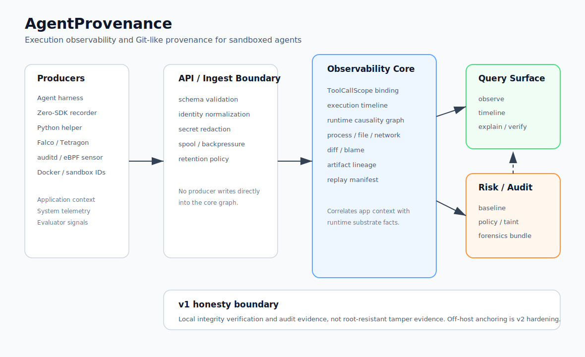
</p>

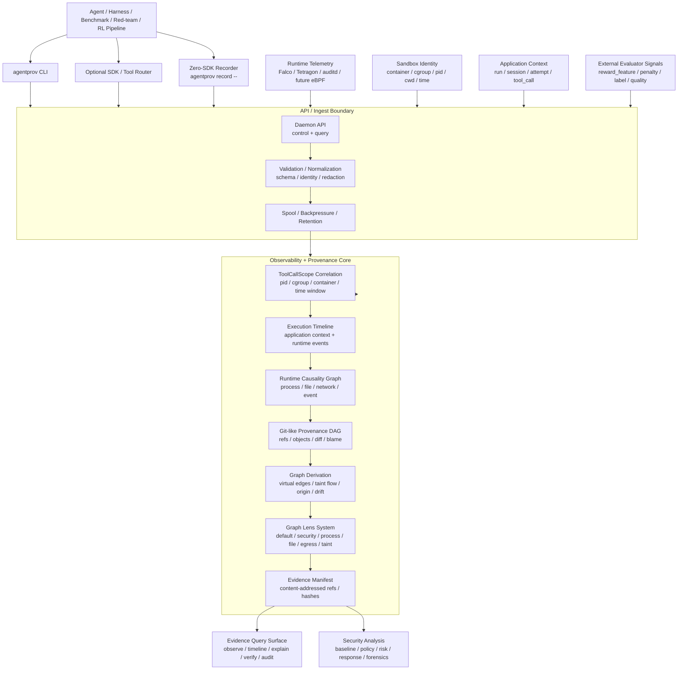

Capability gating is a hard design rule. Upper layers must query the runtime,
snapshot, telemetry, and isolation capabilities before assuming fast fork,
memory snapshot, restore, identity, or enforcement semantics. Docker-only
execution degrades to directory/filesystem provenance instead of pretending to
provide VM-level resume.

All producers enter through the API/Ingest Boundary. Zero-SDK recorders,
SDK/tool routers, telemetry receivers, sandbox adapters, and external evaluator
signals are producer inputs; they should not bypass validation, normalization,
identity binding, redaction, spool/backpressure, or retention controls to write
directly into the core evidence graph.

## Substrate Signals

Substrate integrations are downstream of the provenance model:

- Docker is the active local runtime.
- OpenSandbox, gVisor, Firecracker, and Kata are future runtime substrates.
- Kubernetes, Ray, Batch, and cloud systems are orchestration substrates.
- Falco, Tetragon, LoongCollector, auditd, and eBPF are telemetry substrates.
  The current MVP consumes already-filtered Tetragon/Falco/LoongCollector JSONL
  through `agentprov telemetry ingest-jsonl`, adds a dedicated
  `agentprov telemetry ingest-falco` receiver for Falco JSON/stdout streams,
  records a hashable batch manifest, and does not run kernel probes.
- A future `agentprov-sensor` should be capability-gated: prefer modern eBPF
  where the kernel and permissions support it, fall back to a legacy eBPF path
  where appropriate, and only use a kmod-style collector when an operator
  explicitly accepts that deployment model. The control plane must treat sensor
  capability as data, not as a hidden assumption.

The project value is not collecting more logs. The value is correlating
substrate signals with execution context and making them affect diff, blame,
taint, replay, and auditability.

## Boundaries

These boundaries are intentional:

- AgentProvenance does not implement a general sandbox runtime.
- It does not replace Kubernetes, Ray, OpenSandbox, Firecracker, gVisor, Kata,
  Falco, Tetragon, LoongCollector, or eBPF.
- It is not a LangSmith clone, LLM gateway, or general observability dashboard.
- It does not promise memory snapshot or VM-level instant clone in Phase 1.
- It does not perform arbitrary branch auto-merge.
- It does not roll back real external side effects. External actions are
  recorded, gated, and optionally linked to compensation hooks.
- It does not make final reward, penalty, or winner decisions for RL pipelines;
  it emits the behavior evidence and deviation signals those systems can score.

See [docs/product.md](docs/product.md) for the product direction and
[docs/deployment-modes.md](docs/deployment-modes.md) for deployment shapes.
[docs/comparisons.md](docs/comparisons.md) covers adjacent-system boundaries.

## Repository Layout

```text
cmd/agentprov/        CLI entrypoint
cmd/agentprov-sensor/ native eBPF sensor (Linux)
internal/cli/         command parsing and output

internal/record/      zero-SDK command recorder
internal/sensor/      native eBPF sensor (exec/connect/file/privesc/tamper/TLS/DNS); Linux-only, arm64
internal/telemetry/   normalized runtime event schema, JSONL ingest, TLS HTTP metadata, correlation inputs
internal/correlation/ ToolCallScope and runtime identity binding
internal/provenance/  timeline, graph trace, refs, objects, diff, blame, verify, replay
internal/evidence/    compact evidence records and external effects
internal/security/    policy decisions, risk signals, baseline deviations, response actions
internal/signals/     unified graph-attached signal model (behavior/cost/quality/security)
internal/baseline/    behavior baseline learning and deviation records
internal/attest/      in-toto/DSSE ed25519 evidence signing (tamper-evidence)
internal/forensics/   evidence bundle export (optional signed attestation)
internal/aitools/     AI-callable tool catalog (read surface + inline gate + context-write)
internal/mcpserver/   stdio MCP (JSON-RPC 2.0) server over the aitools catalog
internal/dashboard/   local read-only web dashboard (embedded UI)

internal/substrate/   Docker/runtime/snapshot adapters used as execution substrates
internal/control/     local lease/session control for substrate-backed demos
internal/computerapi/ file/tool API over local sandbox sessions
internal/ports/       local preview proxy support

internal/stressdemo/  branch-heavy fanout demos that exercise provenance under load
internal/experimental/ resource windows, scheduler, node metadata, warm-pool experiments
internal/store/       SQLite schema and repositories
examples/             tasks, events, policies
scripts/              runnable demos
docs/                 product direction, MVP details, comparisons
```

The main product path lives in `record`, `telemetry`, `correlation`,
`provenance`, `evidence`, `security`, `signals`, `baseline`, `attest`, and
`forensics`. `substrate` contains runtime facts AgentProvenance can consume.
`stressdemo` and `experimental` are intentionally separated so branch fanout and
old resource experiments do not define the project identity.

## Roadmap

| Phase | Goal | Main deliverables |
|---|---|---|
| Phase 1 | Provenance Correlation MVP | ToolCallScope, raw telemetry correlation, runtime causality DAG, diff/blame, risk/deviation records, response-gate evidence, replay and trajectory manifests |
| Phase 2 | Evidence / Causality Hardening | execution timeline JSON, stable explain JSON, content-addressed objects, object parent hashes, graph verification, bounded traversal, pagination, integrity metadata |
| Phase 3 | Zero-SDK Recorder Hardening | process-tree capture, delayed child process handling, cwd/time/file-diff inference, orphan lifecycle evidence, low-intrusion record mode |
| Phase 4 | Real Telemetry Integration | Falco/Tetragon/LoongCollector/auditd/eBPF receivers, cgroup/container/pid correlation, kernel-side filtering assumptions |
| Phase 5 | Risk / Policy / Control | configurable risk signals, behavior baselines, compliance evidence mapping, response adapters, taint propagation, quarantine, response blocking, forensics export, Feishu/DingTalk/webhook hooks, isolation escalation hooks |
| Phase 6 | Scale / UI / Productization | async evidence writer, retention, content-addressed storage, snapshot GC, resource windows, high-concurrency ingest/query tests, evaluator SDK hardening, central evidence service, usable UI/API |

Phases 1–4 are built and machine-checked by acceptance scripts; Phase 5 is built
except the notification hooks; Phase 6 is largely landed (web dashboard,
retention, content-addressed storage, concurrency, evaluator SDK), with the
central evidence service deferred to v2.

Recently landed:

- **Unified signal model** (`internal/signals`, `agentprovenance.signals/v1`) -
  one graph-attached row type for behavior/cost/quality/security, replacing the
  per-dimension silos; security and quality are live producers, with idempotent
  backfill from legacy tables.
- **Signed evidence attestation** (`internal/attest`) - in-toto/DSSE ed25519
  signing of evidence digests, wired into `forensics export`, giving
  post-compromise tamper-evidence rather than integrity-only hash recompute.
- **Concurrency correctness** - SQLite pragmas (incl. `busy_timeout`) applied via
  DSN to every pooled connection, fixing silent `SQLITE_BUSY` under concurrent
  writers; correlation bindings bound stale-open over-matching.
- **Native eBPF sensor expansion** (`internal/sensor`, validated live on an arm64
  VM) - sensitive file reads (-> `secret_path`), privilege changes
  (setuid/setgid/ptrace), file tamper (rename/unlink), TLS plaintext -> privacy-
  safe HTTP metadata + `llm_call` pairing, `process_exit` closing correlation
  windows, and DNS (getaddrinfo). In-kernel noise filtering before ring-buffer
  reserve removed a containerd-teardown firehose. Privilege-escalation policy
  rules (ptrace, setuid-to-root -> quarantine).
- **AI surface** - MCP server (`ai mcp`, stdio JSON-RPC 2.0) and context-write
  tools (`bind_scope`, `record_tool_call`) over the same `internal/aitools`
  catalog, app-asserted within the trust boundary.
- **Web dashboard** (`internal/dashboard`, `dashboard serve`) - local read-only
  view with the causality DAG as the signature panel, plus timeline, process
  tree, egress, signals, and verify/signature status.

Next / open:

- **Sensor breadth** — universal DNS (musl / raw UDP:53, or a `udp_sendmsg`
  kprobe; `getaddrinfo` covers glibc today), IPv6/UDP connect, and multi-arch
  (x86 `PT_REGS`; arm64-only today). `ptrace` is captured but not yet exercised
  end to end in a test.
- **TLS depth** — HTTP/2 HPACK header decode and SSE reassembly (HTTP/1.1 plus
  h2 detection today).
- **Tamper-evidence (v2)** — off-host / capture-time signing (KMS / TPM /
  transparency log). v1 is integrity plus optional local signing, not proof
  against a host-root attacker.
- **Deploy 3** — central evidence service with process-level data-plane
  isolation and authz/scopes.
- **Notifications** — Feishu / DingTalk / webhook response hooks.

## Development

```sh
go test ./...
./scripts/accept_phase1.sh
./scripts/accept_zero_sdk_realistic.sh
./scripts/accept_falco_risk_realistic.sh
./scripts/accept_forensics_bundle.sh
./scripts/accept_batch_forensics.sh
./scripts/accept_evidence_query_pagination.sh
./scripts/accept_daemon_evidence_api.sh
./scripts/accept_telemetry_spool_backpressure.sh
./scripts/accept_telemetry_100k_pressure.sh
./scripts/accept_telemetry_event_windows.sh
./scripts/accept_signal_engine.sh
./scripts/accept_python_helper.sh
./scripts/accept_deploy1_batch_pipeline.sh
```

`go test ./...`, `go vet ./...`, and `gofmt -l` are the per-package gates. The
acceptance scripts are the end-to-end ones: each drives a single path —
zero-SDK record, Falco/native-sensor risk, forensics bundle, daemon evidence
API, telemetry spool/pressure/windows, the signal engine, the Python helper, the
Deploy 1 batch pipeline, and query pagination — and asserts correlated evidence,
risk/response records, graph edges, and a clean `graph verify`. The eBPF sensor
is validated on a Linux host (`go generate ./internal/sensor`, then run
`agentprov-sensor`).
