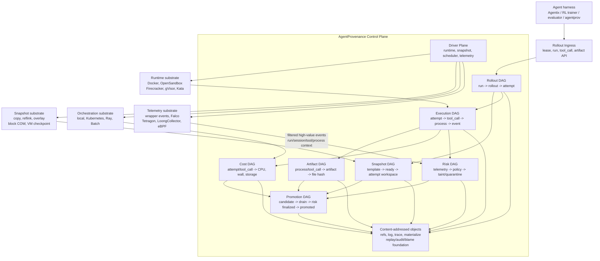

<div align="center">

<h1>AgentProvenance</h1>

### Git-like provenance control for sandboxed AI agent execution.

<p>
Turn sandboxed agent execution into content-addressed, queryable, replayable,
and auditable rollout provenance DAGs.
</p>

[](https://go.dev/)
[](https://www.docker.com/)
[](https://www.sqlite.org/)
[](LICENSE)

**[Quickstart](#quickstart)** | **[Demos](#demos)** | **[Architecture](#architecture)** | **[Roadmap](#roadmap)**

</div>

---

AgentProvenance is a local-first rollout provenance control plane for high-concurrency AI agents.

AgentProvenance does not try to be a generic sandbox runtime, telemetry collector, eBPF platform, or Kubernetes/Ray replacement. It sits above runtime, snapshot, scheduler, and telemetry substrates and owns the agent-side causal model that generic infrastructure does not preserve:

- scope: ToolCallScope bindings from runtime identity to agent context
- state source: template, ready snapshot, forked attempt workspace
- execution: tool calls, processes, events, stdout/stderr summaries
- artifact: result refs, file hashes, artifact lineage
- cost: fanout cost, active CPU, saved cost, burst admission
- risk: telemetry correlation, policy decisions, taint, quarantine
- promotion: winner selection, telemetry drain, risk finalization
- evidence: Git-like refs/log/trace and content-addressed provenance objects

AgentProvenance uses Docker today and is designed to plug into Docker, OpenSandbox, Kubernetes, Ray, Firecracker, gVisor, Kata, LoongCollector, Falco, Tetragon, and other runtime or telemetry substrates through capability-gated drivers. Those systems provide execution and signals; AgentProvenance turns them into an agent rollout provenance DAG.

The current CLI remains `agentprov` during the rename transition so existing demos and scripts keep working.

## Why this exists

Modern AI agent workloads are no longer just “run one command in one container.”

Evaluation, RL training, best-of-N sampling, coding-agent repair loops, and tool-using agents can create hundreds or thousands of short-lived sandbox computers. Most of those attempts spend much of their wall time waiting on model calls, package installs, tests, I/O, or external services. Meanwhile, their useful state, runtime behavior, cost, and security evidence are scattered across containers, filesystems, logs, telemetry streams, and agent traces.

AgentProvenance makes the rollout provenance layer explicit.

It answers questions such as:

- Which snapshot did this attempt fork from?
- Which `tool_call` and process produced this artifact?
- Is this branch cheap enough to continue?
- Is this winner safe to promote?
- Did runtime telemetry arrive before promotion?
- Which snapshots or descendants are tainted?
- How much active CPU did this run actually consume?
- What objects, manifests, hashes, and policy decisions are needed to replay or audit this result?
- Which raw runtime event maps to which `tool_call`, and how confident is that mapping?

## The core loop

```text
template / ready snapshot
  -> fork N attempt workspaces
  -> execute tool_call/process steps
  -> bind runtime identity to ToolCallScope
  -> correlate raw runtime telemetry into agent context
  -> collect artifacts, cost, telemetry, and compact evidence
  -> score attempts by result, risk, budget, and cost
  -> wait at the promotion barrier
  -> promote the safe winner or quarantine the tainted branch
  -> materialize content-addressed provenance objects
```

In CLI form:

```sh
agentprov snapshot create "$SESSION_ID" --type directory --path /workspace --name ready

agentprov rollout start \
  --task examples/tasks/bugfix.yaml \
  --snapshot ready \
  --runtime docker \
  --fanout 3 \
  --strategy 'probe::test -f hello.txt && echo passed::score=contains:passed' \
  --strategy 'fast::printf 42::score=number' \
  --strategy 'slow::sleep 1; echo passed::score=contains:passed'

agentprov rollout winner run-demo-bugfix
agentprov cost show run-demo-bugfix
agentprov graph trace --run run-demo-bugfix
agentprov graph refs --run run-demo-bugfix
agentprov graph log --run run-demo-bugfix
agentprov graph materialize --run run-demo-bugfix
agentprov graph diff --run run-demo-bugfix --file calculator.py
agentprov graph blame --run run-demo-bugfix --file calculator.py
```

Raw runtime/security events do not need to carry `tool_call_id`. They can be
ingested with substrate identity such as `process_id`, `container_id`,
`cgroup_id`, `pid`, and timestamp; AgentProvenance resolves them through
execution context bindings and records `correlation_method` plus confidence.

## What AgentProvenance owns vs. what it plugs into

| Layer | AgentProvenance owns | External substrate |
|---|---|---|
| Rollout provenance | `run`, `rollout`, `attempt`, `tool_call`, process, artifact, promotion DAG | Agentix, trainers, evaluators, coding agents |
| State lineage | template, ready snapshot, forked workspace, taint, artifact lineage | Docker workspace copy today; future OverlayFS, reflink, block COW, VM snapshots |
| Economics lineage | active CPU windows, fanout cost, saved cost, BurstGuard, cost per run/attempt/tool call | OS, cgroups, Docker stats, Kubernetes/Ray resource envelopes |
| Risk lineage | telemetry-context correlation, policy decision, taint, quarantine, forensics trigger | Falco, Tetragon, LoongCollector, eBPF, runtime events |
| Runtime intent | capability-gated execution and isolation intent | Docker now; future OpenSandbox, gVisor, Firecracker, Kata, Kubernetes, Ray |
| Evidence objects | Git-like refs/log/trace, content-addressed object DAG, replay metadata | local SQLite/filesystem today; future external object stores |

## What works now

The current repository is a local-first MVP. It currently supports:

Core AgentProvenance path:

- Docker-backed sandbox sessions
- streaming exec and process records
- ToolCallScope execution context bindings for process/container/cgroup/time-window correlation
- directory snapshot, fork, and resume
- template → ready snapshot → attempt workspace lineage
- rollout fanout and best-of-forks, including Docker-backed short-lived attempt sessions via `--runtime docker`
- winner selection by risk, budget, score, and cost instead of exit code alone
- budget-aware probe-to-top-k rollout pruning
- rollout cost summary with executed/pruned/saved ratio
- BurstGuard admission before synchronized tool phases, with default reject and optional delay/queue policy
- Docker CPU profile switching between `think` and `tool`
- promotion barrier with evidence drain, risk finalization, and taint rejection
- active CPU / idle / wall-time cost accounting
- async evidence and cleanup pipeline
- explainable attempt evidence for pruned and promoted rollout branches
- strategy artifact capture from attempt workspaces into `.acf/artifacts/`
- artifact provenance edges from attempt/tool_call to exported artifact refs
- Git-like provenance refs, log, trace, diff, blame, and content-addressed materialization under `.acf/provenance/objects/sha256/`
- I/O-aware snapshot planning with source policies: `latest-ready`, `smallest-delta`, `local`, and `untainted`
- run-local provenance trace for snapshot planner explanations
- capability-gated runtime drivers with Docker active and gVisor/Firecracker/bubblewrap as explicit stubs

Experimental or auxiliary paths:

- local preview URL proxy
- MVP policy decisions, quarantine, and forensics export
- HTTP/HTTPS egress proxy and redacted credential injection
- behavior baseline counters
- local node metadata and warm pool simulations

## Current boundaries

AgentProvenance is intentionally narrow at this stage:

- Docker is the only fully active runtime backend.
- Directory snapshot/fork/resume is supported; memory snapshots are not.
- Scheduler/admission is single-node and conservative, not a distributed placement service.
- eBPF/Falco/Tetragon/LoongCollector integration is planned; current telemetry is wrapper/runtime-level MVP telemetry.
- Egress policy currently covers HTTP/HTTPS proxy workflows and direct-egress blocking from the Docker sandbox bridge; it is not yet a general raw TCP policy engine.
- Baseline detection is MVP-level event and cost counting, not syscall ML or full eBPF feature modeling.
- Content-addressed provenance objects exist, but replay and fsck are still early roadmap items. Diff and blame are MVP-level workspace-file queries.
- eBPF/Falco/Tetragon/LoongCollector are not integrated yet; current correlation works with wrapper/runtime events and is structured for those substrates.

## Quickstart

Prerequisites:

- Go 1.23+
- Docker Desktop or a compatible Docker daemon

```sh
git clone https://github.com/ByteYellow/AgentProvenance
cd AgentProvenance

go build ./cmd/agentprov

./agentprov init

LEASE_ID=$(./agentprov lease create --task examples/tasks/bugfix.yaml)
SESSION_ID=$(./agentprov session create --lease "$LEASE_ID")

./agentprov exec "$SESSION_ID" --stream -- sh -lc 'echo hello > hello.txt'
./agentprov snapshot create "$SESSION_ID" --type directory --path /workspace --name ready

./agentprov rollout start --task examples/tasks/bugfix.yaml --snapshot ready --runtime docker --fanout 3 \
  --top-k 2 \
  --strategy 'probe::test -f hello.txt && echo passed::probe=test -f hello.txt && echo passed::score=contains:passed' \
  --strategy 'fast::printf 42::probe=printf 42::score=number' \
  --strategy 'slow::sleep 1; echo passed::probe=echo 1::score=contains:passed'

./agentprov rollout winner run-demo-bugfix
./agentprov cost show run-demo-bugfix
./agentprov graph trace --run run-demo-bugfix
./agentprov graph refs --run run-demo-bugfix
./agentprov graph log --run run-demo-bugfix
./agentprov graph materialize --run run-demo-bugfix
./agentprov graph diff --run run-demo-bugfix --file hello.txt
./agentprov graph blame --run run-demo-bugfix --file hello.txt

./agentprov session rm "$SESSION_ID"
```

The core provenance commands are:

```sh
./agentprov graph trace --run <run_id>
./agentprov graph refs --run <run_id>
./agentprov graph log --run <run_id>
./agentprov graph materialize --run <run_id>
./agentprov graph diff --run <run_id> --file <workspace_relative_file>
./agentprov graph blame --run <run_id> --file <workspace_relative_file>
```

`trace` explains the rollout DAG, `refs` gives stable Git-like names, `log`
shows the chronological execution history, `materialize` writes
content-addressed objects, `diff` compares a file across attempts, and `blame`
attributes a file version to the attempt, tool call, command, strategy, and
promotion status that produced it. The main demo also simulates a risky failed
branch, quarantines it, and keeps that decision in the same provenance trace.

The runtime telemetry path is intentionally layered:

```sh
./agentprov telemetry ingest \
  --raw-event raw-execve-1 \
  --process <process_id> \
  --source wrapper_runtime \
  --type execve \
  --payload '{"argv":["pytest","-q"]}'

./agentprov telemetry list --run <run_id> --type execve
./agentprov graph trace --run <run_id>
```

The raw event above omits `tool_call_id`; the correlator fills it from the
recorded execution context binding and stores the correlation method in both
telemetry output and graph trace.

Run the full MVP walkthrough:

```sh
./scripts/demo_v1.sh
```

## Demos

The primary demo is the provenance path:

```sh
./scripts/demo_coding_agent_best_of_n.sh
./scripts/demo_snapshot_fanout.sh
./scripts/demo_best_of_forks.sh
./scripts/demo_provenance_trace.sh
./scripts/demo_ioaware_snapshot_planner.sh
```

Auxiliary and experimental demos are still available, but they are not the main product surface:

```sh
./scripts/demo_cost_accounting.sh
./scripts/demo_cpu_weight_control.sh
./scripts/demo_preview_url.sh
./scripts/demo_policy_quarantine.sh
./scripts/demo_egress_proxy.sh
SESSIONS=50 ./scripts/demo_v01_50_concurrency.sh
```

See [docs/mvp.md](docs/mvp.md) for command-by-command walkthroughs.

## Command surface

### Daemon mode

```sh
agentprov daemon serve --listen 127.0.0.1:8574
export ACF_DAEMON_URL=http://127.0.0.1:8574
```

Daemon sampling is bounded and windowed:

```sh
agentprov daemon serve \
  --sample-interval 5s \
  --sample-limit 64 \
  --sample-timeout 2s \
  --raw-retention 10m \
  --max-raw-samples 512
```

Raw Docker stats are treated as short-term input. Scheduler and cost views read 10s/60s resource windows instead of scanning unbounded raw samples.

### Core workflow

```sh
agentprov init
agentprov lease create --task examples/tasks/bugfix.yaml
agentprov session create --lease <lease_id>
agentprov session cpu-profile <session_id> --profile think
agentprov exec <session_id> --stream -- <command...>

agentprov snapshot create <session_id> --type directory --path /workspace --name ready
agentprov snapshot plan ready
agentprov snapshot plan ready --policy smallest-delta
agentprov fork ready --count 3
agentprov snapshot resume ready --lease <lease_id>

agentprov rollout start --task examples/tasks/bugfix.yaml --snapshot ready --runtime docker --fanout 3 \
  --top-k 2 \
  --strategy "probe::test -f task.yaml && echo passed::probe=test -f task.yaml && echo passed::score=contains:passed" \
  --strategy "score::printf 42::probe=printf 42::score=number" \
  --strategy "slow::sleep 1; echo passed::probe=echo 1::score=contains:passed"
agentprov rollout winner <rollout_id_or_run_id>

agentprov attempt best-of --snapshot ready \
  --max-fanout 3 --top-k 1 --max-cost 1 --early-stop \
  --strategy "probe::printf 42::probe=printf 42::budget=2::score=number::artifact=probe.txt" \
  --strategy "full::pytest -q::probe=test -f task.yaml && echo 1::budget=30::score=contains:passed::artifact=pytest.log"

agentprov cost show <run_id>
```

### Provenance, telemetry, and evidence

```sh
agentprov process list --session <session_id>
agentprov process inspect <process_id>

agentprov telemetry list --run <run_id> --type network_deny --tool-call <tool_call_id>
agentprov policy test examples/events/metadata-egress.jsonl --rules examples/policies/default.yaml
agentprov policy decisions --run <run_id>

agentprov graph trace --run <run_id>
agentprov graph trace --artifact <artifact_ref>
agentprov graph trace --attempt <attempt_id>
agentprov graph trace --tool-call <tool_call_id>
agentprov graph trace --process <process_id>
agentprov graph refs --run <run_id>
agentprov graph log --run <run_id>
agentprov graph materialize --run <run_id>
agentprov graph diff --run <run_id> --file <workspace_relative_file>
agentprov graph blame --run <run_id> --file <workspace_relative_file>
agentprov forensics export <run_id>
```

Git-like provenance is a first-class AgentProvenance concept. `graph refs` exposes stable
run-local refs for rollouts, base snapshots, winner attempts, promotions, tool
calls, processes, and artifacts. `graph log` prints a chronological rollout
timeline similar to a compact commit log. `graph materialize` upgrades the
SQLite trace into content-addressed provenance objects under
`.acf/provenance/objects/sha256/`, with object hashes, parent hashes, source
ids, artifact file hashes, and replay-oriented payloads. `graph trace` includes
run-local `snapshot_plans` so rollout debugging can show which snapshot source
was selected, which copy/resume plan was used, and why unrelated rollout
snapshots were excluded. It can also reverse-trace an artifact ref, attempt id,
tool call id, or process id back to the producing attempt, tool call, process,
rollout, policy decision, evidence, and winner status. Local rollout attempts
and Docker-backed execs both emit process-linked events, so RL rollout evidence
can start from either the attempt/tool call layer or the runtime process layer.
`graph diff` and `graph blame` are MVP file-level provenance queries: they
compare the base snapshot with each attempt workspace and attribute changes to
the attempt, tool call, command, strategy, artifact ref, and winner status.

### Experimental controls

These commands are useful for local experiments, but they are not the core AgentProvenance interface yet:

```sh
agentprov port expose <session_id> <port>

agentprov egress allow example.com
agentprov credential inject --run <run_id> --session <session_id> \
  --name github-token --host api.github.com --value <secret>

agentprov cost sample <session_id>
agentprov bench overcommit --sessions 20 --idle-ratio 0.8 --bursty --physical-cpu 8

agentprov node register --address localhost --runtime docker --cpu 8 --memory-mb 8192
agentprov node list
agentprov scheduler status

agentprov pool create --template bugfix --size 2 --seed-workspace ./seed --max-size 2
agentprov pool status
```

### Substrate signals

These commands expose lower-level runtime and local scheduling substrate state. They are intentionally kept behind the provenance workflow instead of defining the product surface:

```sh
agentprov runtime list
agentprov runtime inspect docker
agentprov scheduler status
agentprov node list
agentprov pool status
```

## Architecture

The long-term shape is an Agent Rollout Provenance Control Plane. The DAG is the product surface; runtime, snapshot, scheduler, and telemetry systems are capability-gated substrates underneath:



AgentProvenance owns rollout provenance, not generic infrastructure. Runtime, orchestrator, snapshot, and telemetry implementations are queried through a capability matrix before execution. If a backend cannot do memory snapshot or low-latency resume, the scheduler must degrade to filesystem/directory fork instead of pretending the capability exists. eBPF/Falco/Tetragon/LoongCollector are Risk Plane drivers: they provide filtered runtime signals that AgentProvenance correlates into `run_id`, `attempt_id`, `tool_call_id`, `process_id`, `snapshot_id`, and artifact lineage.

| Plane | Responsibility |
|---|---|
| Rollout | `run`, `rollout`, `attempt`, fanout, best-of-forks |
| State | Template, ready snapshot, attempt workspace, snapshot DAG, taint lineage |
| Execution | `tool_call`, process, event, runtime metadata |
| Correlation | ToolCallScope bindings from process/container/cgroup/time-window to agent context |
| Artifact | Result refs, artifact file hash, artifact lineage |
| Economics | Active CPU windows, burst admission, warm reuse, snapshot physical cost, budget |
| Risk | Telemetry-context correlation, policy decision, baseline feature, response |
| Promotion | Winner selection, telemetry drain, risk finalization, promote/reject |
| Evidence | Git-like refs/log/trace, content-addressed object DAG, forensics, replay metadata |
| Driver | Capability-gated runtime, snapshot, orchestrator, and telemetry substrates |

## Runtime driver capabilities

Runtime backends are capability-gated. `agentprov runtime list` and `agentprov runtime inspect <backend>` report what each backend can actually do instead of presenting planned adapters as usable.

| Backend | Exec | Stop | Snapshot | Fork | Resume | CPU weight | Memory snapshot | Status |
|---|---:|---:|---:|---:|---:|---:|---:|---|
| Docker | yes | yes | directory | directory | directory | yes | no | active |
| gVisor | no | no | no | no | no | no | no | planned stub |
| Firecracker | no | no | no | no | no | no | no | planned stub |
| bubblewrap | no | no | no | no | no | no | no | planned stub |

The Docker driver implements directory-level snapshot, fork, and resume by copying workspace state and then creating a new running session. Memory-level snapshot/restore is intentionally left false until a VM-capable backend exists.

## v0.1 hardening demos

```sh
./scripts/demo_cpu_weight_control.sh
SESSIONS=50 ./scripts/demo_v01_50_concurrency.sh
./scripts/demo_ioaware_snapshot_planner.sh
```

The CPU weight demo verifies the control-plane loop with Docker `CpuShares`: `think=2`, `tool=1024`, then back to `think=2` after exec. On Linux cgroup v2, Docker maps this control path to cgroup CPU weight behavior; a direct `cpu.weight` node-agent writer is a later Linux-specific optimization.

The concurrency demo sets `ACF_BURST_MAX_INFLIGHT` and proves that not every simultaneous tool call is promoted to the high-priority CPU profile. Set `ACF_BURST_OVERFLOW_POLICY=delay` with `ACF_BURST_QUEUE_TIMEOUT_MS` to let excess tool phases wait for a burst slot instead of failing immediately.

The I/O-aware snapshot demo shows hot metadata path detection, I/O fanout rejection, and graph trace reasons for not choosing overlay.

## Roadmap

Near term:

- JSON output mode for automation
- Promotion barrier hardening beyond local evidence drain: external telemetry watermarks and taint freeze
- Snapshot taint propagation
- Stronger process manager and process tree enforcement
- Raw TCP policy enforcement for non-HTTP protocols
- Falco/Tetragon/LoongCollector JSONL telemetry receivers

Later:

- OpenSandbox runtime driver
- gVisor and bubblewrap capability adapters
- Firecracker disk/memory snapshot capability path
- Backend-aware admission and scheduling intent for Kubernetes/Ray/cloud batch
- Rich provenance graph queries and forensics bundles

## Testing

```sh
go test ./...
```

Local runtime state lives under `.acf/` by default and is intentionally ignored. Public docs live under [docs/](docs/); runnable examples live under [examples/](examples/) and [scripts/](scripts/).

<div align="center">
<sub>Apache-2.0 licensed | local-first MVP | built around Go, Docker, and SQLite</sub>
</div>
