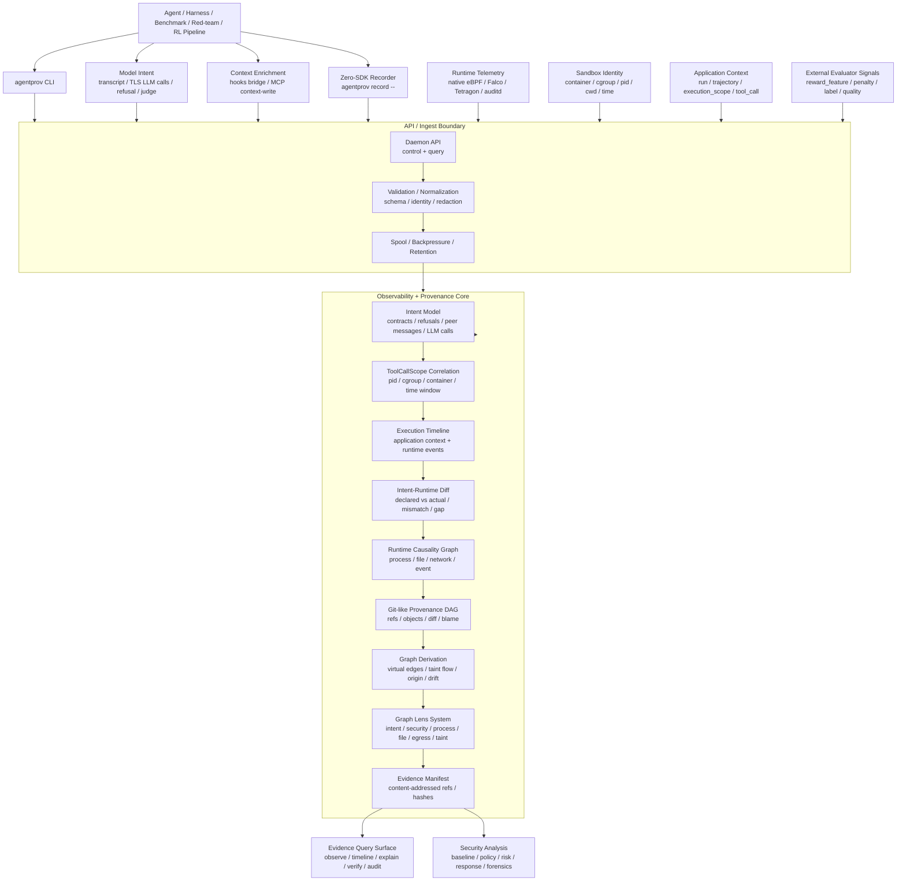

<div align="center">

# AgentProvenance

### Three-axis execution observability for sandboxed agents: model intent, application context, and runtime telemetry in one verifiable evidence graph.

AgentProvenance correlates three evidence axes for sandboxed, tool-using agents:
model intent, application-side agent context, and system-side runtime telemetry.
It turns LLM decisions, tool calls, process/file/network events, artifacts, risk
signals, and response decisions into a queryable, replayable, and auditable
causality graph. Evidence is stored content-addressed and hash-verified (a model
borrowed from Git) and can be signed for tamper-evidence -- but this is an
audit/provenance layer, **not a version-control system**: there is no merge,
checkout, or mutable working tree.

[](https://github.com/ByteYellow/AgentProvenance/releases/latest)
[](https://go.dev/)
[](https://github.com/ByteYellow/AgentProvenance/actions/workflows/ci.yml)
[](https://www.docker.com/)
[](https://www.sqlite.org/)
[](LICENSE)

**[Quickstart](#quickstart)** | **[Core Model](#core-model)** | **[Current Capability](#current-capability)** | **[Demos](demo/README.md)** | **[Roadmap](#roadmap)**

English | [简体中文](README.zh-CN.md)

</div>

---

<p align="center">
  
</p>

<p align="center">
  
</p>

AgentProvenance is a local-first security and provenance control plane for
autonomous, tool-using agents, especially sandboxed coding agents. It captures
model intent from transcripts/TLS evidence, app-side context from agent hooks and
tool scopes, and runtime telemetry from its own eBPF sensor or external sources
such as Falco/Tetragon. The result is a verifiable, signable causality graph
served over the CLI, a daemon API, AI tools (including an MCP server), and a
local web dashboard.

It is not a generic sandbox runtime, generic telemetry collector, Kubernetes/Ray
replacement, RL trainer, trace dashboard, or version-control system (it borrows
Git's content-addressing and verification model, not its branch/merge workflow).
It owns a narrower primitive:

```text
Model Intent
  -> Application Context
  -> Runtime Telemetry
  -> Evidence Ingest
  -> Runtime Causality Graph
  -> Git-like Provenance DAG
  -> Intent Diff / Risk / Response
  -> Replay / Forensics / Audit Manifest
```

The goal is to answer questions ordinary traces do not answer well:

- Which base state did this execution start from?
- Which execution scope produced this artifact?
- Which tool call started this process?
- Which child process caused this runtime event?
- Which process changed this file?
- Which behavior is anomalous for this agent or task profile?
- Which trajectory or execution scope was tainted, quarantined, interrupted, or blocked by
  a response gate?
- Which evidence supports a risk decision?
- What response action should be triggered: audit, deny, kill, quarantine,
  taint, export forensics, or notify a human through Feishu/DingTalk?
- What exact behavior evidence, deviation signal, and risk context should an
  external evaluator, RL pipeline, or human reviewer inspect?
- Can this execution be diffed, blamed, verified, replayed, and audited later?

<p align="center">
  
</p>

## Contents

- [Why](#why)
- [Security Loop](#security-loop)
- [Core Model](#core-model)
  - [Evidence layers](#evidence-layers)
  - [Runtime facts and correlation](#runtime-facts-and-correlation)
- [Relationship To Existing Systems](#relationship-to-existing-systems)
- [Quickstart](#quickstart)
- [Deployment Modes](#deployment-modes)
- [Security Evidence Commands](#security-evidence-commands)
- [External Evaluator Protocol](#external-evaluator-protocol)
- [Compliance Evidence, Not Certification](#compliance-evidence-not-certification)
- [AI-Callable Evidence Tools](#ai-callable-evidence-tools)
- [Web Dashboard](#web-dashboard)
- [Graph Commands](#graph-commands)
- [Current Capability](#current-capability)
- [Core Demo Acceptance](#core-demo-acceptance)
- [Architecture](#architecture)
- [Substrates and Telemetry](#substrates-and-telemetry)
- [Boundaries](#boundaries)
- [Repository Layout](#repository-layout)
- [Roadmap](#roadmap)
- [Development](#development)
- [Author and License](#author-and-license)

## Why

Modern agent execution is not one prompt and one tool call. Coding agents and
autonomous workflows create execution scopes, edit files, run tests, create artifacts,
spawn subprocesses, touch external systems, and trigger runtime telemetry.
Logs, traces, metrics, and sandbox events each capture pieces of that story,
but they rarely produce a Git-like causal record of execution state.

AgentProvenance turns sandboxed execution into a security-oriented evidence
graph:

```text
base state
  -> execution scope
  -> execution context
  -> tool_call
  -> process / child process
  -> runtime_event
  -> file_diff / artifact
  -> baseline feature / risk signal
  -> taint / response action
  -> replay / forensics / audit manifest
```

The primary path is recording and explaining sandboxed agent execution.
AgentProvenance does not choose the reward winner. It emits structured
trajectory evidence and expectation-deviation signals so an external evaluator
or training pipeline can turn them into reward, penalty, filtering, or
human-review decisions.

For RL pipelines, the useful primitive is not "best-of-one" or automatic winner
selection. The useful primitive is observability over each trajectory: what the
agent did, which subprocesses and files were touched, which network/runtime
events appeared, which behavior violated safety or task expectations, and which
risk/baseline signals should contribute to reward shaping or rejection.

## Security Loop

The security model is intentionally simple and concrete:

```text
application context
  run / trajectory / execution_scope / tool_call / user / task / workspace

system telemetry
  process / file / network / resource / sandbox / eBPF event

correlation
  container_id / cgroup_id / pid / ppid / cwd / timestamp / file diff

security analysis
  behavior baseline / suspicious event / taint lineage / risk decision

response
  audit / deny / kill / quarantine / taint / forensics / Feishu or DingTalk notification
```

This makes AgentProvenance closer to an AI-era HIDS/control-plane layer than a
pure LLM trace dashboard. Traditional host monitoring asks "what did this
process do?" AgentProvenance adds the agent execution context needed to ask
"which agent/tool/task caused it, what state did it change, what evidence proves
it, and what response should happen?"

The project currently implements the evidence graph, runtime correlation,
diff/blame, telemetry batch manifests, policy decisions, normalized risk
signals, baseline deviation records, response action records, taint,
quarantine, forensics/export foundations, and a native eBPF sensor.
Feishu/DingTalk response adapters belong to the next security-control phases;
third-party receivers (Falco/Tetragon) are maintained for compatibility, not
extended.

## Core Model

AgentProvenance is not "pick an integration mode." It is layered evidence with
one entry point: wrap the command you already run.

```sh
agentprov record -- <agent command>
```

`record` snapshots the pre-execution file state, runs the command, samples the
process tree, computes post-execution file changes, and emits runtime evidence
into the DAG — no integration code required. Everything else stacks on top of
that base automatically.

### Evidence layers

| Layer | Source | Trust semantics |
|---|---|---|
| Kernel / runtime facts (foundation) | `record` process tree + file diffs, native eBPF sensor, Falco/Tetragon/LoongCollector receivers | hard facts keyed by pid / cgroup / container / time; the agent cannot fabricate them |
| Application context (enrichment) | harness hooks (`hooks bridge`), MCP context-write (`bind_scope` / `record_tool_call`), explicit `run_id / trajectory_id / execution_scope_id / tool_call_id / tool_name / args_hash` | semantics the kernel can never infer — agent identity, delegation and peer messages, refused intents; app-asserted claims carry `binding_source=ai_asserted` and a `<=0.5` confidence cap, and never override kernel facts |

The kernel layer answers "what actually happened on this host." The
application-context layer answers "which agent, which tool call, which intent"
— including things no syscall stream can express, such as an orchestrator's
`agent_spawn`/`agent_message` edges or an action the LLM refused to execute.
Application context is not a separate deployment or a required SDK: when a
harness emits hooks or calls the MCP context-write tools, the enrichment layer
attaches to the same run; when it doesn't, the kernel layer still stands on its
own.

### Runtime facts and correlation

Correlation back to execution context uses runtime facts:

```text
root process / process tree / cwd / timestamp / container_id / cgroup_id
  / file diff / artifact refs
```

Raw system-side telemetry should not be required to carry `tool_call_id`.
Kernel and runtime signals usually know PID, cgroup, namespace, container ID,
timestamp, and process tree. AgentProvenance correlates those substrate facts
back to execution context.

Today, the CLI exposes the underlying binding primitive:

```sh
agentprov telemetry bind --run <run_id> --substrate-scope <substrate_scope_id> \
  --execution-scope <execution_scope_id> --tool-call <tool_call_id> --process <process_id> \
  --container-id <container_id> --cgroup-id <cgroup_id> --pid <pid>
```

Then raw events can be ingested without `tool_call_id`:

```sh
agentprov telemetry ingest --raw-event raw-execve-1 --pid <pid> \
  --timestamp <event_time> --source tetragon_jsonl --type execve \
  --payload '{"argv":["./async_child.sh"]}'
agentprov telemetry ingest-jsonl --format tetragon --file tetragon-events.jsonl
agentprov telemetry ingest-jsonl --format native --file agentprov-sensor-events.jsonl
agentprov telemetry ingest-falco --file falco-events.jsonl
```

`ingest-jsonl` records a telemetry batch manifest with the input file hash,
mapped event IDs, event ID hash, receiver summary, and row-level mapping
results. By default it also evaluates runtime policy for ingested events, so
metadata-IP, private-CIDR, and secret-path rows become `policy_decisions`,
`risk_signals`, `response_actions`, graph edges, and timeline rows. Use
`--no-policy` when the receiver should only normalize and store telemetry. This
gives the DAG an audit handle for external Falco/Tetragon/LoongCollector
evidence without turning AgentProvenance into a long-term log store.

The `native` format is the receiver for AgentProvenance's own eBPF sensor
(`cmd/agentprov-sensor`, `source="agentprov_ebpf"`), and is auto-detected. This
closes the consume-only gap: the sensor's normalized kernel events (execve,
network connect classified into `metadata_ip`/`private_cidr`, file writes with
their real absolute host paths) flow through the identical correlation, policy,
risk, and unified-signal path as third-party telemetry. Raw file telemetry now
accepts absolute host paths (e.g. a write to `/home/agent/.aws/credentials`),
which the policy path rules still catch; only the workspace file-node graph keeps
its relative-path constraint. `scripts/accept_native_sensor_risk.sh` proves the
loop end to end (own kernel telemetry to a unified `security` signal).

`ingest-falco` is the compatibility receiver for hosts that already run Falco
(or where the native sensor cannot run); it folds Falco JSON/stdout streams
into the same correlation/policy path. Details:
[docs/falco-receiver.md](docs/falco-receiver.md).

## Relationship To Existing Systems

AgentProvenance is designed to coexist with system-level observability projects,
LLM tracing systems, and sandbox runtimes.

| System category | What it owns | How AgentProvenance differs |
|---|---|---|
| system observability | low-intrusion system-side capture, eBPF/runtime event collection, cross-process visibility | AgentProvenance treats those events as evidence input, then builds a Git-like causality/provenance DAG, diff/blame, taint lineage, risk decision, forensics, and response-control surface |
| OpenTelemetry / LLM trace platforms | spans, logs, metrics, LLM/tool traces, dashboards, latency/cost views | AgentProvenance focuses on state provenance, artifact lineage, sandbox runtime effects, security decisions, replay, and audit manifests |
| HIDS / EDR / runtime security | host/process/file/network detection and enforcement | AgentProvenance adds agent context: run/trajectory/execution_scope/tool_call, state lineage, file diffs, artifact provenance, risk signals, baseline deviations, and response gates |
| Sandbox runtimes | isolation, process/container/VM execution, filesystem and network boundaries | AgentProvenance consumes sandbox identity and telemetry; it does not try to replace Docker, OpenSandbox, gVisor, Firecracker, Kata, or Kubernetes |

So the differentiation is not "another zero-SDK eBPF observer." The narrow
primitive is:

```text
system-side telemetry + application-side agent context
  -> evidence DAG
  -> security analysis and risk judgment
  -> automated response and audit trail
```

## Quickstart

### One command

The fastest path: wrap any agent in a full provenance run with a single command.

```sh
# Build from source. A direct `go install ...@latest` does not work: the module
# pins two transitive Docker deps (distribution/reference, go-connections) via
# replace directives, which `go install` from a version tag does not honor.
git clone https://github.com/byteyellow/agentprovenance
cd agentprovenance
go install ./cmd/agentprov

agentprov doctor -- claude          # preflight: hooks, cgroup, sensor, dashboard port
agentprov launch -- claude          # or codex, or any agent command
```

`launch` does everything in one shot: create a run scope, serve the live
dashboard, inject a per-run hooks overlay into the agent (Claude Code today; your
`~/.claude` is never modified), start the kernel sensor when the host can (Linux
+ CAP_BPF), exec the agent in a dedicated cgroup, then on exit fold every source
into one signed, verifiable evidence graph and print a one-line verdict:

```text
agentprov preflight
  ✓ agent command:    /usr/local/bin/claude
  ✓ Claude hooks:     per-run --settings overlay; ~/.claude untouched
  ✓ dashboard port:   127.0.0.1:7396 is available
  - cgroup v2:        not available on darwin; record uses a logical scope id
  - kernel sensor:    requires Linux; this host is darwin
```

```text
✓  CLEAN   run=run-… exit=0  events=28 signals=0 high_risk=0 intent_mismatch=0
   dashboard=http://127.0.0.1:7396/
```

The evidence level degrades honestly and is printed up front on two independent
axes -- application side (hooks / transcript vs record-only) and system side
(kernel telemetry vs none) -- so a macOS run (app-side only) never pretends to
kernel evidence a Linux run has. See the [conformance layer](#intent-conformance).
`doctor` runs the same checks without starting the agent and supports `--json`
for install scripts and CI smoke tests.

Prefer to explore signed evidence without capturing anything? Replay a demo:

```sh
agentprov forensics import demo/multiagent-provenance/*.forensics.json.gz \
  --pub-key demo/multiagent-provenance/attestation.pub
agentprov dashboard serve            # then open the printed URL
```

### From source

Prerequisites:

- Go 1.23+
- Docker Desktop or a compatible Docker daemon

```sh
git clone https://github.com/ByteYellow/AgentProvenance
cd AgentProvenance

go build ./cmd/agentprov

mkdir -p /tmp/agentprov-record-demo
printf 'value = 1\n' > /tmp/agentprov-record-demo/app.py
./agentprov record --run run-record-demo --workdir /tmp/agentprov-record-demo -- \
  sh -lc 'printf "value = 2\n" > app.py && echo artifact > artifact.txt'
./agentprov observe summary --run run-record-demo
./agentprov graph explain --run run-record-demo --file app.py

./agentprov adapter list
./agentprov adapter inspect filtered-jsonl --json
./scripts/demo_telemetry_jsonl.sh
./agentprov telemetry batches --run run-telemetry-jsonl-demo
./agentprov timeline --run run-telemetry-jsonl-demo
./agentprov timeline --run run-telemetry-jsonl-demo --view causality
./agentprov timeline --run run-telemetry-jsonl-demo --json
./scripts/accept_phase1.sh
```

The quick path builds `agentprov`, records a command, explains the changed file,
ingests filtered substrate telemetry, and runs the Phase 1 acceptance gate.
`observe summary` is the run-level observability entry point: it summarizes
application context, runtime telemetry coverage, risk, baseline, response, and
top evidence refs before you drill into timeline or graph queries.

`demo_telemetry_jsonl.sh` is the minimal substrate telemetry path. It binds a
ToolCallScope, ingests Tetragon/Falco/LoongCollector fixture JSONL from
`examples/telemetry/`, lists normalized events, and explains how one substrate
event entered the DAG.

`accept_phase1.sh` is the machine-checkable gate for the current MVP.

`timeline` is the execution timeline surface. It merges
application context, runtime telemetry, evidence, policy decisions, risk
signals, baseline deviations, response actions, and external effects into one
time-ordered view. `--view causality` groups rows into agent context, runtime
process, runtime telemetry, evidence, risk/policy, and external-effect lanes,
with correlation status and drill-down commands. The JSON output feeds the web
dashboard (and external UIs).

## Intent conformance

The model-intent layer answers more than "which command did the model run." It
reconciles **what each action declared it would do against what the runtime
actually did** — the divergence a positive "the model caused this" edge cannot
express.

```sh
agentprov intent diff --run <run_id>
```

Each captured **IntentContract** (a tool call, a peer `SendMessage`, or a
refusal) declares the effects it should and must-not produce; each is diffed
against the normalized **RuntimeEffects** attributed to its scope. The verdicts:

| verdict | meaning |
| --- | --- |
| `declared_vs_effect_mismatch` | the runtime exceeded the declared contract (e.g. an *install* that read a foreign secret and egressed to the metadata IP) |
| `peer_message_intent_mismatch` | a mismatch whose intent came from another agent's message (the multi-agent lateral-influence finding) |
| `refused_but_runtime_happened` | a refused action's effects occurred anyway |
| `decided_and_executed` | declared effects appeared, no violation |
| `intent_coverage_gap` | sensitive effects with **no** captured intent — an honest gap, never a fabricated finding |

The finding is **conditional on each action's declared contract**, which is what
separates it from a global policy rule: a network connect is drift for a
read-only file tool but permitted for `bash`; reading `~/.aws/credentials` is
drift for *any* operation that did not declare it. A foreign-secret read is told
apart from the agent's own credentials by the same policy engine the sensor uses.

Verdicts feed an `intent_conformance` dimension in the unified signal model, flip
the `launch` verdict, and render in the **Conformance · declared vs actual**
graph lens (contract scope → verdict → observed effects, alongside the
delegation and peer agent structure). The
[multi-agent](demo/multiagent-provenance/README.md) demo shows a poisoned
install that `alice` instructs `bob` to run surfacing as a
`peer_message_intent_mismatch`.

## Deployment Modes

AgentProvenance is intentionally usable in three deployment shapes. RL,
benchmark, and evaluator users should start with the first shape; enterprise
security and audit users can move toward the later shapes when they need shared
ingest, retention, and query services.

<p align="center">
  
</p>

| Mode | Shape | Best for | Tradeoff |
|---|---|---|---|
| Library / CLI-only recorder | one `agentprov` binary, optional Python helper, local SQLite/object store | evaluator jobs, benchmarks, CI, RL pipelines, local red-team harnesses | easiest to adopt; weaker shared query and long-running ingest |
| Sidecar / local daemon | `agentprov daemon serve` beside one worker or sandbox host; the CLI and evaluator clients talk to it | sandbox worker, CI runner, local security harness, medium-volume telemetry ingest | adds a local service boundary, spool, backpressure, and stable query API |
| Central evidence service (design only) | proposed shared ingest/query service with object storage, retention, auth, and UI/API | future enterprise security, audit, SRE, compliance, incident review | architecture is documented; multi-tenancy, billing, and cluster control-plane implementation are out of scope |

The single-node scale boundary is concrete: the local daemon has a file-backed
spool bounded by batch count, total bytes, and per-batch bytes; it exposes
backpressure/drop/correlation coverage through `telemetry producer-health`.
`scripts/accept_telemetry_100k_pressure.sh` writes a machine-readable throughput,
latency, resource, queue, and coverage report. The finish line and the explicitly
non-implemented central-service boundary are documented in
[project-closeout.md](docs/project-closeout.md) and
[central-evidence-service-design.md](docs/central-evidence-service-design.md).
The checked reference run ingested all 100k events with zero failed/dropped
batches while health and bounded event queries remained responsive; its measured
throughput is documented as a local SQLite baseline, not a production SLA.

The Kubernetes producer gate deploys the real privileged sensor DaemonSet,
starts multiple independent pods, resolves each pod/container identity to the
kernel cgroup observed by the sensor, ingests the DaemonSet's stdout JSONL, and
verifies the resulting run. The checked 2026-08-05 lab run used one arm64 K3s
node and 8 BusyBox pods: 8 distinct cgroups, 1,140 captured events, and
`graph verify` with zero errors and zero warnings. This proves one sensor can
observe N workloads on one node; it is not a cluster-throughput claim.

The same workload also passes a live cross-profile parity gate: active
`local-record` and passive `k8s-daemonset` captures both verify cleanly and share
the canonical workload commands, `execve` evidence, runtime-event nodes, and
process-to-event causal edges. Host-specific PID/cgroup/container identities and
event counts are intentionally excluded from equivalence; their different
correlation confidence tiers remain visible.

Inspect the validation boundary directly with `agentprov sandbox profiles` (or
`--json`). Planned profiles report zero scope confidence and no collection
coverage until they pass a live environment gate.

A separate lightweight attribution-controller DaemonSet runs `agentprov
sandbox watch`: a filtered `client-go` informer List/Watches Pods on its node,
maps each running container to the host cgroup inode used by kernel telemetry,
and maintains exact bindings across container restart and Pod deletion. Its
RBAC is limited to Pod `get/list/watch`; telemetry collection stays in the
independent sensor data plane. The K3s lifecycle gate completed with 2 bindings
created, 2 closed, 1 restart, and no active binding or resolver failure. This is
not presented as a full Kubernetes operator or cluster control plane.

```sh
AGENTPROV=/path/to/linux/agentprov \
SENSOR=/path/to/linux/agentprov-sensor \
AGENTPROV_MULTIWORKLOAD_REPORT=/tmp/agentprov-k8s-multiworkload.json \
  ./scripts/accept_k8s_node_multiworkload.sh

AGENTPROV=/path/to/linux/agentprov \
AGENTPROV_K8S_INFORMER_REPORT=/tmp/agentprov-k8s-informer.json \
  ./scripts/accept_k8s_informer_controller.sh
```

For RL and evaluator pipelines, the default contract is lightweight and
offline-first:

- Install: one Go binary plus an optional thin Python package.
- Call: wrap an existing command; application-context enrichment (hooks
  bridge, MCP context-write) stacks on automatically when the harness provides
  it — no integration code required.
- Batch: every trajectory gets stable `run_id` / evidence manifest / signal
  context output, and query surfaces are paged.
- Overhead: default capture focuses on process/file/diff/artifact/exit/resource
  evidence; heavier Falco/eBPF-style telemetry is an opt-in substrate.
- Ownership: AgentProvenance emits evidence, deviation, risk, and trajectory
  signals. The RL system owns reward, ranking, dataset policy, and winner
  selection.
- Policy: RL mode does not require online deny/kill/quarantine. Those actions
  are opt-in security controls; offline scoring can run later over captured
  EvalContext JSONL.

How an evaluator or RL pipeline actually consumes this contract — the
`EvalContext`/`EvalSignal` protocol and the thin Python helper with custom
rules — is one topic, documented once in
[External Evaluator Protocol](#external-evaluator-protocol).

## Security Evidence Commands

The run-level security surface is a handful of query families, each with a
stable `--json` contract (result/page integrity hashes included):

```sh
./agentprov observe summary --run <run_id>       # coverage: app context, telemetry, risks, responses
./agentprov observe flow --run <run_id>          # runtime event -> risk -> policy -> response
./agentprov timeline --run <run_id> --view causality
./agentprov security risks --run <run_id>        # also: deviations / responses
./agentprov baseline learn --template <t> --run <run_id>   # then: baseline check
./agentprov policy test examples/events/metadata-egress.jsonl
./agentprov forensics export <run_id>            # hashed, optionally signed audit bundle
```

- `observe summary/coverage/scopes/event/process/flow` — run-level
  observability and per-scope drill-down.
- `evidence manifest` / `telemetry correlations` — the run's hash-indexed
  evidence index, and why each telemetry event was attached to its scope.
- `security risks/deviations/responses` + `baseline learn/check` — the risk
  layer over correlated evidence.
- `policy test/decisions` — the trusted policy engine.
- `forensics export[-batch]` — auditable evidence bundles.

Full command list with per-command purpose:
[docs/security-commands.md](docs/security-commands.md).

## External Evaluator Protocol

AgentProvenance exposes evidence to external scoring systems without owning
their reward, ranking, or dataset policy.

```sh
./agentprov signal context --run <run_id> > eval-context.json

./agentprov signal run --run <run_id> \
  --external "PYTHONPATH=python python3 examples/evaluators/python_signal_eval.py" \
  --json

./agentprov signal import --run <run_id> --file external-signals.json --json
```

The protocol is intentionally small:

- `EvalContext` contains trajectories, file changes, runtime events, risk
  signals, and response actions.
- External evaluators read `EvalContext` from stdin and return
  `{ "signals": [...] }`.
- `EvalSignal` can represent reward features, penalties, dataset labels, or
  quality signals.
- `signal import-batch` accepts JSONL EvalReport records so RL pipelines can
  import many offline signal reports without one command per run.

This lets a benchmark harness, RL pipeline, red-team harness, or data filtering
job decide how evidence becomes score, rejection, or review.

### Custom rules in Python

`python/agentprov_eval` (import alias `agentprov`) is the thin, CLI-backed
helper over this protocol — it does not encode a reward function. Custom
"rules" are ordinary Python functions over `EvalContext`; Go keeps ownership of
capture, correlation, manifests, and query integrity. The one-function entry
point runs the whole local offline loop (record batch → evaluate rules →
import signals):

```python
from agentprov import Registry, Signal, run_batch_pipeline

registry = Registry(name="rl-reward-signals")

@registry.rule("file_change_reward")
def file_change_reward(ctx):
    return Signal.reward_feature(
        "file_change_reward",
        float(len(ctx.file_changes())),
        "reward feature from file state changes",
    )

@registry.rule("metadata_penalty")
def metadata_penalty(ctx):
    if ctx.has_event_type("metadata_ip"):
        return Signal.penalty("metadata_ip", -1.0, "metadata service access")
    return None

result = run_batch_pipeline(
    [
        {"run_id": "traj-0001", "workdir": "/tmp/job1", "command": ["pytest", "-q"]},
        {"run_id": "traj-0002", "workdir": "/tmp/job2", "command": ["pytest", "-q"]},
    ],
    registry,
    binary="./agentprov",
    data_dir=".agentprov-rl",
    engine="rl-reward-signals",
    import_signals=True,
    include_forensics=True,
)

print(result.batch_id, result.signal_count)
```

When the pipeline already owns scheduling or sharding, the same workflow splits
into lower-level calls:

```python
from agentprov import Client, evaluate_batch

client = Client(binary="./agentprov", data_dir=".agentprov-batch")
batch = client.record_batch(
    [
        {"run_id": "traj-0001", "workdir": "/tmp/job1", "command": ["pytest", "-q"]},
        {"run_id": "traj-0002", "workdir": "/tmp/job2", "command": ["pytest", "-q"]},
    ],
)
contexts = client.batch_eval_contexts(batch_id=batch["batch_id"])
reports = evaluate_batch(contexts, registry=registry)
client.import_signal_reports(reports, engine=registry.name)
```

Later, the same local store can be queried by batch, shard, job, or run:

```sh
./agentprov evidence batch-summary --latest --json
./agentprov evidence batch-summary --shard shard-0 --json
./agentprov evidence batch-summary --run traj-0001 --json
./agentprov signal batch-context --shard shard-0 --latest > eval-contexts.jsonl
./agentprov forensics export-batch --latest --json
```

### Daemon mode

In daemon mode, the same protocol is available through the local API:

```text
GET  /v1/signal/context?run=<run_id>
POST /v1/signal/run
POST /v1/signal/import
```

The daemon does not expose an HTTP endpoint that runs arbitrary external shell
commands. A client can fetch `EvalContext`, execute its evaluator in its own
process boundary, and import the resulting signals back into the daemon for
validation. The CLI follows that shape when `--daemon-url` is set.

## Compliance Evidence, Not Certification

Run evidence can be mapped onto security framework profiles (OWASP Agentic
Security, NIST AI agent security assessment) as an **evidence-backed
self-assessment** — not certification, legal advice, or a third-party audit
replacement:

```sh
./agentprov compliance map --framework owasp-asi --run <run_id>
./agentprov compliance gaps --framework owasp-asi --run <run_id>   # missing/partial backlog
```

Every check item is derived from evidence already in the run and reports
`covered | partial | missing | not_applicable` with concrete `evidence_refs`
and a recommended next step — honest coverage gaps instead of fake passes, and
no ambition to become a GRC platform. Custom YAML rulesets can add
enterprise-specific frameworks on top of the built-ins.

Full command set, item semantics, and the custom-ruleset YAML model:
[docs/compliance.md](docs/compliance.md).

## AI-Callable Evidence Tools

AgentProvenance can expose its evidence query surface as AI-callable tools for
agent harnesses, evaluators, or review assistants:

```sh
./agentprov ai tools --provider generic
./agentprov ai tools --provider openai
./agentprov ai tools --provider anthropic

./agentprov ai call verify_run --input '{"run":"run-demo-bugfix"}'
./agentprov ai call list_events --input '{"run":"run-demo-bugfix","type":"execve","limit":10}'
./agentprov ai call get_timeline --input '{"run":"run-demo-bugfix","view":"causality"}'
./agentprov ai call evaluate_action --input '{"event_type":"execve","args":["python","-m","pytest","-q"]}'
./agentprov ai call evaluate_action --input '{"event_type":"network_connect","dst_ip":"169.254.169.254"}'

./agentprov ai mcp   # serve the same catalog over stdio MCP (JSON-RPC 2.0)
```

The same catalog is rendered for the generic, OpenAI, and Anthropic providers,
dispatched locally by `ai call`, and served over the Model Context Protocol by
`ai mcp` (a stdio JSON-RPC 2.0 server, spec `2025-06-18`, so MCP clients see the
identical tool set with no separate contract to drift). The catalog:

| Tool | Purpose |
|---|---|
| `verify_run` | Verify object hashes, parent links, and policy/risk/response/signal integrity for a run |
| `get_signals` | Return the unified behavior/cost/quality/security signal set for a run |
| `list_risks` | Return security risk signals and recommended actions |
| `list_events` | Return paged runtime telemetry events, optionally filtered by type |
| `get_timeline` | Return the merged application-context and runtime-telemetry timeline |
| `evaluate_action` | Run a proposed command, file action, or network action through the trusted policy engine without executing it (inline gate, no side effects) |
| `bind_scope` | Register a ToolCallScope binding (app-asserted, forced `binding_source=ai_asserted`) so independent system telemetry can correlate to this tool call |
| `record_tool_call` | Anchor an app-asserted tool call (`status=asserted`); does **not** execute anything |

The read tools and `evaluate_action` are advertised read-only; `bind_scope` and
`record_tool_call` are the context-write surface (`readOnlyHint=false` over MCP).

This is not a model gateway, prompt router, or tool-execution sandbox. The model
receives schemas and can query the evidence store, pre-flight an action through
the trusted policy engine, and assert its own app-side context (`bind_scope` /
`record_tool_call`). It can **never** write raw system telemetry, fabricate
signatures, or forge provenance graph facts: context-write rows are recorded as
`ai_asserted` and execute nothing, and verdicts are computed by the trusted
engine, not the model.

### Worked example: an LLM as security judge

The point of this surface is that an external model can *reason over* the
evidence without being able to *touch* it. `demo/llm-judge` wires that up end
to end:

```sh
python3 demo/llm-judge/judge.py run            # import demo bundle, judge it
python3 demo/llm-judge/judge.py run --run <id> --data-dir <dir>   # judge your own run
```

The single-file judge reads a captured run's **full** trajectory through these
same contract surfaces (EvalContext, `ai call`, graph lenses — no event-type
filter, so new capture dimensions reach the judge without code changes), has
the model return a structured verdict (`agentprovenance.llm_judge/v1`:
benign / suspicious / malicious, with findings that cite evidence ids), and
imports it back as graph-attached signals via `signal import`. Trajectories
past the context budget are chunked chronologically and map-reduced; nothing
is silently dropped, and the verdict records its own coverage numbers.

The judge itself runs under `agentprov record`, and its own LLM
request/response traffic is materialized into `llm_call` nodes in the judge's
provenance run — **the judge is itself audited** by the same machinery it
judges with. Any Anthropic- or OpenAI-protocol endpoint works (Claude,
DeepSeek, Qwen, local vLLM/Ollama); without a key it degrades to an offline
fixture so the pipeline still completes.

## Web Dashboard

<p align="center">
  
</p>
<p align="center">
  
</p>


```sh
./agentprov dashboard serve            # http://127.0.0.1:7396
./agentprov dashboard serve --data-dir <dir> --addr 127.0.0.1:7396
```

A local, read-only, single-page dashboard over the verifiable graph. Its JSON
endpoints reuse the same internal functions as the CLI and AI tools, so the UI
never drifts from the contract; the HTML/JS is embedded in the binary and loads
no external assets (local-first). The UI is a **Graph Explorer** over the
canonical graph, not a single hard-coded security flow. The key scale rule is:
**all raw telemetry remains queryable, but the dashboard never tries to render
all raw telemetry as one graph**.

```text
Raw Telemetry Events
  -> Materialized high-value provenance graph
  -> Derived / Virtual Edges
  -> Lens projection
  -> Layout + side-panel schema
```

Panels:

- **Run Overview / Ask**: query-first entry points (`Why is this run risky?`,
  `What happened around egress?`, `What changed files?`, `Which processes
  mattered?`, `Where did artifacts come from?`, `Which tool calls ran?`). Each
  entry switches to a bounded local lens instead of asking the browser to draw
  the whole canonical graph.
- **Graph Explorer** (`/api/lens`, same `graph lens` query surface as the CLI):
  a **lens switcher** over 12 projections — default causality, security,
  process tree, file/artifact lineage, network egress, **data-flow/taint**,
  agent intent, orchestration, **conformance (declared vs actual)**, substrate
  (producer/cgroup/workload), trust origin, sandbox boundary — with
  **risk/trust overlays**,
  click-to-focus on a node's causal lineage, and a Sugiyama-layered DAG.
  It defaults to `detail=summary`: the default lens is a **Run Overview** rather
  than a raw DAG dump, and every wide lens uses bounded summary nodes:
  `process_group`, `event_burst`, `file_group`, `risk_group`, `egress_group`,
  `intent_group`, `trust_group`, and `boundary_group`. These group nodes are
  **drill-down entries**, not lossy replacements: clicking a group switches to
  the focused lens/detail needed to inspect its local upstream/downstream
  evidence. Security-relevant events, real exec/file changes, workspace writes,
  policy/risk/response, and structural context are promoted into the graph;
  low-value runtime noise stays in raw events for forensics.
  Detail levels are intentionally separated:
  `summary` means bounded overview groups, `expanded` means high-value graph
  details with low-value noise filtered, and `raw` means the full evidence layer
  for focused debugging and forensics.
  **Derived edges** (e.g. `possible_sensitive_data_flow`) render dashed with
  their confidence, so an inferred flow is never mistaken for a recorded fact.
  In summary mode, noisy N x M data-flow evidence is aggregated into a
  process/tool-scope summary edge with counts and evidence refs.
  Network egress is grouped by risk class (`risky_egress`, `dns`, `loopback`,
  `tls`, `network`) so the default path is **overview -> question -> local
  graph -> raw event table**, rather than rendering the whole run at once.
  Selecting a node exposes explicit local expansion controls:
  `lineage`, `upstream`, `downstream`, `children`, and `raw events`.
  These controls dim or reveal only the local explain path; raw telemetry stays
  paged in Focused Evidence instead of being drawn into the DAG.
- **Time-scrubber**: replay a run forward over its real event clock — watch a
  secret read, then the egress, appear in order.
- **Side Panel**: per-node **Evidence** (ids, command/pid/path/destination,
  risk/policy/response, derived-edge rule + confidence + evidence refs, hashes)
  and a bounded, secret-redacted **artifact content Preview** (the code/JSON the
  node actually produced — `/api/artifact`).
- **Focused Evidence** (`/api/events`): focused, paged raw telemetry for the
  selected question, group, signal, or node. It is intentionally empty until a
  selection is made, so it does not look like a second global timeline. Group
  nodes pass evidence refs into this table, so the UI can show the exact raw
  records behind a summary without adding them to the visible DAG.
- **Run Timeline**: the global chronological event stream for the whole run.
  This is the place to inspect "what happened over time"; Focused Evidence is
  the place to inspect "why this selected thing is true".
- **Verify + signature** status, **signals / risk**, a **paged timeline**, the
  **process tree**, and **egress**; live auto-refresh.

<p align="center">
   metadata-IP exfil flow" width="100%">
</p>
<p align="center">
  
</p>

### Demo: agent in a sandbox (supply-chain exfiltration, caught by provenance)

A **real coding agent** (Claude Code, DeepSeek backend) builds a Snake game in a
sandbox; its setup step installs a poisoned `pysnake-helper` whose install hook
reads planted credentials and connects to the cloud-metadata IP. The self-owned
eBPF sensor captures it; the **data-flow/taint lens** surfaces the
secret-read -> egress flow as a causal edge. Captured live on the Linux/eBPF lab
VM and shipped as a **signed, portable forensics bundle** that replays offline:

```sh
./agentprov --data-dir /tmp/snake-replay forensics import \
  demo/snake-supply-chain/run-snake-supervised.forensics.json.gz \
  --pub-key demo/snake-supply-chain/attestation.pub        # verifies the signature, then imports
./agentprov --data-dir /tmp/snake-replay dashboard serve   # open run "run-snake-supervised"
```

<p align="center">
  
</p>

See the [supply-chain demo walkthrough](docs/supply-chain-demo.md) for what to
click in the dashboard, and [`demo/snake-supply-chain/`](demo/snake-supply-chain)
for the signed bundle and the capture scripts.

> **Honesty note.** The sensor captures *every* credential read in the scope, not
> only the planted ones — including the agent runtime reading its own
> `~/.claude/.credentials.json` at startup. All are recorded as `secret_path`
> **events** (the sensor sees the syscall; it cannot tell "the agent's own infra
> secret" from "a planted target"). The distinction is a policy/labeling layer on
> top of the raw evidence: the default `self_credential_access` rule keeps the
> agent's own infra reads observable-yet-**un-alerted**, so only the planted
> target secrets raise risks — and that list is configurable, never faked away at
> the substrate.

### Demo: multi-agent causality (delegation, peer message, syscall evidence)

The multi-agent demo captures an agent team where a lead agent delegates to
sub-agents, one sub-agent passes a poisoned peer message, and a sub-agent
unknowingly runs the poisoned install. Agent-side hooks provide the orchestration graph; runtime
telemetry provides the independent ground truth for `openat` and `connect`.
The result is one signed graph that can answer: **who instructed whom, which
tool call ran, which syscall proved the effect, and which risk/response was
attached to the branch**.

```sh
./agentprov --data-dir /tmp/multiagent-replay forensics import \
  demo/multiagent-provenance/run-double-attempt.forensics.json.gz \
  --pub-key demo/multiagent-provenance/attestation.pub
./agentprov --data-dir /tmp/multiagent-replay graph verify --run run-double-attempt
./agentprov --data-dir /tmp/multiagent-replay graph lens --run run-double-attempt --lens orchestration
./agentprov --data-dir /tmp/multiagent-replay dashboard serve
```

<p align="center">
  
</p>
<p align="center">
  
</p>
<p align="center">
  
</p>
<p align="center">
  
</p>

See [`demo/multiagent-provenance/`](demo/multiagent-provenance) for the signed
bundle, replay commands, capture assets, and the exact attempt split: an
explicit malicious request is refused at the intent layer, while the hidden
supply-chain path is caught by kernel telemetry and linked back to the agent
orchestration graph.

### Demo: Kubernetes cross-pod A2A (one node sensor, two pods, one graph)

The K8s A2A demo moves the same provenance problem across a substrate boundary:
`alice` and `bob` run in separate pods on one Kubernetes node. `alice` calls
`bob` over the real pod network, while `bob` runs a poisoned setup command that
reads planted secrets and connects to the cloud-metadata IP. A single
node-level `agentprov-sensor` observes both pod cgroups, K8s metadata enriches
the graph with namespace/pod/container identity, and both cgroups are bound into
one signed run.

This is the current shape of the **k8s-daemonset producer profile**: the core
graph does not become Kubernetes-specific; Kubernetes only supplies producer
placement and passive scope attribution. The repeatable environment gate uses
the actual DaemonSet, its stdout JSONL transport, Kubernetes pod/container
metadata, and host cgroup identity; it does not require workload instrumentation.

<p align="center">
  
</p>

<p align="center">
  
</p>

See [`demo/k8s-cross-pod-a2a/`](demo/k8s-cross-pod-a2a) for the replay bundle,
capture script, and honesty notes. The key acceptance result is not "more
events"; it is that `secret_path` and `metadata_ip` runtime evidence is pinned
to Bob's pod/cgroup while Alice's pod remains clean, and the cross-pod
`alice -> bob` call is visible as a substrate influence edge.

## Graph Commands

The Git-like surface over content-addressed evidence objects:

```sh
./agentprov graph trace --run <run_id>           # context + causality + risk in one view
./agentprov graph verify --run <run_id>          # integrity: hashes, parent links, evidence chains
./agentprov graph diff --run <run_id> --file <path>
./agentprov graph blame --run <run_id> --file <path>
./agentprov graph explain --run <run_id> --file <path>   # bounded, paged causal explanation
./agentprov graph lens --run <run_id> --lens data-flow-taint --overlay risk --json
./agentprov graph trajectories --run <run_id> --json     # evidence package for evaluators/RL
```

Also: `refs` / `log` / `objects` (Git-like refs and content-addressed object
listing), `materialize` / `materialize-llm` (objectify evidence, incl. captured
LLM calls), `replay` (plan-only reconstruction). Full command list with
per-command purpose: [docs/graph-commands.md](docs/graph-commands.md).

## Current Capability

**Capture & ingest**

| Capability | What it does |
|---|---|
| Zero-SDK record | `record -- <cmd>` snapshots the workdir, samples the process tree, captures file diffs + runtime evidence, no SDK |
| Batch recorder | `record batch` records many jobs in parallel for RL/benchmark pipelines |
| Native eBPF sensor | `agentprov-sensor` (Linux/amd64 + arm64): exec+argv, connect, file write + sensitive **read** → `secret_path`, process_exit, privesc (setuid/setgid/ptrace), tamper (rename/unlink), TLS plaintext (full request/response bodies via chunked `SSL_write`/`SSL_read` and modern `SSL_write_ex`/`SSL_read_ex`; Go `crypto/tls` request/write path via `AGENTPROV_GO_TLS_BIN`), DNS — in-kernel noise filtering, validated live |
| LLM intent capture | `internal/tlsintent` reassembles the sensor's TLS chunks into complete HTTP/1.1 messages (Content-Length, chunked, and SSE streaming bodies) and HTTP/2 messages (frames + HPACK + stream demux), then parses LLM semantics across Anthropic/OpenAI shapes — model, tools offered, tool calls + the shell commands the model decided to run, stop reason |
| Evidence ingest | Falco / Tetragon / LoongCollector JSONL + native sensor → normalized events; schema-validated, app-context rejected in raw payloads, paged with integrity hashes |

**Correlate & verify**

| Capability | What it does |
|---|---|
| Execution context | explicit execution-scope binding across run / trajectory / execution_scope / tool_call / process / container / cgroup / pid |
| Runtime causality | native `runtime_*` graph edges (tool call, process tree, base state, event, file) |
| Provenance DAG | `graph trace / refs / log / materialize / objects / verify / replay` over content-addressed objects |
| Multi-agent orchestration | `hooks bridge` folds a Claude Code (or compatible) agent team's harness hooks into the graph — agent nodes, delegation (`agent_spawn`) + peer (`agent_message`, body objectified as evidence) edges, per-agent tool_calls, and command-match syscall attribution (`agent_syscall`) since in-process sub-agents share one cgroup |
| LLM-intent causality | captured LLM traffic is materialized into the signed graph (`graph materialize-llm`): each body becomes a content-addressed `llm_message` object, each request/response pair a first-class `llm_call` node, and `llm_caused` edges attribute a syscall to the model call **only when the executed command matches what the model's response actually decided** — so "the model told it to" stays narrow and verifiable |
| Graph Explorer lenses | `graph lens` projects the canonical graph into default, security, process, file-artifact, network-egress, data-flow-taint, agent-intent (a causal intent DAG over real evidence nodes: `llm_call` → decided command → process → runtime events → risk, with blocked/refused intents grouped by the agent that proposed them), orchestration, intent (declared-vs-actual: each action's contract scope → diff verdict → the observed effects backing it, as `declared_vs_effect_mismatch` / `refused_bypass` / `coverage_gap`), substrate (producer profile → node sensor → workload group → cgroup binding → run), trust-origin, and sandbox-boundary views; `summary` mode uses Run Overview plus `process_group`, `event_burst`, `file_group`, `risk_group`, `egress_group`, `intent_group`, `trust_group`, and `boundary_group` nodes while keeping raw events queryable; `expanded` keeps high-value details without low-value noise, and `raw` exposes full evidence for focused forensics; group nodes carry drill-down metadata for local expansion, node selection supports lineage/upstream/downstream/children/raw-events controls, and derived edges are marked with derivation rule, confidence, counts, and evidence refs |
| Graph verify | checks object hashes, parent links, and the policy → risk → response → signal chain (app-context and external-telemetry runs) |
| Correlation explain | `telemetry correlations` — raw identity, resolved context, matched binding, confidence, and time window per event |

**Query & observe**

| Capability | What it does |
|---|---|
| Timeline | `timeline [--view causality] [--json]` — merged app-context + system telemetry, paged with integrity metadata |
| Observability | `observe summary / coverage / scopes / event / process / flow` — correlation coverage, gaps, per-scope and event→response views |
| Evidence query | `graph explain` over file / artifact / process / event / tool_call / execution scope / risk with bounded, paged causality paths |
| Diff / blame | file-level diff and blame, joined to runtime events and content-addressed objects |
| Evidence manifest | `evidence manifest` — a run-level, hash-indexed evidence index (`--materialize` to an object) |
| Web dashboard | `dashboard serve` — local read-only UI: Run Overview question entries, Graph Explorer lenses (summary follows the LLM lifecycle spine when a captured model call exists), Focused Evidence, Run Timeline, verify status, signals, process tree, egress; readable execve labels and tool_call/event content previews |

**Security & signals**

| Capability | What it does |
|---|---|
| Policy / risk / taint | policy decisions, risk signals, quarantine, taint + descendant checks, response-gate eligibility; `self_credential_access` keeps the agent's own credential reads observable but un-alerted |
| Policy replay + config | `policy rules` dumps the built-in policy as editable YAML; `security reevaluate --run [--rules]` re-runs it over a captured run's stored events (idempotent, raw events untouched) — apply updated rules to history without re-capturing |
| Behavior baseline | `baseline learn / check` — process/file/network/resource features; deviations become risk signals |
| Unified signals | one graph-attached `signals` table (behavior / cost / quality / security); security + quality are live producers |
| Compliance | `compliance` maps evidence to OWASP Agentic + NIST AI profiles with coverage and gap reports |
| Signed attestation | in-toto/DSSE ed25519 signing of evidence (`forensics export --sign-key`), detecting post-signing tamper |
| Forensics bundle | `forensics export[-batch]` — a hashed audit bundle of the full evidence set |

**Surfaces & integration**

| Capability | What it does |
|---|---|
| CLI / JSON | every command has a stable `--json` contract with result/page integrity hashes |
| Daemon API | `daemon serve` — binding, ingest, query, verify, record, forensics, signals over HTTP; optional bearer-token auth |
| AI tools + MCP | the read surface, the `evaluate_action` gate, and context-write (`bind_scope` / `record_tool_call`) via `ai call` and stdio MCP (`ai mcp`) |
| Evaluator / RL | `signal context / import`, trajectory manifests, and a Python SDK (offline batch + in-loop scoring) — emits evidence, not reward policy |
| Substrate evidence | Docker/local process metadata, cgroup/pid identity, filesystem baseline/diff/replay, telemetry spool, windows, retention, 100k-pressure tested |

## Core Demo Acceptance

The main demo must prove:

- Multiple execution scopes can be compared against the same clean base state.
- Raw telemetry does not need `tool_call_id`.
- Paged `graph objects` and `graph explain` responses expose stable
  `result_set_id` and per-page `page_hash` integrity metadata.
- PID, cgroup, container, and time-window bindings can resolve execution
  context.
- Native runtime causality records `tool_call -> process -> runtime_event`.
- PID/PPID/TGID telemetry creates process-tree causality edges.
- Runtime-observed `file_write` can appear in the same trajectory that produced
  a file diff.
- Runtime-observed file events create `workspace_file/<path>` graph nodes and
  can be explained together with diff/blame.
- Zero-SDK process observations expose outlived child processes and verify that
  orphan lifecycle evidence and policy decisions exist.
- Timeline JSON shows zero-SDK `process_observed` events with pid, ppid,
  command, first/last seen timestamps, `outlived_root`, and scope boundary
  metadata.
- Risk events can create taint and response records, but Phase 1 does not make
  final reward or winner decisions.
- `graph diff` emits unified diff and JSON.
- `graph blame` emits created/modified/deleted/unchanged state attribution.
- `graph trajectories --json` emits a structured evidence package for external
  evaluators.

Run:

```sh
./scripts/demo_telemetry_jsonl.sh
./scripts/accept_phase1.sh
./scripts/accept_zero_sdk_realistic.sh
```

## Architecture

<p align="center">
  
</p>

<p align="center">
  
</p>

<p align="center">
  
</p>


```mermaid
flowchart TD
    Agent["Agent / Harness / Benchmark / Red-team / RL Pipeline"] --> CLI["agentprov CLI"]
    Agent --> ModelIntent["Model Intent\ntranscript / TLS LLM calls / refusal / judge"]
    Agent --> Enrich["Context Enrichment\nhooks bridge / MCP context-write"]
    Agent --> Recorder["Zero-SDK Recorder\nagentprov record -- <cmd>"]

    CLI --> Boundary
    ModelIntent --> Boundary
    Enrich --> Boundary
    Recorder --> Boundary
    RuntimeTelemetry["Runtime Telemetry\nnative eBPF / Falco / Tetragon / auditd"] --> Boundary
    SandboxIdentity["Sandbox Identity\ncontainer / cgroup / pid / cwd / time"] --> Boundary
    AppContext["Application Context\nrun / trajectory / execution_scope / tool_call"] --> Boundary
    ExternalSignals["External Evaluator Signals\nreward_feature / penalty / label / quality"] --> Boundary

    subgraph Boundary["API / Ingest Boundary"]
        Daemon["Daemon API\ncontrol + query"]
        Validation["Validation / Normalization\nschema / identity / redaction"]
        Spool["Spool / Backpressure / Retention"]
    end

    Daemon --> Validation
    Validation --> Spool
    Spool --> Core

    subgraph Core["Observability + Provenance Core"]
        Intent["Intent Model\ncontracts / refusals / peer messages / LLM calls"]
        Correlation["ToolCallScope Correlation\npid / cgroup / container / time window"]
        Timeline["Execution Timeline\napplication context + runtime events"]
        IntentDiff["Intent-Runtime Diff\ndeclared vs actual / mismatch / gap"]
        Causality["Runtime Causality Graph\nprocess / file / network / event"]
        Provenance["Git-like Provenance DAG\nrefs / objects / diff / blame"]
        Derivation["Graph Derivation\nvirtual edges / taint flow / origin / drift"]
        Lens["Graph Lens System\nintent / security / process / file / egress / taint"]
        Evidence["Evidence Manifest\ncontent-addressed refs / hashes"]
    end

    Core --> Intent
    Intent --> Correlation
    Correlation --> Timeline
    Timeline --> IntentDiff
    IntentDiff --> Causality
    Causality --> Provenance
    Provenance --> Derivation
    Derivation --> Lens
    Lens --> Evidence
    Evidence --> Query["Evidence Query Surface\nobserve / timeline / explain / verify / audit"]
    Evidence --> Security["Security Analysis\nbaseline / policy / risk / response / forensics"]
```

Capability gating is a hard design rule. Upper layers must query the runtime,
state, telemetry, and isolation capabilities before assuming identity,
filesystem, replay, or enforcement semantics. Docker-only execution degrades to
directory/filesystem provenance instead of pretending to provide VM-level
resume.

All producers enter through the API/Ingest Boundary. Zero-SDK recorders,
context-enrichment producers (hooks bridge, MCP context-write), telemetry
receivers, sandbox adapters, and external evaluator
signals are producer inputs; they should not bypass validation, normalization,
identity binding, redaction, spool/backpressure, or retention controls to write
directly into the core evidence graph.

## Substrates and Telemetry

The provenance model is the product; substrate integrations sit downstream of
it. Every source funnels through one normalized ingest schema
([docs/telemetry-schema.md](docs/telemetry-schema.md)), and the evidence graph
is built from that schema — not from any specific runtime. Adding a substrate
means teaching a collector to emit the schema, not extending the core.

Substrates fall on three axes:

- **Runtime** — where agent processes execute. Docker is the active local
  runtime; gVisor, Firecracker, Kata, and OpenSandbox are future targets.
- **Orchestration** — where runtimes are scheduled: Kubernetes, Ray, Batch, and
  cloud systems.
- **Telemetry** — where kernel and behavior evidence comes from. The featured
  source is the native Linux eBPF sensor (`agentprov sensor stream`), which
  streams normalized kernel events straight into the
  ingest/correlation/policy/risk path. Hosts already running Falco, Tetragon,
  LoongCollector, or auditd — or that can't load the native sensor — fold their
  filtered JSONL into the same DAG via `telemetry ingest-jsonl` / `ingest-falco`,
  with a hashable batch manifest ([docs/falco-receiver.md](docs/falco-receiver.md)).

Two properties keep this honest:

- **Capability is data, not an assumption.** Modern eBPF is used when the kernel
  and permissions allow; every other telemetry substrate stays pluggable, and
  degraded capability is recorded rather than hidden. Docker-only execution
  degrades to directory/filesystem provenance instead of faking VM-level resume.
- **Correlation needs keys, not adaptation.** The one requirement a substrate
  must meet is emitting usable correlation keys (cgroup id, pid, run/scope id).
  On Linux, `record` plus a cgroup-per-scope join correlates an agent's whole
  process subtree without raw events carrying `tool_call_id`; where those keys
  are unavailable, correlation degrades gracefully.

The value is not collecting more logs. It is correlating substrate signals with
execution context so they affect diff, blame, taint, replay, and auditability.

## Boundaries

These boundaries are intentional:

- AgentProvenance does not implement a general sandbox runtime.
- It does not replace Kubernetes, Ray, OpenSandbox, Firecracker, gVisor, Kata,
  Falco, Tetragon, LoongCollector, or eBPF.
- It is not a LangSmith clone, LLM gateway, or general observability dashboard.
- It does not promise memory snapshot or VM-level instant clone in Phase 1.
- It does not perform arbitrary branch auto-merge.
- It does not roll back real external side effects. External actions are
  recorded, gated, and optionally linked to compensation hooks.
- It does not make final reward, penalty, or winner decisions for RL pipelines;
  it emits the behavior evidence and deviation signals those systems can score.

See [docs/product.md](docs/product.md) for the product direction and
[docs/deployment-modes.md](docs/deployment-modes.md) for deployment shapes.
[docs/comparisons.md](docs/comparisons.md) covers adjacent-system boundaries.

## Repository Layout

```text
cmd/agentprov/        CLI entrypoint
cmd/agentprov-sensor/ native eBPF sensor (Linux)
internal/cli/         command parsing and output
internal/launch/      one-command porcelain (`launch -- <agent>`): scope, dashboard, hooks overlay, sensor, honest degradation

internal/record/      zero-SDK command recorder
internal/sensor/      native eBPF sensor (exec/connect/file/privesc/tamper/TLS-body/DNS); Linux-only, amd64 + arm64
internal/producer/    producer profiles (local-record / k8s-daemonset / microvm-guest-init), passive cgroup scope attribution, K8s informer
internal/tlsintent/   TLS chunk -> full HTTP message reassembly + LLM request/response semantics
internal/telemetry/   normalized runtime event schema, JSONL ingest, TLS HTTP metadata, correlation inputs
internal/correlation/ ToolCallScope and runtime identity binding
internal/provenance/  timeline, graph trace, refs, objects, diff, blame, verify, replay, lenses, domain aliases
internal/evidence/    compact evidence records and external effects
internal/effects/     external effect records (what left the box)
internal/redact/      secret masking before storage, materialization, and bundle export
internal/security/    policy decisions, risk signals, baseline deviations, response actions
internal/signals/     unified graph-attached signal model (behavior/cost/quality/security)
internal/signal/      evaluator/RL signal contexts, batch import, external eval output
internal/intent/      declared intent contracts and declared-vs-effect diff verdicts
internal/observability/ observe query surface (summary/coverage/scopes/event/process/flow) with integrity metadata
internal/compliance/  OWASP Agentic + NIST AI control mapping, coverage and gap reports
internal/cost/        resource telemetry, Docker stats sampling, and resource-window evidence
internal/baseline/    behavior baseline learning and deviation records
internal/attest/      in-toto/DSSE ed25519 evidence signing (tamper-evidence)
internal/forensics/   evidence bundle export (optional signed attestation)
internal/aitools/     AI-callable tool catalog (read surface + inline gate + context-write)
internal/hooksbridge/ harness-hooks -> agent orchestration graph (delegation/peer edges, command-match attribution); claude|kimi|codex|grok
internal/mcpserver/   stdio MCP (JSON-RPC 2.0) server over the aitools catalog
internal/daemon/      HTTP /v1 server, client, and the advisory two-writer lock
internal/dashboard/   local read-only web dashboard (embedded UI)

internal/substrate/   execution substrate facts and compatibility adapters
internal/adapter/     substrate adapter capability registry (what each adapter claims)
internal/control/     hidden substrate scope compatibility plumbing
internal/computerapi/ hidden compatibility file/tool API for substrate-backed demos
internal/envtemplate/ substrate task/environment template build and inspect
internal/ports/       local preview proxy support

internal/store/       SQLite schema and repositories
internal/ids/         prefixed identifier generation
examples/             events, telemetry, policies
scripts/              runnable demos
docs/                 product direction, MVP details, comparisons
```

The main product path lives in `record`, `telemetry`, `correlation`,
`provenance`, `evidence`, `security`, `signals`, `cost`, `baseline`, `attest`,
and `forensics`. `substrate` contains runtime facts AgentProvenance can consume.

## Roadmap

| Phase | Goal | Main deliverables |
|---|---|---|
| Phase 1 | Provenance Correlation MVP | ToolCallScope, raw telemetry correlation, runtime causality DAG, diff/blame, risk/deviation records, response-gate evidence, replay and trajectory manifests |
| Phase 2 | Evidence / Causality Hardening | execution timeline JSON, stable explain JSON, content-addressed objects, object parent hashes, graph verification, bounded traversal, pagination, integrity metadata |
| Phase 3 | Zero-SDK Recorder Hardening | process-tree capture, delayed child process handling, cwd/time/file-diff inference, orphan lifecycle evidence, low-intrusion record mode |
| Phase 4 | Real Telemetry Integration | Falco/Tetragon/LoongCollector/auditd/eBPF receivers, cgroup/container/pid correlation, kernel-side filtering assumptions |
| Phase 5 | Risk / Policy / Control | configurable risk signals, behavior baselines, compliance evidence mapping, response adapters, taint propagation, quarantine, response blocking, forensics export, Feishu/DingTalk/webhook hooks, isolation escalation hooks |
| Phase 6 | Scale / UI / Productization | async evidence writer, retention, content-addressed storage, snapshot GC, resource windows, high-concurrency ingest/query tests, evaluator SDK hardening, central evidence service, usable UI/API |

Phases 1–4 are built and machine-checked by acceptance scripts; Phase 5 is built
except the notification hooks; Phase 6 is largely landed (web dashboard,
retention, content-addressed storage, concurrency, evaluator SDK), with the
central evidence service deferred to v2.

Recently landed:

- **LLM-intent provenance** (`internal/tlsintent`, `graph materialize-llm`) -
  the sensor captures the agent's actual LLM traffic as full TLS bodies
  (chunked `SSL_write`/`SSL_read` and `SSL_write_ex`/`SSL_read_ex` for dynamic
  OpenSSL clients; Go `crypto/tls.(*Conn).Write` request plaintext when
  `AGENTPROV_GO_TLS_BIN` points at an unstripped Go binary), userspace
  reassembles them into complete HTTP/1.1 messages (Content-Length / chunked /
  SSE) and HTTP/2 messages (frames + HPACK + stream demux), then parses
  model/tools/decided-commands semantics; each body is
  objectified as a content-addressed `llm_message`, each request/response pair
  becomes an `llm_call` node, and `llm_caused` edges are drawn only to the
  command the model's response actually decided. The agent-intent lens renders
  this as a causal DAG (with blocked/refused intents grouped by proposing
  agent), and `demo/llm-judge` closes the loop: an external LLM judges the
  full trajectory while its own calls are captured into the graph.
- **Multi-agent orchestration provenance** (`internal/hooksbridge`,
  `agentprov hooks bridge`) - a harness-hooks bridge turns a Claude Code (or
  compatible) agent team's hooks into graph structure: agent nodes (`agents`
  table + `tool_calls.agent_id`), delegation (`agent_spawn`) and peer
  (`agent_message`, the SendMessage body objectified as evidence) edges, and a
  policy-scored tool_call per action bound to the acting `agent_id`. In-process
  sub-agents share one cgroup, so the exfil syscall is attributed to the right
  sub-agent by **command-match** (`agent_syscall`); a new `orchestration` lens
  draws the topology. Proven end-to-end on a signed VM capture
  (`demo/multiagent-provenance`).
- **Policy replay + self-credential default** - `agentprov security reevaluate`
  re-runs the policy over a captured run's stored events (idempotent, raw events
  untouched, verify stays green), so an edited policy (`agentprov policy rules`
  dumps an editable copy) applies to history without re-capturing. A default
  `self_credential_access` rule keeps the agent's OWN credential reads observable
  but un-alerted, so only planted-target secrets raise risks.
- **Unified signal model** (`internal/signals`, `agentprovenance.signals/v1`) -
  one graph-attached row type for behavior/cost/quality/security, replacing the
  per-dimension silos; security and quality are live producers, with idempotent
  backfill from legacy tables.
- **Signed evidence attestation** (`internal/attest`) - in-toto/DSSE ed25519
  signing of evidence digests, wired into `forensics export`, giving
  post-compromise tamper-evidence rather than integrity-only hash recompute.
- **Concurrency correctness** - SQLite pragmas (incl. `busy_timeout`) applied via
  DSN to every pooled connection, fixing silent `SQLITE_BUSY` under concurrent
  writers; correlation bindings bound stale-open over-matching.
- **Native eBPF sensor expansion** (`internal/sensor`, validated live on an arm64
  VM) - sensitive file reads (-> `secret_path`), privilege changes
  (setuid/setgid/ptrace), file tamper (rename/unlink), TLS plaintext capture
  (since upgraded to full request/response bodies -> `llm_call` pairing, see
  LLM-intent provenance above), `process_exit` closing correlation
  windows, and DNS (getaddrinfo). In-kernel noise filtering before ring-buffer
  reserve removed a containerd-teardown firehose. Privilege-escalation policy
  rules (ptrace, setuid-to-root -> quarantine).
- **AI surface** - MCP server (`ai mcp`, stdio JSON-RPC 2.0) and context-write
  tools (`bind_scope`, `record_tool_call`) over the same `internal/aitools`
  catalog, app-asserted within the trust boundary.
- **Web dashboard** (`internal/dashboard`, `dashboard serve`) - local read-only
  view with the causality DAG as the signature panel, plus timeline, process
  tree, egress, signals, and verify/signature status.

Next / open:

- **Sensor breadth** — broader DNS transports and IPv6/UDP connect. The amd64
  live gate now exercises glibc and UDP/sendto DNS, privilege-call attempts,
  legacy open/unlink, C uprobes and Go ABIInternal. See the
  [amd64/KVM/K3s runbook](docs/amd64-kvm-k3s.md) for measured coverage.
- **TLS breadth** — Go `crypto/tls` response/read path, BoringSSL,
  statically-linked TLS, and stripped Go binaries. OpenSSL dynamic-link clients
  are covered by `SSL_write`/`SSL_read` and `SSL_write_ex`/`SSL_read_ex`; Go
  `crypto/tls` request/write capture is partial on unstripped amd64/arm64 binaries;
  HTTP/1.1 and HTTP/2/HPACK reassembly are implemented.
- **Tamper-evidence (v2)** — off-host / capture-time signing (KMS / TPM /
  transparency log). v1 is integrity plus optional local signing, not proof
  against a host-root attacker.
- **Deploy 3** — central evidence service with process-level data-plane
  isolation and authz/scopes.
- **Notifications** — Feishu / DingTalk / webhook response hooks.

Linux amd64 now has a separate eBPF object and a live KVM/K3s acceptance path.
The existing ARM64 object is retained unchanged. Install and validate using the
[amd64/KVM/K3s runbook](docs/amd64-kvm-k3s.md).

## Development

```sh
go test ./...            # per-package unit tests
go vet ./...
gofmt -l internal cmd

# end-to-end acceptance suite (each drives one path and asserts correlated
# evidence + risk/response records + graph edges + a clean `graph verify`)
for s in ./scripts/accept_*.sh; do "$s" || break; done
```

`go test ./...`, `go vet ./...`, and `gofmt -l` are the per-package gates.
`scripts/accept_*.sh` are the end-to-end ones — zero-SDK record,
Falco/Tetragon/native-sensor risk, forensics bundle (+ evidence tamper
detection), daemon evidence API, telemetry spool/pressure/windows, the signal
engine (+ unified-signals attestation), LLM-intent causality, the Python helper,
and the Deploy 1 batch pipeline. CI runs `accept_phase1.sh` plus the
sensor-bindings drift check (`regen-sensor.sh --check`). The eBPF sensor is
validated on a Linux host (`go generate ./internal/sensor`, then run
`agentprov-sensor`).

## Author and License

Built and maintained by [ByteYellow](https://github.com/ByteYellow).

Licensed under the Apache License 2.0 — see [LICENSE](LICENSE).
Copyright 2026 ByteYellow.
