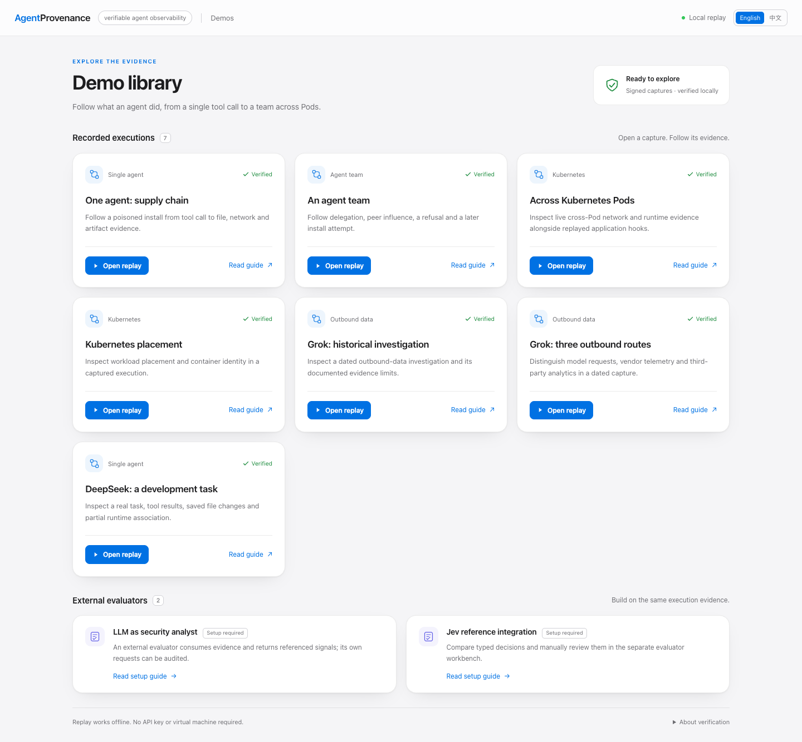
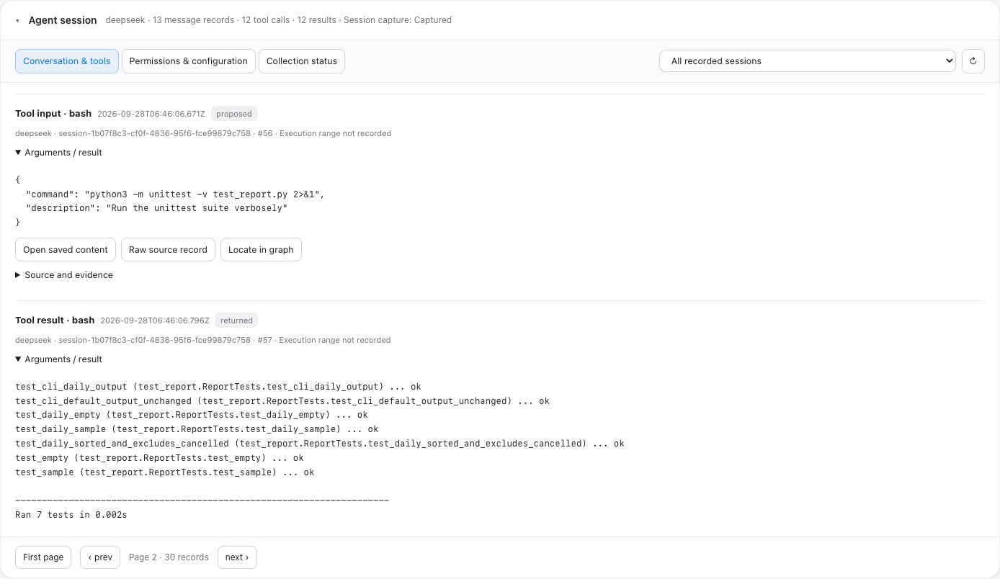
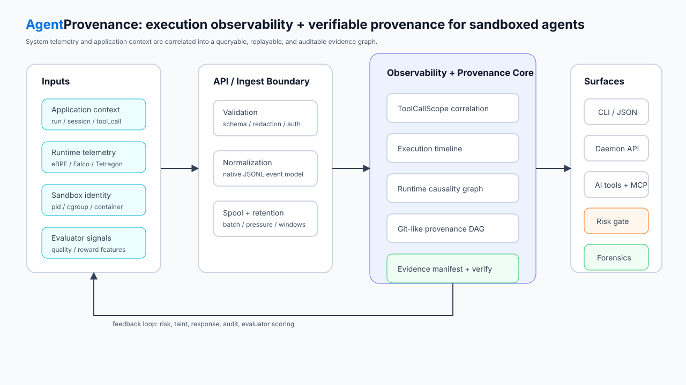

<div align="center">

[](https://ByteYellow.github.io/AgentProvenance/)

**Explore 7 signed replays: graphs, Agent sessions and saved files.**
No installation, account or API key required.

# AgentProvenance

### What did your agent actually do? Follow the evidence.

Record agent tasks, conversations and tool calls alongside the processes, files
and network activity they produce. Trace artifacts, compare executions, and
export evidence you can replay and verify offline.

[](https://github.com/ByteYellow/AgentProvenance/releases/latest)
[](https://go.dev/)
[](https://github.com/ByteYellow/AgentProvenance/actions/workflows/ci.yml)
[](docs/amd64-kvm-k3s.md)
[](https://www.sqlite.org/)
[](LICENSE)

**[Online demo](https://ByteYellow.github.io/AgentProvenance/)** | **[Quickstart](#quickstart)** | **[Capabilities](#what-you-can-do)** | **[Agent session](#agent-session)** | **[Demos](#demos)** | **[Architecture](#architecture)** | **[Docs](#features-and-docs)**

English | [简体中文](README.zh-CN.md)

</div>

---

**Git-like provenance for agent execution:** record → inspect → trace → compare → verify.

AgentProvenance connects three parts of an execution: what the agent was asked
to do, what its tools reported, and what happened in the operating system.
Use the same evidence to debug a failed task, inspect an unexpected file change,
investigate a network connection, or feed an external evaluator.

<a id="current-capability"></a>
<a id="contents"></a>
<a id="why"></a>
<a id="three-axis-execution-observability-for-sandboxed-ai-agents"></a>

## What you can do

| Capability | What it gives you |
| --- | --- |
| Record an execution | Wrap an agent or ordinary command; save process activity, workspace changes and supported session records |
| Follow cause and effect | Connect tasks and tool calls to processes, files and network events; inspect the evidence behind an association |
| Trace files and artifacts | Use `graph explain`, `diff` and `blame` to see what changed and which execution produced it |
| Inspect Agent sessions | Read messages and tool results, compare task/configuration snapshots, and review collection gaps |
| Investigate security | Apply policies, inspect blocking decisions, trace sensitive data flow and compare behavior against a baseline |
| Understand agent teams | Follow delegation and peer messages into the execution evidence attributed to each agent |
| Capture across environments | Collect on Linux amd64/arm64, inside KVM guests, or on Kubernetes nodes with Pod/container attribution |
| Replay and verify | Export content-addressed evidence, optionally sign it, and share a replay that works offline |
| Integrate with other tools | Query through CLI/JSON, HTTP, Python or MCP; attach external evaluation results to the same evidence |

Use it for debugging coding agents, reviewing generated artifacts, investigating
unexpected behavior, and building evaluation or audit workflows.

**On this page:** [Quickstart](#quickstart) · [Evidence model](#core-model) ·
[Agent session](#agent-session) · [Dashboard](#web-dashboard) · [Demos](#demos) ·
[Runtime capture](#runtime-capture) · [Security and evaluation](#security-and-evaluation) ·
[Architecture](#architecture) · [Documentation](#features-and-docs)

## Quickstart

<a id="download-and-replay--no-go-required"></a>

### Try a recorded execution

[Open the online demo](https://ByteYellow.github.io/AgentProvenance/) to explore
the graph, Agent session and saved files in your browser. The same site includes
the illustrated demo guides and user documentation. No installation is needed.

To replay offline, download the CLI:

Download the archive for your platform and its `.sha256` file from
[Releases](https://github.com/ByteYellow/AgentProvenance/releases).
The examples below use v0.9.0.

| Platform | Archive suffix |
| --- | --- |
| Linux / WSL, x86-64 | `linux_amd64.tar.gz` |
| Linux / WSL, ARM64 | `linux_arm64.tar.gz` |
| macOS, Intel | `darwin_amd64.tar.gz` |
| macOS, Apple Silicon | `darwin_arm64.tar.gz` |

On Linux x86-64, verify and extract the downloaded archive:

```sh
sha256sum -c agentprov_v0.9.0_linux_amd64.tar.gz.sha256
mkdir agentprov-demo
tar -xzf agentprov_v0.9.0_linux_amd64.tar.gz -C agentprov-demo
cd agentprov-demo
./agentprov demo
```

On macOS, use the matching `darwin` archive and `shasum -a 256 -c` to check it.
Windows users run the Linux archive inside WSL. Replay needs no Go, Docker,
agent account or API key and works offline.

[](https://ByteYellow.github.io/AgentProvenance/)

Choose **Open replay** to explore a signed execution, or **Read guide** to open
its illustrated guide. The library includes **seven signed replays and nine
guides**. Start with the new DeepSeek development task:

```sh
./agentprov demo deepseek-context
./agentprov demo multiagent-provenance
./agentprov demo --list
```

The CLI verifies the evidence signature and opens the dashboard with a temporary
store. Ctrl-C closes it and removes that store. Recorded commands are never rerun.
For remote or headless machines, add `--no-browser` and access the local address
through your usual port forwarding.

To build v0.9.0 from source, install Go 1.23+:

```sh
git clone --branch v0.9.0 https://github.com/ByteYellow/AgentProvenance
cd AgentProvenance
go build -o agentprov ./cmd/agentprov
./agentprov demo
```

[All demos](demo/README.md) · [Archive guide](docs/release-start.md)

<a id="capture-your-own-agent"></a>

### Record your own agent

With your agent installed and authenticated:

```sh
./agentprov doctor -- claude
./agentprov launch --file-diff -- claude
```

`doctor` checks the local capture setup. `launch` starts the agent and dashboard,
then collects the session when the agent exits. `--file-diff` also saves workspace
changes and final changed-file text. Claude receives a per-run hooks overlay;
your normal Claude settings stay in place.

Codex and DeepSeek Harness use the same entry point:

```sh
./agentprov launch --file-diff -- codex
./agentprov launch --file-diff -- dsh headless --json 'Inspect the project and run its tests.'
```

Linux eBPF capture requires the sensor, a supported kernel and BPF/perf access.
macOS supports application recording and replay. Custom session directories,
resumed sessions and source formats are covered in the
[Agent session guide](docs/agent-context.md).

<a id="record-a-command-without-an-agent"></a>

### Record an ordinary command

You can start without an agent integration:

```sh
mkdir -p /tmp/agentprov-record-demo
./agentprov record --run run-record-demo --workdir /tmp/agentprov-record-demo -- \
  sh -c 'echo artifact > artifact.txt'
./agentprov observe summary --run run-record-demo
./agentprov graph explain --run run-record-demo --file artifact.txt
```

`record` captures the command, process samples and workspace changes. A running
Linux sensor adds kernel events; a supported session adapter adds agent context.
Local recording and replay do not require Docker.

### Inspect, trace, compare and export

Each execution has a Run ID. Substitute the IDs printed by your recording:

```sh
./agentprov observe summary --run RUN_ID
./agentprov graph explain --run RUN_ID --file path/to/artifact
./agentprov graph diff --run RUN_ID --file path/to/artifact
./agentprov graph blame --run RUN_ID --file path/to/artifact
./agentprov context coverage --run RUN_ID
./agentprov graph verify --run RUN_ID
./agentprov forensics export RUN_ID
```

Use the dashboard to follow tools into runtime events, open saved file content,
and compare recorded task or configuration entries. The [graph reference](docs/graph-commands.md)
covers execution comparisons and artifact lineage. Add `--sign-key` during
recording when you want a signed run; signing is opt-in.

<a id="evidence-layers"></a>
<a id="runtime-facts-and-correlation"></a>

## Core model

An agent transcript explains the task and tool decisions. Runtime telemetry
records process, file and network effects. AgentProvenance brings them together
with file changes and saved artifacts:

```text
Task / conversation / agent delegation
  → tool call
    → process and child processes
      → file access / network connection / runtime event
        → changed file / artifact / evidence object
```

| Evidence layer | Sources | What it explains |
| --- | --- | --- |
| Runtime facts | Process sampling, file diffs, native eBPF and compatible telemetry receivers | What processes did, which files changed and where connections went |
| Agent context | Session logs, hooks and explicit context producers | The task, conversation, tools, agent identities, delegation and recorded permissions |
| Model requests and intent | Supported transcript formats and TLS plaintext probes | Captured requests/responses, declared actions and refusals |

Correlation uses process identity, cgroups, containers, working directories,
time ranges and recorded tool identifiers. Raw kernel events do not need an
agent-specific `tool_call_id`. Derived relationships retain their supporting
evidence and confidence; missing or ambiguous context remains visible.

Evidence objects have content hashes and parent references. Verification checks
those objects and their links; optional signatures let a recipient verify a
bundle against its signing key. Captured intent means recorded messages and
actions, not access to a model's internal reasoning.

[Detailed evidence model](docs/capabilities.md#core-model) ·
[Correlation and graph queries](docs/graph-commands.md)

## Agent session

v0.9.0 brings the task and conversation into the same view as execution evidence.
The graph stays above **Agent session**, which is **collapsed by default**.

| View | What you can inspect |
| --- | --- |
| Conversation and tools | User/assistant messages, tool inputs, results and errors, with links to their source records and runtime evidence |
| Permissions and configuration | Recorded tasks, model, workspace, approval and sandbox settings; compare snapshots from different points in a session or across runs |
| Collection status | Which session sources were read, missing fields, parsing failures, runtime probe coverage and association gaps |
| Saved content | Full tool output and captured file text in a separate paged reader; keep reading with the session collapsed |



### Supported agents

| Agent | Integration and available context |
| --- | --- |
| Claude Code | Per-run hooks and native transcripts: messages, tools, permission-mode changes and session metadata |
| Codex | Native rollout records: messages, tool results, thread settings and recorded child-thread identities |
| DeepSeek Harness | v3 JSONL and native v4 Zstandard sessions: messages, tools, PTC sub-calls and configuration |
| Kimi / Grok | Existing supported transcript integrations and historical replay formats |
| Other commands or harnesses | Process/file recording through `record`; add semantic context through hooks, MCP or explicit producers |

Custom directories and resumed sessions can be selected explicitly. Incremental
imports retain source positions and deduplicate repeated records. Configuration
and task snapshots can be compared within a run or across runs. The
[compatibility table](docs/agent-context.md#native-format-compatibility) lists
checked versions and source formats.

Context is collected **after the agent exits**. Permission history contains what
the source recorded; missing decisions appear as unrecorded. The coverage report
shows capture gaps separately from graph and signature verification.

[Explore the DeepSeek example](demo/deepseek-context/README.md) ·
[Session commands and API](docs/agent-context.md)

## Web Dashboard

The Dashboard brings the execution graph, timeline, process tree, network
activity, risk signals and saved evidence into one investigation view.

| View | Use it to |
| --- | --- |
| Graph Explorer | Switch between process, file/artifact, network, agent intent, orchestration, data flow and deployment views |
| Timeline and details | Follow the order of events, select a node and inspect its source evidence |
| Agent session | Navigate from a tool result to linked graph evidence; inspect task and permission/configuration history |
| Saved-content reader | Read captured tool output or file text in pages, independently of the session panel |
| Coverage and verification | Review session capture, probe availability, association gaps and integrity results |


Open your own recorded runs with:

```sh
./agentprov dashboard serve
```

The local Dashboard serves its assets from the CLI and needs no external web
service. The online demo provides the same read-only investigation experience
for the bundled public captures. Views summarize large event sets and let you
drill into details instead of placing every raw event on one canvas.

## Demos

<a id="demo-multi-agent-causality-delegation-peer-message-syscall-evidence"></a>

### Follow a multi-agent execution

An agent delegates work; a peer message leads another agent to install a poisoned
package. Follow the message and tool call into the attributed file reads and
network connection. The recording also includes an earlier refused action.


```sh
./agentprov demo multiagent-provenance
```

[Read the investigation](demo/multiagent-provenance/README.md). Shared-process
agent attribution is inferred from the recorded hooks and command evidence.

<a id="demo-kubernetes-cross-pod-a2a-one-node-sensor-two-pods-one-graph"></a>

### Trace execution across Pods

One node sensor captures two Pods, preserving their cgroup identities and
Kubernetes metadata. Explore workload placement, the cross-Pod connection and
the worker's runtime activity in the same graph.


```sh
./agentprov demo k8s-cross-pod-a2a
```

The network and syscall events were captured live; the delegation hooks reuse
the agent-team recording. [The guide](demo/k8s-cross-pod-a2a/README.md) explains
how these sources are joined.

<a id="demo-agent-in-a-sandbox-supply-chain-exfiltration-caught-by-provenance"></a>

### Explore all examples

| Example | What to look for |
| --- | --- |
| [DeepSeek development task](demo/deepseek-context/README.md) | Task, tool results, configuration history, passing tests and final file content |
| [Snake supply chain](demo/snake-supply-chain/README.md) | A poisoned dependency, planted test secrets, network activity and artifact provenance |
| [Agent team](demo/multiagent-provenance/README.md) | Delegation, peer influence, a refusal and the later execution path |
| [Kubernetes cross-Pod A2A](demo/k8s-cross-pod-a2a/README.md) | Separate workloads connected by one node's evidence |
| [Kubernetes placement](demo/k8s-substrate/README.md) | Container identity and workload placement |
| [Grok codebase-exfil investigation](demo/grok-codebase-exfil/README.md) | Historical evidence, reported behavior and reproduction limits; replay with `grok-codebase-exfil` |
| [Grok outbound routes](demo/grok-codebase-exfil/README.md) | Model requests, vendor telemetry and third-party analytics; replay with `grok-3routes` |
| [LLM Judge](demo/llm-judge/README.md) | An external model reads evidence and returns findings with evidence references |
| [Jev evaluator](demo/jev-judge/README.md) | Structured evaluation, rule comparison and human review |

The first seven replay entries work offline. LLM Judge and Jev are optional
integration guides; live evaluation requires the provider setup described in
each guide. Grok examples are dated captures with reproduction limits, not a
statement about the current service.

<a id="substrates-and-telemetry"></a>

## Runtime capture

The native sensor records process, file and network activity on Linux amd64 and
arm64. It runs on a Linux host, **inside a KVM guest**, or as a node sensor for
Kubernetes/K3s. Pod metadata connects events to workloads; disk buffering and
late attribution handle events that arrive before their workload binding.
Probe reports show the syscalls, DNS and TLS paths available in that environment.

| Environment | Available workflow |
| --- | --- |
| Linux amd64 / arm64 | Agent sessions, command recording, native eBPF capture, queries and replay |
| KVM Linux guest | Capture inside the guest using its kernel and process identities |
| Kubernetes / K3s | One sensor per node with Pod/container attribution and lifecycle tracking |
| macOS Intel / Apple Silicon | Agent sessions, command and file recording, queries and replay |
| Windows | Run the Linux tools in WSL; kernel capture depends on the WSL kernel and permissions |

[KVM/K3s setup and TLS support](docs/amd64-kvm-k3s.md) ·
[Durable capture](docs/native-capture-spool.md) ·
[Kubernetes attribution](docs/design-k8s-auto-attribution.md)

TLS discovery follows supported OpenSSL libraries and Go binaries, including
container replacements. Go TLS response capture currently supports **amd64,
Go 1.23–1.26, with symbols**. ARM64 Go response capture, BoringSSL and arbitrary
custom TLS stacks remain outside that coverage. Use the probe report to see
what actually attached on your machine.

<a id="daemon-mode"></a>

### Deployment modes

| Mode | How it runs | Typical use |
| --- | --- | --- |
| Local CLI | One CLI with a local SQLite database and evidence objects | Development, offline replay, CI jobs and evaluators |
| Local daemon / sidecar | A service beside a worker or sandbox host, with ingest and query APIs | Shared local queries and buffered event ingestion |
| Kubernetes node capture | A sensor on each selected node with workload attribution | Multi-workload capture in Kubernetes/K3s |

The sensor runs within the Linux host or guest being observed. AgentProvenance
uses existing runtimes and orchestrators; it does not provision VMs or replace
Kubernetes. Existing Falco/Tetragon receivers remain compatibility paths.
A centralized multi-tenant evidence service is a future design.

<a id="ai-callable-evidence-tools"></a>
<a id="compliance-evidence-not-certification"></a>
<a id="custom-rules-in-python"></a>
<a id="external-evaluator-protocol"></a>
<a id="intent-conformance"></a>
<a id="security-evidence-commands"></a>
<a id="security-loop"></a>
<a id="worked-example-an-llm-as-security-judge"></a>

## Security and evaluation

Use policies and behavior baselines to find unexpected secret access, network
egress or process activity. The evidence graph connects findings to their tools,
processes and artifacts; data-flow views expose possible sensitive-data paths.
Intent comparison highlights differences between declared actions and observed
effects, including actions that happened after a recorded refusal.

```sh
./agentprov security risks --run RUN_ID
./agentprov policy decisions --run RUN_ID
./agentprov security responses --run RUN_ID
./agentprov intent diff --run RUN_ID
```

Blocking uses the applicable policy gate or response integration. The recorded
decision and response history show what was requested and what happened;
importing historical evidence does not block an already completed action.
OWASP Agentic and NIST mappings show which controls have supporting evidence
and where gaps remain.

External evaluators can read a trajectory, score it and write back signals
with evidence references. LLM Judge and Jev demonstrate this workflow; an
evaluation or training pipeline owns its scoring and reward rules.

```sh
./agentprov signal context --run RUN_ID
./agentprov ai tools --provider openai
./agentprov ai mcp
```

CLI/JSON, HTTP APIs, the Python SDK and MCP expose evidence to other tools.
MCP also provides action preflight and explicit context-write tools; writing
agent context does not execute an action or create kernel telemetry.

[Security commands](docs/security-commands.md) · [Compliance mapping](docs/compliance.md) ·
[AI tools and MCP](docs/ai-tools.md) · [Python SDK](docs/python-sdk.md)

<a id="boundaries"></a>
<a id="repository-layout"></a>
<a id="relationship-to-existing-systems"></a>

## Architecture



1. **Collect** session records, hooks, command/file observations and runtime events.
2. **Normalize and associate** them with runs, tool scopes, processes and workloads;
   redact sensitive values and buffer streaming input where configured.
3. **Store evidence** in SQLite and content-addressed objects, retaining source
   identities, revisions and the basis for derived relationships.
4. **Inspect and exchange** it through the graph, timeline, CLI, APIs, signed
   bundles and read-only replay. Security rules and external evaluators add
   findings tied to the same evidence.

The default deployment keeps these modules in a local service/CLI with an
optional privileged sensor. A hosted control plane is not required.

| Code area | Responsibility |
| --- | --- |
| `internal/launch`, `record`, `hooksbridge`, `agentcontext` | Start executions and collect agent context |
| `internal/sensor`, `producer`, `telemetry` | Native collection, workload identities and ingestion |
| `internal/correlation`, `provenance`, `store` | Association, evidence graph, objects and persistence |
| `internal/security`, `signals`, `attest`, `forensics` | Analysis, external results, signing and export |
| `internal/cli`, `dashboard`, `daemon`, `mcpserver` | User and integration interfaces |

Git-like provenance covers history, differences, attribution and verification.
It does not roll back external effects. Hashes and signatures check recorded
evidence; collection reports separately explain what was observed or missed.

[Full architecture and repository map](docs/capabilities.md#architecture) ·
[Relationship to other systems](docs/comparisons.md)

<a id="graph-commands"></a>
<a id="interface-language"></a>

## Features and docs

The session view sits alongside the existing timeline, process tree, network,
risk signals, data-flow and rule-coverage views. Security analysis and external
evaluators consume the same recorded evidence.

| What you want to do | Guide |
| --- | --- |
| Trace tools, files and execution differences | [Graph commands](docs/graph-commands.md) |
| Capture sessions and compare configuration | [Agent session](docs/agent-context.md) |
| Investigate risk, apply policies and inspect blocking decisions | [Security commands](docs/security-commands.md) |
| Inspect control mappings and rule coverage | [Compliance mapping](docs/compliance.md) |
| Query evidence from another application | [HTTP API](docs/openapi.yaml), [context API](docs/agent-context-api.yaml), [Python SDK](docs/python-sdk.md) |
| Give an agent access to evidence tools | [AI tools and MCP](docs/ai-tools.md) |
| Add an external evaluator | [LLM Judge](demo/llm-judge/README.md), [Jev](demo/jev-judge/README.md) |
| Understand deployment and architecture | [Deployment modes](docs/deployment-modes.md), [capability reference](docs/capabilities.md) |

Web pages follow your browser language initially, falling back to English, and
remember manual switches. CLI and tool output default to English; original
evidence is kept as recorded.

<a id="roadmap"></a>
<a id="core-demo-acceptance"></a>

## Release status

v0.9.0 adds richer Agent sessions, DeepSeek Harness integration, task and
configuration history, collection reports and saved-content browsing. It also
brings the complete read-only demo and bilingual documentation to the web.

For upgrades, back up your data directory before opening it with v0.9.0.
An upgraded database should not be reopened with an older binary. macOS archives
are not Apple notarized; download checksums verify archive integrity.

[Release notes](docs/releases/v0.9.0.md) · [Changelog](CHANGELOG.md) ·
[Validation details](docs/benchmarks/v0.9.0-acceptance/README.md) ·
[Future work](docs/capabilities.md#future-work)

## Development

```sh
go test -race ./...
go vet ./...
gofmt -l internal cmd

# Portable end-to-end evidence and verification smoke.
./scripts/accept_phase1.sh
```

[CI](.github/workflows/ci.yml) runs these gates, static Linux amd64/arm64 builds,
the native bindings drift check, daemon readiness faults, and live amd64
syscall/OpenSSL/Go TLS tests across Go 1.23–1.26. Live ARM64 and KVM/K3s lab
reports are distinct from hosted CI.

Acceptance scripts are environment-specific. Do not run every
`scripts/accept_*.sh` indiscriminately: some require root, create Pods, or install
services. Use the [KVM/K3s runbook](docs/amd64-kvm-k3s.md) for those gates and the
[closeout guide](docs/project-closeout.md) for the single-node pressure tests.

## Author and License

Built and maintained by [ByteYellow](https://github.com/ByteYellow).

Licensed under the Apache License 2.0 — see [LICENSE](LICENSE).
Copyright 2026 ByteYellow.
