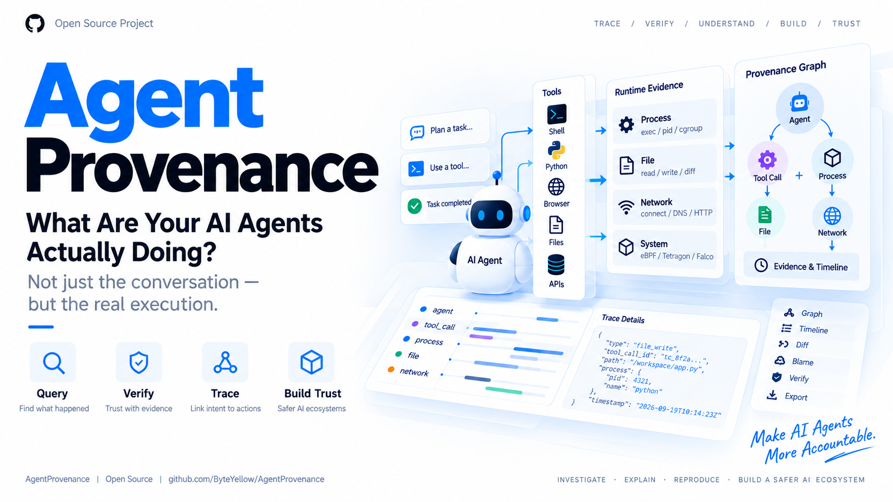

<p align="center">
  
</p>

<div align="center">

# AgentProvenance

### What did your agent actually do? Follow the evidence.

Record agent tasks, conversations and tool calls alongside the processes, files
and network activity they produce. Trace artifacts, compare executions, and
export evidence you can replay and verify offline.

[](https://github.com/ByteYellow/AgentProvenance/releases/latest)
[](https://go.dev/)
[](https://github.com/ByteYellow/AgentProvenance/actions/workflows/ci.yml)
[](docs/amd64-kvm-k3s.md)
[](https://www.sqlite.org/)
[](LICENSE)

**[Quickstart](#quickstart)** | **[Agent session](#agent-session)** | **[Features and docs](#features-and-docs)** | **[All demos](demo/README.md)** | **[v0.9.0](docs/releases/v0.9.0.md)**

English | [简体中文](README.zh-CN.md)

</div>

---

**Git-like provenance for agent execution:** record → inspect → trace → compare → verify.

AgentProvenance connects three parts of an execution: what the agent was asked
to do, what its tools reported, and what happened in the operating system.
Use the same evidence to debug a failed task, inspect an unexpected file change,
investigate a network connection, or feed an external evaluator.

## Quickstart

### Try a recorded execution

Download the archive for your platform and its `.sha256` file from
[Releases](https://github.com/ByteYellow/AgentProvenance/releases).
The examples below target v0.9.0. While it awaits publication, use the source
build below to try the new session features.

| Platform | Archive suffix |
| --- | --- |
| Linux / WSL, x86-64 | `linux_amd64.tar.gz` |
| Linux / WSL, ARM64 | `linux_arm64.tar.gz` |
| macOS, Intel | `darwin_amd64.tar.gz` |
| macOS, Apple Silicon | `darwin_arm64.tar.gz` |

On Linux x86-64, verify and extract the downloaded archive:

```sh
sha256sum -c agentprov_v0.9.0_linux_amd64.tar.gz.sha256
mkdir agentprov-demo
tar -xzf agentprov_v0.9.0_linux_amd64.tar.gz -C agentprov-demo
cd agentprov-demo
./agentprov demo
```

On macOS, use the matching `darwin` archive and `shasum -a 256 -c` to check it.
Windows users run the Linux archive inside WSL. Replay needs no Go, Docker,
agent account or API key and works offline.


Choose **Open replay** to explore a signed execution, or **Read guide** to open
its illustrated guide. The library includes **seven signed replays and nine
guides**. Start with the new DeepSeek development task:

```sh
./agentprov demo deepseek-context
./agentprov demo multiagent-provenance
./agentprov demo --list
```

The CLI verifies the evidence signature and opens the dashboard with a temporary
store. Ctrl-C closes it and removes that store. Recorded commands are never rerun.
For remote or headless machines, add `--no-browser` and access the local address
through your usual port forwarding.

To build this review branch instead, install Go 1.23+:

```sh
git clone --branch fix/v0.9.0-acceptance https://github.com/ByteYellow/AgentProvenance
cd AgentProvenance
go build -o agentprov ./cmd/agentprov
./agentprov demo
```

[All demos](demo/README.md) · [Archive guide](docs/release-start.md)

### Record your own agent

With your agent installed and authenticated:

```sh
./agentprov doctor -- claude
./agentprov launch --file-diff -- claude
```

`doctor` checks the local capture setup. `launch` starts the agent and dashboard,
then collects the session when the agent exits. `--file-diff` also saves workspace
changes and final changed-file text. Claude receives a per-run hooks overlay;
your normal Claude settings stay in place.

Codex and DeepSeek Harness use the same entry point:

```sh
./agentprov launch --file-diff -- codex
./agentprov launch --file-diff -- dsh headless --json 'Inspect the project and run its tests.'
```

Linux eBPF capture requires the sensor, a supported kernel and BPF/perf access.
macOS supports application recording and replay. Custom session directories,
resumed sessions and source formats are covered in the
[Agent session guide](docs/agent-context.md).

### Inspect, trace, compare and export

Each execution has a Run ID. Substitute the IDs printed by your recording:

```sh
./agentprov observe summary --run RUN_ID
./agentprov graph explain --run RUN_ID --file path/to/artifact
./agentprov context coverage --run RUN_ID
./agentprov graph verify --run RUN_ID
./agentprov forensics export RUN_ID
```

Use the dashboard to follow tools into runtime events, open saved file content,
and compare recorded task or configuration entries. The [graph reference](docs/graph-commands.md)
covers execution comparisons and artifact lineage. Add `--sign-key` during
recording when you want a signed run; signing is opt-in.

## Agent session

v0.9.0 brings the task and conversation into the same view as execution evidence.
The graph stays above **Agent session**, which is **collapsed by default**.

| View | What you can inspect |
| --- | --- |
| Conversation and tools | User/assistant messages, tool inputs, results and errors, with links to their source records and runtime evidence |
| Permissions and configuration | Recorded tasks, model, workspace, approval and sandbox settings; compare snapshots from different points in a session or across runs |
| Collection status | Which session sources were read, missing fields, parsing failures, runtime probe coverage and association gaps |
| Saved content | Full tool output and captured file text in a separate paged reader; keep reading with the session collapsed |


Claude Code and Codex have native session adapters; DeepSeek Harness supports v3
JSONL and native v4 Zstandard logs. Existing Kimi/Grok transcript integrations
remain available. The [compatibility table](docs/agent-context.md#native-format-compatibility)
lists checked versions and formats.

Context is collected **after the agent exits**. Permission history contains what
the source recorded; missing decisions appear as unrecorded. The coverage report
shows capture gaps separately from graph and signature verification.

[Explore the DeepSeek example](demo/deepseek-context/README.md) ·
[Session commands and API](docs/agent-context.md)

## Runtime capture

The native sensor records process, file and network activity on Linux amd64 and
arm64. It runs on a Linux host, **inside a KVM guest**, or as a node sensor for
Kubernetes/K3s. Pod metadata connects events to workloads; disk buffering and
late attribution handle events that arrive before their workload binding.
Probe reports show the syscalls, DNS and TLS paths available in that environment.

| Environment | Available workflow |
| --- | --- |
| Linux amd64 / arm64 | Agent sessions, command recording, native eBPF capture, queries and replay |
| KVM Linux guest | Capture inside the guest using its kernel and process identities |
| Kubernetes / K3s | One sensor per node with Pod/container attribution and lifecycle tracking |
| macOS Intel / Apple Silicon | Agent sessions, command and file recording, queries and replay |
| Windows | Run the Linux tools in WSL; kernel capture depends on the WSL kernel and permissions |

[KVM/K3s setup and TLS support](docs/amd64-kvm-k3s.md) ·
[Durable capture](docs/native-capture-spool.md) ·
[Kubernetes attribution](docs/design-k8s-auto-attribution.md)

<a id="ai-callable-evidence-tools"></a>
<a id="architecture"></a>
<a id="boundaries"></a>
<a id="capture-your-own-agent"></a>
<a id="compliance-evidence-not-certification"></a>
<a id="contents"></a>
<a id="core-demo-acceptance"></a>
<a id="core-model"></a>
<a id="current-capability"></a>
<a id="custom-rules-in-python"></a>
<a id="daemon-mode"></a>
<a id="demo-agent-in-a-sandbox-supply-chain-exfiltration-caught-by-provenance"></a>
<a id="demo-kubernetes-cross-pod-a2a-one-node-sensor-two-pods-one-graph"></a>
<a id="demo-multi-agent-causality-delegation-peer-message-syscall-evidence"></a>
<a id="deployment-modes"></a>
<a id="download-and-replay--no-go-required"></a>
<a id="evidence-layers"></a>
<a id="external-evaluator-protocol"></a>
<a id="graph-commands"></a>
<a id="intent-conformance"></a>
<a id="interface-language"></a>
<a id="record-a-command-without-an-agent"></a>
<a id="relationship-to-existing-systems"></a>
<a id="repository-layout"></a>
<a id="roadmap"></a>
<a id="runtime-facts-and-correlation"></a>
<a id="security-evidence-commands"></a>
<a id="security-loop"></a>
<a id="substrates-and-telemetry"></a>
<a id="three-axis-execution-observability-for-sandboxed-ai-agents"></a>
<a id="web-dashboard"></a>
<a id="why"></a>
<a id="worked-example-an-llm-as-security-judge"></a>

## Features and docs

The session view sits alongside the existing timeline, process tree, network,
risk signals, data-flow and rule-coverage views. Security analysis and external
evaluators consume the same recorded evidence.

| What you want to do | Guide |
| --- | --- |
| Trace tools, files and execution differences | [Graph commands](docs/graph-commands.md) |
| Capture sessions and compare configuration | [Agent session](docs/agent-context.md) |
| Investigate risk, apply policies and inspect blocking decisions | [Security commands](docs/security-commands.md) |
| Inspect control mappings and rule coverage | [Compliance mapping](docs/compliance.md) |
| Query evidence from another application | [HTTP API](docs/openapi.yaml), [context API](docs/agent-context-api.yaml), [Python SDK](docs/python-sdk.md) |
| Give an agent access to evidence tools | [AI tools and MCP](docs/ai-tools.md) |
| Add an external evaluator | [LLM Judge](demo/llm-judge/README.md), [Jev](demo/jev-judge/README.md) |
| Understand deployment and architecture | [Deployment modes](docs/deployment-modes.md), [capability reference](docs/capabilities.md) |

Web pages follow your browser language initially, falling back to English, and
remember manual switches. CLI and tool output default to English; original
evidence is kept as recorded.

## Release status

**v0.9.0 has completed acceptance and is awaiting release review.** Tests cover
existing session adapters, DeepSeek, resume and deduplication, configuration
history, coverage reports, saved content and dashboard navigation.

The [acceptance report](docs/benchmarks/v0.9.0-acceptance/README.md) records
485 browser checks, six historical signed bundles, schema 17→19 migration,
live x86 KVM/K3s and TLS checks. Remote CI and all four portable archive builds
passed. The agreed 24-hour soak remains deferred; ARM live validation was not
repeated in this round.

For upgrades, back up your data directory before opening it with v0.9.0.
An upgraded database should not be reopened with an older binary. macOS archives
are not Apple notarized; download checksums verify archive integrity.

[Release notes](docs/releases/v0.9.0.md) · [Changelog](CHANGELOG.md)

## Development

```sh
go test -race ./...
go vet ./...
gofmt -l internal cmd

# Portable end-to-end evidence and verification smoke.
./scripts/accept_phase1.sh
```

[CI](.github/workflows/ci.yml) runs these gates, static Linux amd64/arm64 builds,
the native bindings drift check, daemon readiness faults, and live amd64
syscall/OpenSSL/Go TLS tests across Go 1.23–1.26. Live ARM64 and KVM/K3s lab
reports are distinct from hosted CI.

Acceptance scripts are environment-specific. Do not run every
`scripts/accept_*.sh` indiscriminately: some require root, create Pods, or install
services. Use the [KVM/K3s runbook](docs/amd64-kvm-k3s.md) for those gates and the
[closeout guide](docs/project-closeout.md) for the single-node pressure tests.

## Author and License

Built and maintained by [ByteYellow](https://github.com/ByteYellow).

Licensed under the Apache License 2.0 — see [LICENSE](LICENSE).
Copyright 2026 ByteYellow.
