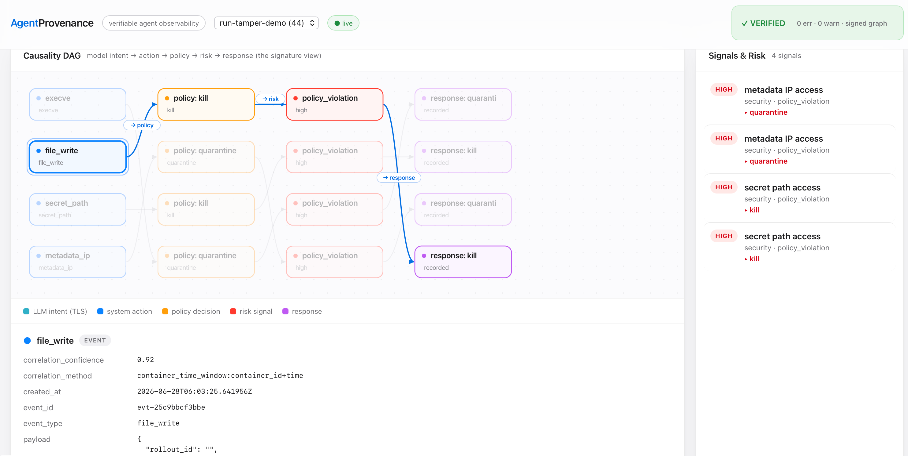
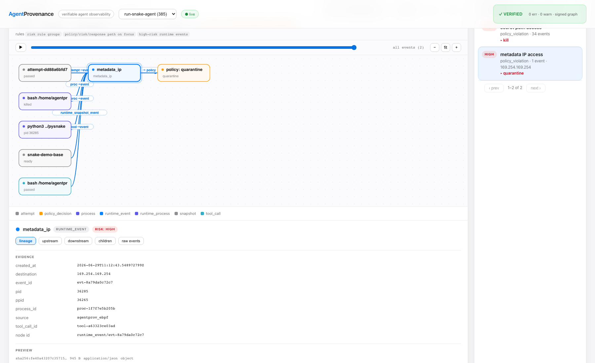
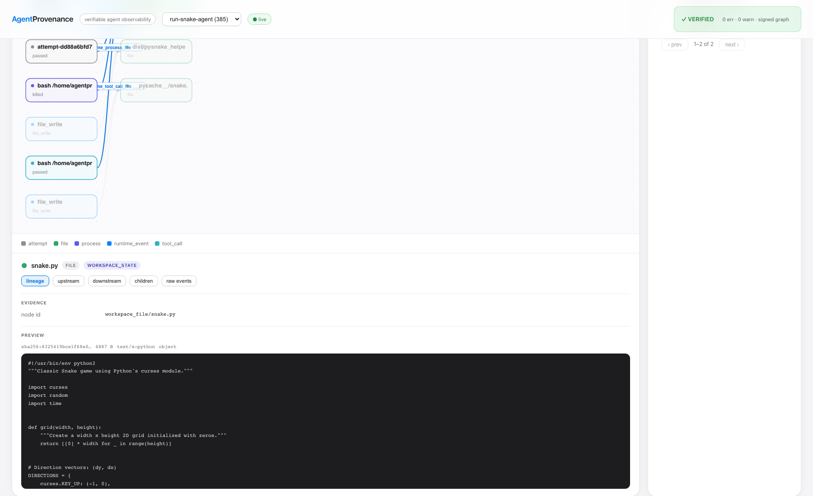
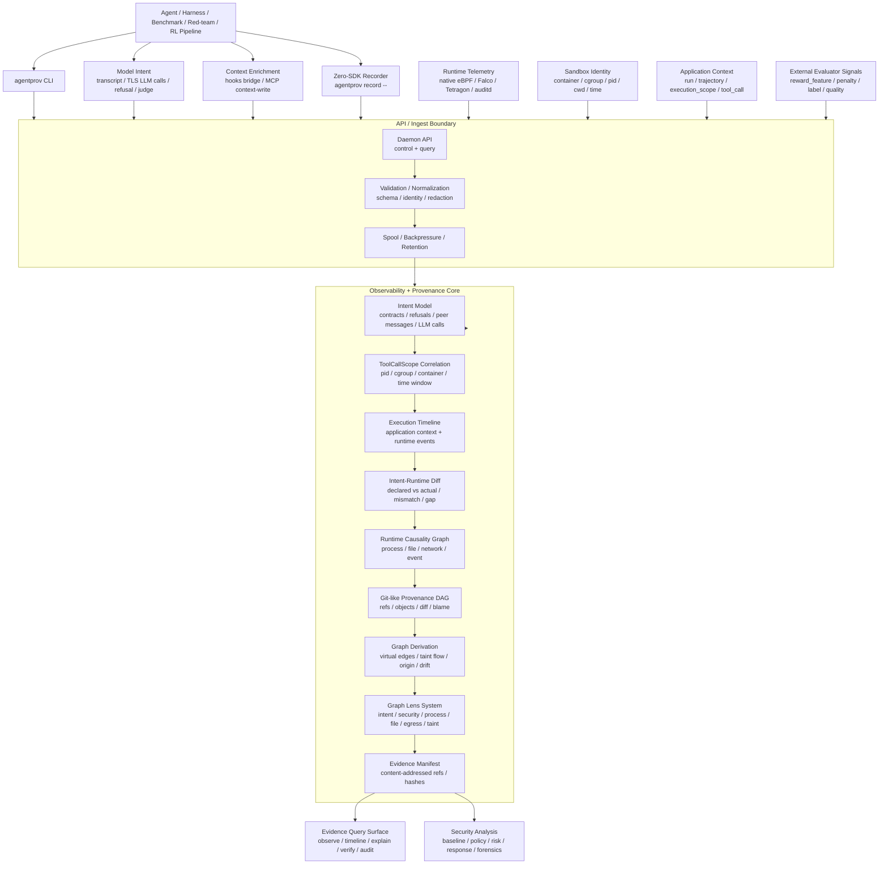

<p align="center">
  
</p>

<div align="center">

# AgentProvenance

### 面向沙箱化 AI agent 的三轴执行可观测性。

将**模型意图、应用上下文和运行时遥测**关联到同一张可验证的证据图。
从工具调用追到实际的进程、文件和网络行为，调查风险、比较执行差异，
并在本地回放签名证据。

[](https://github.com/ByteYellow/AgentProvenance/releases/latest)
[](https://go.dev/)
[](https://github.com/ByteYellow/AgentProvenance/actions/workflows/ci.yml)
[](docs/amd64-kvm-k3s.md)
[](https://www.sqlite.org/)
[](LICENSE)

**[快速开始](#快速开始)** | **[核心模型](#核心模型)** | **[当前能力](#当前能力)** | **[Demo](demo/README.md)** | **[Roadmap](#roadmap)**

[English](README.md) | 简体中文

</div>

---

<p align="center">
  
</p>

**调查真实执行，而不只是对话记录：**

- 哪个 agent、哪条对等消息引出了这次工具调用？
- 哪个进程读取了敏感文件、修改了产物，或连接了外部地址？
- 判定依据是什么，能否离线验证？

**真实采集：一次恶意依赖安装穿过 agent 团队。** Hooks 呈现委派和对等消息，
运行时证据记录文件读取与网络连接，dashboard 回放关联后的执行路径：

<p align="center">
  
</p>

[查看真实场景](demo/multiagent-provenance/README.md) ·
[立即回放](#快速开始) · [v0.8.0 版本说明](docs/releases/v0.8.0.md)

## 目录

- [快速开始](#快速开始)
- [为什么需要它](#为什么需要它)
- [安全闭环](#安全闭环)
- [核心模型](#核心模型)
  - [证据分层](#证据分层)
  - [运行时事实与关联](#运行时事实与关联)
- [与现有系统的关系](#与现有系统的关系)
- [意图一致性](#意图一致性)
- [部署模式](#部署模式)
- [安全证据命令](#安全证据命令)
- [外部评估器协议](#外部评估器协议)
- [合规证据，而非合规认证](#合规证据而非合规认证)
- [AI 可调用的证据工具](#ai-可调用的证据工具)
- [Web Dashboard](#web-dashboard)
- [Graph 命令](#graph-命令)
- [当前能力](#当前能力)
- [核心 Demo 验收](#核心-demo-验收)
- [架构](#架构)
- [基质与遥测](#基质与遥测)
- [边界](#边界)
- [仓库结构](#仓库结构)
- [Roadmap](#roadmap)
- [开发](#开发)
- [作者与许可](#作者与许可)

## 快速开始

### 先回放一份签名证据

需要 macOS 或 Linux，以及 Go 1.23+。查看仓库自带的采集结果，**不需要 Linux
虚拟机、Docker、agent 账号或 API key**。

```sh
git clone https://github.com/ByteYellow/AgentProvenance
cd AgentProvenance
go build -o agentprov ./cmd/agentprov

./agentprov --data-dir /tmp/agentprov-demo init
./agentprov --data-dir /tmp/agentprov-demo forensics import \
  demo/multiagent-provenance/run-double-attempt.forensics.json.gz \
  --pub-key demo/multiagent-provenance/attestation.pub
./agentprov --data-dir /tmp/agentprov-demo graph verify --run run-double-attempt
./agentprov --data-dir /tmp/agentprov-demo dashboard serve --addr 127.0.0.1:7396
```

打开输出中的地址，选择 **run-double-attempt**，切到 **Agent Network /
orchestration** 视图并播放。沿对等消息查看工具调用和对应的运行时证据。
[Demo 目录](demo/README.md)按单 agent、多 agent、Kubernetes 顺序展开，
并提供出站数据调查场景。

### 采集你自己的 agent

在同一个仓库目录中，使用已经安装并完成认证的 agent：

```sh
./agentprov doctor -- claude
./agentprov launch -- claude
```

`doctor` 在不运行 agent 的前提下，检查命令、hook 接入、cgroup 权限、传感器权限
和 dashboard 端口。`launch` 创建执行作用域、启动 dashboard，并为 Claude 注入
本次运行专用的 hooks 配置，不修改 `~/.claude`。

Linux 内核采集需要受支持的内核、可用的 cgroup，以及 root 或适当的 BPF/perf
权限。macOS 仍可使用 record/hooks/transcript 证据，**但没有内核传感器**。
预检和最终报告显示实际证据等级。其他 agent 的应用上下文取决于对应的
hook/transcript 适配器，不是命令能运行就能完整采集。

退出时封存证据图。**签名需要显式传入 `--sign-key <private-key-file>`，
并非默认开启。**需要工作区执行前后 diff 时，添加 `--file-diff`。

节点级采集请参阅 [KVM guest 与 K3s 部署指南](docs/amd64-kvm-k3s.md)及
[Kubernetes 归属指南](docs/design-k8s-auto-attribution.md)。传感器运行在 KVM
guest 内或 Kubernetes 节点上，核心证据模型不变。

### 不依赖 agent，记录一条命令

```sh
mkdir -p /tmp/agentprov-record-demo
./agentprov record --run run-record-demo --workdir /tmp/agentprov-record-demo -- \
  sh -c 'echo artifact > artifact.txt'
./agentprov observe summary --run run-record-demo
./agentprov graph explain --run run-record-demo --file artifact.txt
```

只有可选的 Docker 执行命令需要 Docker；回放、本地 `record` 和 dashboard
都不需要。进阶入口：[Graph 命令](docs/graph-commands.md)、
[部署模式](docs/deployment-modes.md)、[遥测 schema](docs/telemetry-schema.md)、
[开发门禁](#开发)。

## 为什么需要它

现代 agent 执行不是"一个 prompt 加一次工具调用"。编码 agent 和自主工作流会
创建执行作用域、改文件、跑测试、产出产物、派生子进程、接触外部系统，并触发
运行时遥测。日志、trace、指标和沙箱事件各自捕获了这个故事的一部分，
但它们很少能产出一份类 Git 的、关于执行状态的因果记录。

AgentProvenance 把沙箱化执行变成一张面向安全的证据图：

```text
base state                    基线状态
  -> execution scope              执行作用域
  -> execution context            执行上下文
  -> tool_call                    工具调用
  -> process / child process      进程 / 子进程
  -> runtime_event                运行时事件
  -> file_diff / artifact         文件差异 / 产物
  -> baseline feature / risk signal   基线特征 / 风险信号
  -> taint / response action      污染标记 / 响应动作
  -> replay / forensics / audit manifest   重放 / 取证 / 审计清单
```

主路径是**记录并解释**沙箱化 agent 的执行。AgentProvenance 不负责挑选
reward 的赢家。它输出结构化的轨迹证据和"预期偏差"信号，好让外部评估器或
训练流水线把它们转化成 reward、惩罚、过滤或人工复核的决策。

对 RL 流水线来说，有用的原语不是 "best-of-one" 或自动选优，而是**对每条轨迹
的可观测性**：agent 做了什么、碰了哪些子进程和文件、出现了哪些网络/运行时
事件、哪些行为违反了安全或任务预期、哪些风险/基线信号应该参与 reward 塑形
或拒绝判定。

## 安全闭环

安全模型刻意保持简单而具体：

```text
application context   应用上下文
  run / trajectory / execution_scope / tool_call / user / task / workspace

system telemetry      系统遥测
  process / file / network / resource / sandbox / eBPF event

correlation           关联
  container_id / cgroup_id / pid / ppid / cwd / timestamp / file diff

security analysis     安全分析
  behavior baseline / suspicious event / taint lineage / risk decision

response              响应
  audit / deny / kill / quarantine / taint / forensics / 飞书或钉钉通知
```

这让 AgentProvenance 更接近 AI 时代的 HIDS / 控制平面层，而不是纯粹的 LLM
trace dashboard。传统主机监控问的是"这个进程做了什么？"，AgentProvenance
补上了 agent 执行上下文，从而能问："是哪个 agent / 工具 / 任务导致的、
它改变了什么状态、有什么证据能证明、应该做出什么响应？"

项目当前已实现：证据图、运行时关联、diff/blame、遥测批次清单、策略决策、
归一化风险信号、基线偏差记录、响应动作记录、污染标记、隔离、取证/导出基础
设施，以及一个自研的 eBPF 传感器。飞书/钉钉响应适配器属于下一阶段的安全控制
工作；第三方接收器（Falco/Tetragon）按兼容性维护，不再扩展。

## 核心模型

<p align="center">
  
</p>

证据通过内容寻址存储、哈希校验，并可选签名。这是 **Git-like 执行溯源**，
不是版本控制系统：diff/blame/replay 面向执行证据，不提供分支合并、checkout
或真实外部操作的回滚。


AgentProvenance 不需要你"挑一种接入模式"。它是分层的证据，只有一个入口：
把你本来就在跑的命令包一层。

```sh
agentprov record -- <agent command>
```

`record` 会在执行前对文件状态做快照、运行命令、采样进程树、计算执行后的文件
变更，并把运行时证据写入 DAG，不需要应用 SDK。额外上下文需要受支持的
hook/transcript 适配器或显式上下文生产者；内核采集需要运行中的传感器。
这些来源在可用时增强同一份 run。

### 证据分层

| 层 | 来源 | 信任语义 |
|---|---|---|
| 运行时事实（基座） | `record` 进程采样 + 文件差异、自研 eBPF、兼容 JSONL 接收器 | 观测到的进程、文件和网络行为，以身份和采集时间关联；可信度取决于采集器和宿主机信任边界 |
| 应用上下文（增强） | harness hooks（`hooks bridge`）、MCP 上下文写入（`bind_scope` / `record_tool_call`）、显式的 `run_id / trajectory_id / execution_scope_id / tool_call_id / tool_name / args_hash` | 内核永远推不出来的语义 —— agent 身份、委派与对等消息、被拒绝的意图；应用侧断言带 `binding_source=ai_asserted` 和 `<=0.5` 的置信度上限，且永远不能覆盖内核事实 |
| 模型意图（增强） | 支持的 transcript 适配器和 TLS 明文探针；HTTP/1.1 + HTTP/2/HPACK 解析 | 捕获的请求、响应和声明的工具决策，不是模型内部推理的读取；采集不完整时保留 coverage gap |

内核层回答"这台主机上实际发生了什么"。应用上下文层回答"是哪个 agent、
哪次工具调用、什么意图" —— 包括任何 syscall 流都无法表达的东西，比如编排器的
`agent_spawn`/`agent_message` 边，或者 LLM **拒绝**执行的某个动作。
应用上下文不是一种独立部署，也不是必需的 SDK：当某个 harness 发出 hooks
或调用 MCP 上下文写入工具时，增强层会附着到同一次 run 上；当它不发时，
内核层依然独立成立。

### 运行时事实与关联

回溯到执行上下文的关联，使用的是运行时事实：

```text
root process / process tree / cwd / timestamp / container_id / cgroup_id
  / file diff / artifact refs
```

原始的系统侧遥测**不应该**被要求携带 `tool_call_id`。内核和运行时信号通常
知道 PID、cgroup、namespace、容器 ID、时间戳和进程树。AgentProvenance
把这些基质事实关联回执行上下文。

目前，CLI 暴露了底层的绑定原语：

```sh
agentprov telemetry bind --run <run_id> --substrate-scope <substrate_scope_id> \
  --execution-scope <execution_scope_id> --tool-call <tool_call_id> --process <process_id> \
  --container-id <container_id> --cgroup-id <cgroup_id> --pid <pid>
```

之后原始事件就可以在没有 `tool_call_id` 的情况下被摄取：

```sh
agentprov telemetry ingest --raw-event raw-execve-1 --pid <pid> \
  --timestamp <event_time> --source tetragon_jsonl --type execve \
  --payload '{"argv":["./async_child.sh"]}'
agentprov telemetry ingest-jsonl --format tetragon --file tetragon-events.jsonl
agentprov telemetry ingest-jsonl --format native --file agentprov-sensor-events.jsonl
agentprov telemetry ingest-falco --file falco-events.jsonl
```

`ingest-jsonl` 会记录一份遥测批次清单，含输入文件哈希、映射后的事件 ID、
事件 ID 哈希、接收器摘要和逐行映射结果。默认它还会对摄取的事件评估运行时
策略，因此 metadata-IP、私有 CIDR 和敏感路径这些行会变成 `policy_decisions`、
`risk_signals`、`response_actions`、图的边以及时间线行。如果接收器只需要
归一化并存储遥测，用 `--no-policy`。这让 DAG 对外部
Falco/Tetragon/LoongCollector 证据有了一个审计抓手，同时又不至于把
AgentProvenance 变成一个长期日志库。

`native` 格式是 AgentProvenance 自研 eBPF 传感器
（`cmd/agentprov-sensor`，`source="agentprov_ebpf"`）的接收器，会被自动识别。
这补上了"只消费不生产"的缺口：传感器归一化后的内核事件（execve、被分类为
`metadata_ip`/`private_cidr` 的网络连接、带真实绝对主机路径的文件写入）
走的是与第三方遥测**完全相同**的关联、策略、风险和统一信号路径。原始文件
遥测现在接受绝对主机路径（例如对 `/home/agent/.aws/credentials` 的写入），
策略路径规则依然能抓到；只有工作区文件节点图保留相对路径约束。
`scripts/accept_native_sensor_risk.sh` 端到端证明了这条闭环
（从自己的内核遥测一路到统一的 `security` 信号）。

`ingest-falco` 是给已经在跑 Falco 的主机（或自研传感器跑不起来的场景）
准备的兼容接收器；它把 Falco 的 JSON/stdout 流折进同一条关联/策略路径。
细节见 [docs/falco-receiver.md](docs/falco-receiver.md)。

## 与现有系统的关系

AgentProvenance 的设计目标是与系统级可观测性项目、LLM tracing 系统和沙箱
运行时**共存**。

| 系统类别 | 它负责什么 | AgentProvenance 有何不同 |
|---|---|---|
| 系统可观测性 | 低侵入的系统侧捕获、eBPF/运行时事件采集、跨进程可见性 | AgentProvenance 把这些事件当作证据**输入**，然后构建类 Git 的因果/溯源 DAG、diff/blame、污染血缘、风险判定、取证和响应控制面 |
| OpenTelemetry / LLM trace 平台 | span、日志、指标、LLM/工具 trace、dashboard、延迟/成本视图 | AgentProvenance 聚焦于状态溯源、产物血缘、沙箱运行时效果、安全决策、重放和审计清单 |
| HIDS / EDR / 运行时安全 | 主机/进程/文件/网络的检测与强制 | AgentProvenance 补上 agent 上下文：run/trajectory/execution_scope/tool_call、状态血缘、文件差异、产物溯源、风险信号、基线偏差和响应门禁 |
| 沙箱运行时 | 隔离，进程/容器/VM 执行，文件系统与网络边界 | AgentProvenance 消费沙箱身份与遥测；它不试图取代 Docker、OpenSandbox、gVisor、Firecracker、Kata 或 Kubernetes |

所以差异化并不是"又一个零 SDK 的 eBPF 观察者"。那个窄原语是：

```text
system-side telemetry + application-side agent context
  -> evidence DAG
  -> security analysis and risk judgment
  -> automated response and audit trail
```

## 意图一致性

模型意图层回答的不只是"模型跑了哪条命令"。它把**每个动作声明自己要做什么，
与运行时实际做了什么**对账 —— 这种"背离"，是一条正向的"模型导致了这件事"
的边所无法表达的。

```sh
agentprov intent diff --run <run_id>
```

每一份被捕获的 **IntentContract**（一次工具调用、一条对等的 `SendMessage`，
或一次拒绝）都声明了它**应该**产生和**绝不能**产生的效果；每一份都会与归属到
其作用域的、归一化后的 **RuntimeEffects** 做差异对比。判定结果：

| 判定 | 含义 |
| --- | --- |
| `declared_vs_effect_mismatch` | 运行时超出了声明的契约（例如一次 *install* 读了别人的密钥并向 metadata IP 外发） |
| `peer_message_intent_mismatch` | 意图来自另一个 agent 的消息所导致的不匹配（多 agent 横向影响的发现） |
| `refused_but_runtime_happened` | 一个被拒绝的动作，其效果却还是发生了 |
| `decided_and_executed` | 声明的效果出现了，无违规 |
| `intent_coverage_gap` | 敏感效果**没有**对应的被捕获意图 —— 这是一个诚实的缺口，绝不是编造的发现 |

这个发现是**以每个动作自己声明的契约为条件的**，这正是它区别于全局策略规则
之处：一次网络连接对一个只读文件工具而言是漂移，但对 `bash` 是允许的；
读取 `~/.aws/credentials` 对**任何**没有声明它的操作而言都是漂移。
"读别人的密钥"与"agent 读自己的凭证"由传感器所用的同一个策略引擎区分开。

判定结果会汇入统一信号模型中的 `intent_conformance` 维度，能翻转 `launch`
的结论，并在 **Conformance · declared vs actual** 图透镜中渲染
（契约作用域 → 判定 → 观测到的效果，与委派和对等 agent 结构并列）。
[multi-agent](demo/multiagent-provenance/README.md) demo 展示了 `alice`
指使 `bob` 运行一次投毒 install，最终以 `peer_message_intent_mismatch`
浮现出来。

## 部署模式

AgentProvenance 刻意做成可以用三种部署形态使用。RL、benchmark 和评估器用户
应该从第一种形态开始；企业安全和审计用户在需要共享摄取、保留和查询服务时，
可以向后面的形态迁移。

<p align="center">
  
</p>

| 模式 | 形态 | 最适合 | 取舍 |
|---|---|---|---|
| 库 / 纯 CLI 记录器 | 一个 `agentprov` 二进制，可选的 Python helper，本地 SQLite/对象存储 | 评估器作业、benchmark、CI、RL 流水线、本地红队工具链 | 最易采用；共享查询和长时摄取较弱 |
| Sidecar / 本地 daemon | `agentprov daemon serve` 跑在某个 worker 或沙箱主机旁；CLI 和评估器客户端与它通信 | 沙箱 worker、CI runner、本地安全工具链、中等量级遥测摄取 | 引入一个本地服务边界、spool、背压和稳定的查询 API |
| 中心化证据服务（仅设计） | 提议中的共享摄取/查询服务，带对象存储、保留策略、认证和 UI/API | 未来的企业安全、审计、SRE、合规、事件复盘 | 架构已成文；多租户、计费和集群控制平面的实现不在范围内 |

单节点的规模边界是具体的：本地 daemon 有一个文件支撑的 spool，受批次数、
总字节数和单批字节数三重约束；它通过 `telemetry producer-health` 暴露
背压/丢弃/关联覆盖率。`scripts/accept_telemetry_100k_pressure.sh` 会写出一份
机器可读的吞吐、延迟、资源、队列和覆盖率报告。终点线以及明确**未**实现的
中心化服务边界，记录在 [project-closeout.md](docs/project-closeout.md) 和
[central-evidence-service-design.md](docs/central-evidence-service-design.md)。
经核对的参考运行摄取了全部 10 万条事件，零失败/零丢弃批次，同时 health 和
有界事件查询保持响应；其实测吞吐被明确记录为**本地 SQLite 基准，而非生产
SLA**。

Kubernetes 生产者门禁会部署真实的特权传感器 DaemonSet、启动多个独立 pod、
把每个 pod/容器身份解析到传感器观测到的内核 cgroup、摄取 DaemonSet 的
stdout JSONL，并验证产出的 run。经核对的 2026-08-05 实验室运行使用了一个
arm64 K3s 节点和 8 个 BusyBox pod：8 个不同的 cgroup、1,140 条捕获事件，
`graph verify` 零错误零告警。这证明了一个传感器能在一个节点上观测 N 个负载；
它**不是**一个集群吞吐量声明。

同一个负载还通过了一道实跑的**跨 profile 平价门禁**：主动的 `local-record`
和被动的 `k8s-daemonset` 两种捕获都能干净地验证通过，并共享同样的规范化负载
命令、`execve` 证据、运行时事件节点和"进程→事件"因果边。主机相关的
PID/cgroup/容器身份以及事件数量被刻意排除在等价性之外；它们各自不同的关联
置信度档位保持可见。

用 `agentprov sandbox profiles`（或 `--json`）可以直接查看这条验证边界。
处于 planned 状态的 profile 在通过实环境门禁之前，一律报告零作用域置信度和
零采集覆盖。

另有一个独立的轻量归属控制器 DaemonSet 运行 `agentprov sandbox watch`：
一个过滤过的 `client-go` informer 在本节点 List/Watch Pod，把每个运行中的
容器映射到内核遥测所用的主机 cgroup inode，并在容器重启和 Pod 删除期间维持
精确绑定。它的 RBAC 仅限于 Pod 的 `get/list/watch`；遥测采集仍留在独立的
传感器数据面。K3s 生命周期门禁完成时的结果是：创建 2 个绑定、关闭 2 个、
1 次重启，无残留活跃绑定、无解析失败。这**不**被宣称为一个完整的 Kubernetes
operator 或集群控制平面。

```sh
AGENTPROV=/path/to/linux/agentprov \
SENSOR=/path/to/linux/agentprov-sensor \
AGENTPROV_MULTIWORKLOAD_REPORT=/tmp/agentprov-k8s-multiworkload.json \
  ./scripts/accept_k8s_node_multiworkload.sh

AGENTPROV=/path/to/linux/agentprov \
AGENTPROV_K8S_INFORMER_REPORT=/tmp/agentprov-k8s-informer.json \
  ./scripts/accept_k8s_informer_controller.sh
```

对 RL 和评估器流水线，默认契约是轻量且 offline-first 的：

- **安装**：一个 Go 二进制，外加一个可选的轻薄 Python 包。
- **调用**：包住一条已有命令；受支持的 launch 配方及 hook/transcript
  适配器补充应用上下文，自定义生产者可以使用 MCP 上下文写入。
- **批量**：每条轨迹都得到稳定的 `run_id` / 证据清单 / 信号上下文输出，
  且查询界面都是分页的。
- **开销**：默认捕获聚焦于进程/文件/差异/产物/退出/资源证据；更重的
  Falco/eBPF 式遥测是一个可选启用的基质。
- **归属**：AgentProvenance 输出证据、偏差、风险和轨迹信号。RL 系统拥有
  reward、排序、数据集策略和选优。
- **策略**：RL 模式不要求在线 deny/kill/quarantine。那些动作是可选启用的
  安全控制；离线打分可以事后基于捕获的 EvalContext JSONL 来跑。

一个评估器或 RL 流水线到底怎么消费这份契约 —— `EvalContext`/`EvalSignal`
协议，以及带自定义规则的轻薄 Python helper —— 是一个独立话题，
统一记录在[外部评估器协议](#外部评估器协议)。

## 安全证据命令

run 级的安全界面是若干查询族，每一个都有稳定的 `--json` 契约
（含结果/分页完整性哈希）：

```sh
./agentprov observe summary --run <run_id>       # 覆盖率：应用上下文、遥测、风险、响应
./agentprov observe flow --run <run_id>          # 运行时事件 -> 风险 -> 策略 -> 响应
./agentprov timeline --run <run_id> --view causality
./agentprov security risks --run <run_id>        # 另有：deviations / responses
./agentprov baseline learn --template <t> --run <run_id>   # 然后：baseline check
./agentprov policy test examples/events/metadata-egress.jsonl
./agentprov forensics export <run_id>            # 带哈希、可选签名的审计包
```

- `observe summary/coverage/scopes/event/process/flow` —— run 级可观测性与
  按作用域下钻。
- `evidence manifest` / `telemetry correlations` —— 该 run 的哈希索引证据目录，
  以及每条遥测事件为何被挂到它的作用域上。
- `security risks/deviations/responses` + `baseline learn/check` —— 建立在
  已关联证据之上的风险层。
- `policy test/decisions` —— 受信策略引擎。
- `forensics export[-batch]` —— 可审计的证据包。

完整命令列表及每条命令的用途：
[docs/security-commands.md](docs/security-commands.md)。

## 外部评估器协议

AgentProvenance 把证据暴露给外部打分系统，但不接管它们的 reward、排序或
数据集策略。

```sh
./agentprov signal context --run <run_id> > eval-context.json

./agentprov signal run --run <run_id> \
  --external "PYTHONPATH=python python3 examples/evaluators/python_signal_eval.py" \
  --json

./agentprov signal import --run <run_id> --file external-signals.json --json
```

协议刻意做得很小：

- `EvalContext` 包含轨迹、文件变更、运行时事件、风险信号和响应动作。
- 外部评估器从 stdin 读取 `EvalContext`，返回 `{ "signals": [...] }`。
- `EvalSignal` 可以表示 reward 特征、惩罚、数据集标签或质量信号。
- `signal import-batch` 接受 JSONL 格式的 EvalReport 记录，这样 RL 流水线
  可以批量导入大量离线信号报告，而不必每个 run 敲一次命令。

这让 benchmark 工具链、RL 流水线、红队工具链或数据过滤作业，自己决定证据
如何变成分数、拒绝或复核。

### 用 Python 写自定义规则

<details>
<summary>展开完整的 Python 规则示例</summary>

`python/agentprov_eval`（import 别名 `agentprov`）是这个协议之上一层轻薄的、
由 CLI 支撑的 helper —— **它不编码任何 reward 函数**。自定义"规则"就是普通的
Python 函数，作用于 `EvalContext`；捕获、关联、清单和查询完整性依然由 Go 掌握。
这个单函数入口会跑完整条本地离线闭环（record batch → 评估规则 → 导入信号）：

```python
from agentprov import Registry, Signal, run_batch_pipeline

registry = Registry(name="rl-reward-signals")

@registry.rule("file_change_reward")
def file_change_reward(ctx):
    return Signal.reward_feature(
        "file_change_reward",
        float(len(ctx.file_changes())),
        "reward feature from file state changes",
    )

@registry.rule("metadata_penalty")
def metadata_penalty(ctx):
    if ctx.has_event_type("metadata_ip"):
        return Signal.penalty("metadata_ip", -1.0, "metadata service access")
    return None

result = run_batch_pipeline(
    [
        {"run_id": "traj-0001", "workdir": "/tmp/job1", "command": ["pytest", "-q"]},
        {"run_id": "traj-0002", "workdir": "/tmp/job2", "command": ["pytest", "-q"]},
    ],
    registry,
    binary="./agentprov",
    data_dir=".agentprov-rl",
    engine="rl-reward-signals",
    import_signals=True,
    include_forensics=True,
)

print(result.batch_id, result.signal_count)
```

当流水线自己已经掌管调度或分片时，同样的工作流可以拆成更底层的调用：

```python
from agentprov import Client, evaluate_batch

client = Client(binary="./agentprov", data_dir=".agentprov-batch")
batch = client.record_batch(
    [
        {"run_id": "traj-0001", "workdir": "/tmp/job1", "command": ["pytest", "-q"]},
        {"run_id": "traj-0002", "workdir": "/tmp/job2", "command": ["pytest", "-q"]},
    ],
)
contexts = client.batch_eval_contexts(batch_id=batch["batch_id"])
reports = evaluate_batch(contexts, registry=registry)
client.import_signal_reports(reports, engine=registry.name)
```

之后，同一个本地存储可以按 batch、shard、job 或 run 来查询：

```sh
./agentprov evidence batch-summary --latest --json
./agentprov evidence batch-summary --shard shard-0 --json
./agentprov evidence batch-summary --run traj-0001 --json
./agentprov signal batch-context --shard shard-0 --latest > eval-contexts.jsonl
./agentprov forensics export-batch --latest --json
```

</details>

### Daemon 模式

在 daemon 模式下，同一套协议通过本地 API 提供：

```text
GET  /v1/signal/context?run=<run_id>
POST /v1/signal/run
POST /v1/signal/import
```

daemon **不**暴露任何可以执行任意外部 shell 命令的 HTTP 端点。客户端可以
拉取 `EvalContext`、在自己的进程边界里执行评估器，再把产出的信号导回 daemon
做校验。设置了 `--daemon-url` 时，CLI 也遵循这个形态。

## 合规证据，而非合规认证

Run 证据可以映射到安全框架画像（OWASP Agentic Security、NIST AI agent
安全评估），作为一份**有证据支撑的自评** —— 而不是认证、法律意见，
也不能替代第三方审计：

```sh
./agentprov compliance map --framework owasp-asi --run <run_id>
./agentprov compliance gaps --framework owasp-asi --run <run_id>   # 缺失/部分覆盖的待办
```

每一个检查项都从该 run 中**已有的**证据推导而来，报告
`covered | partial | missing | not_applicable`，并带上具体的 `evidence_refs`
和一条建议的下一步 —— 是**诚实的覆盖缺口，而不是伪造的通过**，
也没有成为 GRC 平台的野心。自定义 YAML 规则集可以在内置框架之上叠加
企业专属框架。

完整命令集、检查项语义和自定义规则集的 YAML 模型：
[docs/compliance.md](docs/compliance.md)。

## AI 可调用的证据工具

AgentProvenance 可以把它的证据查询界面暴露成 AI 可调用的工具，供 agent
harness、评估器或复核助手使用：

```sh
./agentprov ai tools --provider generic
./agentprov ai tools --provider openai
./agentprov ai tools --provider anthropic

./agentprov ai call verify_run --input '{"run":"run-demo-bugfix"}'
./agentprov ai call list_events --input '{"run":"run-demo-bugfix","type":"execve","limit":10}'
./agentprov ai call get_timeline --input '{"run":"run-demo-bugfix","view":"causality"}'
./agentprov ai call evaluate_action --input '{"event_type":"execve","args":["python","-m","pytest","-q"]}'
./agentprov ai call evaluate_action --input '{"event_type":"network_connect","dst_ip":"169.254.169.254"}'

./agentprov ai mcp   # 通过 stdio MCP（JSON-RPC 2.0）提供同一份目录
```

同一份目录会为 generic、OpenAI 和 Anthropic 三种 provider 渲染，由 `ai call`
在本地分发，并由 `ai mcp` 通过 Model Context Protocol 提供
（stdio JSON-RPC 2.0 server，规范版本 `2025-06-18`，因此 MCP 客户端看到的是
完全相同的工具集，不存在两份会各自漂移的契约）。目录如下：

| 工具 | 用途 |
|---|---|
| `verify_run` | 校验一次 run 的对象哈希、父链接以及策略/风险/响应/信号完整性 |
| `get_signals` | 返回一次 run 的统一 行为/成本/质量/安全 信号集 |
| `list_risks` | 返回安全风险信号和建议动作 |
| `list_events` | 返回分页的运行时遥测事件，可按类型过滤 |
| `get_timeline` | 返回合并后的应用上下文 + 运行时遥测时间线 |
| `evaluate_action` | 把一条拟执行的命令、文件动作或网络动作送进受信策略引擎判定，但**不执行**（内联门禁，无副作用） |
| `bind_scope` | 注册一条 ToolCallScope 绑定（应用侧断言，强制 `binding_source=ai_asserted`），让独立的系统遥测能关联到这次工具调用 |
| `record_tool_call` | 锚定一次应用侧断言的工具调用（`status=asserted`）；**不执行**任何东西 |

只读工具和 `evaluate_action` 被声明为只读；`bind_scope` 和
`record_tool_call` 是上下文写入界面（在 MCP 上 `readOnlyHint=false`）。

这不是模型网关、prompt 路由器或工具执行沙箱。模型拿到的是 schema，它可以
查询证据库、通过受信策略引擎对一个动作做预检、断言自己的应用侧上下文
（`bind_scope` / `record_tool_call`）。它**永远不能**写入原始系统遥测、
伪造签名或捏造溯源图事实：上下文写入的行被记为 `ai_asserted` 且不执行任何
东西，判定由受信引擎计算，而不是由模型计算。

### 实例：把 LLM 当作安全裁判

这个界面的意义在于，一个外部模型能够**推理**证据，却**碰不到**证据。
`demo/llm-judge` 把这条链路端到端接了起来：

```sh
python3 demo/llm-judge/judge.py run            # 导入 demo 包并裁决
python3 demo/llm-judge/judge.py run --run <id> --data-dir <dir>   # 裁决你自己的 run
```

这个单文件裁判通过上述同一批契约界面（EvalContext、`ai call`、图透镜 ——
**不做事件类型过滤**，因此新的捕获维度无需改代码就能抵达裁判）读取一次已捕获
run 的**完整**轨迹，让模型返回一份结构化判定
（`agentprovenance.llm_judge/v1`：benign / suspicious / malicious，
其发现会引用证据 id），再通过 `signal import` 把它作为挂在图上的信号导回。
超出上下文预算的轨迹会按时间顺序切块并做 map-reduce；不会有东西被悄悄丢掉，
判定本身会记录自己的覆盖率数字。

裁判自身也跑在 `agentprov record` 之下，它自己的 LLM 请求/响应流量会被
物化成裁判那次溯源 run 里的 `llm_call` 节点 —— **裁判本身也被它用来裁决的
同一套机制审计着**。任何 Anthropic 或 OpenAI 协议的端点都能用
（Claude、DeepSeek、Qwen、本地 vLLM/Ollama）；没有 key 时会降级到离线
fixture，流水线依然能跑完。

## Web Dashboard

<p align="center">
  
</p>
<p align="center">
  
</p>


```sh
./agentprov dashboard serve            # http://127.0.0.1:7396
./agentprov dashboard serve --data-dir <dir> --addr 127.0.0.1:7396
```

一个建立在可验证图之上的、本地的、只读的单页 dashboard。它的 JSON 端点复用
与 CLI 和 AI 工具**完全相同的内部函数**，因此 UI 永远不会与契约漂移；
HTML/JS 内嵌在二进制里，不加载任何外部资源（local-first）。这个 UI 是一个
建立在规范图之上的 **Graph Explorer**，而不是一条写死的安全流程。关键的
规模规则是：**所有原始遥测都保持可查询，但 dashboard 绝不试图把所有原始遥测
渲染成一张图**。

```text
Raw Telemetry Events                     原始遥测事件
  -> Materialized high-value provenance graph   物化的高价值溯源图
  -> Derived / Virtual Edges                    派生 / 虚拟边
  -> Lens projection                            透镜投影
  -> Layout + side-panel schema                 布局 + 侧栏 schema
```

面板：

- **Run Overview / Ask**：以问题为先的入口（`这次 run 为什么有风险？`、
  `外发前后发生了什么？`、`哪些文件被改了？`、`哪些进程重要？`、
  `产物从哪来的？`、`跑了哪些工具调用？`）。每个入口都会切换到一个有界的
  局部透镜，而不是要求浏览器画出整张规范图。
- **Graph Explorer**（`/api/lens`，与 CLI 的 `graph lens` 是同一个查询界面）：
  一个覆盖 12 种投影的**透镜切换器** —— 默认因果、安全、进程树、
  文件/产物血缘、网络外发、**数据流/污染**、agent 意图、编排、
  **一致性（声明 vs 实际）**、基质（生产者/cgroup/负载）、信任来源、
  沙箱边界 —— 带**风险/信任叠加层**、点击聚焦某节点的因果血缘，
  以及 Sugiyama 分层 DAG。
  它默认 `detail=summary`：默认透镜是一份 **Run Overview** 而不是原始 DAG
  倾倒，且每个宽透镜都使用有界的摘要节点：`process_group`、`event_burst`、
  `file_group`、`risk_group`、`egress_group`、`intent_group`、`trust_group`
  和 `boundary_group`。这些分组节点是**下钻入口**，不是有损替代：
  点击一个分组会切换到检视其局部上下游证据所需的聚焦透镜/细节层级。
  安全相关事件、真实的 exec/文件变更、工作区写入、策略/风险/响应，以及结构性
  上下文会被提升进图中；低价值的运行时噪声留在原始事件里供取证使用。
  细节层级被刻意分开：`summary` 表示有界的概览分组，`expanded` 表示过滤掉
  低价值噪声后的高价值图细节，`raw` 表示用于聚焦调试和取证的完整证据层。
  **派生边**（例如 `possible_sensitive_data_flow`）以虚线渲染并标注置信度，
  这样一条推断出来的流向绝不会被误认为已记录的事实。
  在 summary 模式下，嘈杂的 N x M 数据流证据会被聚合成一条带计数和证据引用的
  进程/工具作用域摘要边。
  网络外发按风险类别分组（`risky_egress`、`dns`、`loopback`、`tls`、
  `network`），因此默认路径是**概览 -> 问题 -> 局部图 -> 原始事件表**，
  而不是一次性渲染整个 run。
  选中一个节点会暴露明确的局部展开控件：`lineage`、`upstream`、
  `downstream`、`children` 和 `raw events`。这些控件只会暗化或揭示局部的
  解释路径；原始遥测仍分页留在 Focused Evidence 里，而不会被画进 DAG。
- **时间轴拖动器（Time-scrubber）**：按真实事件时钟向前重放一次 run ——
  眼看着一次密钥读取、然后是外发，依次出现。
- **侧栏（Side Panel）**：每个节点的**证据**（ids、命令/pid/路径/目的地、
  风险/策略/响应、派生边的规则 + 置信度 + 证据引用、哈希），以及一份有界的、
  已脱敏的**产物内容预览**（该节点实际产出的代码/JSON —— `/api/artifact`）。
- **Focused Evidence**（`/api/events`）：针对所选问题、分组、信号或节点的
  聚焦分页原始遥测。在做出选择之前它刻意是空的，这样它就不会看起来像
  第二条全局时间线。分组节点会把证据引用传进这张表，因此 UI 能展示一条摘要
  背后确切的原始记录，而不必把它们加进可见的 DAG。
- **Run Timeline**：整个 run 的全局按时间排序事件流。这是检视"随时间发生了
  什么"的地方；Focused Evidence 则是检视"为什么选中的这件事成立"的地方。
- **Verify + 签名**状态、**信号 / 风险**、一条**分页时间线**、**进程树**
  和**外发**；实时自动刷新。

<p align="center">
   metadata-IP exfil flow" width="100%">
</p>
<p align="center">
  
</p>

### Demo：沙箱中的 agent（供应链数据外泄，被溯源抓住）

一个**真实的编码 agent**（Claude Code，DeepSeek 后端）在沙箱里做一个贪吃蛇
游戏；它的 setup 步骤安装了一个被投毒的 `pysnake-helper`，其 install hook
读取了预先植入的凭证并连接到云 metadata IP。自研的 eBPF 传感器捕获了它；
**数据流/污染透镜**把"密钥读取 -> 外发"这条流向呈现为一条因果边。
在 Linux/eBPF 实验室 VM 上实时捕获，并以一份**已签名、可移植的取证包**发布，
可离线重放：

```sh
./agentprov --data-dir /tmp/snake-replay forensics import \
  demo/snake-supply-chain/run-snake-supervised.forensics.json.gz \
  --pub-key demo/snake-supply-chain/attestation.pub        # 先验签，再导入
./agentprov --data-dir /tmp/snake-replay dashboard serve   # 打开 run "run-snake-supervised"
```

<p align="center">
  
</p>

在 dashboard 里该点什么，见[供应链 demo 走查](docs/supply-chain-demo.md)；
已签名的包和捕获脚本见 [`demo/snake-supply-chain/`](demo/snake-supply-chain)。

> **诚实说明。** 传感器捕获的是作用域内**每一次**凭证读取，不只是植入的那些
> —— 包括 agent 运行时在启动时读取自己的 `~/.claude/.credentials.json`。
> 它们全部被记录为 `secret_path` **事件**（传感器看到的是 syscall，
> 它分不清"agent 自己的基础设施密钥"和"一个植入的目标"）。这个区分是原始证据
> 之上的一个策略/标注层：默认的 `self_credential_access` 规则让 agent 自己的
> 基础设施读取保持**可观测但不告警**，因此只有植入的目标密钥才会引发风险 ——
> 而且这份名单是可配置的，绝不会在基质层面被假装抹掉。

### Demo：多 agent 因果（委派、对等消息、syscall 证据）

多 agent demo 捕获了一个 agent 团队：主 agent 委派给子 agent，一个子 agent
传递了一条被投毒的对等消息，另一个子 agent 在不知情的情况下执行了投毒
install。agent 侧的 hooks 提供编排图；运行时遥测为 `openat` 和 `connect`
提供独立的 ground truth。结果是一张已签名的图，能回答：**谁指使了谁、
哪次工具调用执行了、哪条 syscall 证明了这个效果、哪个风险/响应挂在了
这个分支上**。

```sh
./agentprov --data-dir /tmp/multiagent-replay forensics import \
  demo/multiagent-provenance/run-double-attempt.forensics.json.gz \
  --pub-key demo/multiagent-provenance/attestation.pub
./agentprov --data-dir /tmp/multiagent-replay graph verify --run run-double-attempt
./agentprov --data-dir /tmp/multiagent-replay graph lens --run run-double-attempt --lens orchestration
./agentprov --data-dir /tmp/multiagent-replay dashboard serve
```

<p align="center">
  
</p>
<p align="center">
  
</p>
<p align="center">
  
</p>

已签名的包、重放命令、捕获素材，以及确切的双次尝试拆分（一个显式的恶意请求
在意图层被拒绝，而隐蔽的供应链路径被内核遥测抓到并链回 agent 编排图），
见 [`demo/multiagent-provenance/`](demo/multiagent-provenance)。

### Demo：Kubernetes 跨 Pod A2A（一个节点传感器，两个 pod，一张图）

K8s A2A demo 把同一个溯源问题搬过了基质边界：`alice` 和 `bob` 跑在同一个
Kubernetes 节点上的不同 pod 里。`alice` 通过真实的 pod 网络调用 `bob`，
而 `bob` 执行了一条投毒的 setup 命令，读取了植入的密钥并连接到云 metadata
IP。一个节点级的 `agentprov-sensor` 观测两个 pod 的 cgroup，K8s 元数据用
namespace/pod/container 身份丰富了这张图，两个 cgroup 被绑进同一次已签名的
run。

这是 **k8s-daemonset 生产者 profile** 当前的形态：核心图**不会**变得
Kubernetes 专属；Kubernetes 只提供生产者落位和被动的作用域归属。可重复的
环境门禁使用真实的 DaemonSet、它的 stdout JSONL 传输、Kubernetes
pod/container 元数据和主机 cgroup 身份；它不要求对负载做任何插桩。

<p align="center">
  
</p>

<p align="center">
  
</p>

重放包、捕获脚本和诚实说明见
[`demo/k8s-cross-pod-a2a/`](demo/k8s-cross-pod-a2a)。关键的验收结果不是
"更多事件"，而是：`secret_path` 和 `metadata_ip` 运行时证据被牢牢钉在 Bob
的 pod/cgroup 上，而 Alice 的 pod 保持干净，并且跨 pod 的 `alice -> bob`
调用作为一条基质影响边可见。

## Graph 命令

建立在内容寻址证据对象之上的类 Git 界面：

```sh
./agentprov graph trace --run <run_id>           # 上下文 + 因果 + 风险，一个视图
./agentprov graph verify --run <run_id>          # 完整性：哈希、父链接、证据链
./agentprov graph diff --run <run_id> --file <path>
./agentprov graph blame --run <run_id> --file <path>
./agentprov graph explain --run <run_id> --file <path>   # 有界、分页的因果解释
./agentprov graph lens --run <run_id> --lens data-flow-taint --overlay risk --json
./agentprov graph trajectories --run <run_id> --json     # 给评估器/RL 的证据包
```

另有：`refs` / `log` / `objects`（类 Git 的 refs 和内容寻址对象列表）、
`materialize` / `materialize-llm`（把证据物化成对象，含捕获到的 LLM 调用）、
`replay`（仅生成计划的重建）。完整命令列表及每条命令用途：
[docs/graph-commands.md](docs/graph-commands.md)。

## 当前能力

**捕获与摄取**

| 能力 | 做什么 |
|---|---|
| 零 SDK record | `record -- <cmd>` 对工作目录做快照、采样进程树、捕获文件差异 + 运行时证据，不需要 SDK |
| 批量记录器 | `record batch` 为 RL/benchmark 流水线并行记录大量作业 |
| 自研 eBPF 传感器 | `agentprov-sensor`（Linux/amd64 + arm64）：exec+argv、connect、文件写入 + 敏感**读取** → `secret_path`、process_exit、提权（setuid/setgid/ptrace）、篡改（rename/unlink）、TLS 明文（通过分块的 `SSL_write`/`SSL_read` 和新式 `SSL_write_ex`/`SSL_read_ex` 拿到完整请求/响应体；未 strip 的 Go `crypto/tls` 在 amd64/arm64 上支持写入捕获，在 amd64 Go 1.23–1.26 上支持读取捕获）、DNS —— 内核侧噪声过滤，已实机验证 |
| LLM 意图捕获 | `internal/tlsintent` 把传感器的 TLS 分块重组成完整的 HTTP/1.1 消息（Content-Length、chunked 和 SSE 流式体）和 HTTP/2 消息（帧 + HPACK + 流解复用），然后跨 Anthropic/OpenAI 形态解析 LLM 语义 —— 模型、提供的工具、工具调用 + 模型决定要跑的 shell 命令、停止原因 |
| 证据摄取 | Falco / Tetragon / LoongCollector JSONL + 自研传感器 → 归一化事件；经 schema 校验，原始 payload 中的应用上下文会被拒收，分页并带完整性哈希 |

原生节点采集还提供持久化有界批次、重启恢复、迟到绑定重试、事务级去重和
逐探针覆盖报告。具体 syscall/TLS 范围见[部署与验收指南](docs/amd64-kvm-k3s.md)，
恢复语义见[原生采集 spool](docs/native-capture-spool.md)。

**关联与验证**

| 能力 | 做什么 |
|---|---|
| 执行上下文 | 跨 run / trajectory / execution_scope / tool_call / process / container / cgroup / pid 的显式执行作用域绑定 |
| 运行时因果 | 原生 `runtime_*` 图边（工具调用、进程树、基线状态、事件、文件） |
| 溯源 DAG | 建立在内容寻址对象之上的 `graph trace / refs / log / materialize / objects / verify / replay` |
| 多 agent 编排 | `hooks bridge` 把 Claude Code（或兼容）agent 团队的 harness hooks 折进图中 —— agent 节点、委派（`agent_spawn`）+ 对等（`agent_message`，消息体被物化为证据）边、按 agent 归属的 tool_calls，以及基于命令匹配的 syscall 归属（`agent_syscall`），因为进程内的子 agent 共享同一个 cgroup |
| LLM 意图因果 | 捕获到的 LLM 流量被物化进已签名的图（`graph materialize-llm`）：每个消息体成为一个内容寻址的 `llm_message` 对象，每个请求/响应对成为一等公民 `llm_call` 节点，而 `llm_caused` 边**仅当被执行的命令与模型响应中实际决定的命令相匹配时**才把某条 syscall 归因到那次模型调用 —— 这样"是模型让它做的"这句话就保持窄且可验证 |
| Graph Explorer 透镜 | `graph lens` 把规范图投影成 default、security、process、file-artifact、network-egress、data-flow-taint、agent-intent（一张建立在真实证据节点上的因果意图 DAG：`llm_call` → 决定的命令 → 进程 → 运行时事件 → 风险，被阻断/拒绝的意图按提出它的 agent 分组）、orchestration、intent（声明 vs 实际：每个动作的契约作用域 → 差异判定 → 支撑它的观测效果，形式为 `declared_vs_effect_mismatch` / `refused_bypass` / `coverage_gap`）、substrate（生产者 profile → 节点传感器 → 负载分组 → cgroup 绑定 → run）、trust-origin 和 sandbox-boundary 视图；`summary` 模式使用 Run Overview 加上 `process_group`、`event_burst`、`file_group`、`risk_group`、`egress_group`、`intent_group`、`trust_group` 和 `boundary_group` 节点，同时保持原始事件可查询；`expanded` 保留高价值细节而滤掉低价值噪声，`raw` 暴露完整证据供聚焦取证；分组节点携带下钻元数据以支持局部展开，节点选择支持 lineage/upstream/downstream/children/raw-events 控件，派生边则标注推导规则、置信度、计数和证据引用 |
| Graph verify | 校验对象哈希、父链接，以及 策略 → 风险 → 响应 → 信号 链（应用上下文 run 与外部遥测 run 均可） |
| 关联解释 | `telemetry correlations` —— 每条事件的原始身份、解析出的上下文、匹配到的绑定、置信度和时间窗 |

**查询与观测**

| 能力 | 做什么 |
|---|---|
| 时间线 | `timeline [--view causality] [--json]` —— 合并的应用上下文 + 系统遥测，分页并带完整性元数据 |
| 可观测性 | `observe summary / coverage / scopes / event / process / flow` —— 关联覆盖率、缺口、按作用域以及"事件→响应"视图 |
| 证据查询 | `graph explain` 覆盖 文件 / 产物 / 进程 / 事件 / tool_call / 执行作用域 / 风险，给出有界、分页的因果路径 |
| Diff / blame | 文件级的 diff 和 blame，并与运行时事件、内容寻址对象相连 |
| 证据清单 | `evidence manifest` —— run 级的、哈希索引的证据目录（`--materialize` 可物化成对象） |
| Web dashboard | `dashboard serve` —— 本地只读 UI：Run Overview 问题入口、Graph Explorer 透镜（当存在捕获到的模型调用时，summary 会沿 LLM 生命周期主干展开）、Focused Evidence、Run Timeline、verify 状态、信号、进程树、外发；可读的 execve 标签和 tool_call/事件内容预览 |

**安全与信号**

| 能力 | 做什么 |
|---|---|
| 策略 / 风险 / 污染 | 策略决策、风险信号、隔离、污染 + 后代检查、响应门禁资格；`self_credential_access` 让 agent 自己的凭证读取保持可观测但不告警 |
| 策略重放 + 配置 | `policy rules` 把内置策略导出成可编辑的 YAML；`security reevaluate --run [--rules]` 在一次已捕获 run 的存量事件上重跑策略（幂等，原始事件不动）—— 无需重新捕获即可把更新后的规则应用到历史 |
| 行为基线 | `baseline learn / check` —— 进程/文件/网络/资源特征；偏差成为风险信号 |
| 统一信号 | 一张挂在图上的 `signals` 表（行为 / 成本 / 质量 / 安全）；安全与质量是活跃的生产者 |
| 合规 | `compliance` 把证据映射到 OWASP Agentic + NIST AI 画像，并给出覆盖与缺口报告 |
| 签名证明 | 对证据做 in-toto/DSSE ed25519 签名（`forensics export --sign-key`），可检测签名后的篡改 |
| 取证包 | `forensics export[-batch]` —— 完整证据集的带哈希审计包 |

**界面与集成**

| 能力 | 做什么 |
|---|---|
| CLI / JSON | 每条命令都有稳定的 `--json` 契约，含结果/分页完整性哈希 |
| Daemon API | `daemon serve` —— 通过 HTTP 提供绑定、摄取、查询、验证、记录、取证、信号；可选 bearer token 认证 |
| AI 工具 + MCP | 只读界面、`evaluate_action` 门禁，以及上下文写入（`bind_scope` / `record_tool_call`），经由 `ai call` 和 stdio MCP（`ai mcp`） |
| 评估器 / RL | `signal context / import`、轨迹清单，以及一个 Python SDK（离线批量 + 在环打分）—— 输出的是证据，不是 reward 策略 |
| 基质证据 | Docker/本地进程元数据、cgroup/pid 身份、文件系统基线/差异/重放、遥测 spool、时间窗、保留策略，已做 10 万级压力测试 |

## 核心 Demo 验收

主 demo 必须证明：

- 多个执行作用域可以针对同一个干净的基线状态做比较。
- 原始遥测不需要 `tool_call_id`。
- 分页的 `graph objects` 和 `graph explain` 响应暴露稳定的 `result_set_id`
  和每页的 `page_hash` 完整性元数据。
- PID、cgroup、容器和时间窗绑定能够解析出执行上下文。
- 原生运行时因果记录 `tool_call -> process -> runtime_event`。
- PID/PPID/TGID 遥测能创建进程树因果边。
- 运行时观测到的 `file_write` 能出现在产生了某个文件差异的同一条轨迹里。
- 运行时观测到的文件事件会创建 `workspace_file/<path>` 图节点，
  并能与 diff/blame 一起被解释。
- 零 SDK 的进程观测能暴露"活得比根进程久"的子进程，并验证孤儿生命周期证据
  和策略决策确实存在。
- Timeline JSON 展示零 SDK 的 `process_observed` 事件，含 pid、ppid、命令、
  首次/末次出现时间戳、`outlived_root` 和作用域边界元数据。
- 风险事件能创建污染和响应记录，但 Phase 1 不做最终的 reward 或选优决策。
- `graph diff` 输出 unified diff 和 JSON。
- `graph blame` 输出 创建/修改/删除/未变 的状态归属。
- `graph trajectories --json` 为外部评估器输出结构化证据包。

运行：

```sh
./scripts/demo_telemetry_jsonl.sh
./scripts/accept_phase1.sh
./scripts/accept_zero_sdk_realistic.sh
```

## 架构

<p align="center">
  
</p>

<p align="center">
  
</p>

<p align="center">
  
</p>

<p align="center">
  
</p>



**能力门控（capability gating）是一条硬性设计规则。** 上层在假定身份、
文件系统、重放或强制语义之前，必须先查询运行时、状态、遥测和隔离能力。
仅有 Docker 的执行会降级为目录/文件系统级溯源，而不是假装提供 VM 级恢复。

所有生产者都从 API/摄取边界进入。零 SDK 记录器、上下文增强生产者
（hooks bridge、MCP 上下文写入）、遥测接收器、沙箱适配器和外部评估器信号
都是生产者输入；它们不应绕过校验、归一化、身份绑定、脱敏、spool/背压或
保留控制，直接写入核心证据图。

## 基质与遥测

**溯源模型才是产品**；基质集成处在它的下游。每一路来源都汇入同一份归一化
摄取 schema（[docs/telemetry-schema.md](docs/telemetry-schema.md)），证据图
是从这份 schema 构建的 —— 而不是从任何特定运行时。新增一种基质意味着教一个
采集器输出这份 schema，而不是扩展核心。

基质落在三条轴上：

- **运行时** —— agent 进程在哪里执行，包括本地 Linux、KVM guest 和容器；
  这些是已验证的采集位置。AgentProvenance 观察执行，不负责创建或替代运行时。
- **编排** —— 运行时在哪里被调度：Kubernetes、Ray、Batch 和云系统。
- **遥测** —— 内核与行为证据从哪里来。主打来源是原生 Linux eBPF 传感器
  （`agentprov sensor stream`），它把归一化的内核事件直接推进
  摄取/关联/策略/风险路径。已经在跑 Falco、Tetragon、LoongCollector 或
  auditd 的主机 —— 或者加载不了原生传感器的主机 —— 可以通过
  `telemetry ingest-jsonl` / `ingest-falco` 把过滤后的 JSONL 折进同一张 DAG，
  并附带可哈希的批次清单（[docs/falco-receiver.md](docs/falco-receiver.md)）。

有两条性质让这件事保持诚实：

- **能力是数据，不是假设。** 当内核和权限允许时才使用现代 eBPF；
  其他每一种遥测基质都保持可插拔，能力降级会被**记录**而不是被隐藏。
  仅有 Docker 的执行会降级为目录/文件系统溯源，而不是伪造 VM 级恢复。
- **关联需要的是键，不是适配。** 一种基质必须满足的唯一要求，是输出可用的
  关联键（cgroup id、pid、run/scope id）。在 Linux 上，`record` 加上
  "每作用域一个 cgroup"的 join，就能在原始事件不携带 `tool_call_id` 的前提下
  关联出一个 agent 的整棵进程子树；当这些键不可用时，关联会优雅降级。

价值不在于采集更多日志，而在于**把基质信号与执行上下文关联起来**，
让它们能影响 diff、blame、污染、重放和可审计性。

## 边界

以下边界是刻意为之：

- AgentProvenance 不实现通用沙箱运行时。
- 它不取代 Kubernetes、Ray、OpenSandbox、Firecracker、gVisor、Kata、Falco、
  Tetragon、LoongCollector 或 eBPF。
- 它不是 LangSmith 克隆、LLM 网关或通用可观测性 dashboard。
- 它在 Phase 1 不承诺内存快照或 VM 级瞬时克隆。
- 它不做任意分支的自动合并。
- 它不回滚真实的外部副作用。外部动作会被记录、门控，并可选地关联到补偿 hook。
- 它不为 RL 流水线做最终的 reward、惩罚或选优决策；它输出的是那些系统可以
  拿去打分的行为证据和偏差信号。

产品方向见 [docs/product.md](docs/product.md)，部署形态见
[docs/deployment-modes.md](docs/deployment-modes.md)。
相邻系统的边界见 [docs/comparisons.md](docs/comparisons.md)。

## 仓库结构

```text
cmd/agentprov/        CLI 入口
cmd/agentprov-sensor/ 原生 eBPF 传感器（Linux）
internal/cli/         命令解析与输出
internal/launch/      一条命令的 porcelain 入口（`launch -- <agent>`）：作用域、dashboard、hooks overlay、传感器、诚实降级

internal/record/      零 SDK 命令记录器
internal/sensor/      原生 eBPF 传感器（exec/connect/文件/提权/篡改/TLS-body/DNS）；仅 Linux，amd64 + arm64
internal/producer/    生产者 profile（local-record / k8s-daemonset / microvm-guest-init）、被动 cgroup 作用域归属、K8s informer
internal/tlsintent/   TLS 分块 -> 完整 HTTP 消息重组 + LLM 请求/响应语义
internal/telemetry/   归一化运行时事件 schema、JSONL 摄取、TLS HTTP 元数据、关联输入
internal/correlation/ ToolCallScope 与运行时身份绑定
internal/provenance/  时间线、graph trace、refs、objects、diff、blame、verify、replay、透镜、域别名
internal/evidence/    紧凑证据记录与外部效果
internal/effects/     外部效果记录（什么离开了这台机器）
internal/redact/      在存储、物化和打包导出之前对密钥做脱敏
internal/security/    策略决策、风险信号、基线偏差、响应动作
internal/signals/     挂在图上的统一信号模型（行为/成本/质量/安全）
internal/signal/      评估器/RL 的信号上下文、批量导入、外部评估输出
internal/intent/      声明的意图契约与"声明 vs 实际"差异判定
internal/observability/ observe 查询界面（summary/coverage/scopes/event/process/flow），带完整性元数据
internal/compliance/  OWASP Agentic + NIST AI 控制项映射、覆盖率与缺口报告
internal/cost/        资源遥测、Docker stats 采样和资源时间窗证据
internal/baseline/    行为基线学习与偏差记录
internal/attest/      in-toto/DSSE ed25519 证据签名（防篡改证据）
internal/forensics/   证据包导出（可选签名证明）
internal/aitools/     AI 可调用工具目录（只读界面 + 内联门禁 + 上下文写入）
internal/hooksbridge/ harness hooks -> agent 编排图（委派/对等边、命令匹配归属）；claude|kimi|codex|grok
internal/mcpserver/   基于 aitools 目录的 stdio MCP（JSON-RPC 2.0）server
internal/daemon/      HTTP /v1 server、client 和双写者咨询锁
internal/dashboard/   本地只读 Web dashboard（内嵌 UI）

internal/substrate/   执行基质事实与兼容适配器
internal/adapter/     基质适配器能力注册表（每个适配器声称能做什么）
internal/control/     隐藏的基质作用域兼容管道
internal/computerapi/ 隐藏的兼容文件/工具 API，供基质支撑的 demo 使用
internal/envtemplate/ 基质任务/环境模板的构建与检视
internal/ports/       本地预览代理支持

internal/store/       SQLite schema 与仓储层
internal/ids/         带前缀的标识符生成
examples/             事件、遥测、策略
scripts/              可运行的 demo
docs/                 产品方向、MVP 细节、对比
```

主产品路径位于 `record`、`telemetry`、`correlation`、`provenance`、
`evidence`、`security`、`signals`、`cost`、`baseline`、`attest` 和
`forensics`。`substrate` 包含 AgentProvenance 可以消费的运行时事实。

## Roadmap

**v0.8.0 聚焦可移植、可靠的证据采集。** 本版增加原生 amd64 支持、KVM guest
部署、K3s 验收、容器 TLS 自动发现，以及受支持 amd64 二进制的 Go TLS 响应捕获；
同时加固迟到归属、持久采集恢复、升级测试、数据库就绪检查和事件/证据原子写入。
验证依据与边界见[发布说明](docs/releases/v0.8.0.md)及
[部署指南](docs/amd64-kvm-k3s.md)。

接下来 / 未完成：

- **采集广度**：ARM64 Go TLS 响应捕获、BoringSSL、strip 后或不支持的 TLS
  二进制，以及更广的网络覆盖。OpenSSL `SSL_*` 与 `SSL_*_ex`、HTTP/1.1 和
  HTTP/2/HPACK 已实现。
- **运行验证**：更长周期的负载、真实磁盘故障及 run 级覆盖报告。已有的
  10 万事件报告是单节点基准，不是生产 SLA。
- **证据信任**：可选离机 / 捕获时签名。当前哈希与本地签名可以相对可信检查点
  检测改动，但不能证明被攻陷的宿主机完整、如实地记录了所有事件。
- **中心化证据服务**：[仅设计](docs/central-evidence-service-design.md)。
  多租户、计费、集群调度及 operator 高可用不在本版范围内。

[v0.7 设计](docs/roadmap-v0.7.md)作为历史背景保留，不是当前功能待办表。
[收尾标准](docs/project-closeout.md)定义本版单节点交付边界。

## 开发

```sh
go test -race ./...
go vet ./...
gofmt -l internal cmd

# 可在本地运行的端到端证据与验证冒烟测试。
./scripts/accept_phase1.sh
```

[CI](.github/workflows/ci.yml)执行这些门禁、Linux amd64/arm64 静态构建、
原生绑定漂移检查、daemon 就绪故障测试，以及 Go 1.23–1.26 下的真实 amd64
syscall/OpenSSL/Go TLS 测试。ARM64 和 KVM/K3s 实验环境报告与托管 CI 分开列示。

验收脚本各有环境要求，不要直接遍历全部 `scripts/accept_*.sh`：
部分需要 root、会创建 Pod 或安装服务。环境测试请按
[KVM/K3s 部署指南](docs/amd64-kvm-k3s.md)执行，单节点压力测试见
[收尾指南](docs/project-closeout.md)。

## 作者与许可

由 [ByteYellow](https://github.com/ByteYellow) 开发和维护。

基于 Apache License 2.0 授权 —— 见 [LICENSE](LICENSE)。
Copyright 2026 ByteYellow。

---

> 本文档是 [README.md](README.md) 的中文翻译。英文版为权威版本；
> 若两者出现分歧，以英文版为准。
