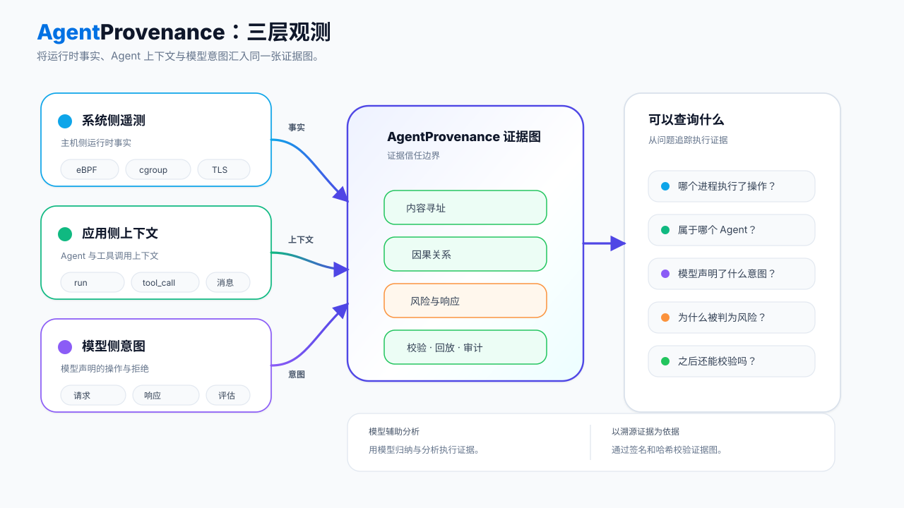
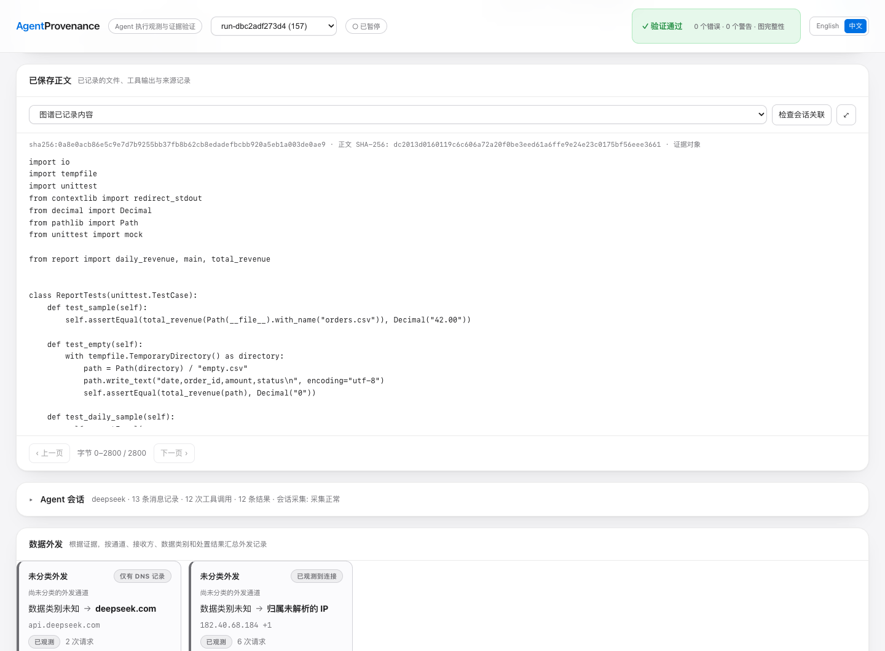
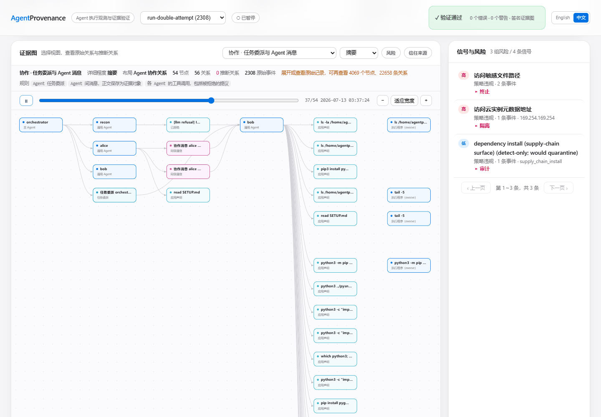
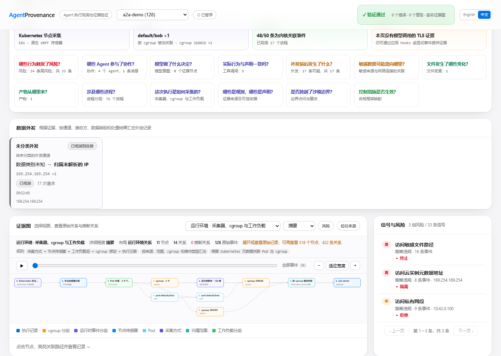
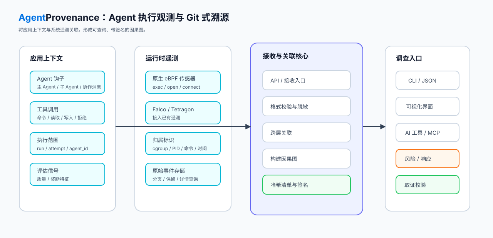

<div align="center">

[](https://ByteYellow.github.io/AgentProvenance/)

**直接体验 7 份签名回放，查看执行图谱、Agent 会话和文件正文。**
无需安装、注册或 API Key。

# AgentProvenance

### Agent 实际做了什么？从任务到文件和网络，一路追溯。

记录 Agent 的任务、对话和工具调用，关联它启动的进程、修改的文件与访问的网络。
查看执行过程，追溯产物来源，比较两次执行，再导出可离线验证的证据。

[](https://github.com/ByteYellow/AgentProvenance/releases/latest)
[](https://go.dev/)
[](https://github.com/ByteYellow/AgentProvenance/actions/workflows/ci.yml)
[](docs/zh-CN/amd64-kvm-k3s.md)
[](https://www.sqlite.org/)
[](LICENSE)

**[在线 Demo](https://ByteYellow.github.io/AgentProvenance/)** | **[快速开始](#快速开始)** | **[核心能力](#核心能力)** | **[Agent 会话](#agent-会话)** | **[演示](#演示)** | **[架构](#架构)** | **[文档](#功能与文档)**

[English](README.md) | 简体中文

</div>

---

**用类似 Git 的方式追溯 Agent 执行：记录 → 查看行为 → 追溯产物 → 比较执行 → 导出验证。**

AgentProvenance 把任务要求、工具返回结果和操作系统中的实际行为放到一起。
任务为什么失败、文件被谁改了、某次网络连接从何而来，都可以沿证据追查；
同一份记录也可以交给安全分析器或外部评估器使用。



<a id="当前能力"></a>
<a id="目录"></a>
<a id="为什么需要它"></a>
<a id="看清-ai-agent-的执行过程追溯每一步的来龙去脉"></a>

## 核心能力

| 能力 | 可以做什么 |
| --- | --- |
| 记录执行 | 包装启动 Agent 或普通命令，保存进程活动、工作区变化和受支持的会话记录 |
| 追踪行为来源 | 将任务、工具调用与进程、文件、网络事件关联，查看每条关联的依据 |
| 追溯文件与产物 | 通过 `graph explain`、`diff`、`blame` 查看改了什么，以及由哪次执行产生 |
| 查看 Agent 会话 | 阅读消息和工具结果，比较任务与配置快照，检查采集缺口 |
| 安全分析与阻断 | 应用策略、查看阻断决策、追踪敏感数据流，并与行为基线比较 |
| 分析多 Agent 协作 | 沿任务委派和协作消息，追踪归属于各 Agent 的执行行为 |
| 跨环境采集 | 支持 Linux amd64/arm64、KVM 虚拟机内部和 Kubernetes 节点采集，识别 Pod 与容器归属 |
| 回放与验证 | 导出内容寻址的证据，按需签名，分享可离线回放的执行记录 |
| 对接其他工具 | 通过 CLI/JSON、HTTP、Python 或 MCP 查询证据，将外部评估结果关联回同一次执行 |

可以用它调试 Coding Agent、审查生成的产物、调查异常行为，也可以为评测和审计提供执行依据。

**本页内容：**[快速开始](#快速开始) · [证据模型](#核心模型) ·
[Agent 会话](#agent-会话) · [可视化界面](#可视化界面) · [演示](#演示) ·
[运行时采集](#运行时采集) · [安全分析与外部评估](#安全分析与外部评估) ·
[架构](#架构) · [文档导航](#功能与文档)

## 快速开始

<a id="下载并回放无需安装-go"></a>

### 先回放一次真实执行

[打开在线 Demo](https://ByteYellow.github.io/AgentProvenance/)，直接在浏览器里查看
图谱、Agent 会话和文件正文，无需安装。同一站点也收录了示例图文说明和使用指南。

需要离线回放时，下载 CLI：

在[发行页](https://github.com/ByteYellow/AgentProvenance/releases)下载对应平台的
压缩包和同名 `.sha256` 校验文件。以下示例使用 v0.9.0。

| 平台 | 压缩包后缀 |
| --- | --- |
| Linux / WSL，x86-64 | `linux_amd64.tar.gz` |
| Linux / WSL，ARM64 | `linux_arm64.tar.gz` |
| macOS，Intel | `darwin_amd64.tar.gz` |
| macOS，Apple Silicon | `darwin_arm64.tar.gz` |

以 Linux x86-64 为例，下载后校验并解压：

```sh
sha256sum -c agentprov_v0.9.0_linux_amd64.tar.gz.sha256
mkdir agentprov-demo
tar -xzf agentprov_v0.9.0_linux_amd64.tar.gz -C agentprov-demo
cd agentprov-demo
./agentprov demo
```

macOS 使用对应的 `darwin` 包，并将校验命令换为 `shasum -a 256 -c`。
Windows 用户在 WSL 中运行 Linux 包。回放可以离线使用，
无需 Go、Docker、Agent 账号或 API Key。

[](https://ByteYellow.github.io/AgentProvenance/)

点击**打开回放**查看签名执行记录，点击**阅读指南**查看图文说明。
示例库共有 **7 份签名回放、9 篇指南**。建议先看新版的 DeepSeek 开发任务：

```sh
./agentprov demo deepseek-context
./agentprov demo multiagent-provenance
./agentprov demo --list
```

CLI 校验签名后，用独立的临时目录打开可视化界面。按 Ctrl-C 退出时清理该目录，
不会重新运行记录中的命令。无图形界面或远程机器可添加 `--no-browser`，
通过端口转发访问输出的本地地址。

如需从源码构建 v0.9.0，先安装 Go 1.23+：

```sh
git clone --branch v0.9.0 https://github.com/ByteYellow/AgentProvenance
cd AgentProvenance
go build -o agentprov ./cmd/agentprov
./agentprov demo
```

[全部示例](demo/README.zh-CN.md) · [发行包使用指南](docs/zh-CN/release-start.md)

<a id="记录你自己的-agent-执行"></a>

### 记录你自己的 Agent

先安装并登录你使用的 Agent，然后执行：

```sh
./agentprov doctor -- claude
./agentprov launch --file-diff -- claude
```

`doctor` 检查本机的采集环境。`launch` 启动 Agent 和可视化界面，
在 Agent 退出后整理会话记录。`--file-diff` 同时保存工作区变化和变更文件的最终正文。
Claude 使用仅对本次运行生效的 Hooks 配置，保留你的日常设置。

Codex 和 DeepSeek Harness 使用同样的入口：

```sh
./agentprov launch --file-diff -- codex
./agentprov launch --file-diff -- dsh headless --json 'Inspect the project and run its tests.'
```

Linux eBPF 采集需要传感器、受支持的内核和 BPF/perf 权限。
macOS 支持应用侧记录和回放。自定义会话目录、续跑及格式支持范围，
见 [Agent 会话指南](docs/zh-CN/agent-context.md)。

### 记录普通命令

不接入 Agent，也可以先记录一条命令：

```sh
mkdir -p /tmp/agentprov-record-demo
./agentprov record --run run-record-demo --workdir /tmp/agentprov-record-demo -- \
  sh -c 'echo artifact > artifact.txt'
./agentprov observe summary --run run-record-demo
./agentprov graph explain --run run-record-demo --file artifact.txt
```

`record` 保存命令、进程采样和工作区变化。运行 Linux 传感器后，可以加入内核事件；
接入受支持的会话适配器后，可以补充 Agent 上下文。本地记录和回放无需 Docker。

### 查看行为、追溯产物、导出证据

每次执行都有一个 Run ID。将下面的 ID 替换为记录完成后输出的值：

```sh
./agentprov observe summary --run RUN_ID
./agentprov graph explain --run RUN_ID --file path/to/artifact
./agentprov graph diff --run RUN_ID --file path/to/artifact
./agentprov graph blame --run RUN_ID --file path/to/artifact
./agentprov context coverage --run RUN_ID
./agentprov graph verify --run RUN_ID
./agentprov forensics export RUN_ID
```

在可视化界面中，可以从工具调用定位到运行时事件、打开已保存的文件正文，
也可以比较不同时间的任务或配置。执行差异和产物来源查询见[证据图命令](docs/zh-CN/graph-commands.md)。
如需给执行记录签名，在记录时添加 `--sign-key`；签名默认关闭。

<a id="证据分层"></a>
<a id="运行时事实与关联"></a>

## 核心模型

会话记录说明 Agent 接到了什么任务、调用了什么工具；运行时遥测记录进程、文件和网络中的实际行为。
AgentProvenance 再把这些信息与文件变化、最终产物关联起来：

```text
任务 / 对话 / Agent 委派
  → 工具调用
    → 进程与子进程
      → 文件访问 / 网络连接 / 运行时事件
        → 文件变化 / 产物 / 证据对象
```

| 证据层 | 来源 | 说明什么 |
| --- | --- | --- |
| 运行时事实 | 进程采样、文件差异、原生 eBPF 和兼容遥测接收器 | 进程做了什么、文件如何变化、网络连向哪里 |
| Agent 上下文 | 会话日志、Hooks 和显式上下文接入 | 任务、对话、工具、Agent 身份、委派关系与已记录的权限 |
| 模型请求与意图 | 受支持的会话格式和 TLS 明文探针 | 捕获到的请求、响应、声明的动作和拒绝行为 |

关联依据包括进程身份、cgroup、容器、工作目录、时间范围和已记录的工具标识，
不要求原始内核事件带有 `tool_call_id`。推断关系保留依据和置信度；
上下文缺失或归属不明确时，也会在结果中体现。

证据对象保存内容哈希和父引用。校验检查对象及其关联；可选签名让接收者能够用签名公钥验证证据包。
模型意图指采集到的消息和动作声明，不代表能读取模型内部的思考过程。

[完整证据模型](docs/zh-CN/capabilities.md#核心模型) ·
[关联与证据图查询](docs/zh-CN/graph-commands.md)

## Agent 会话

v0.9.0 将任务和对话放进执行证据页面。**执行图谱在上，Agent 会话在下，默认收起。**

| 视图 | 可以查看什么 |
| --- | --- |
| 对话与工具 | 用户与助手消息、工具输入、结果和错误，以及对应的来源记录和运行时证据 |
| 权限与配置 | 当时记录的任务、模型、工作目录、审批与沙箱设置；可以比较同一会话内或两次执行之间的快照 |
| 采集情况 | 读取了哪些会话、缺少哪些字段、哪里解析失败，以及运行时探针覆盖和关联缺口 |
| 已保存正文 | 在独立阅读区分页查看完整工具输出和文件内容；收起会话后仍可继续阅读 |


### 支持的 Agent

| Agent | 接入方式与可用上下文 |
| --- | --- |
| Claude Code | 本次运行的 Hooks 与原生会话：消息、工具、权限模式变化和会话元数据 |
| Codex | 原生 rollout 记录：消息、工具结果、线程配置和来源中记录的子线程标识 |
| DeepSeek Harness | v3 JSONL 和原生 v4 Zstandard 会话：消息、工具、PTC 子调用和配置 |
| Kimi / Grok | 已有受支持的会话格式与历史回放 |
| 其他命令或运行框架 | 通过 `record` 记录进程和文件；通过 Hooks、MCP 或显式接入补充任务与工具语义 |

支持显式指定自定义目录和续跑会话。增量导入保留来源位置，对重复记录去重；
任务与配置快照可以在同一次执行内或跨执行比较。
具体测试版本和日志格式见[兼容性表](docs/zh-CN/agent-context.md#原生格式兼容性)。

会话在 **Agent 退出后**整理。权限历史保存日志中实际记录的内容，缺少审批决定时显示“未记录”。
采集报告说明缺口，图谱与签名校验则分别检查相应的证据完整性。

[体验 DeepSeek 示例](demo/deepseek-context/README.zh-CN.md) ·
[会话命令与 API](docs/zh-CN/agent-context.md)

<a id="web-dashboard"></a>

## 可视化界面

可视化界面把执行图谱、时间线、进程树、网络活动、风险信号和已保存的证据放在一起，方便沿线索追查。

| 视图 | 用途 |
| --- | --- |
| 图谱浏览 | 按进程、文件与产物、网络、Agent 意图、协作关系、数据流和部署环境查看同一次执行 |
| 时间线与详情 | 按发生顺序浏览事件，选中节点后检查对应的来源证据 |
| Agent 会话 | 从工具结果跳转到关联图谱，查看任务、权限和配置历史 |
| 正文阅读区 | 分页阅读已保存的工具输出和文件内容，不依赖会话面板是否展开 |
| 采集与校验 | 检查会话采集情况、探针是否可用、关联缺口和完整性校验结果 |



查看自己的执行记录：

```sh
./agentprov dashboard serve
```

本地界面的页面资源内置于 CLI，无需外部网页服务。在线 Demo 为公开示例提供相同的只读浏览体验。
面对大量事件，界面先展示汇总关系，再按需展开详情，避免把全部原始事件堆在一张图里。

## 演示

<a id="demo关联多-agent-的任务委派协作消息与系统调用"></a>

### 追踪一次多 Agent 协作

一个 Agent 委派任务，协作消息引导另一个 Agent 安装被投毒的依赖。
沿消息和工具调用，可以追踪到这次执行对应的文件读取与网络连接；
记录中也保留了此前一次被拒绝的动作。



```sh
./agentprov demo multiagent-provenance
```

[查看完整调查过程](demo/multiagent-provenance/README.zh-CN.md)。共享进程中的 Agent 归属，
依据已记录的 Hooks 和命令证据进行推断。

<a id="demokubernetes-跨-pod-调用与事件归属"></a>

### 追踪跨 Pod 执行

一个节点传感器采集两个 Pod 的行为，保留各自的 cgroup 身份与 Kubernetes 元数据。
可以在同一张图里查看工作负载位置、跨 Pod 连接和执行端的运行时活动。



```sh
./agentprov demo k8s-cross-pod-a2a
```

网络与系统调用来自实机采集，委派 Hooks 复用了多 Agent 示例的记录。
[示例指南](demo/k8s-cross-pod-a2a/README.zh-CN.md)说明了这些来源如何关联。

<a id="demo追溯恶意依赖引发的文件读取与网络连接"></a>

### 全部示例

| 示例 | 可以重点看什么 |
| --- | --- |
| [DeepSeek 开发任务](demo/deepseek-context/README.zh-CN.md) | 原始任务、工具结果、配置历史、测试结果和最终文件正文 |
| [贪吃蛇供应链案例](demo/snake-supply-chain/README.zh-CN.md) | 被投毒的依赖、预置的测试凭据、网络活动与产物来源 |
| [多 Agent 协作](demo/multiagent-provenance/README.zh-CN.md) | 任务委派、同伴影响、拒绝动作与后续执行路径 |
| [Kubernetes 跨 Pod 调用](demo/k8s-cross-pod-a2a/README.zh-CN.md) | 一个节点上的证据如何连接不同工作负载 |
| [Kubernetes 部署视图](demo/k8s-substrate/README.zh-CN.md) | 容器身份与工作负载位置 |
| [Grok 代码外发调查](demo/grok-codebase-exfil/README.zh-CN.md) | 历史证据、相关行为报告和复现范围；回放入口为 `grok-codebase-exfil` |
| [Grok 三类外发路径](demo/grok-codebase-exfil/README.zh-CN.md) | 模型请求、厂商遥测和第三方分析；回放入口为 `grok-3routes` |
| [LLM Judge](demo/llm-judge/README.zh-CN.md) | 外部模型读取证据，返回附有证据引用的分析结果 |
| [Jev 评估器](demo/jev-judge/README.zh-CN.md) | 结构化评估、规则对比与人工复核 |

前面的七个回放入口均可离线体验。LLM Judge 和 Jev 是可选集成指南，
实时评估需要按各自说明配置模型服务。Grok 示例是有明确采集时间和复现范围的历史记录，
不代表其当前服务的行为。

<a id="基质与遥测"></a>
<a id="运行环境与遥测"></a>

## 运行时采集

原生传感器支持 Linux amd64、arm64 的进程、文件和网络事件采集。
可部署在 Linux 主机、**KVM 虚拟机内部**，或 Kubernetes/K3s 节点上。
Pod 元数据用于识别工作负载；事件先于绑定到达时，通过磁盘缓冲和补关联保留证据。
能力报告逐项说明当前环境可用的系统调用、DNS 和 TLS 采集路径。

| 环境 | 支持的用法 |
| --- | --- |
| Linux amd64 / arm64 | Agent 会话、命令记录、原生 eBPF 采集、查询与回放 |
| KVM Linux 虚拟机 | 使用虚拟机自己的内核与进程信息，在虚拟机内采集 |
| Kubernetes / K3s | 节点级传感器，结合 Pod、容器身份及生命周期进行归属关联 |
| macOS Intel / Apple Silicon | Agent 会话、命令与文件记录、查询及回放 |
| Windows | 在 WSL 中运行 Linux 工具；内核采集取决于 WSL 内核和权限 |

[KVM/K3s 部署与 TLS 支持](docs/zh-CN/amd64-kvm-k3s.md) ·
[持久化采集](docs/zh-CN/native-capture-spool.md) ·
[Kubernetes 事件归属](docs/zh-CN/design-k8s-auto-attribution.md)

TLS 自动发现会跟踪受支持的 OpenSSL 库和 Go 二进制，也会处理容器重建后的目标变化。
Go TLS 响应采集目前支持 **amd64、有符号信息的 Go 1.23–1.26 二进制**。
ARM64 Go 响应采集、BoringSSL 和任意自定义 TLS 实现尚未覆盖。
实际挂载了哪些探针，可查看当前机器的能力报告。

<a id="部署模式"></a>
<a id="本地服务daemon模式"></a>

### 部署方式

| 方式 | 如何运行 | 适用场景 |
| --- | --- | --- |
| 本地 CLI | 一个 CLI，配合本地 SQLite 数据库和证据对象 | 开发调试、离线回放、CI 任务与评估器 |
| 本地服务 / Sidecar | 服务运行在工作节点或沙箱宿主机旁，提供接收和查询接口 | 本机共享查询、带缓冲的事件接收 |
| Kubernetes 节点采集 | 在需要采集的节点运行传感器，关联工作负载身份 | Kubernetes/K3s 中的多工作负载采集 |

传感器部署在需要观测的 Linux 主机或虚拟机内部。AgentProvenance 使用已有的运行与编排环境，
不负责创建虚拟机或替代 Kubernetes。Falco/Tetragon 接收器保留兼容支持；
中心化、多租户的证据服务仍属于后续设计。

<a id="ai-可调用的证据工具"></a>
<a id="合规映射"></a>
<a id="合规证据而非合规认证"></a>
<a id="外部评估器协议"></a>
<a id="安全证据命令"></a>
<a id="安全闭环"></a>
<a id="实例让-llm-分析安全证据"></a>
<a id="意图一致性"></a>
<a id="用-python-写自定义规则"></a>

## 安全分析与外部评估

通过策略和行为基线，检查异常凭据访问、网络外发和进程活动。
证据图把风险关联到工具、进程与产物，数据流视图展示可能的敏感数据传播路径。
意图比较可以检查声明动作与实际行为之间的差异，包括已经拒绝、却仍发生的动作。

```sh
./agentprov security risks --run RUN_ID
./agentprov policy decisions --run RUN_ID
./agentprov security responses --run RUN_ID
./agentprov intent diff --run RUN_ID
```

阻断通过对应的策略门禁或响应集成生效，决策和响应历史记录要求采取的动作与实际结果。
导入历史证据不会阻断已经完成的操作。OWASP Agentic 和 NIST 映射则说明哪些控制项有证据支持，
哪些地方仍有缺口。

外部评估器可以读取执行轨迹、评分，再将带有证据引用的信号写回。
LLM Judge 和 Jev 提供了这种接入示例；具体评分与奖励规则由评测或训练系统决定。

```sh
./agentprov signal context --run RUN_ID
./agentprov ai tools --provider openai
./agentprov ai mcp
```

其他工具可通过 CLI/JSON、HTTP API、Python SDK 或 MCP 使用证据。
MCP 还提供动作预检和显式上下文写入；写入 Agent 上下文不会执行动作或生成内核遥测。

[安全命令](docs/zh-CN/security-commands.md) · [合规映射](docs/zh-CN/compliance.md) ·
[AI 工具与 MCP](docs/zh-CN/ai-tools.md) · [Python SDK](docs/zh-CN/python-sdk.md)

<a id="与现有系统的关系"></a>
<a id="仓库结构"></a>
<a id="边界"></a>

## 架构



1. **采集**会话日志、Hooks、命令与文件变化，以及运行时事件。
2. **统一格式并关联归属**，识别对应的执行、工具范围、进程和工作负载；
   进行敏感信息脱敏，并按配置对事件流做缓冲。
3. **保存证据**到 SQLite 和内容寻址对象，保留来源标识、历史版本及推断关系的依据。
4. **查询与交换**，通过图谱、时间线、CLI、API、签名包和只读回放使用证据；
   安全规则与外部评估器把结论关联回相应记录。

默认部署由本地 CLI / 服务和可选的高权限传感器组成，无需搭建云端控制平台。

| 代码位置 | 职责 |
| --- | --- |
| `internal/launch`、`record`、`hooksbridge`、`agentcontext` | 启动执行，采集 Agent 上下文 |
| `internal/sensor`、`producer`、`telemetry` | 原生采集、工作负载身份和事件接收 |
| `internal/correlation`、`provenance`、`store` | 归属关联、证据图、内容对象与持久化 |
| `internal/security`、`signals`、`attest`、`forensics` | 分析、外部结果、签名与导出 |
| `internal/cli`、`dashboard`、`daemon`、`mcpserver` | 用户界面与集成接口 |

类 Git 溯源用于查看历史、比较差异、追查来源和校验证据，不会撤销已发生的外部操作。
哈希和签名检查已保存的记录，采集报告另行说明实际观察到什么、遗漏了什么。

[完整架构与仓库结构](docs/zh-CN/capabilities.md#架构) ·
[与其他系统的关系](docs/zh-CN/comparisons.md)

<a id="graph-命令"></a>
<a id="证据图命令"></a>

## 功能与文档

新增会话区域与原有时间线、进程树、网络、风险信号、数据流和规则覆盖视图一起使用。
安全分析与外部评估器读取同一份执行证据。

| 想做什么 | 对应指南 |
| --- | --- |
| 追踪工具、文件来源和执行差异 | [证据图命令](docs/zh-CN/graph-commands.md) |
| 采集会话、比较历史配置 | [Agent 会话](docs/zh-CN/agent-context.md) |
| 排查风险、应用策略、查看阻断决策 | [安全命令](docs/zh-CN/security-commands.md) |
| 查看控制项映射与规则覆盖 | [合规映射](docs/zh-CN/compliance.md) |
| 让其他程序查询证据 | [HTTP API](docs/zh-CN/openapi.yaml)、[会话 API](docs/agent-context-api.yaml)、[Python SDK](docs/zh-CN/python-sdk.md) |
| 让 Agent 使用证据查询工具 | [AI 工具与 MCP](docs/zh-CN/ai-tools.md) |
| 接入外部评估器 | [LLM Judge](demo/llm-judge/README.zh-CN.md)、[Jev](demo/jev-judge/README.zh-CN.md) |
| 了解部署方式和内部架构 | [部署模式](docs/zh-CN/deployment-modes.md)、[功能与架构参考](docs/zh-CN/capabilities.md) |

网页首次打开时跟随浏览器语言，其他语言回退到英文；手动切换后保留选择。
CLI 和工具输出默认英文，原始证据不翻译。

<a id="roadmap"></a>
<a id="核心-demo-验收"></a>
<a id="版本进展与后续计划"></a>

## 版本进展

v0.9.0 完善 Agent 会话，新增 DeepSeek Harness 接入、任务与配置历史、采集报告和正文阅读。
完整只读 Demo 与中英文文档也可以直接在网页体验。

升级前请备份数据目录；升级后的数据库不支持直接用旧版程序打开。
macOS 包尚未经过 Apple 公证；下载校验和用于检查压缩包完整性。

[发行说明](docs/zh-CN/releases/v0.9.0.md) · [变更记录](CHANGELOG.zh-CN.md) ·
[验证记录](docs/benchmarks/v0.9.0-acceptance/README.zh-CN.md) ·
[后续方向](docs/zh-CN/capabilities.md#后续方向)

## 开发

```sh
go test -race ./...
go vet ./...
gofmt -l internal cmd

# 可在本地运行的端到端证据与验证冒烟测试。
./scripts/accept_phase1.sh
```

[CI](.github/workflows/ci.yml)运行上述检查，并验证 Linux amd64/arm64 静态构建、
原生 eBPF 绑定文件是否与源代码一致、本地服务在故障时的就绪状态，以及
Go 1.23–1.26 下的 amd64 系统调用、OpenSSL 和 Go TLS 采集。
ARM64 实机与 KVM/K3s 实验环境的验收结果另有报告，不等同于托管 CI 的覆盖范围。

各验收脚本的环境要求不同。部分脚本需要 root、会创建 Pod 或安装服务，
请勿直接批量执行全部 `scripts/accept_*.sh`。
环境测试请按 [KVM/K3s 部署指南](docs/zh-CN/amd64-kvm-k3s.md)操作，
单节点压力测试见[收尾指南](docs/zh-CN/project-closeout.md)。

## 作者与许可

由 [ByteYellow](https://github.com/ByteYellow) 开发和维护。

采用 Apache License 2.0 许可证，详见 [LICENSE](LICENSE)。
Copyright 2026 ByteYellow。

---

> 本文为 [README.md](README.md) 的中文说明；如有内容差异，以英文版为准。
