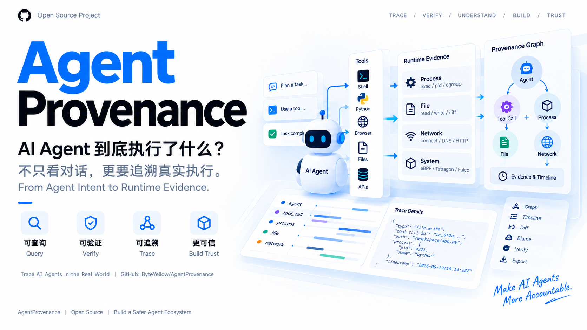
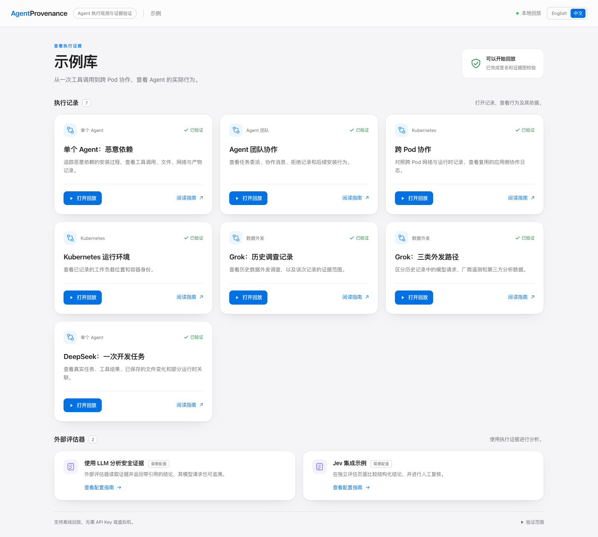
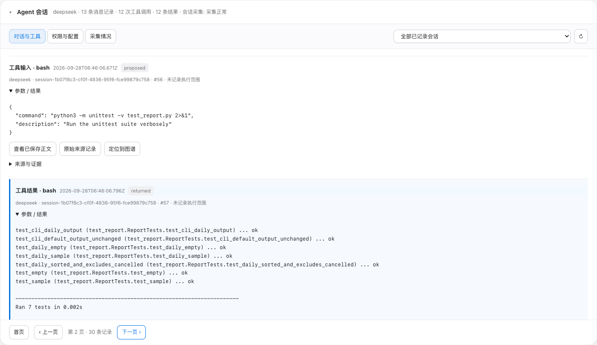

<p align="center">
  
</p>

<div align="center">

# AgentProvenance

### Agent 实际做了什么？从任务到文件和网络，一路追溯。

记录 Agent 的任务、对话和工具调用，关联它启动的进程、修改的文件与访问的网络。
查看执行过程，追溯产物来源，比较两次执行，再导出可离线验证的证据。

[](https://github.com/ByteYellow/AgentProvenance/releases/latest)
[](https://go.dev/)
[](https://github.com/ByteYellow/AgentProvenance/actions/workflows/ci.yml)
[](docs/zh-CN/amd64-kvm-k3s.md)
[](https://www.sqlite.org/)
[](LICENSE)

**[快速开始](#快速开始)** | **[Agent 会话](#agent-会话)** | **[功能与文档](#功能与文档)** | **[全部示例](demo/README.zh-CN.md)** | **[v0.9.0](docs/zh-CN/releases/v0.9.0.md)**

[English](README.md) | 简体中文

</div>

---

**用类似 Git 的方式追溯 Agent 执行：记录 → 查看行为 → 追溯产物 → 比较执行 → 导出验证。**

AgentProvenance 把任务要求、工具返回结果和操作系统中的实际行为放到一起。
任务为什么失败、文件被谁改了、某次网络连接从何而来，都可以沿证据追查；
同一份记录也可以交给安全分析器或外部评估器使用。

## 快速开始

### 先回放一次真实执行

在[发行页](https://github.com/ByteYellow/AgentProvenance/releases)下载对应平台的
压缩包和同名 `.sha256` 校验文件。以下示例对应 v0.9.0；正式发布前，
可使用下面的源码构建步骤体验新版功能。

| 平台 | 压缩包后缀 |
| --- | --- |
| Linux / WSL，x86-64 | `linux_amd64.tar.gz` |
| Linux / WSL，ARM64 | `linux_arm64.tar.gz` |
| macOS，Intel | `darwin_amd64.tar.gz` |
| macOS，Apple Silicon | `darwin_arm64.tar.gz` |

以 Linux x86-64 为例，下载后校验并解压：

```sh
sha256sum -c agentprov_v0.9.0_linux_amd64.tar.gz.sha256
mkdir agentprov-demo
tar -xzf agentprov_v0.9.0_linux_amd64.tar.gz -C agentprov-demo
cd agentprov-demo
./agentprov demo
```

macOS 使用对应的 `darwin` 包，并将校验命令换为 `shasum -a 256 -c`。
Windows 用户在 WSL 中运行 Linux 包。回放可以离线使用，
无需 Go、Docker、Agent 账号或 API Key。



点击**打开回放**查看签名执行记录，点击**阅读指南**查看图文说明。
示例库共有 **7 份签名回放、9 篇指南**。建议先看新版的 DeepSeek 开发任务：

```sh
./agentprov demo deepseek-context
./agentprov demo multiagent-provenance
./agentprov demo --list
```

CLI 校验签名后，用独立的临时目录打开可视化界面。按 Ctrl-C 退出时清理该目录，
不会重新运行记录中的命令。无图形界面或远程机器可添加 `--no-browser`，
通过端口转发访问输出的本地地址。

如需构建当前待发布分支，先安装 Go 1.23+：

```sh
git clone --branch fix/v0.9.0-acceptance https://github.com/ByteYellow/AgentProvenance
cd AgentProvenance
go build -o agentprov ./cmd/agentprov
./agentprov demo
```

[全部示例](demo/README.zh-CN.md) · [发行包使用指南](docs/zh-CN/release-start.md)

### 记录你自己的 Agent

先安装并登录你使用的 Agent，然后执行：

```sh
./agentprov doctor -- claude
./agentprov launch --file-diff -- claude
```

`doctor` 检查本机的采集环境。`launch` 启动 Agent 和可视化界面，
在 Agent 退出后整理会话记录。`--file-diff` 同时保存工作区变化和变更文件的最终正文。
Claude 使用仅对本次运行生效的 Hooks 配置，保留你的日常设置。

Codex 和 DeepSeek Harness 使用同样的入口：

```sh
./agentprov launch --file-diff -- codex
./agentprov launch --file-diff -- dsh headless --json 'Inspect the project and run its tests.'
```

Linux eBPF 采集需要传感器、受支持的内核和 BPF/perf 权限。
macOS 支持应用侧记录和回放。自定义会话目录、续跑及格式支持范围，
见 [Agent 会话指南](docs/zh-CN/agent-context.md)。

### 查看行为、追溯产物、导出证据

每次执行都有一个 Run ID。将下面的 ID 替换为记录完成后输出的值：

```sh
./agentprov observe summary --run RUN_ID
./agentprov graph explain --run RUN_ID --file path/to/artifact
./agentprov context coverage --run RUN_ID
./agentprov graph verify --run RUN_ID
./agentprov forensics export RUN_ID
```

在可视化界面中，可以从工具调用定位到运行时事件、打开已保存的文件正文，
也可以比较不同时间的任务或配置。执行差异和产物来源查询见[证据图命令](docs/zh-CN/graph-commands.md)。
如需给执行记录签名，在记录时添加 `--sign-key`；签名默认关闭。

## Agent 会话

v0.9.0 将任务和对话放进执行证据页面。**执行图谱在上，Agent 会话在下，默认收起。**

| 视图 | 可以查看什么 |
| --- | --- |
| 对话与工具 | 用户与助手消息、工具输入、结果和错误，以及对应的来源记录和运行时证据 |
| 权限与配置 | 当时记录的任务、模型、工作目录、审批与沙箱设置；可以比较同一会话内或两次执行之间的快照 |
| 采集情况 | 读取了哪些会话、缺少哪些字段、哪里解析失败，以及运行时探针覆盖和关联缺口 |
| 已保存正文 | 在独立阅读区分页查看完整工具输出和文件内容；收起会话后仍可继续阅读 |



Claude Code 和 Codex 接入原生会话记录；DeepSeek Harness 支持 v3 JSONL 和原生 v4
Zstandard 日志；已有的 Kimi/Grok 会话适配继续可用。
具体版本与格式见[兼容性表](docs/zh-CN/agent-context.md#原生格式兼容性)。

会话在 **Agent 退出后**整理。权限历史保存日志中实际记录的内容，缺少审批决定时显示“未记录”。
采集报告说明缺口，图谱与签名校验则分别检查相应的证据完整性。

[体验 DeepSeek 示例](demo/deepseek-context/README.zh-CN.md) ·
[会话命令与 API](docs/zh-CN/agent-context.md)

## 运行时采集

原生传感器支持 Linux amd64、arm64 的进程、文件和网络事件采集。
可部署在 Linux 主机、**KVM 虚拟机内部**，或 Kubernetes/K3s 节点上。
Pod 元数据用于识别工作负载；事件先于绑定到达时，通过磁盘缓冲和补关联保留证据。
能力报告逐项说明当前环境可用的系统调用、DNS 和 TLS 采集路径。

| 环境 | 支持的用法 |
| --- | --- |
| Linux amd64 / arm64 | Agent 会话、命令记录、原生 eBPF 采集、查询与回放 |
| KVM Linux 虚拟机 | 使用虚拟机自己的内核与进程信息，在虚拟机内采集 |
| Kubernetes / K3s | 节点级传感器，结合 Pod、容器身份及生命周期进行归属关联 |
| macOS Intel / Apple Silicon | Agent 会话、命令与文件记录、查询及回放 |
| Windows | 在 WSL 中运行 Linux 工具；内核采集取决于 WSL 内核和权限 |

[KVM/K3s 部署与 TLS 支持](docs/zh-CN/amd64-kvm-k3s.md) ·
[持久化采集](docs/zh-CN/native-capture-spool.md) ·
[Kubernetes 事件归属](docs/zh-CN/design-k8s-auto-attribution.md)

<a id="ai-可调用的证据工具"></a>
<a id="demokubernetes-跨-pod-调用与事件归属"></a>
<a id="demo关联多-agent-的任务委派协作消息与系统调用"></a>
<a id="demo追溯恶意依赖引发的文件读取与网络连接"></a>
<a id="graph-命令"></a>
<a id="roadmap"></a>
<a id="web-dashboard"></a>
<a id="下载并回放无需安装-go"></a>
<a id="与现有系统的关系"></a>
<a id="为什么需要它"></a>
<a id="仓库结构"></a>
<a id="可视化界面"></a>
<a id="合规映射"></a>
<a id="合规证据而非合规认证"></a>
<a id="基质与遥测"></a>
<a id="外部评估器协议"></a>
<a id="安全证据命令"></a>
<a id="安全闭环"></a>
<a id="实例让-llm-分析安全证据"></a>
<a id="当前能力"></a>
<a id="意图一致性"></a>
<a id="本地服务daemon模式"></a>
<a id="架构"></a>
<a id="核心-demo-验收"></a>
<a id="核心模型"></a>
<a id="版本进展与后续计划"></a>
<a id="用-python-写自定义规则"></a>
<a id="目录"></a>
<a id="看清-ai-agent-的执行过程追溯每一步的来龙去脉"></a>
<a id="记录你自己的-agent-执行"></a>
<a id="记录普通命令"></a>
<a id="证据分层"></a>
<a id="证据图命令"></a>
<a id="边界"></a>
<a id="运行时事实与关联"></a>
<a id="运行环境与遥测"></a>
<a id="部署模式"></a>

## 功能与文档

新增会话区域与原有时间线、进程树、网络、风险信号、数据流和规则覆盖视图一起使用。
安全分析与外部评估器读取同一份执行证据。

| 想做什么 | 对应指南 |
| --- | --- |
| 追踪工具、文件来源和执行差异 | [证据图命令](docs/zh-CN/graph-commands.md) |
| 采集会话、比较历史配置 | [Agent 会话](docs/zh-CN/agent-context.md) |
| 排查风险、应用策略、查看阻断决策 | [安全命令](docs/zh-CN/security-commands.md) |
| 查看控制项映射与规则覆盖 | [合规映射](docs/zh-CN/compliance.md) |
| 让其他程序查询证据 | [HTTP API](docs/zh-CN/openapi.yaml)、[会话 API](docs/agent-context-api.yaml)、[Python SDK](docs/zh-CN/python-sdk.md) |
| 让 Agent 使用证据查询工具 | [AI 工具与 MCP](docs/zh-CN/ai-tools.md) |
| 接入外部评估器 | [LLM Judge](demo/llm-judge/README.zh-CN.md)、[Jev](demo/jev-judge/README.zh-CN.md) |
| 了解部署方式和内部架构 | [部署模式](docs/zh-CN/deployment-modes.md)、[功能与架构参考](docs/zh-CN/capabilities.md) |

网页首次打开时跟随浏览器语言，其他语言回退到英文；手动切换后保留选择。
CLI 和工具输出默认英文，原始证据不翻译。

## 版本进展

**v0.9.0 已完成验收，等待发布前审阅。** 本次验收覆盖已有会话适配器、DeepSeek、
续跑与去重、配置历史、采集报告、完整正文和可视化交互。

[验收报告](docs/benchmarks/v0.9.0-acceptance/README.zh-CN.md)记录了 485 项浏览器检查、
六份历史签名包、数据库 17→19 升级，以及 x86 KVM/K3s 和 TLS 实测。
远端 CI 与四个平台的便携包构建均已通过。此前暂缓的 24 小时长稳测试仍未开展，
本轮未重复 ARM 实机验收。

升级前请备份数据目录；升级后的数据库不支持直接用旧版程序打开。
macOS 包尚未经过 Apple 公证；下载校验和用于检查压缩包完整性。

[发行说明](docs/zh-CN/releases/v0.9.0.md) · [变更记录](CHANGELOG.zh-CN.md)

## 开发

```sh
go test -race ./...
go vet ./...
gofmt -l internal cmd

# 可在本地运行的端到端证据与验证冒烟测试。
./scripts/accept_phase1.sh
```

[CI](.github/workflows/ci.yml)运行上述检查，并验证 Linux amd64/arm64 静态构建、
原生 eBPF 绑定文件是否与源代码一致、本地服务在故障时的就绪状态，以及
Go 1.23–1.26 下的 amd64 系统调用、OpenSSL 和 Go TLS 采集。
ARM64 实机与 KVM/K3s 实验环境的验收结果另有报告，不等同于托管 CI 的覆盖范围。

各验收脚本的环境要求不同。部分脚本需要 root、会创建 Pod 或安装服务，
请勿直接批量执行全部 `scripts/accept_*.sh`。
环境测试请按 [KVM/K3s 部署指南](docs/zh-CN/amd64-kvm-k3s.md)操作，
单节点压力测试见[收尾指南](docs/zh-CN/project-closeout.md)。

## 作者与许可

由 [ByteYellow](https://github.com/ByteYellow) 开发和维护。

采用 Apache License 2.0 许可证，详见 [LICENSE](LICENSE)。
Copyright 2026 ByteYellow。

---

> 本文为 [README.md](README.md) 的中文说明；如有内容差异，以英文版为准。
