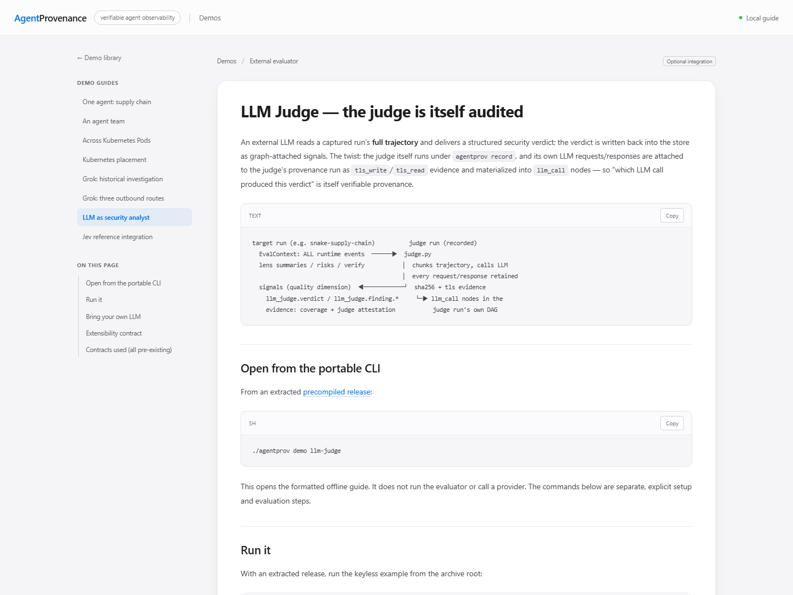

# AgentProvenance demos

English | [中文](README.zh-CN.md)

Start with a single agent, then follow a team and a cross-pod execution. The
committed compressed bundles can be imported, verified and explored on macOS or
Linux without rerunning the agents. Live capture has separate environment and
credential requirements in each demo's README.

## One-command entry

Download the matching Linux/macOS amd64/arm64 archive from
[v0.8.2-rc.2](https://github.com/ByteYellow/AgentProvenance/releases/tag/v0.8.2-rc.2),
verify its checksum and extract it as shown in the [Quickstart](../README.md#quickstart).
Go is needed only if you choose to build from source.
The precompiled CLI embeds every signed capture and all demo guides:

```sh
./agentprov demo                         # gallery: all demos
./agentprov demo --list                  # list replay names and setup guides
./agentprov demo snake-supply-chain      # one signed capture
./agentprov demo multiagent-provenance
./agentprov demo k8s-cross-pod-a2a
./agentprov demo k8s-substrate
./agentprov demo grok-codebase-exfil
./agentprov demo grok-3routes
./agentprov demo llm-judge                # offline setup guide; no provider call
./agentprov demo jev-judge                # offline setup guide; no provider call
```

**Open replay** opens a signed run in the dashboard. **Read guide** opens a
formatted local guide with section navigation, images, tables and code-copy
buttons. The gallery and reader share the dashboard theme and fit narrow screens.


Guide text and embedded images work offline; links to additional repository files
or external services need a network connection when followed.

Signatures are checked before import and the graph is verified before serving.
The browser selects the Run/lens and starts playback when the lens has timed events; placement lenses show their topology. Each invocation uses a
fresh temporary store, removed on Ctrl-C; it ignores ambient daemon settings.
Explicit `--data-dir` or `--daemon-url` is rejected to prevent confusion with
normal data. `--no-browser` prints a URL; `--json` also reports verification.

All original example sources ship in the archive's `demo/` directory. For the
keyless LLM Judge flow with the precompiled CLI, from the extracted directory:

```sh
AGENTPROV_BIN="$PWD/agentprov" python3 demo/llm-judge/judge.py run --offline
```

Jev's guide supports the supplied CLI through `--agentprov`; a source build is
optional. Its live capture still requires Python, credentials and explicit consent.

## 1. One agent: supply-chain execution

[Snake supply-chain demo](snake-supply-chain/) follows a real coding agent that
installs a poisoned local package while building a game. Its install hook reads
planted fake secrets and attempts a metadata-IP connection. The graph joins the
tool call, process, file activity, network activity and artifact.

Bundle: `run-snake-supervised`. Start with **Agent Intent**, then **Data Flow**
and the artifact evidence. Captured transcript content supplies model messages
and declared tool actions; it is not access to the model's internal reasoning.

## 2. An agent team: delegation and peer influence

[Multi-agent demo](multiagent-provenance/) adds delegation, peer messages and
two attempts. One proposed action is refused; the later install path produces
real sensitive-file and network events. The **Agent Network / Orchestration**
view shows the team, while command-match correlation links execution evidence
to the acting agent. Shared-process attribution is an inference with evidence,
not a separate kernel identity for each sub-agent.

Bundle: `run-double-attempt`. Open it with `agentprov demo multiagent-provenance`
or choose **Agent team** in the [Quickstart gallery](../README.md#quickstart).

## 3. Across Pods: one sensor, separate workload identities

[Kubernetes cross-pod A2A demo](k8s-cross-pod-a2a/) moves the execution into two
Pods. One node sensor records the real network call and the worker's syscalls,
preserving each Pod's cgroup and Kubernetes metadata in one graph.

Use **Substrate** to inspect placement and **Orchestration** to follow the peer
relationship. The app delegation hook log is replayed from the multi-agent
capture; the cross-pod network and runtime events were collected live. These
are distinct evidence sources, not a claim that the entire team was recaptured.

## Additional placement example

[Kubernetes substrate](k8s-substrate/) focuses on container identity and placement.
Use `agentprov demo k8s-substrate` to open the Substrate lens without Kubernetes.

## Additional investigations

- [Grok outbound-data investigation](grok-codebase-exfil/): dated captures
  distinguish sensitive content in model requests, vendor telemetry and
  third-party product analytics. The README separately documents the historical
  codebase-upload report, missing wire evidence and reproduction limits. Do not
  treat this fixture as proof of the vendor's current behavior.

## Optional external evaluator examples

These examples consume execution evidence and return analysis through the
existing signal contract. Provider integration and review workflows stay outside
the core product; neither example is required to capture or inspect a run.

- [LLM as security analyst](llm-judge/): an external evaluator reads graph
  evidence and returns referenced signals. Its own request can also be audited.
  Live mode needs a compatible model endpoint; the keyless fixture validates
  the integration flow, not a real model verdict.
- [Jev reference integration](jev-judge/): typed decisions over selected capture
  evidence, with a standalone demo UI for rule comparison and human review.
  Reviewed results can be exported for explicit `signal import`. Live evaluation
  needs a key and raw-evidence consent; reopening a completed study is offline.
  The UI is not part of `agentprov dashboard` or a policy-deployment service.

## Manual import and comparison

Use this advanced path when you want a persistent data directory or want to compare
your own runs. For a first look, use `agentprov demo` above.

Each demo README names the exact bundle and matching public key. The common
workflow is:

```sh
agentprov --data-dir /tmp/view init
agentprov --data-dir /tmp/view forensics import <folder>/<run>.forensics.json.gz \
  --pub-key <folder>/attestation.pub
agentprov --data-dir /tmp/view graph verify --run <run>
agentprov --data-dir /tmp/view dashboard serve --addr 127.0.0.1:7396
```

Import multiple bundles into the same data directory and switch runs in the
dashboard. Verification checks preserved evidence and its signature against the
supplied key; it does not certify complete capture or every derived causal claim.

Capture scripts and prerequisites are documented under each demo directory.
Keep regenerated raw `*.forensics.json` exports local; publish large captures
as release assets rather than growing Git history.
