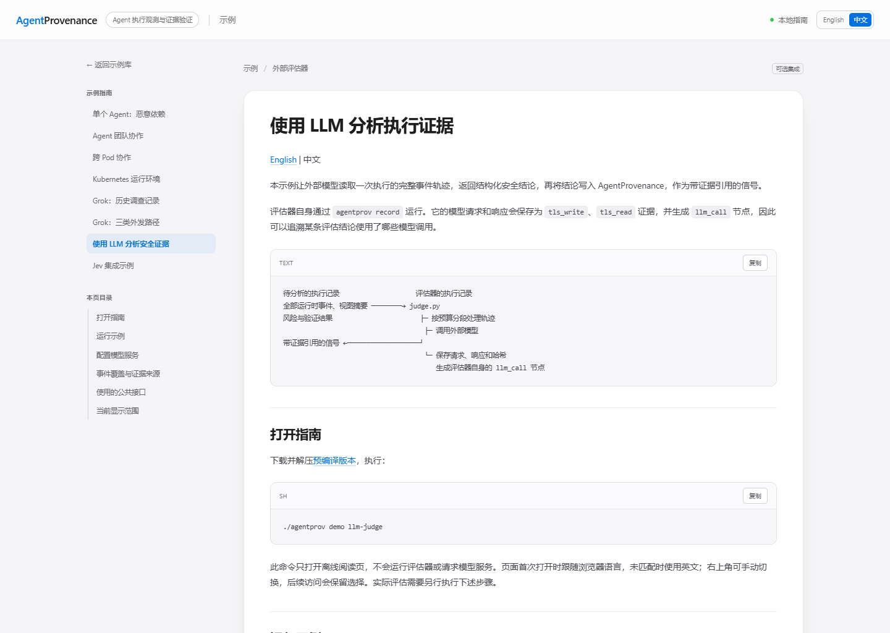

# AgentProvenance 示例

[English](README.md) | 中文

从单个 Agent 开始，再查看团队协作和跨 Pod 执行。仓库中的压缩证据包可在 macOS 或 Linux 上导入、校验和浏览，无需重新运行 Agent。重新采集所需的环境与凭据，见各示例说明。

## 一条命令打开

从 [v0.8.2-rc.2 发行页](https://github.com/ByteYellow/AgentProvenance/releases/tag/v0.8.2-rc.2)下载对应 Linux/macOS、amd64/arm64 的压缩包，按[快速开始](../README.zh-CN.md#快速开始)校验并解压。只有自行从源码构建时才需要 Go。预编译 CLI 内嵌全部签名采集记录和示例指南：

```sh
./agentprov demo                         # 打开全部示例
./agentprov demo --list                  # 列出回放名称和接入指南
./agentprov demo snake-supply-chain      # 打开一份签名采集记录
./agentprov demo multiagent-provenance
./agentprov demo k8s-cross-pod-a2a
./agentprov demo k8s-substrate
./agentprov demo grok-codebase-exfil
./agentprov demo grok-3routes
./agentprov demo llm-judge                # 离线接入指南，不调用服务商
./agentprov demo jev-judge                # 离线接入指南，不调用服务商
```

“打开回放”（Open replay）在 Dashboard 中打开签名执行记录。“阅读指南”（Read guide）打开排版后的本地说明，包含章节目录、图片、表格和代码复制按钮。示例首页与阅读页沿用 Dashboard 风格，支持窄屏。rc.2 使用英文按钮；后续中文版的入口和布局相同。



指南正文和内嵌图片可以离线使用；点击额外的仓库文件或外部服务链接时需要联网。

导入前会校验签名，启动页面前会校验证据图。浏览器自动选择执行记录和视图；含时间事件的视图开始播放，部署关系视图展示拓扑。每次启动使用独立临时存储，按 Ctrl-C 后删除，不受环境中的后台服务设置影响。为避免与日常数据混淆，该命令不接受显式 `--data-dir` 或 `--daemon-url`。`--no-browser` 只输出地址，`--json` 还会报告校验结果。工具输出默认英文。

发行包的 `demo/` 目录包含全部原始示例源码。使用预编译 CLI 运行无需密钥的 LLM Judge 流程，可在解压目录执行：

```sh
AGENTPROV_BIN="$PWD/agentprov" python3 demo/llm-judge/judge.py run --offline
```

Jev 示例可通过 `--agentprov` 使用包内 CLI，无需自行构建。在线评估需要 Python 和模型接口凭据。

## 1. 单个 Agent：供应链执行

[贪吃蛇供应链示例](snake-supply-chain/README.zh-CN.md)记录真实 Coding Agent 在开发游戏时安装被植入恶意逻辑的本地包。安装钩子读取预置的模拟秘密，并尝试连接元数据 IP。证据图关联工具调用、进程、文件、网络活动和产物。

执行记录为 `run-snake-supervised`。先查看“Agent 意图”，再查看“数据流”和产物证据。模型消息和工具调用可与实际执行逐项对照。

## 2. Agent 团队：委托与同伴影响

[多 Agent 示例](multiagent-provenance/README.zh-CN.md)增加委托、同伴消息和两次尝试。第一次提议被拒绝，后续安装路径产生真实的敏感文件读取和网络事件。“Agent 网络／编排”视图展示团队关系；命令匹配将执行证据关联到对应 Agent。

执行记录为 `run-double-attempt`。可运行 `agentprov demo multiagent-provenance`，或在[快速开始](../README.zh-CN.md#快速开始)的示例首页选择“Agent 团队”。

## 3. 跨 Pod：一个传感器，不同工作负载身份

[Kubernetes 跨 Pod A2A 示例](k8s-cross-pod-a2a/README.zh-CN.md)将执行放到两个 Pod 中。一个节点传感器记录真实网络调用和工作 Pod 的系统调用，在同一张图中保留各 Pod 的 cgroup 与 Kubernetes 元数据。

通过“运行环境”查看部署位置，通过“编排”追踪协作关系。应用委托 hook 日志复用多 Agent 采集记录，跨 Pod 网络及运行时事件则来自实际采集。

## 其他部署示例

[Kubernetes 运行环境示例](k8s-substrate/README.zh-CN.md)侧重容器身份和部署位置。运行 `agentprov demo k8s-substrate` 即可打开对应视图，无需 Kubernetes。

## 其他调查示例

[Grok 外发数据调查](grok-codebase-exfil/README.zh-CN.md)按采集日期区分模型请求中的敏感内容、厂商遥测和第三方产品分析。版本、采集过程和复现情况见指南。

## 可选外部评估器

这些示例读取执行证据，通过现有信号接口返回分析。服务商接入和评审流程独立于核心产品；采集或查看执行记录无需安装它们。

- [LLM 安全分析器](llm-judge/README.zh-CN.md)：外部评估器读取图证据，返回带引用的信号；评估器自己的请求也可供审计。在线模式需要兼容模型接口；离线模式使用预设结果演示接入流程。
- [Jev 接入示例](jev-judge/README.zh-CN.md)：对选定证据作出带类型约束的判断，提供独立页面比较规则、进行人工评审。评审结果可导出，再显式执行 `signal import`。在线评估需要密钥，并会向服务商发送选定证据；已完成研究可离线重开。

## 手动导入与比较

需要保留数据目录或比较自己的执行记录时，可使用以下流程。首次体验直接运行前面的 `agentprov demo` 即可。

各示例说明列出了准确的证据包和配套公钥，通用步骤为：

```sh
agentprov --data-dir /tmp/view init
agentprov --data-dir /tmp/view forensics import <folder>/<run>.forensics.json.gz \
  --pub-key <folder>/attestation.pub
agentprov --data-dir /tmp/view graph verify --run <run>
agentprov --data-dir /tmp/view dashboard serve --addr 127.0.0.1:7396
```

可将多份证据包导入同一目录，在 Dashboard 中切换执行记录。导入时校验签名，随后可检查证据图和内容完整性。

采集脚本与前提条件见各示例目录。重新生成的原始 `*.forensics.json` 导出文件留在本地；大型采集记录作为发行附件发布，避免持续增加 Git 历史体积。
