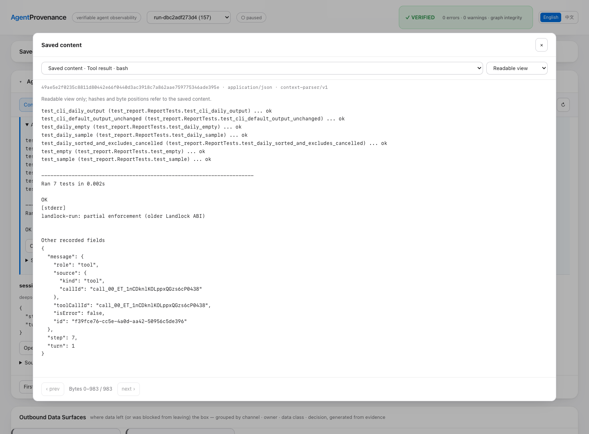
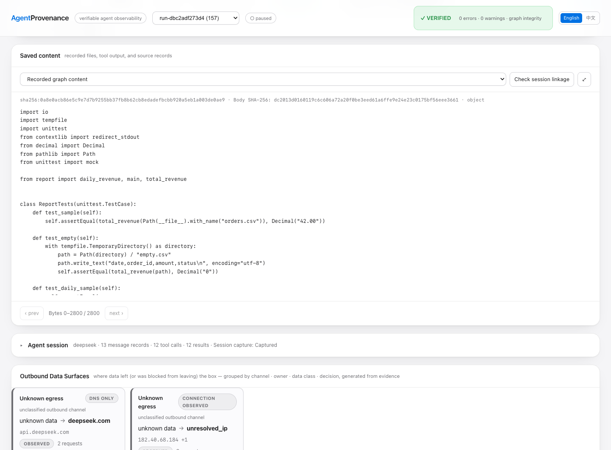

# DeepSeek: An Ordinary Development Task

English | [中文](README.zh-CN.md)

A real DeepSeek Harness session adds `--daily` to a small Python revenue report,
keeps the existing total unchanged, and runs seven tests. AgentProvenance records
the task, conversation, tool inputs/results, configuration and changed files,
alongside native kernel events. This is a development-task capture, not a
prompt-injection or enforcement demonstration.

## Replay

With a matching v0.9.0 candidate binary, from its extracted directory:

```sh
./agentprov demo deepseek-context
```

From a source checkout, build the binary first with
`go build -o agentprov ./cmd/agentprov`. The published v0.8.2 archive does not
include this example. Only the source-build path requires Go.

Replay is read-only and offline. It needs neither DeepSeek credentials nor a
Linux VM, and does not execute commands found in the evidence. The CLI verifies
the original signature, imports into a fresh temporary store, and checks graph
integrity before opening the Dashboard.

Run ID: `run-dbc2adf273d4`. The short demo name does not rewrite this identity.

## What to Inspect

1. **Agent session / Conversation & tools**: the user asks for daily totals,
   the agent reads the three seed files, edits the implementation and tests,
   and returns the real tool outputs. Expand a tool result or select
   **Open saved content**; **Raw source record** retains its source envelope.
2. **Permissions & configuration**: inspect the recorded workspace-write and
   ask policies, model settings and working directory. No approval interaction
   occurred in this capture. A configured ask policy is not evidence of a grant.
3. **File & Artifact**: select `report.py` or `test_report.py` to view the final
   saved text, independently of the session section. Workspace comparison
   identifies changed paths; the saved body is the final state, not a textual
   patch or a record of every intermediate write.
4. **Locate in graph**: follow a stored tool link, then use the graph's session
   action to return to the corresponding input/result. The unit-test invocation
   and final CLI checks have inferred links to captured Bash exec events.
5. **Collection status**: compare successful transcript collection with partial
   kernel capture and partial tool/runtime association. Graph verification,
   signature verification and collection completeness are separate results.



Structured results have a **Readable view** and a **Saved bytes** view. The
former changes presentation only; hashes and byte positions describe the saved
original. Raw source records and partial pages remain byte views.



## Capture Facts and Limits

Captured on **2026-09-28**, using **DeepSeek Harness 0.1.7-rc.2**, native
`session.v4.jsonl.zstd`, and Linux **6.8.0-137-generic aarch64** in the prepared VM.
This does not establish new x86 or microVM coverage.

- All 73 physical source records were read and stored: 13 messages, 12 tool
  calls, 12 results, five configuration records, and source lifecycle records.
  Transcript capture reported zero failed, truncated, unrecognized or deferred
  records. Approval records were not present.
- The bundle contains 157 stored runtime events, including 128 native eBPF
  events. Command/time/scope correlation matched **two of 22 exec events**.
  These are inferences at confidence tier `0.8`, not calibrated probabilities
  or kernel-proven sub-agent identities. Other execs remain unassociated.
- `report.py` and `test_report.py` have saved final text, 4,048 bytes total.
  Two generated `.pyc` files are explicitly omitted by the text-capture path.
  There are no omitted bundle objects; binary-text omissions are a different
  coverage boundary.
- Native capture is **partial**: optional probe/TLS visibility is incomplete;
  node-level diagnostics include three rejected file-write payloads and pending
  events at sealing. Their impact on this run is unknown. No run-specific loss
  count or TLS model-response coverage is claimed.
- Existing `secret_path` rules also matched Harness startup probes for `.env`,
  `.credentials.yaml` and credential-package paths. An open attempt is not proof
  that a file existed or its contents were read. These signals are retained, not
  relabeled as agent theft or proof that a process was killed.

The recorded tool output reports seven passing tests, unchanged total `42.00`,
and daily amounts `30.00`, `7.25`, `4.75` for September 25, 26 and 27 respectively.
The capture script independently reran the tests and CLI checks after launch.
Replay checks the recorded output; it does not rerun the model or captured code.

## Portable Evidence

The [capture manifest](capture-manifest.json) identifies the source version,
capture date, signed bundle and matching public key. The compressed bundle
includes saved context, file content, runtime events and batch membership.
Offline replay reads this evidence, not files from the original VM. The original
signature is checked before import; graph integrity and capture coverage are
reported separately.

## Recapture

Recapture uses a configured DeepSeek Harness, funded credentials outside the
workspace, Python 3 and a Linux host with a usable native sensor and delegated
cgroup. Run `agentprov doctor` first and inspect the reported capabilities.
The script does not install software, elevate privileges or change credentials.

```sh
export AGENTPROV_BIN=/absolute/path/to/agentprov
export DSH_BIN=/absolute/path/to/dsh
export DSH_HOME=/absolute/path/to/configured-dsh-home
bash demo/deepseek-context/capture.sh /tmp/deepseek-context-new
```

The script copies only the three seed files into a disposable workspace,
generates a local signing key outside it, and uses `launch --file-diff` for the
task in [TASK.md](TASK.md). Keep the generated private key private. Review
coverage and scan exported content for credentials before sharing a new bundle;
an exact known-key check and credential-pattern scan passed for this supplied
capture, but neither substitutes for reviewing future captures.

New model runs may use different tools, outcomes and source records. Preserve
this historical sample; do not overwrite it to make a later run match the guide.
